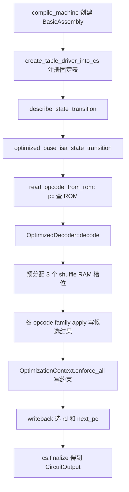

# 第四章 Machine代码怎样写出多项式约束

第三章在 setup 层回答：电路长什么样、固定表内容是什么。第四章回答：一行 RISC-V 执行在 Machine 代码里怎样变成 Variable、Constraint、lookup 和 shuffle RAM query。

两章的衔接点在 default_compile_machine。第三章的 get_machine 会调用它；它内部先 compile_machine 得到 CircuitOutput，再交给 OneRowCompiler 生成 CompiledCircuitArtifact。

```text
第三章出口:
  get_main_riscv_circuit_setup
    -> get_machine
    -> default_compile_machine

第四章入口:
  default_compile_machine
    -> compile_machine
    -> describe_state_transition
    -> CircuitOutput

第四章出口:
  CircuitOutput
    -> OneRowCompiler
    -> CompiledCircuitArtifact

第五章入口:
  witness trace 给 CircuitOutput 里的 Variable 填真实执行值
```

## 第四章怎么读

第四章按一条 CPU 执行主线展开，不是按 crate 目录展开。每一节只解决主线上的一个子问题；读完一节，应能说出它在主线上的位置、对应源码文件、以及主线例子 ADD x5,x1,x2 推进到了哪一步。

### 阅读阶段

```text
阶段 A  4.0 - 4.6   先认识写规则用的代数对象和收集器
阶段 B  4.7         找到 Machine 写规则的入口函数
阶段 C  4.8 - 4.11  跟完取指、decode、预分配三个 memory 槽位
阶段 D  4.12 - 4.17 跟完 ADD 候选结果、约束、writeback、next_pc
阶段 E  4.18        用 ADD 把前面所有对象收束成一张清单
阶段 F  4.19 - 4.20 看 LW/SW 怎样复用同一套槽位，再对齐第三章边界
```

阶段 A 不碰 describe_state_transition。先弄清 Machine 代码往哪里写、用什么符号写。没有 Variable、Term、Constraint，后面读 optimized_base_isa_state_transition 时每个 cs.add_constraint 都缺少上下文。

阶段 B 只有一节 4.7，但它是整章枢纽。compile_machine 和 describe_state_transition 的调用关系在这里固定下来；4.8 到 4.17 都在 describe_state_transition 调用的 optimized_base_isa_state_transition 内部展开。

阶段 C 到 D 按 optimized_base_isa_state_transition 的真实执行顺序阅读，不要按 opcode family 的字母顺序跳读。

### 主线例子

全章用同一条 guest 指令贯穿：

```text
pc = 0x0000
instruction = ADD x5, x1, x2

执行前:
  x1 = 7
  x2 = 9
  x5 = 100
```

这条指令在每一阶段的进展：

```text
4.0   定义一行 CPU row 应包含 pc、opcode、三次访问、next_pc
4.1   规则写入 BasicAssembly，finalize 后进入 CircuitOutput
4.2-4.5  用 Variable、Term、Constraint 表达 rs1+rs2=rd 等关系
4.6   cs.add_constraint 把关系登记进 constraint_storage
4.7   compile_machine 调用 describe_state_transition
4.8   pc=0 经 RomRead 得到 ADD 的 32-bit 编码
4.9   decoder 得到 rs1=1, rs2=2, rd=5, ADD_OP_KEY=1
4.10  预分配 slot0 读 x1, slot1 读 x2, slot2 写 x5
4.11  src1=x1, src2=x2
4.12  AddOp 登记 7+9 的候选结果 16
4.13  OptimizationContext 写出低/高 16 位加法约束
4.14  is_add=1 使 ADD 约束生效，其他 family 约束关闭
4.15  writeback 把 slot2 地址绑到 rd=5，写回值绑到 16
4.16  三个 shuffle RAM query 写入 CircuitOutput
4.17  next_pc = 0x0004
4.18  汇总本行产生的 constraints、lookups、queries
4.19  对比 LW/SW 如何改 slot1、slot2，ADD 结构不变
4.20  区分 CircuitOutput、CompiledCircuitArtifact、witness trace
```

读 4.8 到 4.17 时，随时回到这张表，对照 ADD 例子当前停在哪一步。

### 源码文件地图

读某一节时，打开对应文件，再按文中提到的函数名搜索。

```text
节号    主题                          主要源码文件
----    ----                          ------------
4.1     BasicAssembly                 cs/src/cs/cs_reference.rs
4.2     Variable                      cs/src/definitions/mod.rs
4.3     Num, Boolean                  cs/src/types.rs
4.4-4.5 Term, Constraint              cs/src/constraint.rs
4.6     add_constraint                cs/src/cs/cs_reference.rs
4.7     compile_machine               cs/src/machine/machine_configurations/mod.rs
                                      cs/src/lib.rs (default_compile_machine)
4.7     describe_state_transition     cs/src/machine/machine_configurations/full_isa_with_delegation_no_exceptions/mod.rs
4.8-4.17 一行状态转移主线            cs/src/machine/machine_configurations/full_isa_no_exceptions/optimized_state_transition.rs
4.8     read_opcode_from_rom          cs/src/machine/utils.rs
4.9-4.11 optimized_decode...         cs/src/machine/machine_configurations/state_transition_parts/decode_and_read_operands.rs
4.12    AddOp                         cs/src/machine/ops/add_sub.rs
4.13    OptimizationContext           cs/src/devices/optimization_context.rs
4.15-4.17 writeback, select rd/pc     cs/src/machine/machine_configurations/state_transition_parts/writeback_no_exceptions.rs
                                      cs/src/devices/diffs.rs (CommonDiffs)
4.18    CircuitOutput 字段            cs/src/cs/circuit.rs
4.20    get_machine 入口              circuit_defs/setups/src/circuits/main_riscv/mod.rs
```

第三章 get_machine 在 circuit_defs/setups；第四章 Machine 语义在 cs crate。从 setup 跳进 Machine 时，路径从 circuit_defs/setups/src/circuits/main_riscv/mod.rs 的 get_main_riscv_circuit_setup 跟到 cs/src/lib.rs 的 default_compile_machine，再跟到 cs/src/machine/machine_configurations/mod.rs 的 compile_machine。

### 一条 CPU 行的总流程



4.1 到 4.6 解释 A 和 K 之间写规则用的符号和容器。4.7 定位 C。4.8 到 4.11 对应 E 到 G。4.12 到 4.17 对应 H 到 J。

### compile_machine 核心片段

下面这段是第四章在源码里的锚点。后文每次进入新函数，都从这里往回找调用关系。

```rust id="wg75wi"
let mut cs = C::new();

create_table_driver_into_cs::<F, C, M, ROM_ADDRESS_SPACE_SECOND_WORD_BITS>(&mut cs, machine);

let (initial_state, final_state) =
    M::describe_state_transition::<C, ROM_ADDRESS_SPACE_SECOND_WORD_BITS>(&mut cs);

let (mut output, _) = cs.finalize();
output.state_input = initial_state.flatten();
output.state_output = final_state.flatten();
```

对象在源码里的层次：

```text
RISC-V 语义 (ADD x5,x1,x2)
  -> Machine 代码 (AddOp, read_opcode_from_rom, writeback)
    -> 代数对象 (Variable, Term, Constraint)
      -> Circuit 接口 (cs.add_constraint, lookup, add_shuffle_ram_query)
        -> CircuitOutput (constraints, lookups, shuffle_ram_queries)
```

---

## 4.0 读Machine代码前需要的CPU和电路背景

> **阶段 A 起点** | **源码**：本节无单一函数，为后文读 optimized_state_transition 提供 CPU 词汇  
> **承接第三章**：第三章已生成 RomRead 表和 CompiledCircuitArtifact 的布局；本节说明一行 CPU 在语义上要发生什么  
> **主线 ADD**：pc=0，将执行 ADD x5,x1,x2；x1=7，x2=9，x5=100  
> **读完后去读 4.1**：已知道一行 CPU row 包含哪些对象，才能理解 BasicAssembly 在收集什么

Airbender的main RISC-V circuit把一次CPU执行切成很多行。每一行表示一个cycle，也就是CPU执行一条RISC-V instruction时发生的事情。第四章讨论的Machine代码只描述“一行应该满足哪些规则”，它不直接执行guest程序，也不直接生成证明。

一行CPU row包含几类对象：

```text
CPU row:
  当前pc
  当前opcode
  decoder输出
  rs1读取
  rs2读取或RAM读取
  rd写回或RAM写入
  next_pc
  opcode family产生的候选结果
```

pc是program counter，表示当前CPU应该从哪一个地址读取instruction。RISC-V instruction通常占4字节，所以普通顺序执行时next_pc = pc + 4。jump和branch会改写next_pc。

register是RISC-V寄存器。main RISC-V使用32个通用寄存器x0到x31。x0比较特殊，RISC-V规定x0读出来永远是0，写入x0也不会改变它。Airbender的writeback代码会显式处理rd = 0的情况，把写回值mask成0。

ROM是只读程序区。第三章里，guest binary经过padding后生成RomRead表。第四章里，Machine代码不会重新生成ROM表，它只登记“当前pc要查询RomRead表”的lookup。后续lookup argument会检查CPU row查询的opcode确实来自setup trace里承诺过的RomRead表。

RAM和register在这套Machine代码里统一进入shuffle RAM memory argument。shuffle RAM不是普通内存数组，而是一组带地址、读值、写值、timestamp的query。后面的memory argument会证明同一地址的读写顺序一致。第四章只需要知道：Machine代码先登记query，具体一致性证明在后续章节处理。

Airbender把32-bit整数拆成两个16-bit limb：

```text
u32 value = low16 + 2^16 * high16

value = 0x0001_0002
low16 = 0x0002
high16 = 0x0001
```

这个拆法贯穿pc、register value、opcode、RAM word。原因是底层field元素能表示的安全范围有限，直接把所有32-bit对象当成一个field元素处理会让range check和lookup设计变复杂。16-bit limb更适合配合range check表、ROM表和加法进位约束。

lookup表示“某一行输入输出必须出现在一张固定表里”。例如RomRead lookup检查：

```text
input:
  rom_address

output:
  opcode_low16
  opcode_high16
```

decoder lookup检查instruction编码对应的寄存器索引、立即数、指令格式flag和opcode family flag。第四章后面出现的OptimizedDecoder::decode本质上就在登记这些decoder相关查询和约束。

placeholder是给witness generation用的占位变量。Machine构造电路时还没有真实执行值，但它需要为“这一行rs1读出来的值”“slot 2写入的值”这类对象先占一个Variable位置。后面生成witness trace时，执行器会把真实值填到这些placeholder对应的变量里。

这几个层次不要混在一起：

```text
Machine代码:
  写规则

CircuitOutput:
  保存Variable、Constraint、lookup、shuffle RAM query

witness trace:
  保存每一行真实执行值

CompiledCircuitArtifact:
  保存变量到列的映射、约束布局、memory layout、setup layout

proof:
  证明witness trace满足CompiledCircuitArtifact里的规则
```

4.0 只建立词汇和层次。4.1 到 4.6 进入阶段 A：Machine 代码用什么容器、什么符号写规则。读 4.1 时打开 cs/src/cs/cs_reference.rs。

## 4.1 BasicAssembly是规则收集器

> **阶段 A** | **源码**：cs/src/cs/cs_reference.rs，结构体 BasicAssembly，方法 new / add_variable / add_constraint / finalize  
> **承接 4.0**：4.0 说一行 CPU 要满足很多规则；BasicAssembly 是 Machine 写这些规则时的收集容器  
> **主线 ADD**：尚未执行 ADD；本节只建立记事本，后面 describe_state_transition 往里写  
> **读完后去读 4.2**：add_variable 返回的第一个类型就是 Variable

`compile_machine`里的`C::new()`在默认路径中创建`BasicAssembly`。`BasicAssembly`实现`Circuit` trait。它内部保存约束、lookup query、shuffle RAM query、range check、boolean变量、placeholder映射、linkage query、`table_driver`和witness graph。创建时，`BasicAssembly::new()`把这些列表置空，并创建一个空`TableDriver`。

```rust id="zc5cjt"
pub struct BasicAssembly<F: PrimeField, W: WitnessPlacer<F> = CSDebugWitnessEvaluator<F>> {
    no_index_assigned: u64,
    constraint_storage: Vec<(Constraint<F>, bool)>,
    lookup_storage: Vec<LookupQuery<F>>,
    pub shuffle_ram_queries: Vec<ShuffleRamMemQuery>,
    boolean_variables: Vec<Variable>,
    rangechecked_expressions: Vec<RangeCheckQuery<F>>,
    placeholder_query: HashMap<(Placeholder, usize), Variable>,
    linkage_queries: Vec<LinkedVariablesPair>,
    table_driver: TableDriver<F>,
    ...
}
```

这些字段可以按“普通约束、查表约束、内存约束、辅助标记、表内容、witness辅助信息”分组：

```text
普通约束:
  constraint_storage
  boolean_variables
  rangechecked_expressions

查表约束:
  lookup_storage
  table_driver

内存约束:
  shuffle_ram_queries

变量和占位符:
  no_index_assigned
  placeholder_query
  linkage_queries

witness辅助:
  witness_placer
  witness_graph
```

`constraint_storage`保存多项式等于0的约束。ADD低16位加法关系、pc + 4关系、writeback地址关系都会进入这里。

`lookup_storage`保存查表请求。ROM读取、decoder分解、range check、bit操作辅助表最终都以lookup形式出现。lookup不是普通等式，它表达“这一组输入输出必须出现在某张表里”。

`shuffle_ram_queries`保存寄存器和RAM访问。它不直接证明读写一致，只把每行CPU发生的读写记录下来。后续memory argument消费这些query。

`table_driver`保存当前Machine使用的固定表内容或表类型。第三章里的setup trace会根据它生成固定表列。第四章里只需要确认Machine把哪些表注册进Circuit。

`placeholder_query`把placeholder映射到具体Variable。witness generation执行guest程序时，会根据placeholder知道某个Variable应该填入哪个运行时值。

Machine代码通过`Circuit`接口写规则。`add_variable`创建一个新的变量编号；`add_constraint`登记多项式约束；`materialize_table`注册固定表；`add_table_with_content`加入已经构造好的表；`add_shuffle_ram_query`登记寄存器或RAM访问；`finalize`把这些记录写入`CircuitOutput`。`Circuit` trait定义了这些方法。

`BasicAssembly::add_variable()`只分配编号。源码返回`Variable(self.no_index_assigned)`，随后把计数器加一。这个变量没有执行值，也没有列号。

```rust id="fx7olh"
fn add_variable(&mut self) -> Variable {
    let variable = Variable(self.no_index_assigned);
    self.no_index_assigned += 1;
    variable
}
```

例如ADD行需要保存`x1`、`x2`、`x5`的低16位和高16位。Machine代码会创建若干`Variable`：

```text id="hugblj"
v_rs1_low
v_rs1_high
v_rs2_low
v_rs2_high
v_rd_low
v_rd_high
v_is_add
```

这些变量在第四章只代表符号位置。真实执行值在witness生成阶段出现：

```text id="r37dli"
v_rs1_low  = 7
v_rs1_high = 0
v_rs2_low  = 9
v_rs2_high = 0
v_rd_low   = 16
v_rd_high  = 0
v_is_add   = 1
```

`BasicAssembly::finalize()`把`table_driver`、`shuffle_ram_queries`、`constraints`、`lookups`、`range_check_expressions`、`boolean_vars`、`substitutions`等字段写入`CircuitOutput`。

这一步仍然没有生成trace。`finalize()`只是把BasicAssembly内部的临时收集结构整理成一个返回对象。后续`OneRowCompiler`读取`CircuitOutput`，决定每个Variable放到哪一列，哪些约束属于degree-1，哪些约束属于degree-2，哪些query进入lookup layout或memory layout。

BasicAssembly在编译阶段的位置是：

```text
Machine代码:
  调用Circuit trait方法

BasicAssembly:
  实现Circuit trait
  收集规则和query

CircuitOutput:
  BasicAssembly.finalize的结果

OneRowCompiler:
  把CircuitOutput里的Variable和规则排成具体列布局
```

## 4.2 Variable是编号

> **阶段 A** | **源码**：cs/src/definitions/mod.rs，Variable；分配在 cs/src/cs/cs_reference.rs 的 add_variable  
> **承接 4.1**：BasicAssembly 用 Variable 编号标记每个待约束的符号位置  
> **主线 ADD**：rs1_low、rs2_low、rd_low、is_add 都会先变成 Variable，此时还没有具体数值 7、9、16  
> **读完后去读 4.3**：寄存器值和 flag 在代码里很少裸用 Variable，而用 Num 和 Boolean 包装

`Variable`定义在`cs/src/definitions/mod.rs`：

```rust id="upw5nv"
pub struct Variable(pub u64);
```

`Variable::placeholder_variable()`返回`u64::MAX`，`is_placeholder()`检查这个特殊值。普通变量由`BasicAssembly::add_variable()`按顺序分配。

`Variable(17)`不是第17列，也不是第17行。它是电路构造阶段的临时变量名。`OneRowCompiler`后续会读取`CircuitOutput`，把这些变量映射到具体列位置。第三章里提到的`CompiledCircuitArtifact.variable_mapping`保存这个映射。

这一点对读代码很关键。源码里看到`Variable`时，不要直接把它理解成witness trace的一格。它要经过两次转化：

```text
电路构造阶段:
  Variable(17)

compiler阶段:
  Variable(17) -> ColumnAddress

witness阶段:
  ColumnAddress在某一行上的值 = 真实执行值
```

例如`rs1_low`可能先是`Variable(17)`。OneRowCompiler可能把它放到main trace的某个witness column。执行ADD那一行时，这个位置的值才是7。执行下一条instruction时，同一列可能保存另一个变量对应的值。

ADD例子里，`Variable`承担三类角色：

```text id="vpu99c"
执行数据变量：
  rs1_low, rs1_high, rs2_low, rs2_high, rd_low, rd_high

控制变量：
  is_add, r_insn, i_insn, update_rd

辅助变量：
  carry_low, carry_out, rom_address_low, decoder输出变量
```

这些变量后续进入`Term`和`Constraint`。

三类Variable对应不同检查：

执行数据变量要和witness值一致。例如rs1_low、rs2_low由shuffle RAM读取得到，rd_low由ADD关系和writeback共同约束。

控制变量要是布尔值，并且通常来自decoder。is_add、is_load、r_insn、i_insn这类变量决定哪些候选关系生效。

辅助变量不是RISC-V寄存器本身，而是为了表达约束引入的中间值。carry_low、carry_out、rom_address_low、is_zero结果都属于辅助变量。

## 4.3 Num和Boolean包装变量、常量和flag

> **阶段 A** | **源码**：cs/src/types.rs，Num 和 Boolean  
> **承接 4.2**：Variable 只是编号；Num 区分变量与常量，Boolean 表达 decoder 的 flag  
> **主线 ADD**：表 id 用 Num::Constant；is_add 用 Boolean::Is；x1 的 limb 用 Num::Var  
> **读完后去读 4.4**：把 Num/Boolean 放进等式时，需要 Term 表示单项式

Machine代码很少直接裸用`Variable`。它使用`Num`表示数值，使用`Boolean`表示flag。

`Num`可以是变量，也可以是常量：

```rust id="tsb08x"
pub enum Num<F: PrimeField> {
    Var(Variable),
    Constant(F),
}
```

这个设计减少无意义变量。例如某个表id是常量，代码用`Num::Constant`表示；某个执行值来自witness，代码用`Num::Var(variable)`表示。

`Num`出现在很多函数签名里，是因为Machine代码经常混合处理常量和变量。例如：

```text
表id:
  Num::Constant(table_id)

register limb:
  Num::Var(rs1_low)

立即数:
  可能来自decoder输出的Variable
  也可能在某些辅助路径里是Constant
```

函数接收`Num`后，可以统一写表达式。若输入是Constant，就不会额外分配Variable；若输入是Var，就把Variable放进Term或Constraint。

`Boolean`有三种形态：

```rust id="h6clh7"
pub enum Boolean {
    Is(Variable),
    Not(Variable),
    Constant(bool),
}
```

`Boolean::Is(v)`表示变量`v`取0或1；`Boolean::Not(v)`表示`1-v`这个视图；`Boolean::Constant`表示编译期已知的布尔值。

`Boolean::new`会创建一个布尔变量。源码注释写出布尔约束：

```text id="s9e1v0"
(1 - a) * a = 0
```

这个约束只允许`a=0`或`a=1`。

decoder产生的`is_add`、`is_load`、`is_store`都属于`Boolean`。opcode family用这些flag控制约束是否启用。对于ADD行，`is_add=1`；对于SUB行，`is_add=0`。

`Boolean::Not(v)`避免为了`1 - v`再分配新变量。很多选择逻辑都需要某个flag的取反，例如根据`is_zero`决定写回x0时的mask。代码可以把Not当作一个视图，而不是一个新的witness位置。

`Boolean::Constant(true)`和`Boolean::Constant(false)`用于编译期已经确定的开关。比如slot 1一开始默认是register访问，代码可以先写`is_register = Boolean::Constant(true)`，后续LoadOp再把它改成RAM读取路径需要的形状。

## 4.4 Term表示一个单项式

> **阶段 A** | **源码**：cs/src/constraint.rs，enum Term  
> **承接 4.3**：Num 和 Boolean 可转成 Term；Term 是 Constraint 的原子乘法项  
> **主线 ADD**：rom_address = pc_low + 2^16 * rom_address_low 由两个 Term 相加构成  
> **读完后去读 4.5**：多个 Term 的和构成完整约束

`Term`定义在`constraint.rs`：

```rust id="dihgco"
pub enum Term<F: PrimeField> {
    Constant(F),
    Expression {
        coeff: F,
        inner: [Variable; TERM_INNER_CAPACITY],
        degree: usize,
    },
}
```

`Term::Constant(F)`表示常数。`Term::Expression`表示一个单项式：

```text id="wccoso"
coeff * inner[0] * inner[1] * ... * inner[degree-1]
```

源码注释把`Term`称为多项式的原子片段，可以是常数，也可以是`coeff * x1 * x2 * ...`。

几个例子：

```text id="r1nd5g"
5
  Term::Constant(5)

3 * v1
  coeff = 3
  inner = [v1]
  degree = 1

2 * v1 * v2
  coeff = 2
  inner = [v1, v2]
  degree = 2
```

`Term::normalize()`会排序变量，保证`v1*v2`和`v2*v1`用同一种内部表示。它也会把0系数表达式改成常数0。

这个归一化让代码可以合并同类项：

```text id="gixj5x"
3*v1 + 5*v1
  -> 8*v1

2*v1*v2 + 4*v2*v1
  -> 6*v1*v2
```

Machine代码写RISC-V语义时，`Term`构成每个约束的基础。

Term只表示乘法项，不表示完整等式。完整等式由Constraint保存。例如这个约束：

```text
is_add * (rs1 + rs2 - rd) = 0
```

展开成Term以后是：

```text
is_add * rs1
+ is_add * rs2
- is_add * rd
```

每一项都是一个Term，整个和才是Constraint。Airbender把约束保持在二次以内，所以`is_add * rs1`这种二次项允许出现，但`a * b * c`这种三次项最终不能留在Constraint里。

## 4.5 Constraint表示多项式等于0

> **阶段 A** | **源码**：cs/src/constraint.rs，struct Constraint  
> **承接 4.4**：rs1 + rs2 - rd = 0 是 Constraint；乘 is_add 后仍是 Constraint  
> **主线 ADD**：ADD 关系最终写成 is_add * (rs1 + rs2 - rd) = 0 的形式（经 limb 拆分后见 4.13）  
> **读完后去读 4.6**：Constraint 构造完成后，通过 cs.add_constraint 进入 BasicAssembly

`Constraint`是一组`Term`的和：

```rust id="wny26r"
pub struct Constraint<F: PrimeField> {
    pub terms: Vec<Term<F>>,
}
```

源码注释说明，`Constraint`是稀疏单项式和；算术操作会归一化、合并同类项，并要求归一化后的次数不超过2。

电路约束采用等于0的形式。RISC-V语义里的：

```text id="vdclgt"
rd = rs1 + rs2
```

在`Constraint`里写成：

```text id="nkzxh8"
rs1 + rs2 - rd = 0
```

如果只在ADD指令生效，则乘上ADD flag：

```text id="8qg5xb"
is_add * (rs1 + rs2 - rd) = 0
```

当`is_add=1`时，约束要求`rd=rs1+rs2`；当`is_add=0`时，乘积为0，这条ADD关系不限制当前行。这个写法的次数为2，因为`is_add`是一次，括号里的表达式是一次。

`Constraint::normalize()`会归一化每个`Term`，排序，合并同类项，删除0项，并断言最终次数不超过2。

`Constraint::split_max_quadratic()`会把约束拆成三类：二次项、一次项、常数项。后续编译器可以根据这个结构把约束排进degree-2和degree-1约束表示。

`Constraint`不是“检查一次代码里的if条件”。它描述的是一行trace上的代数等式。证明系统后面会在整条trace上检查这些等式。对CPU row来说，同一个Constraint模板会应用到每一行，只是每一行的witness值不同。

例如ADD低位约束模板是：

```text
a_low + b_low - c_low - 2^16 * carry = 0
```

在第0行，它可能检查x1 + x2 = x5。在第1行，它可能被flag关闭，或者检查另一条加法类指令。模板固定，witness值按行变化。

## 4.6 cs.add_constraint把多项式交给Circuit

> **阶段 A 终点** | **源码**：cs/src/cs/cs_reference.rs，add_constraint  
> **承接 4.5**：Constraint 是内存里的对象；add_constraint 把它 push 进 constraint_storage  
> **主线 ADD**：低/高 16 位加法约束各调用一次 add_constraint（在 4.13 的 enforce_all 里）  
> **读完后去读 4.7**：代数对象和收集器已齐，进入 compile_machine 和 describe_state_transition 入口

`BasicAssembly::add_constraint`接收一个`Constraint`，要求它的次数为2，归一化，然后存入`constraint_storage`。线性约束使用`add_constraint_allow_explicit_linear`。

```rust id="wvswo2"
fn add_constraint(&mut self, mut constraint: Constraint<F>) {
    assert!(constraint.degree() == 2);
    assert!(constraint.degree() <= 2);
    constraint.normalize();
    self.try_check_constraint(&constraint);
    self.constraint_storage.push((constraint, false));
}
```

这个函数是Machine语义进入CircuitOutput的主要入口之一。Machine代码只要构造出`Constraint`并调用`cs.add_constraint(...)`，这条约束就进入`CircuitOutput.constraints`。

ADD例子经过这个入口：

```text id="tzxcc9"
RISC-V语义：
  x5 = x1 + x2

MachineOp：
  AddOp::apply

OptimizationContext：
  append_add_relation
  enforce_all

Circuit：
  cs.add_constraint(low limb relation)
  cs.add_constraint(high limb relation)

CircuitOutput：
  constraints.push(...)
```

阶段 A 结束。已掌握 Variable、Term、Constraint 和 BasicAssembly。阶段 B 从 compile_machine 入口进入 describe_state_transition。打开 cs/src/machine/machine_configurations/mod.rs，搜索 compile_machine。

## 4.7 compile_machine怎样进入describe_state_transition

> **阶段 B 枢纽** | **源码**：cs/src/machine/machine_configurations/mod.rs 的 compile_machine；cs/src/machine/machine_configurations/full_isa_with_delegation_no_exceptions/mod.rs 的 describe_state_transition  
> **承接 4.6**：4.1-4.6 说明规则写进哪个容器、用什么符号；本节定位谁调用 describe_state_transition  
> **主线 ADD**：compile_machine 即将进入 optimized_base_isa_state_transition，开始处理 pc=0 那一行  
> **读完后去读 4.8**：describe_state_transition 的第一项工作是取 pc 并 read_opcode_from_rom

> **阶段 B 枢纽** | **源码**：cs/src/machine/machine_configurations/mod.rs 的 compile_machine；cs/src/machine/machine_configurations/full_isa_with_delegation_no_exceptions/mod.rs 的 describe_state_transition  
> **承接 4.6**：4.1-4.6 讲了往 cs 里写什么；本节讲谁调用 cs、调用顺序是什么  
> **主线 ADD**：compile_machine 创建 cs 后，describe_state_transition 开始描述 ADD 那一行的规则  
> **读完后去读 4.8**：进入 optimized_base_isa_state_transition 的第一步——用 pc 读 ROM

`compile_machine`创建`cs`以后先调用`create_table_driver_into_cs`，这一步把Machine需要的固定表注册到Circuit。随后`M::describe_state_transition`开始写CPU状态转移规则。

当前main RISC-V机器是`FullIsaMachineWithDelegationNoExceptionHandling`。它把`State`设成`MinimalStateRegistersInMemory<F>`，配置为trusted code、不输出精确异常、bytecode来自ROM。它支持ADD、SUB、LUI、AUIPC、Binary、Mul、DivRem、Conditional、Shift、Jump、Load、Store和CSR。

这几个配置决定后面Machine代码的形状。

`MinimalStateRegistersInMemory<F>`表示跨行状态只保留最小CPU状态。对当前阅读目标来说，最重要的是pc。寄存器文件和RAM不直接作为普通state字段保存，而是通过shuffle RAM query表达读写。也就是说，相邻两行之间的pc用state linkage连接，寄存器和RAM的一致性由memory argument证明。

trusted code表示Airbender假设正在证明的guest program落在受支持的执行路径里。源码里遇到invalid opcode时，不会进入一个完整exception handler分支，而是把`invalid_opcode = 0`作为约束加入Circuit。若实际opcode无效，witness无法满足这条约束。

bytecode来自ROM表示instruction fetch走RomRead lookup。当前CPU row不会从RAM里取指令。`read_opcode_from_rom`里对`is_ram_range = 0`的约束正是这个配置的直接结果。

`FullIsaMachineWithDelegationNoExceptionHandling`支持多个opcode family，但Airbender不会为每个opcode family生成一套独立电路。它在同一行CPU row里让所有family都产生候选结果，再用decoder flag选择当前opcode对应的候选结果。ADD行里`is_add = 1`，其他family flag为0；LOAD行里`is_load = 1`，ADD关系被flag关闭。

`describe_state_transition`先获取decoder表划分和布尔key，然后调用`optimized_base_isa_state_transition`：

```rust id="mim9tt"
let (splitting, _) = <Self as Machine<F>>::produce_decoder_table_stub();
let boolean_keys = <Self as Machine<F>>::all_decoder_keys();

optimized_base_isa_state_transition::<...>(
    cs,
    splitting,
    boolean_keys,
)
```

这个函数返回初始状态和最终状态。

`optimized_base_isa_state_transition`的执行顺序适合作为第四章后半部分的主线：

```text id="ynwevd"
初始化CPU state
  -> 取pc
  -> pc查ROM得到opcode
  -> decode opcode
  -> 预分配三个memory query槽位
  -> 计算默认next_pc
  -> 各opcode family写候选结果
  -> OptimizationContext写出约束
  -> writeback选择最终rd和pc
  -> 登记三个shuffle RAM query
```

源码里能看到这个顺序：初始化state和pc，range check pc低位，调用`optimized_decode_and_preallocate_mem_queries_for_bytecode_in_rom`，计算`next_pc`，创建`OptimizationContext`，逐个调用opcode family的`apply`，调用`opt_ctx.enforce_all(cs)`，再调用`writeback_no_exception_with_opcodes_in_rom`。

这段代码容易误读成真正执行了一遍所有指令。它实际做的是“为所有可能的opcode family写候选规则”。以ADD行为例：

```text
当前opcode = ADD

AddOp::apply:
  exec_flag = 1
  产生rd候选值
  登记ADD关系

LoadOp::spec_apply:
  exec_flag = 0
  产生LOAD候选对象
  相关约束被flag关闭

StoreOp::spec_apply:
  exec_flag = 0
  产生STORE候选对象
  相关约束被flag关闭

writeback:
  从所有rd候选里选择flag为1的ADD结果
```

Airbender用这种写法获得固定形状的一行CPU circuit。每一行都有相同的列布局、相同数量的memory query槽位、相同种类的候选关系。不同opcode只改变flag和witness值，不改变电路结构。对proof system来说，固定结构比按opcode动态生成不同电路更容易编译成统一trace。

阶段 B 结束。阶段 C 进入 optimized_base_isa_state_transition 内部，顺序为：取指(4.8) -> decode(4.9) -> 预分配槽位(4.10) -> 选 src2(4.11)。打开 cs/src/machine/machine_configurations/full_isa_no_exceptions/optimized_state_transition.rs，与 decode_and_read_operands.rs 对照阅读。

## 4.8 pc怎样变成RomRead lookup

> **阶段 C 起点** | **承接 4.7**：进入 optimized_base_isa_state_transition 后，第一项 I/O 是用 pc 从 ROM 取指令  
> **主线 ADD**：pc=0 -> RomRead -> 得到 ADD 的 32-bit 编码（两个 16-bit limb）  
> **读完后去读 4.9**：next_opcode 交给 OptimizedDecoder::decode

**源码路径（本节前半）**：cs/src/machine/machine_configurations/full_isa_no_exceptions/optimized_state_transition.rs，函数 optimized_base_isa_state_transition，约第 26-59 行。

打开这个文件，从函数体第一行开始跟。ADD 例子假设当前 CPU row 的 pc = 0x0000。

### 8.1 初始化本行 state 并取出 pc

```rust
// 第 27 行
let initial_state = MinimalStateRegistersInMemory::<F>::initialize(cs);
```

这一行调用 cs/src/machine/machine_configurations/minimal_state.rs 第 36 行的 initialize。initialize 内部通过 PcWrapper::initialize 向 cs 申请 pc 的两个 Variable：pc_low 和 pc_high。此时还没有具体数值 0，只是占住跨行状态槽位。

对 ADD 第一行，witness 阶段会把 pc_low=0、pc_high=0 填进去。上一行 final_state.pc 与本行 initial_state.pc 通过 state linkage 相连；第一行没有上一行，public input 或边界条件决定起始 pc。

```rust
// 第 33 行
let pc = *initial_state.get_pc();
```

get_pc 返回 Register<F>，即 [pc_low, pc_high] 两个 Num。pc 不是 Rust u32，而是电路里的两个 limb 变量。

### 8.2 给 pc 低 16 位登记 range check

```rust
// 第 40-45 行
cs.require_invariant(
    pc.0[0].get_variable(),
    Invariant::RangeChecked {
        width: LIMB_WIDTH as u32,
    },
);
```

pc.0[0] 是低 16 位 limb。require_invariant 把一条 range check 请求记入 BasicAssembly，finalize 后进入 CircuitOutput.range_check_expressions，后续编译成 range 表 lookup。

源码注释说明：decoder 读 ROM 时会处理 pc 高半部分；这里先约束低半位落在 16-bit 范围内。ADD 行 pc=0，pc_low=0 满足 range check。

### 8.3 调用 decode 函数，内部第一行就是取指

```rust
// 第 52-59 行
let (memory_queries, src1, src2, raw_decoder_output, flags_source, opcode_types_bits) =
    optimized_decode_and_preallocate_mem_queries_for_bytecode_in_rom::<...>(
        cs, pc, decode_table_splitting, boolean_keys,
    );
```

这一行进入另一个文件。返回值在本节末尾先不展开；4.9-4.11 会逐项解释。本节只跟取指：该函数第一行调用 read_opcode_from_rom。

**源码路径（本节后半）**：cs/src/machine/utils.rs，函数 read_opcode_from_rom，约第 256-290 行。由 decode_and_read_operands.rs 第 35 行调用。

在 decode_and_read_operands.rs 里对应代码：

```rust
// decode_and_read_operands.rs 第 35 行
let next_opcode = read_opcode_from_rom::<F, CS, ROM_ADDRESS_SPACE_SECOND_WORD_BITS>(cs, pc);
```

下面逐行读 utils.rs 的 read_opcode_from_rom。

### 8.4 read_opcode_from_rom 第 265 行：编译期断言

```rust
assert!(16 + ROM_ADDRESS_SPACE_SECOND_WORD_BITS <= F::CHAR_BITS - 1);
```

ROM 地址由 pc 高位拆分出的 rom_address_low 与 pc 低位组合。组合后的位数不能超过 field 安全承载范围。main RISC-V 的 ROM_ADDRESS_SPACE_SECOND_WORD_BITS 在 risc_v_cycles 里配置，这里只保证地址编码不会溢出 field。

### 8.5 第一个 lookup：RomAddressSpaceSeparator

```rust
// 第 270-273 行
let [is_ram_range, rom_address_low] = cs.get_variables_from_lookup_constrained(
    &[LookupInput::from(pc.0[1].get_variable())],
    TableType::RomAddressSpaceSeparator,
);
```

输入：pc 的高 16 位变量 pc.0[1]。

输出：两个新 Variable。

- is_ram_range：当前地址高位是否落在 RAM 区
- rom_address_low：拼 ROM 完整地址时要用的高位贡献

get_variables_from_lookup_constrained 做两件事：向 lookup_storage 登记一条 RomAddressSpaceSeparator 查询；分配输出变量。第三章 create_table_driver_into_cs 已把这张表注册进 table_driver；lookup argument 后续证明查询行在 setup trace 的固定表里。

ADD 行 pc_high=0 时，表输出 is_ram_range=0、rom_address_low=0。

### 8.6 线性约束：instruction fetch 只能来自 ROM

```rust
// 第 275 行
cs.add_constraint_allow_explicit_linear(Constraint::<F>::from(is_ram_range));
```

Constraint::from(is_ram_range) 是次数为 1 的约束，要求 is_ram_range = 0。main machine 配置 USE_ROM_FOR_BYTECODE=true，取指不能从 RAM 读指令。若 witness 填 is_ram_range=1，电路不满足。

这条约束进入 constraint_storage，不是 lookup。

### 8.7 拼 ROM 地址：Term 第一次出现在取指路径

```rust
// 第 278-279 行
let rom_address_constraint = Term::from(pc.0[0].get_variable())
    + Term::from((F::from_u64_unchecked(1 << 16), rom_address_low));
```

左边：pc 低 16 位变量，一次项。

右边：常数 2^16 乘以 rom_address_low 变量，一次项。

相加得到线性 Constraint，表示：

```text
rom_address = pc_low + 2^16 * rom_address_low
```

ADD 行：pc_low=0，rom_address_low=0，故 rom_address=0。这不是 Rust 整数 0，而是两个 limb 变量在约束下的值。

### 8.8 第二个 lookup：RomRead

```rust
// 第 282-285 行
let [low, high] = cs.get_variables_from_lookup_constrained(
    &[LookupInput::from(rom_address_constraint)],
    TableType::RomRead,
);
```

输入：上一行拼出的 rom_address_constraint（线性表达式，不是裸整数）。

输出：opcode 的两个 16-bit limb，变量 low 和 high。

RomRead 表内容来自第三章 get_table_driver 根据 padded guest binary 生成。地址 0 处存 ADD x5,x1,x2 的编码。第四章只登记查询；表内容已在 setup 阶段固定。

对本章 ADD 例子，更准确地说：

```text
ADD x5, x1, x2 的 32-bit 机器码 = 0x002082B3

low  = 0x82B3   // 低 16 位
high = 0x0020   // 高 16 位
```

所以 8.8 这一步按例子返回的，正是 0x002082B3 的低半和高半。注意这里返回的是原始位模式，不是已经 decode 好的 rs1/rs2/rd。

还要分清“表已经固定”和“当前变量已经有值”是两回事：

```text
setup / compile 之前:
  padded bytecode 已经生成 RomRead 表

4.8 构造电路时:
  这里只登记一条 RomRead lookup，并分配 low/high 两个 Variable

witness generation:
  再根据当前行的 pc 去表里查地址 0，把 0x82B3 和 0x0020 填入 low/high
```

### 8.9 返回 Register 形状的 opcode

```rust
// 第 288-290 行
let result = Register([Num::Var(low), Num::Var(high)]);
result
```

next_opcode 类型是 Register<F>，与 pc、寄存器值同形：[low16, high16]。32-bit RISC-V instruction 在电路里始终用两个 limb 表示，因为单个 field 元素不能安全表示任意 u32。

对 ADD 例子，此时可以把 next_opcode 暂时想成：

```text
next_opcode = [0x82B3, 0x0020]
```

但要注意，这只是“完整机器码的两个 limb”。它已经隐含包含了 opcode、rd、rs1、rs2、funct3、funct7 全部字段，只是 4.8 还没有把这些字段拆成显式变量。

### 8.10 ADD 行取指结果汇总

```text
pc_low = 0, pc_high = 0

Lookup 1 RomAddressSpaceSeparator(0):
  -> is_ram_range = 0, rom_address_low = 0

Constraint:
  is_ram_range = 0

Lookup 2 RomRead(0 + 2^16 * 0 = 0):
  -> 0x82B3, 0x0020  (即 0x002082B3 的低 16 位和高 16 位)

CircuitOutput 新增:
  lookups: 上述两条
  constraints: is_ram_range = 0
  range_check: pc_low 的 16-bit range
```

此时 CPU row 只知道「当前 pc 处 instruction 的 32-bit 位模式」。更准确地说，它已经拿到了足以唯一确定 rs1/rs2/rd/opcode/funct3/funct7 的完整 32-bit 编码，但这些信息还只是隐含在位模式里，尚未被 decoder 拆成显式的 rs1=1、rs2=2、rd=5、ADD_OP_KEY=1 等变量。那是 4.9 decoder 的工作。

**本节与下一节衔接**：read_opcode_from_rom 返回到 decode_and_read_operands.rs 第 35 行，变量名 next_opcode。4.9 从第 61 行 DecoderInput 继续读。

## 4.9 opcode怎样变成decoder flags

> **阶段 C** | **承接 4.8**：next_opcode 是 32-bit instruction 的两个 limb；本节把它拆成 rs1、rd、格式 flag、ADD_OP_KEY  
> **主线 ADD**：rs1=1, rs2=2, rd=5, r_insn=1, ADD_OP_KEY=1, invalid_opcode=0  
> **读完后去读 4.10**：decoder 完成后，同一文件继续预分配三个 memory 槽位

**源码路径（本节）**：cs/src/machine/machine_configurations/state_transition_parts/decode_and_read_operands.rs，从第 41 行到第 80 行。与 4.8 同属一个函数 optimized_decode_and_preallocate_mem_queries_for_bytecode_in_rom。

### 9.0 先弄清 decoder 在证明系统里做什么

真实 CPU 的 decoder 硬件把 32-bit 机器码译成控制信号。Airbender 不做硬件仿真，而是用 lookup 表加约束表达同一件事：

```text
输入：32-bit instruction 编码（两个 16-bit limb）
输出：
  寄存器编号 rs1, rs2, rd
  立即数 imm
  这条指令属于 R/I/S/B/U/J 哪一种格式
  这条指令属于 ADD / LOAD / STORE 等哪一个 opcode family
```

第三章 compile 时，create_table_driver_into_cs 把 OpTypeBitmask 等 decoder 表注册进 table_driver。第四章 OptimizedDecoder::decode 只登记「本行 CPU 对这张表的查询」，并读出上述字段对应的 Variable。

decoder 不执行 ADD，不检查 7+9=16。它只回答：「这条编码在支持的指令集合里，字段分别是什么」。

### 9.1 第 41-51 行：trusted code 下的 UNIMP 检查

```rust
if ASSUME_TRUSTED_CODE {
    if PERFORM_DELEGATION {
        // Do nothing
    } else {
        assert_no_unimp(cs, next_opcode);
    }
} else {
    unimplemented!()
}
```

main RISC-V machine 设 ASSUME_TRUSTED_CODE=true：假设 guest 程序不会故意走到未实现指令。assert_no_unimp 对 UNIMP 编码加约束，防止 ROM padding 区的无效指令被当成合法执行。ADD 行不会走这条失败路径。

### 9.2 第 61-65 行：构造 DecoderInput 并调用 decode

```rust
let decoder_input = DecoderInput {
    instruction: next_opcode,
};
let (invalid_opcode, raw_decoder_output, opcode_format_bits, other_bits) =
    OptimizedDecoder::decode::<F, CS>(&decoder_input, cs, decode_table_splitting);
```

instruction 就是 4.8 得到的 next_opcode，形状仍是 Register<F> = [low16, high16]。

decode 返回四个对象，含义如下。

**invalid_opcode**（Boolean）：若 instruction 不在 machine 支持的 opcode 集合里，这个 flag 为 1。trusted code 下后面会强制它等于 0。

**raw_decoder_output**：字段容器，ADD 行里最重要的是：
- rs1：Num 形状，解码出源寄存器编号 1（即 x1）
- rs2：Constraint 形状，编号 2（x2）
- rd：Constraint 形状，编号 5（x5）
- imm、funct3、funct12：ADD 行也有，但 ADD 不用 imm 当 src2

**opcode_format_bits**：六个互斥 Boolean，表示 R/I/S/B/U/J。ADD 是 R-type，故 r_insn=1，其余为 0。

**other_bits**：major opcode family 的布尔位集合。AddOp 在编译期通过 define_decoder_subspace 声明 ADD 和 ADDI 都归入 ADD_OP_KEY；decode 后 ADD_OP_KEY 对应位为 1。

### 9.3 R-type ADD 的 32-bit 编码长什么样

RISC-V 把 32 个 bit 切成固定字段（初学者只需记住「编号从 instruction 里读出来」，不必手算 bit）：

```text
ADD x5, x1, x2  (R-type)

字段          含义              ADD 行的值
opcode        操作码大类        OPERATION_OP
rd            目标寄存器        5  (x5)
funct3        功能码低 3 位     000
rs1           第一源寄存器      1  (x1)
rs2           第二源寄存器      2  (x2)
funct7        功能码高 7 位     0000000 (表示 ADD 而非 SUB)
```

把这些字段从高位到低位拼起来，就是：

```text
0000000 00010 00001 000 00101 0110011
```

转成十六进制就是：

```text
0x002082B3
```

再拆成 4.8 里的两个 limb：

```text
opcode_low16  = 0x82B3
opcode_high16 = 0x0020
```

因此，4.8 不是“只知道地址 0 上是一条 ADD，但不知道寄存器是谁”。更准确地说：

```text
4.8 已拿到完整机器码 0x002082B3
  ↓
这 32 个 bit 里已经包含 rs1=1、rs2=2、rd=5
  ↓
4.9 才把这些隐含在 bit 里的字段显式 decode 成独立变量
```

decoder 的输出 rs1=1 不是值 7。1 是寄存器编号；值 7 来自后面 slot 0 读 x1 的 witness。

### 9.4 OptimizedDecoder::decode 的输入和输出结构

**源码路径**：cs/src/machine/decoder/decode_optimized_must_handle_csr.rs，第 31-313 行。

decode 接收的 inputs.instruction 来自 4.8 的 next_opcode：

```text
inputs.instruction = Register([low16, high16])

ADD 例子:
  low16  = 0x82B3
  high16 = 0x0020
```

decode 返回四类对象：

```text
is_invalid:
  当前 32-bit 编码是否不属于 machine 支持的指令集合

OptimizedDecoderOutput:
  rs1, rs2, rd, imm, funct3, funct7, funct12

opcode_format_bits:
  [r_insn, i_insn, s_insn, b_insn, u_insn, j_insn]

opcode_type_and_variant_bits:
  major opcode family 与具体变体对应的布尔位
```

OptimizedDecoderOutput 定义为：

```rust
pub struct OptimizedDecoderOutput<F: PrimeField> {
    pub rs1: Num<F>,
    pub rs2: Constraint<F>,
    pub rd: Constraint<F>,
    pub imm: Register<F>,
    pub funct3: Num<F>,
    pub funct7: Constraint<F>,
    pub funct12: Constraint<F>,
}
```

这些字段都是 instruction 的编码字段，不是寄存器文件里的数据。ADD 行的 rs1=1 表示读取 x1；x1 的内容 7 要等 4.10 的 shuffle RAM 读寄存器阶段。

### 9.5 第 72-83 行：先申请需要显式存在的字段变量

```rust
let opcode = Num::Var(circuit.add_variable());
let imm4_1 = Num::Var(circuit.add_variable());
let funct3 = Num::Var(circuit.add_variable());
let rs1_low = circuit.add_boolean_variable();
let rs1_high = Num::Var(circuit.add_variable());
let rs2_high = Num::Var(circuit.add_variable());
let imm10_5 = Num::Var(circuit.add_variable());
let sign_bit = circuit.add_boolean_variable();
```

RISC-V 的字段跨越 low16/high16 边界。rs1 位于 bit 19..15，其中 bit 15 在 low16，bit 16..19 在 high16，因此源码拆成 rs1_low 和 rs1_high：

```text
low16:  bit 15        = rs1_low
high16: bit 0..3      = rs1_high
```

ADD 例子里 rs1=1，即二进制 00001：

```text
rs1_low  = 1
rs1_high = 0000
rs1 = rs1_low + 2 * rs1_high = 1
```

rs2 的最低位在 high16 的 bit 4，其余四位在 high16 的 bit 5..8。源码没有给 rs2_low 单独分配变量，而是稍后用线性约束从 high16 里推出来。

### 9.6 第 101-136 行：witness generation 按 bit 切 instruction

```rust
let mut low_word = placer.get_u16(input[0]);
let mut high_word = placer.get_u16(input[1]);

let opcode = low_word.get_lowest_bits(7);
low_word = low_word.shr(8);
let imm4_1 = low_word.get_lowest_bits(4);
low_word = low_word.shr(4);
let funct3 = low_word.get_lowest_bits(3);
low_word = low_word.shr(3);
let rs1_low = low_word.get_bit(0);

let rs1_high = high_word.get_lowest_bits(4);
high_word = high_word.shr(5);
let rs2_high = high_word.get_lowest_bits(4);
high_word = high_word.shr(4);
let imm10_5 = high_word.get_lowest_bits(6);
high_word = high_word.shr(6);
let sign_bit = high_word.get_bit(0);
```

这段 set_values 只描述 witness 怎样填变量。普通电路构造阶段不会立即得到这些值；prover 生成 witness 时，placer 读取 low16=0x82B3、high16=0x0020，再按位切出 opcode、funct3、rs1_low 等小字段。

ADD 例子切出的字段：

```text
opcode  = 0b0110011
imm11   = 1           // 由后面的重构约束从 bit 7 推出
imm4_1  = 0b0010      // R-type 里这 4 位同时也是 rd 的 bit 1..4
funct3  = 0b000
rs1_low = 1
rs1_high = 0b0000
rs2_low = 0           // 由后面的重构约束从 high16 的 bit 4 推出
rs2_high = 0b0001
imm10_5 = 0b000000
sign_bit = 0
```

ADD 是 R-type，机器码里没有真正的 immediate。源码里的 imm11、imm4_1、imm10_5 不是说 ADD 有 immediate，而是 decoder 使用的一组通用 bit 切片名。

OptimizedDecoder::decode 同时服务 R/I/S/B/U/J 多种格式。同一个 bit 区间在不同格式里有不同解释。源码先按固定位置把 32-bit instruction 切成小片段，再由后面的 opcode_format_bits 决定这些片段如何使用：

```text
instruction[7]     -> imm11
instruction[11:8]  -> imm4_1
instruction[30:25] -> imm10_5
instruction[31]    -> sign_bit
```

这些名字偏向立即数格式，因为 I/S/B/J/U 格式需要把这些片段重新拼成 imm。R-type ADD 不消费 imm；同一组 bit 在 R-type 中换成以下含义：

```text
imm11 + imm4_1     -> rd 的 5 个 bit
imm10_5 + sign_bit -> funct7 的 7 个 bit
```

以 ADD x5,x1,x2 为例，low16=0x82B3 中 instruction[7]=1、instruction[11:8]=0010。源码临时叫它们 imm11 和 imm4_1；等构造 rd 时，它们变成：

```text
rd = imm11 + 2 * imm4_1
   = 1 + 2 * 0b0010
   = 5
```

因此，imm4_1 这个字段名来自其他格式的 immediate 构造；在 ADD 里它不是 immediate，而是 rd 的 bit 1..4。

### 9.7 第 138-185 行：range check 和 low/high 重构约束

decode 不允许 prover 任意填 opcode、funct3、rs1_high 等字段。源码用固定表和重构约束把字段绑定回原始 low16/high16。

两个固定表检查小字段宽度：

```rust
TableType::QuickDecodeDecompositionCheck4x4x4
TableType::QuickDecodeDecompositionCheck7x3x6
```

它们保证：

```text
imm4_1, rs1_high, rs2_high 都在 0..15
opcode 在 0..127
funct3 在 0..7
imm10_5 在 0..63
```

随后源码从 low16 反推 imm11：

```rust
let mut imm11_constraint = {
    low_insn
        - Term::from(opcode)
        - Term::from(1 << 8) * Term::from(imm4_1)
        - Term::from(1 << 12) * Term::from(funct3)
        - Term::from(rs1_low) * Term::from(1 << 15)
};
imm11_constraint.scale(F::from_u64_unchecked(1 << 7).inverse().unwrap());
```

公式写成普通整数更直观：

```text
low16 =
  opcode
  + 2^7  * imm11
  + 2^8  * imm4_1
  + 2^12 * funct3
  + 2^15 * rs1_low
```

imm11_constraint 就是把等式移项后除以 2^7 得到的 bit。源码再加：

```rust
imm11 * (imm11 - 1) = 0
```

这条布尔约束只允许 imm11 为 0 或 1。

high16 也按同样方式重构：

```text
high16 =
  rs1_high
  + 2^4  * rs2_low
  + 2^5  * rs2_high
  + 2^9  * imm10_5
  + 2^15 * sign_bit
```

源码通过移项除以 2^4 得到 rs2_low_constraint，并加布尔约束：

```text
rs2_low * (rs2_low - 1) = 0
```

ADD 例子里：

```text
rs2_low  = 0
rs2_high = 0001
rs2 = rs2_low + 2 * rs2_high = 2
```

### 9.8 第 196-204 行：构造 rs1、rs2、rd、funct7

源码把小字段拼成 decoder 输出字段：

```rust
let rs1 = circuit.add_variable_from_constraint_allow_explicit_linear(
    Term::from(rs1_high) * Term::from(1 << 1) + Term::from(rs1_low),
);
let rs2_constraint = Term::from(rs2_high) * Term::from(1 << 1) + rs2_low_constraint.clone();
let rd_constraint = Term::from(imm4_1) * Term::from(1 << 1) + imm11_constraint.clone();
let funct7_constraint = Term::from(sign_bit) * Term::from(1 << 6) + Term::from(imm10_5);
```

ADD 例子代入：

```text
rs1 = 2 * 0 + 1 = 1
rs2 = 2 * 1 + 0 = 2
rd  = 1 + 2 * 0b0010 = 5
```

rd 这里容易看错。imm4_1 是 low16 的 bit 8..11；对 R-type，rd 的 bit 1..4 正好位于这四个 bit。imm11 是 low16 的 bit 7；对 R-type，它正好是 rd 的 bit 0。因此：

```text
rd = imm11 + 2 * imm4_1

ADD x5:
  imm11 = 1
  imm4_1 = 0b0010
  rd = 1 + 2 * 2 = 5
```

前一节的机器码 0x002082B3 正好满足这个结果。若把 imm4_1 读成 0101，就会把 rd 和整个字节边界混在一起；正确的 low16=0x82B3 中 bit 8..11 是 0010。

funct7 则由 high16 的 bit 9..15 组成：

```text
funct7 = imm10_5 + 2^6 * sign_bit

ADD:
  imm10_5 = 000000
  sign_bit = 0
  funct7 = 0000000
```

这里的字段名仍然复用了立即数命名。对 R-type，这些 bit 的语义是 funct7；对 I/S/B/J/U，它们又被立即数构造逻辑使用。

### 9.9 Self::opcode_lookup 判定格式和 family

**源码路径**：cs/src/machine/decoder/decode_optimized_must_handle_csr.rs，第 378-490 行。

decode 已经得到 opcode、funct3、funct7。Self::opcode_lookup 把这三个字段作为 key，查询 OpTypeBitmask 表。这个表回答三类问题：

```text
1. 当前编码是否合法：is_invalid
2. 当前指令属于哪种 RISC-V 格式：R/I/S/B/U/J
3. 当前指令属于哪个 major opcode family：ADD、LOAD、STORE、CSR 等
```

ADD x5,x1,x2 的输入字段为：

```text
opcode = 0b0110011
funct3 = 0b000
funct7 = 0b0000000
```

表输出为：

```text
is_invalid = 0
r_insn = 1
ADD_OP_KEY 对应 major family bit = 1
```

这一步把 0x002082B3 从原始位模式变成 ADD family 的控制信号。AddOp 后面通过 flags_source 读取这个 family bit。

#### 9.9.1 OpTypeBitmask 表从哪里来

OpTypeBitmask 不是程序 ROM 表。它不依赖 guest bytecode，而是由 machine 支持的 opcode 集合生成。生成位置在 cs/src/machine/mod.rs：

```rust
fn create_decoder_table(id: u32) -> LookupTable<F, 3> {
    let ([first_word_bits, second_word_bits], stub_values) =
        Self::produce_decoder_table_stub();
    // ...
}
```

produce_decoder_table_stub 遍历完整的三元组空间：

```text
opcode: 7 bit  -> 0..127
funct3: 3 bit  -> 0..7
funct7: 7 bit  -> 0..127

总共 2^(7+3+7) = 131072 个 key
```

对每个 key，它依次询问 machine 支持的 opcode family：

```rust
supported_opcode.define_decoder_subspace(opcode, funct3, funct7)
```

AddOp 的声明在 cs/src/machine/ops/add_sub.rs：

```rust
(OPERATION_OP, 0b000, 0b000_0000) => {
    // ADD
    (InstructionType::RType, ADD_OP_KEY, &[][..])
}
(OPERATION_OP_IMM, 0b000, _) => {
    // ADDI
    (InstructionType::IType, ADD_OP_KEY, &[][..])
}
```

因此，当表生成器遇到：

```text
opcode = OPERATION_OP
funct3 = 000
funct7 = 0000000
```

它把这一行标成：

```text
valid
format = RType
major family = ADD_OP_KEY
```

若没有任何 supported opcode 匹配某个 key，produce_decoder_table_stub 保留 basic_invalid_bitmask；opcode_lookup 返回的 is_invalid 就会是 1。

#### 9.9.2 table_input_constraint 拼出 17-bit key

opcode_lookup 先把 opcode、funct3、funct7 拼成一个线性表达式：

```rust
let table_input_constraint = Constraint::empty()
    + Term::from(opcode)
    + Term::from(funct3) * Term::from(1 << 7)
    + (funct7 * Term::from(1 << (7 + 3)));
```

普通整数形式为：

```text
table_input =
  opcode
  + 2^7  * funct3
  + 2^10 * funct7
```

这个拼法与 create_decoder_table 生成 key 的顺序一致：

```text
低 7 bit: opcode
接着 3 bit: funct3
再接着 7 bit: funct7
```

ADD 例子里 funct3=0、funct7=0，所以：

```text
table_input = opcode = 0b0110011 = 51
```

这个 51 不是完整 instruction，也不是寄存器值。它只是 decoder 表的 key，用来索引 opcode/funct3/funct7 这个组合。

#### 9.9.3 bitmask 的布局

produce_decoder_table_stub 给每个 key 生成一个 bitmask。bitmask 的 bit 顺序为：

```text
bit 0:
  is_invalid

接下来的 NUM_INSTRUCTION_TYPES 个 bit:
  R/I/S/B/U/J format flags

再后面:
  major opcode family flags
  例如 ADD_OP_KEY、LOAD_COMMON_OP_KEY、STORE_COMMON_OP_KEY

最后:
  minor variant flags
  例如同一个 family 内的具体变体
```

ADD 行对应的 bitmask 至少包含：

```text
is_invalid = 0
r_insn = 1
i_insn = 0
s_insn = 0
b_insn = 0
u_insn = 0
j_insn = 0
ADD_OP_KEY = 1
```

这些 bit 后面都以 Boolean 形式存在。Boolean 的约束保证每一位只能是 0 或 1；decoder 表的 lookup 保证这组 Boolean 与 opcode/funct3/funct7 的组合一致。

#### 9.9.4 splitting 为什么是两个数

Mersenne31 field 不能安全容纳任意长度的 bitmask。produce_decoder_table_stub 计算 total_used_bits 后，把 bitmask 拆成两个 field 元素：

```rust
let field_capacity = F::CHAR_BITS - 1;
let first_chunk = std::cmp::min(total_used_bits, field_capacity);
splitting[0] = first_chunk;
splitting[1] = total_used_bits - first_chunk;
```

所以 OpTypeBitmask 表的返回不是一个大整数，而是两个输出：

```text
bitmask_0: 前 splitting[0] 个 bit
bitmask_1: 后 splitting[1] 个 bit
```

create_decoder_table 也按同样规则写表：

```rust
let first_word = bitmask & mask_first_word;
let second_word = bitmask >> first_word_bits;
```

opcode_lookup 收到同一个 splitting 参数，因此它知道要分配多少个 Boolean，并知道哪些 Boolean 属于 bitmask_0，哪些属于 bitmask_1。

#### 9.9.5 第 402-416 行：给 bitmask 输出分配 Boolean

```rust
let mut all_bits = Vec::with_capacity(splitting[0] + splitting[1]);

let mut splitting_constraint_0 = Constraint::<F>::empty();
for i in 0..splitting[0] {
    let bit = circuit.add_boolean_variable();
    splitting_constraint_0 = splitting_constraint_0 + Term::from(1 << i) * bit.get_terms();
    all_bits.push(bit);
}

let mut splitting_constraint_1 = Constraint::<F>::empty();
for i in 0..splitting[1] {
    let bit = circuit.add_boolean_variable();
    splitting_constraint_1 = splitting_constraint_1 + Term::from(1 << i) * bit.get_terms();
    all_bits.push(bit);
}
```

这段代码分配所有 decoder 输出 bit。每个 bit 是 Boolean，`add_boolean_variable` 会让后续电路带上：

```text
bit * (bit - 1) = 0
```

splitting_constraint_0 和 splitting_constraint_1 是把这些 Boolean 重新拼回两个整数：

```text
splitting_constraint_0 = bit0 + 2*bit1 + 4*bit2 + ...
splitting_constraint_1 = 后半段 bitmask 的同样拼法
```

这两个表达式稍后会作为 OpTypeBitmask lookup 的两个输出列。也就是说，lookup 约束检查的是：

```text
(table_input, splitting_constraint_0, splitting_constraint_1)
```

这三项必须出现在 OpTypeBitmask 固定表里。

#### 9.9.6 第 418-468 行：witness generation 根据表输出填 Boolean

这一小段容易误读成「已经在做安全性检查」。它**不是**。它只做一件事：**告诉 witness generator：将来填 trace 时，这些 Boolean 变量应该填 0 还是 1**。

##### 9.9.6.0 先分清三个阶段

```text
阶段 A — Machine 构造（compile_machine 时，guest 还没跑）:
  1. 分配 all_bits[]：一堆空的 Boolean 变量（壳子）
  2. 写 splitting_constraint_0/1：把壳子拼回两个整数的线性表达式
  3. set_values(value_fn)：登记「witness 时怎么填这些壳子」
  4. enforce_lookup_tuple_for_fixed_table：登记「这组 (input, out0, out1) 必须在 OpTypeBitmask 表里」

阶段 B — witness generation（guest 真跑 ADD 那一行时）:
  执行 value_fn：查表，把 bit 写进 all_bits 对应的 Variable

阶段 C — 证明验证（verifier / lookup argument）:
  检查 enforce_lookup 登记的 tuple 确实在固定表里
  检查每个 Boolean 满足 bit*(bit-1)=0
```

**安全性在阶段 C**（lookup argument），不在 `set_values`。prover 若在阶段 B 乱填 bit，阶段 C 会对不上 OpTypeBitmask 表，证明失败。

##### 9.9.6.1 table_input 是什么？51 从哪来？

`table_input` 不是完整指令，不是寄存器编号，也不是 pc。它是把 RISC-V 解码用的三个字段**压成一个 17-bit 整数 key**，用来索引 OpTypeBitmask 表：

```text
table_input = opcode + 2^7 * funct3 + 2^10 * funct7

位布局（与 produce_decoder_table_stub 一致）:
  bit 0..6   : opcode  (7 bit)
  bit 7..9   : funct3  (3 bit)
  bit 10..16 : funct7  (7 bit)
```

对 ADD 例子 `0x002082B3`，9.8 节已从位模式拆出：

```text
opcode = instruction[6:0]  = 0b0110011 = 51
funct3 = instruction[14:12] = 0b000    = 0
funct7 = instruction[31:25] = 0b0000000 = 0
```

代入：

```text
table_input = 51 + 128*0 + 1024*0 = 51
```

所以 **51 就是 R-type 算术指令的 opcode 域**（`OPERATION_OP = 0b0110011`，见 `ops/constants.rs`）。funct3、funct7 都为 0 时，key 退化成「只看 opcode」。

表一共有 `2^17 = 131072` 行。第 51 行在 setup 时由 `produce_decoder_table_stub` 填好：AddOp::define_decoder_subspace 认出 `(opcode=51, funct3=0, funct7=0)` 是合法 ADD，写入对应 bitmask；未识别的组合保留 `basic_invalid_bitmask`（is_invalid=1）。

##### 9.9.6.2 value_fn 逐行在做什么

完整源码（中间计算 `result` 的部分）：

```rust
let value_fn = move |placer: &mut CS::WitnessPlacer| {
    // Step 1: 用 witness 里已有的 opcode/funct3/funct7 算出 table_input 的数值
    let mut result = Field::ZERO;
    for (coeff, var) in linear_terms.iter() {
        result += coeff * placer.get_field(var);   // 即 opcode + 128*funct3 + 1024*funct7
    }
    // ADD 行: result = 51

    // Step 2: 在 TableDriver 的 OpTypeBitmask 表里查 key=51
    let table_id = U16::constant(TableType::OpTypeBitmask.to_table_id());
    let [bitmask_0, bitmask_1] = placer.lookup::<1, 2>(&[result], &table_id);
    // 得到两个 field 元素，各承载 bitmask 的一半（见 9.9.4 splitting）

    // Step 3: 把 bitmask_0 的每一位写到 all_bits 前 splitting[0] 个变量
    for i in 0..splitting_0 {
        let bit = bitmask_0.get_bit(i);
        placer.assign_mask(outputs[i], &bit);      // outputs[0]=is_invalid, [1]=r_insn, ...
    }

    // Step 4: 把 bitmask_1 的每一位写到 all_bits 后半段
    for i in 0..splitting_1 {
        let bit = bitmask_1.get_bit(i);
        placer.assign_mask(outputs[splitting_0 + i], &bit);
    }
};
circuit.set_values(value_fn);
```

用流程图看：


**Step 1** 的 `linear_terms` 来自 `table_input_constraint.split_max_quadratic()`。构造期已把「opcode + 128*funct3 + 1024*funct7」拆成系数和 Variable 列表；witness 期只是用**已填好的** opcode/funct3/funct7 变量值做算术。

**Step 2** 的 `placer.lookup` 与 RomRead 的 witness 查表同族：读 compile 时写进 `TableDriver` 的固定 OpTypeBitmask 内容，**不是**电路约束本身。

**Step 3–4** 把表返回的两个 word 拆 bit，按 `splitting` 布局写入 `outputs[]`。`outputs[i]` 就是 9.9.5 里 `all_bits[i]` 的 Variable。

##### 9.9.6.3 ADD 行查表后具体填了哪些 bit

OpTypeBitmask 第 51 行的 bitmask（概念上）在 setup 时被标成：

```text
bit 0       : is_invalid = 0     （合法指令）
bit 1       : R-type flag = 1
bit 2..6    : I/S/B/U/J = 0
bit ...     : ADD_OP_KEY 对应 major flag = 1
其余 minor flags = 0
```

witness 执行 value_fn 后，`all_bits` 各 Variable 的 trace 值即为上述 0/1。随后：

```text
is_invalid  → all_bits[0]
r_insn      → format_bits[0]  （4.11 用来选 src2）
ADD_OP_KEY  → other_bits 里某一位 （4.12 AddOp::get_major_flag 读取）
```

##### 9.9.6.4 与 9.9.7 lookup 约束的分工

| 机制 | 何时运行 | 作用 |
|------|----------|------|
| `set_values(value_fn)` | witness 生成 | **提示** prover 各 Boolean 应填何值；方便后续 witness 传播 |
| `enforce_lookup_tuple_for_fixed_table` | 证明验证 | **强制** `(table_input, splitting_0, splitting_1)` 三元组出现在 OpTypeBitmask 表中 |

若 prover 在 value_fn 指引下填了 `r_insn=1`，但 `table_input=51` 在表里面对应的行其实是 `r_insn=0`，则 lookup argument 失败。

反过来，仅有 `set_values` 而无 lookup：prover 可给 `table_input=51` 却手动把 `ADD_OP_KEY=0`、`r_insn=0` 填进 Boolean，后面 AddOp 约束不生效，电路可能被恶意满足。**所以 9.9.7 才是安全核心。**

##### 9.9.6.5 与 9.8 的关系（避免重复 decode）

9.8 从 32-bit 指令**切 bit**，得到 opcode、funct3、funct7、rs1、rd 等**数值关系**。

9.9.6 **不再切 bit**。它假定 opcode/funct3/funct7 变量已在 witness 里正确，只做「查 decoder 控制表 → 输出 family/format flags」。

```text
9.8:  0x002082B3 → opcode=51, rs1=1, rd=5, funct7=0  （位算术）
9.9:  (51,0,0)   → is_invalid=0, r_insn=1, ADD_OP_KEY=1 （表 lookup）
```

ADD 行完整 decoder 时间线：

```text
RomRead → 0x002082B3
9.8 bit 切片 + range check → opcode, funct3, funct7, rs1, rs2, rd
9.9.6 witness 查表 → control flags
9.9.7 lookup 约束 → 证明 flags 与 (opcode,funct3,funct7) 一致
4.11 用 r_insn 选 src2
4.12 用 ADD_OP_KEY 启用 AddOp
```

#### 9.9.7 第 470-479 行：登记 OpTypeBitmask lookup 约束

```rust
circuit.enforce_lookup_tuple_for_fixed_table(
    &[
        LookupInput::from(table_input_constraint),
        LookupInput::from(splitting_constraint_0),
        LookupInput::from(splitting_constraint_1),
    ],
    TableType::OpTypeBitmask,
    true,
);
```

OpTypeBitmask 是宽度为 3 的固定表：

```text
column 0: table_input = opcode + 2^7*funct3 + 2^10*funct7
column 1: bitmask_0
column 2: bitmask_1
```

这条 lookup 要求当前 CPU row 的 `(table_input, bitmask_0, bitmask_1)` 必须等于表中某一行。表中每一行由 machine 支持的 opcode 列表生成，因此 prover 不能把 ADD 的 table_input 伪装成 LOAD 的 flag。

参数 `true` 的注释写着：前面 witness 计算已经查了一次表，所以这里登记 lookup 关系，但不需要自动生成额外的 multiplicity witness 计算。第四章只需要记住：这条调用把 OpTypeBitmask 查询写入 CircuitOutput 的 lookup 集合，后续 lookup argument 证明查询行属于固定表。

#### 9.9.8 第 481-489 行：拆出返回值

```rust
let is_invalid = all_bits[0];

let format_bits: [Boolean; NUM_INSTRUCTION_TYPES_IN_DECODE_BITS] =
    all_bits[1..][..NUM_INSTRUCTION_TYPES].try_into().unwrap();
let other_bits = all_bits[1..][NUM_INSTRUCTION_TYPES_IN_DECODE_BITS..].to_vec();

(is_invalid, format_bits, other_bits)
```

all_bits 的第 0 位是 invalid flag。随后 6 位是 R/I/S/B/U/J format flags。剩下的 other_bits 与 boolean_keys 对齐，后面 BasicFlagsSource 用 `(boolean_keys, other_bits)` 支持：

```rust
boolean_set.get_major_flag(ADD_OP_KEY)
```

ADD 行的结果：

```text
is_invalid = 0
format_bits = [1,0,0,0,0,0]
other_bits 中 ADD_OP_KEY 对应位置 = 1
```

### 9.10 第 220-288 行：按指令格式构造 imm

RISC-V 的立即数在不同格式里分布不同。I/S/B/U/J 五种格式复用相同 instruction bit，但拼接顺序和符号扩展规则不同。源码用 opcode_format_bits 选择不同拼法：

```text
I-type: imm 来自 sign_bit、imm10_5、rs2_high、rs2_low
S-type: imm 来自 sign_bit、imm10_5、imm4_1、imm11
B-type: imm 来自 sign_bit、imm11、imm10_5、imm4_1，并强制最低位为 0
U-type: imm 高位直接来自 instruction 高半部分，低 12 位为 0
J-type: imm 来自 sign_bit、rs1_high、rs1_low、funct3、rs2_low、imm10_5、rs2_high，并强制最低位为 0
```

ADD 是 R-type。R-type 不用 imm 做 src2，4.11 会用 r_insn=1 选择 rs2_value_if_register。因此 ADD 行虽然也生成 imm 变量，AddOp 不消费它。

### 9.11 第 290-306 行：funct12 和 OptimizedDecoderOutput

funct12 用在 SYSTEM、CSR、ECALL、EBREAK 这类指令。源码把 funct7 和 rs2 拼成 12-bit：

```rust
let funct12_constraint =
    rs2_constraint.clone() + (funct7_constraint.clone() * Term::from(1 << 5));
```

普通 ADD 不使用 funct12。CSR 指令会用它表示 CSR index 或 system 指令的 12-bit 编码。

最后 decode 返回 OptimizedDecoderOutput：

```rust
let decoder_output = OptimizedDecoderOutput {
    rs1: Num::Var(rs1),
    rs2: rs2_constraint,
    rd: rd_constraint,
    funct3,
    funct7: funct7_constraint,
    funct12: funct12_constraint,
    imm,
};
```

rs1 是 Num，因为 slot0 寄存器读取马上需要一个显式变量作为地址。rs2、rd、funct7、funct12 保持 Constraint，是因为后续代码可以把这些线性表达式直接放进约束或再 materialize，减少不必要的变量。

### 9.12 decode_and_read_operands 第 83-90 行：invalid_opcode 必须等于 0

```rust
if ASSUME_TRUSTED_CODE {
    cs.add_constraint_allow_explicit_linear_prevent_optimizations(Constraint::<F>::from(
        invalid_opcode,
    ));
}
```

Constraint::from(invalid_opcode) 是线性约束 invalid_opcode = 0。若 witness 填 invalid_opcode=1，电路不可满足。

这是「支持性检查」：非法 opcode 直接失败。它不验证 ADD 算术是否正确；算术在 4.13 的 enforce_all 里检查。

### 9.13 decode_and_read_operands 第 95-96 行：构造 flags_source

```rust
let flags_source = BasicFlagsSource::new(boolean_keys, other_bits);
```

boolean_keys 在 describe_state_transition 入口由 Machine::all_decoder_keys() 提供，是编译期登记的 family 名字列表。other_bits 是本行 decode 出的布尔位。合在一起后，AddOp 可以写：

```rust
boolean_set.get_major_flag(ADD_OP_KEY)  // 4.12 里叫 exec_flag
```

对 ADD 行，exec_flag 在 witness 里应为 1，表示「本行启用 ADD family 的候选关系」。

#### 9.13.1 BasicFlagsSource 怎样查 flag（machine_configurations/mod.rs 16-47）

```rust
pub struct BasicFlagsSource {
    keys: DecoderOutputExtraKeysHolder,   // 编译期登记的 major/minor key 顺序
    values: Vec<Boolean>,                 // decode 出的 other_bits，与 keys 一一对应
}

impl IndexableBooleanSet for BasicFlagsSource {
    fn get_major_flag(&self, major: DecoderMajorInstructionFamilyKey) -> Boolean {
        let major_index = self.keys.get_major_index(&major);
        self.values[major_index]          // ADD_OP_KEY → values 里对应位
    }

    fn get_minor_flag(&self, major, minor) -> Boolean {
        let offset = self.keys.num_major_keys();
        self.values[offset..][minor_index]   // 如 LOAD_WORD_OP_KEY
    }
}
```

`boolean_keys` 决定 `other_bits` 每一位的语义顺序；`opcode_lookup` 的 bitmask 必须与这张表对齐。ADD 行：`get_major_flag(ADD_OP_KEY)` 返回的 Boolean 在 witness 中为 1；`get_major_flag(LOAD_COMMON_OP_KEY)` 等为 0。

### 9.14 返回到 optimized_state_transition：组装 decoder_output

decode_and_read_operands 在 4.10-4.11 还会继续；但 decoder 字段如何交给各 opcode family，是在 optimized_state_transition.rs 第 68-80 行完成的（读 4.10 之后回来对照）：

**源码路径**：cs/src/machine/machine_configurations/full_isa_no_exceptions/optimized_state_transition.rs，第 63-80 行。

```rust
let next_pc = calculate_pc_next_no_overflows(cs, pc);   // 4.17 详讲
let mut opt_ctx = OptimizationContext::<F, CS>::new();
let src1 = RegisterDecompositionWithSign::parse_reg(cs, src1);
let src2 = RegisterDecompositionWithSign::parse_reg(cs, src2);
let decoder_output = BasicDecodingResultWithSigns {
    pc_next: next_pc,
    src1,
    src2,
    rs2_index: raw_decoder_output.rs2.clone(),
    imm: raw_decoder_output.imm,
    funct3: raw_decoder_output.funct3,
    funct12: raw_decoder_output.funct12,
};
```

此时 src1、src2 尚未在 4.10 里赋值；顺序上先 decode（4.9），再预分配槽位并得到 src1/src2（4.10-4.11），然后 optimized_state_transition 才 parse_reg 并组装 decoder_output。读源码时以函数内实际顺序为准：decode_and_read_operands 整体返回后，optimized_state_transition 第 68 行才拿到 src1、src2。

### 9.15 ADD 行 decoder 阶段小结

```text
输入：next_opcode = ADD 的机器码两个 limb

decoder 输出：
  invalid_opcode = 0
  rs1 编号 = 1, rs2 编号 = 2, rd 编号 = 5
  r_insn = 1, i_insn = 0, ...
  ADD_OP_KEY = 1

CircuitOutput 新增：
  decoder 相关 lookups
  constraint: invalid_opcode = 0

尚未知道：
  x1=7, x2=9（要等 slot 读寄存器 + witness）
  rd 写回 16（要等 AddOp + writeback）
```

**读下一节 4.10**：仍在 decode_and_read_operands.rs，从第 82 行开始为 rs1/rs2/rd 预分配三个 shuffle RAM 槽位。

## 4.10 decoder预分配三个shuffle RAM query槽位

> **阶段 C 核心** | **承接 4.9**：decoder 已给出 rs1=1, rs2=2, rd=5；本节为三次访问占好槽位和 placeholder  
> **主线 ADD**：slot0 读 x1，slot1 读 x2，slot2 写 x5（值稍后由 witness 填入 7/9/16）  
> **读完后去读 4.11**：三个槽位就绪后，按 R/I 格式选出 src2

**源码路径（本节）**：仍在 decode_and_read_operands.rs，第 82-161 行。

### 10.0 为什么固定三个槽位

真实 RISC-V 一行指令可能读 0~2 个寄存器、读/写 RAM。Airbender 把「一行最多三次访问」固定成三个槽位，换来统一 trace 形状：

```text
slot 0：几乎总是读 rs1（寄存器）
slot 1：读 rs2，或 LOAD 时读 RAM
slot 2：写 rd，或 STORE 时写 RAM
```

ADD 只用寄存器；LW 把 slot1 改成 RAM 读；SW 把 slot2 改成 RAM 写。compiler 始终看到三个 shuffle_ram_queries。

### 10.1 ShuffleRamMemQuery 四个字段（初学者版）

一次访问在电路里记成一条 query，包含：

```text
query_type：
  这次是纯寄存器访问，还是「寄存器或 RAM」二选一

local_timestamp_in_cycle：
  本行内的第几次访问（0、1、2…），用于排序

read_value[low, high]：
  读到的旧值两个 limb

write_value[low, high]：
  写入的新值两个 limb
```

寄存器读通常 read_value = write_value（读 x1 时「写回」仍是 x1，表示未改寄存器内容）。寄存器写时 read_value 是旧值，write_value 是新值。ADD 写 x5：read 100，write 16。

memory_queries 是长度为 3 的数组。它固定表达一行 CPU 最多使用的寄存器/RAM 访问结构：

```text
slot 0:
  rs1读取

slot 1:
  rs2读取
  或LOAD读取RAM

slot 2:
  rd写回
  或STORE写RAM
```

固定槽位让后面的 compiler 和 memory argument 拥有稳定布局。

### 10.2 第 82-105 行：slot 0 读 rs1

```rust
let mut memory_queries = vec![];

let rs1_value = {
    let (local_timestamp_in_cycle, placeholder) = (
        RS1_LOAD_LOCAL_TIMESTAMP,
        Placeholder::ShuffleRamReadValue(0),
    );
    let value = Register::new_unchecked_from_placeholder(cs, placeholder);
    let query = form_mem_op_for_register_only(
        local_timestamp_in_cycle,
        raw_decoder_output.rs1.clone(),
        value,
        value,
    );
    memory_queries.push(query);
    value
};
```

逐行说明：

- RS1_LOAD_LOCAL_TIMESTAMP：本行内第一次访问的时间戳常数（具体数值在 ops 模块定义，读源码时搜这个名字即可）。
- Placeholder::ShuffleRamReadValue(0)：给「slot0 读到的值」占一个 Variable 位置；witness 阶段填 7。
- new_unchecked_from_placeholder：分配 Variable，登记 placeholder 映射；不在此处单独 range check（读值一致性由 memory argument 连接历史写）。
- raw_decoder_output.rs1：decoder 给出的 rs1 编号 Constraint，ADD 行为 1（x1）。
- form_mem_op_for_register_only：构造 RegisterOnly 类型 query；地址是寄存器编号，不是 RAM 地址。
- value 同时作为 read 和 write：表示「只读寄存器，不把新值写回去」。
- rs1_value：Register 形状，后面作为 src1。

ADD 行：query 表示「读寄存器 1」，witness 填 read_value = 7。

### 10.2.1 form_mem_op_for_register_only 逐行（utils.rs 471-485）

`form_mem_op_for_register_only` 把「读某个寄存器编号」封装成标准 `ShuffleRamMemQuery`：

```rust
pub fn form_mem_op_for_register_only<F: PrimeField>(
    local_timestamp_in_cycle: usize,
    reg_idx: Num<F>,
    read_value: Register<F>,
    write_value: Register<F>,
) -> ShuffleRamMemQuery {
    ShuffleRamMemQuery {
        query_type: ShuffleRamQueryType::RegisterOnly {
            register_index: reg_idx.get_variable(),
        },
        local_timestamp_in_cycle,
        read_value: read_value.0.map(|el| el.get_variable()),
        write_value: write_value.0.map(|el| el.get_variable()),
    }
}
```

逐字段说明：

| 字段 | ADD 行含义 |
|------|-----------|
| `query_type::RegisterOnly` | 明确这是寄存器访问，不是 RAM |
| `register_index` | `raw_decoder_output.rs1` 的 Variable，witness 为 1（x1 编号） |
| `local_timestamp_in_cycle` | `RS1_LOAD_LOCAL_TIMESTAMP`，本行第 0 次访问 |
| `read_value` / `write_value` | 同一组 limb 变量；读寄存器时写回值等于读值，表示「未修改寄存器内容」 |

与 slot1/slot2 的 `RegisterOrRam` 对比：`RegisterOnly` 没有 `is_register` 开关，compiler 和 memory argument 可直接按寄存器编号解释地址。

### 10.3 第 109-134 行：slot 1（默认读 rs2，LOAD 可改）

```rust
let rs2_value_if_register = {
    let (local_timestamp_in_cycle, placeholder) = (
        RS2_LOAD_LOCAL_TIMESTAMP,
        Placeholder::ShuffleRamReadValue(1),
    );
    let value = Register::new_unchecked_from_placeholder(cs, placeholder);
    let read_address =
        Register::new_unchecked_from_placeholder(cs, Placeholder::ShuffleRamAddress(1));

    let query = ShuffleRamMemQuery {
        query_type: ShuffleRamQueryType::RegisterOrRam {
            is_register: Boolean::Constant(true),
            address: read_address.0.map(|el| el.get_variable()),
        },
        local_timestamp_in_cycle,
        read_value: value.0.map(|el| el.get_variable()),
        write_value: value.0.map(|el| el.get_variable()),
    };
    memory_queries.push(query);
    value
};
```

与 slot0 的区别：

- 使用 RegisterOrRam 而非 RegisterOnly：保留 is_register 开关。ADD 行 is_register 编译期常量为 true，表示按寄存器编号解释 address。
- read_address 来自 Placeholder::ShuffleRamAddress(1)：构造电路时 address 变量还是空的；writeback 或 LoadOp 会把「寄存器 2」或「RAM 地址」约束进去。ADD 行后续 writeback 会把 slot1 的 address 绑到 rs2 编号。

RegisterOrRam 的含义：

```text
is_register = 1:
  address 解释为寄存器编号
  read_value 来自 register file

is_register = 0:
  address 解释为 RAM 地址
  read_value 来自 RAM
```

ADD 行：读寄存器 2，witness 填 9。

### 10.4 第 138-161 行：slot 2（默认写 rd，STORE 可改）

```rust
{
    let local_timestamp_in_cycle = RD_STORE_LOCAL_TIMESTAMP;
    let read_value =
        Register::new_unchecked_from_placeholder(cs, Placeholder::ShuffleRamReadValue(2));
    let write_value =
        Register::new_unchecked_from_placeholder(cs, Placeholder::ShuffleRamWriteValue(2));
    let read_address =
        Register::new_unchecked_from_placeholder(cs, Placeholder::ShuffleRamAddress(2));

    let query = ShuffleRamMemQuery {
        query_type: ShuffleRamQueryType::RegisterOrRam {
            is_register: Boolean::Constant(true),
            address: read_address.0.map(|el| el.get_variable()),
        },
        local_timestamp_in_cycle,
        read_value: read_value.0.map(|el| el.get_variable()),
        write_value: write_value.0.map(|el| el.get_variable()),
    };
    memory_queries.push(query);
}
```

slot2 同时有 read_value 和 write_value：

- read_value：写之前 x5 的旧值，ADD 行 witness 为 100。
- write_value：写回的新值，先占位；4.15 writeback 约束为 16。
- read_address：先占位；4.15 约束为 rd=5。

注意：此处只 push 进 memory_queries 向量，尚未调用 cs.add_shuffle_ram_query。正式登记在 4.16 writeback。

### 10.5 ADD / LW / SW 三槽位对照

ADD x5,x1,x2：

```text
slot 0: 读寄存器 1 → witness: 7
slot 1: 读寄存器 2 → witness: 9
slot 2: 写寄存器 5，旧 100 → 新 16
```

LW x5, 0(x10)：

```text
slot 0: 读 x10（基址）
slot 1: RAM 读，address = x10 + imm
slot 2: 写 x5
```

SW x6, 0(x10)：

```text
slot 0: 读 x10
slot 1: 读 x6（store value）
slot 2: RAM 写
```

### 10.6 placeholder 与 unchecked（初学者必读）

new_unchecked_from_placeholder 里的 unchecked 不是跳过安全检查。它表示当前位置先不在本地添加 range check，因为这些值来自 register/RAM 的读集合，后续 memory argument 会把它们和之前写入过、已经 range checked 的值连接起来。

placeholder 生命周期：

```text
Machine 构造阶段:
  创建 Placeholder::ShuffleRamReadValue(0)
  分配 Variable
  把 Variable 写进 ShuffleRamMemQuery

CircuitOutput:
  保存 placeholder 到 Variable 的映射
  保存 shuffle_ram_queries

witness generation:
  执行 guest instruction
  读取真实 register/RAM 值
  填入 placeholder 对应 Variable

memory argument:
  检查读值和历史写值一致
```

因此，第四章看到 placeholder 时，不要把它理解成一个已经有值的变量。它是 Machine 和 witness generator 之间的接口名字。

### 10.7 Register::new_unchecked_from_placeholder 逐行（types.rs 975-992）

```rust
pub fn new_unchecked_from_placeholder<CS: Circuit<F>>(
    cs: &mut CS,
    placeholder: Placeholder,
) -> Self {
    let new = Self::new_unchecked(cs);   // 分配 low/high 两个 Variable，暂不 range check

    let vars = new.0.map(|el| el.get_variable());
    let value_fn = move |placer: &mut CS::WitnessPlacer| {
        let value = placer.get_oracle_u32(placeholder);   // 从 oracle 取真实 32-bit 值
        placer.assign_u32_from_u16_parts(vars, &value);   // 拆成两个 limb 写入
    };

    cs.set_values(value_fn);   // 登记 witness 计算，构造期不填数
    new
}
```

ADD 行三个 placeholder 在 witness 阶段的填值：

```text
ShuffleRamReadValue(0) → slot0 读 x1 → 7
ShuffleRamReadValue(1) → slot1 读 x2 → 9
ShuffleRamReadValue(2) → slot2 读旧 x5 → 100
ShuffleRamWriteValue(2) → slot2 写新 x5 → 16（由 4.15 writeback 约束，非 oracle 直接给）
ShuffleRamAddress(1/2)  → rs2=2、rd=5（由 writeback / LoadOp 约束进电路）
```

`get_oracle_u32` 是 witness generator 和 guest 执行之间的桥梁：guest 跑完一行后，把真实寄存器/RAM 值按 placeholder 名字回灌进 trace。

**读下一节 4.11**：同一文件第 163-189 行，根据 r_insn/i_insn 等选出 src2，然后函数 return。

## 4.11 src2怎样兼容ADD和ADDI

> **阶段 C 终点** | **承接 4.10**：slot 和 rs1_value、rs2_value_if_register 已就绪  
> **主线 ADD**：r_insn=1 → src2 = rs2 的值；若 ADDI x5,x1,3 则 src2 = imm=3  
> **读完后去读 4.12**：函数返回后，optimized_state_transition 调用 AddOp::apply

**源码路径（本节）**：decode_and_read_operands.rs，第 163-189 行。

### 11.0 为什么要在这里统一 src2

ADD 的第二个操作数来自 rs2；ADDI 来自立即数 imm。若 AddOp 内部分支处理，每个 family 都要重复格式判断。Airbender 在 decode 末尾用格式 flag 选出唯一 src2，AddOp 只写 src1 + src2。

### 11.1 第 163-180 行：正交选择

```rust
let [r_insn, i_insn, s_insn, b_insn, _u_insn, _j_insn] = opcode_format_bits;

let src1 = rs1_value;

let src2 = Register::choose_from_orthogonal_variants(
    cs,
    &[r_insn, i_insn, s_insn, b_insn],
    &[
        rs2_value_if_register,
        raw_decoder_output.imm,
        rs2_value_if_register,
        rs2_value_if_register,
    ],
);
```

- opcode_format_bits 解构出六个格式 flag；decoder 保证互斥，同一行只有一个为 1。
- src1 直接等于 rs1_value（slot0 读出的 x1）。
- choose_from_orthogonal_variants：在电路里实现

```text
src2 = r_insn * rs2_reg + i_insn * imm + s_insn * rs2_reg + b_insn * rs2_reg
```

这是 4.5 学过的「flag 乘关系」：flag 为 0 时该项不约束结果。

ADD x5,x1,x2：r_insn=1，src2 = rs2_value_if_register（x2 的 limb 变量）。

ADDI x5,x1,3：i_insn=1，src2 = imm（常数 3 的 limb 表示）。

S-type 和 B-type 也选 rs2_value_if_register：SW 需要 store value；branch 需要比较 rs1 和 rs2。

### 11.1.1 Register::choose_from_orthogonal_variants（types.rs 1044-1056）

Register 层把 low/high 两个 limb 分开选：

```rust
let low_parts: Vec<Num<F>> = variants.iter().map(|x| x.0[0]).collect();
let high_parts: Vec<Num<F>> = variants.iter().map(|x| x.0[1]).collect();

let low = cs.choose_from_orthogonal_variants(&flags, &low_parts);
let high = cs.choose_from_orthogonal_variants(&flags, &high_parts);
Register([low, high])
```

ADD 行：`imm` 的 high limb 为 0，但 R-type 下 `i_insn=0`，不会选中 imm，故不影响 src2。

### 11.1.2 spec_choose_from_orthogonal_variants 电路实现（spec_selection.rs 15-48）

`Circuit::choose_from_orthogonal_variants` 委托给 `spec_choose_from_orthogonal_variants`：

1. **拼累加约束**：对每个 `(flag, variant)` 调用 `mask_by_boolean_into_accumulator_constraint`，得到

```text
result = sum_i (flag_i * variant_i)
```

2. **分配结果变量**：`result = cs.add_variable()`，约束 `accumulator - result = 0`。

3. **witness**：`set_values` 里按 flag 做 masked assign——只有 `flag_i=1` 的那一项把 `variant_i` 写入 result。

对 ADD 行 src2 的 low limb：

```text
r_insn=1, i_insn=s_insn=b_insn=0
src2_low = 1 * rs2_low + 0 * imm_low + ... = rs2_low   （witness 为 9 的低 16 位）
```

**正交性要求**：同一行至多一个 format flag 为 1。若两个 flag 同时为 1，累加约束会要求 result 同时等于两个不同 variant，电路不可满足。

### 11.2 第 182-189 行：函数返回

```rust
(
    memory_queries.try_into().unwrap(),
    src1,
    src2,
    raw_decoder_output,
    flags_source,
    opcode_format_bits,
)
```

返回到 optimized_state_transition.rs 第 52 行解构。阶段 C 结束。

```text
返回到 optimized_state_transition 后，ADD 行已有：
  memory_queries: 三个预分配 query
  src1: x1 的寄存器值变量
  src2: x2 的寄存器值变量
  flags_source: 可查询 ADD_OP_KEY
  opcode_format_bits: r_insn=1
```

阶段 C 结束。阶段 D 在 optimized_state_transition.rs 第 86 行起调用 AddOp::apply 等 opcode family。

## 4.12 AddOp怎样把ADD写成加法关系

> **阶段 D 起点** | **承接 4.11**：decoder_output 和 flags_source 已就绪；本节开始逐个调用 opcode family  
> **主线 ADD**：exec_flag=is_add=1，append_add_relation(7, 9)，候选 rd=16  
> **读完后去读 4.13**：所有 family apply 完后，opt_ctx.enforce_all 统一写出约束

**源码路径（本节）**：

- cs/src/machine/machine_configurations/full_isa_no_exceptions/optimized_state_transition.rs，第 65-94 行（准备 decoder_output、调用 AddOp）
- cs/src/machine/ops/add_sub.rs，第 71-102 行（AddOp::apply）

### 12.0 阶段 D 在干什么

阶段 C 结束时，电路里已有三个 memory query 占位、src1、src2、decoder 字段。阶段 D 做两件事：

1. 每个 opcode family 登记「若本行是我，则应满足的关系」（多数先进 OptimizationContext，不立刻 add_constraint）。
2. 全部登记完后 enforce_all，再 writeback 选最终 rd/pc。

一行 CPU 电路会同时跑 AddOp、SubOp、LoadOp……但只有 decoder 标为 1 的那个 family 的 exec_flag 会让约束生效。

### 12.1 optimized_state_transition 第 65-94 行：调用 AddOp 前

```rust
let mut opt_ctx = OptimizationContext::<F, CS>::new();

let src1 = RegisterDecompositionWithSign::parse_reg(cs, src1);
let src2 = RegisterDecompositionWithSign::parse_reg(cs, src2);

let decoder_output = BasicDecodingResultWithSigns {
    pc_next: next_pc,
    src1,
    src2,
    rs2_index: raw_decoder_output.rs2.clone(),
    imm: raw_decoder_output.imm,
    funct3: raw_decoder_output.funct3,
    funct12: raw_decoder_output.funct12,
};

let mut application_results = Vec::<CommonDiffs<F>>::with_capacity(32);

let application_result = AddOp::apply::<_, ASSUME_TRUSTED_CODE, OUTPUT_EXACT_EXCEPTIONS>(
    cs,
    &initial_state,
    &decoder_output,
    &flags_source,
    &mut opt_ctx,
);
application_results.push(application_result);
```

### 12.1.1 RegisterDecompositionWithSign：寄存器值的带符号拆分

`parse_reg` 返回的不是普通 `Register<F>`，而是：

```rust
pub struct RegisterDecompositionWithSign<F: PrimeField> {
    pub u16_limbs: [Num<F>; 2],
    pub low_word_unconstrained_decomposition: (Variable, Constraint<F>),
    pub high_word_decomposition: (Constraint<F>, Variable),
    pub sign_bit: Boolean,
}
```

字段含义：

- `u16_limbs`：原始 32-bit 寄存器值的两个 16-bit limb。ADD 主要用这两个 limb 做加法。
- `low_word_unconstrained_decomposition`：把低 16 位拆成两个字节。第一个元素是低字节 `byte_0`，第二个元素是由线性约束恢复出来的高字节 `byte_1`。
- `high_word_decomposition`：把高 16 位拆成低字节 `byte_2` 和高字节 `byte_3`。
- `sign_bit`：最高位 bit31。把 32-bit 寄存器看成有符号整数时，`sign_bit=1` 表示负数。

`parse_reg` 的工作顺序：

1. 取出 `Register<F>` 的两个 limb；
2. 给低 16 位分配 `byte_0`，再用线性约束恢复 `byte_1`；
3. 用 `U16GetSignAndHighByte` 查表，从高 16 位同时得到 `sign_bit` 和 `byte_3`，再恢复 `byte_2`；
4. 把这些结果打包成 `RegisterDecompositionWithSign`。

ADD 行里 `src1=7`、`src2=9` 都是非负数，所以 `sign_bit=0`。这条指令只需要 `u16_limbs`，但 branch、signed load、signed mul/div 会继续使用字节拆分和 `sign_bit`。

### 12.1.2 BasicDecodingResultWithSigns：各 opcode family 共享的 decoder 输出容器

`optimized_state_transition` 把零散的 decode 结果重新装成一个统一结构体：

```rust
pub struct BasicDecodingResultWithSigns<F: PrimeField> {
    pub pc_next: Register<F>,
    pub src1: RegisterDecompositionWithSign<F>,
    pub src2: RegisterDecompositionWithSign<F>,
    pub imm: Register<F>,
    pub rs2_index: Constraint<F>,
    pub funct3: Num<F>,
    pub funct12: Constraint<F>,
}
```

每个字段的下游使用者不同：

- `pc_next`：默认 `pc + 4`。jump/branch family 会决定是否覆盖它。
- `src1` / `src2`：两路源操作数。ADD 直接取寄存器 limb；branch 会继续看 `sign_bit`。
- `imm`：decoder 已经按 I/S/B/U/J 格式重建好的统一 32-bit immediate。
- `rs2_index`：寄存器编号，不是寄存器值。LOAD/STORE 在 slot1 不是 RAM 访问时，需要它去绑定寄存器地址。
- `funct3`：3-bit 子操作字段。LOAD/STORE 用它区分 byte/half/word，binop/shift 也会用。
- `funct12`：SYSTEM/CSR 相关的 12-bit 字段。ADD 不用它。

`BasicDecodingResultWithSigns` 实现了 `DecoderOutputSource` trait。后面的 `AddOp::apply`、`LoadOp::apply`、`StoreOp::apply` 不关心前面 decode 细节，只通过 trait 方法拿：

```text
get_rs1_or_equivalent()
get_rs2_or_equivalent()
get_imm()
get_rs2_index()
funct3()
funct12()
get_pc_next()
```

这样每个 opcode family 都读同一种输入形状。

### 12.1.3 CommonDiffs：每个 family 返回给 writeback 的候选结果

`application_results` 的元素类型是：

```rust
pub struct CommonDiffs<F: PrimeField> {
    pub exec_flag: Boolean,
    pub trapped: Option<Boolean>,
    pub trap_reason: Option<Num<F>>,
    pub rd_value: Vec<([Constraint<F>; 2], Boolean)>,
    pub new_pc_value: NextPcValue<F>,
}
```

字段含义：

- `exec_flag`：当前 family 是否真的执行。ADD 行里 `AddOp` 的 `exec_flag=is_add=1`，其他 family 为 0。
- `trapped` / `trap_reason`：异常路径。当前主线假设 trusted code，ADD/LW/SW 这里通常是 `None`。
- `rd_value`：这个 family 提供的候选写回值。`Vec` 不是多余设计：有的 family 会给多个候选值，再用附带的 flag 二选一。典型例子是 LOAD，ROM 读和 RAM 读都可能成为候选。
- `new_pc_value`：这个 family 对 next_pc 的意见。普通顺序执行返回 `Default`，jump/branch 返回 `Custom(target)`。

ADD 行里 `AddOp::apply` 返回：

```text
exec_flag   = is_add
rd_value    = [(16, is_add)]
new_pc_value = Default
```

随后 `application_results: Vec<CommonDiffs<F>>` 收集所有 family 的返回值。writeback 后面做两件事：

1. `select_final_rd_value` 从全部 `rd_value` 候选里选真正写回的那个；
2. `select_final_pc_value` 从 `Default` 和 `Custom` 里选真正的 next_pc。

### 12.2 add_sub.rs 第 71-102 行：AddOp::apply 逐行

```rust
opt_ctx.reset_indexers();
let exec_flag = boolean_set.get_major_flag(ADD_OP_KEY);

let src1 = inputs.get_rs1_or_equivalent().get_register();
let src2 = inputs.get_rs2_or_equivalent().get_register();

let (res, _of_flag) = opt_ctx.append_add_relation(src1, src2, exec_flag, cs);

let returned_value = [
    Constraint::<F>::from(res.0[0].get_variable()),
    Constraint::<F>::from(res.0[1].get_variable()),
];

CommonDiffs {
    exec_flag,
    trapped: None,
    trap_reason: None,
    rd_value: vec![(returned_value, exec_flag)],
    new_pc_value: NextPcValue::Default,
}
```

逐行说明：

- reset_indexers：本 family 若多次用 opt_ctx，先重置内部索引（AddOp 只登记一条加法）。
- exec_flag = get_major_flag(ADD_OP_KEY)：decoder 在 4.9 已判定本行是否为 ADD/ADDI；ADD 行 is_add=1。
- src1/src2：来自 4.10/4.11 的寄存器 limb 变量；witness 分别为 7 和 9。
- append_add_relation：登记 a+b=res，分配 res 的两个新 Variable；witness 填 16。此时还没有 cs.add_constraint。
- rd_value：把 res 的两个 limb 包成 Constraint，和 exec_flag 配对，供 writeback 选择。
- new_pc_value::Default：ADD 不改 pc，默认 pc+4（4.17 处理）。

### 12.3 为什么 AddOp 不直接写 slot 2

slot 2 既可能是 rd 写回，也可能被 StoreOp 改成 RAM 写。各 family 只返回「候选 rd」，writeback（4.15）再按 update_rd 和 opcode 格式绑到 slot 2。

ADD x5,x1,x2 在本节结束时：

```text
Circuit 新增（尚未 enforce）：
  add_sub_relations 里一条：(is_add=1, a=7, b=9, c=16)

application_results[0]（AddOp）：
  exec_flag = is_add = 1
  rd_value = (16_low, 16_high), flag=is_add
  new_pc = Default
```

**读下一节 4.13**：optimized_state_transition.rs 第 286 行 opt_ctx.enforce_all(cs)。

## 4.13 OptimizationContext怎样写出ADD约束

> **阶段 D** | **承接 4.12**：各 family 已把关系登记进 opt_ctx  
> **主线 ADD**：7+9=16 拆成低 16 位和高 16 位两条约束，carry=0  
> **读完后去读 4.14**：约束已写出，需理解 is_add 如何让非 ADD 行不生效

**源码路径（本节）**：

- cs/src/machine/machine_configurations/full_isa_no_exceptions/optimized_state_transition.rs，第 286 行
- cs/src/devices/optimization_context.rs，append_add_sub_relation（约 548-620 行）、enforce_all（约 771-888 行）

### 13.0 为什么要分「登记」和「enforce」

若每个 AddOp/LoadOp 各自 add_constraint，会重复分配 carry、range check 变量。OptimizationContext 把同类关系攒在一起，enforce_all 时按 exec_flag 加权合并，再写一组约束——既省列数，又保持「一行只生效一个 family」。

### 13.0.1 OptimizationContext：关系缓冲区，不是单个加法器

`OptimizationContext` 的定义很长，关键部分如下：

```rust
pub struct OptimizationContext<F: PrimeField, C: Circuit<F>> {
    pub indexers: OptCtxIndexers,
    add_sub_relations: Vec<(usize, AddSubRelation<F>)>,
    u16_to_u8x2_decomposition_relations: Vec<(usize, RangeCheckRelation<F>)>,
    u16_range_check_relations: Vec<(usize, RangeCheckRelation<F>)>,
    mul_div_relations: Vec<(usize, MulDivRelation<F>)>,
    lookup_relations: Vec<(usize, LookupRelation<F>)>,
    is_zero_relations: Vec<(usize, IsZeroRelation<F>)>,

    registers: Vec<Register<F>>,
    add_sub_ofs: Vec<Boolean>,
    is_zero_flags: Vec<Boolean>,
    lookup_outputs: Vec<Variable>,
}
```

这不是“ADD 专用上下文”，而是当前 CPU row 的统一关系缓冲区。各个 opcode family 把候选关系登记到不同数组里：

- `add_sub_relations`：加减法关系。ADD、SUB、地址计算都走这里。
- `mul_div_relations`：乘除法关系。
- `lookup_relations`：条件查表关系。
- `is_zero_relations`：零判断关系。
- `registers`、`add_sub_ofs`、`lookup_outputs`：这些是复用的输出变量池，避免每个 family 都重新分配一组新变量。

`OptimizationContext` 做两件事：

1. **登记阶段**：family 把“如果我执行，就应满足什么关系”放进对应缓冲区；
2. **enforce 阶段**：按 indexer 把同类关系合并，再统一写出约束。

### 13.0.2 OptCtxIndexers：每类关系各自的游标

```rust
pub struct OptCtxIndexers {
    pub register_allocation_indexer: usize,
    pub add_sub_indexer: usize,
    pub u16_to_u8x2_decomposition_indexer: usize,
    pub u16_range_check_indexer: usize,
    pub mul_div_indexer: usize,
    pub lookup_indexer: usize,
    pub lookup_outputs_indexer: usize,
    pub zero_indexer: usize,
}
```

这些 indexer 不是跨行状态，只是当前 row 内部的“第几条同类关系”。`reset_indexers()` 每次在 family 开头调用，目的是让不同 family 在**同一逻辑位置**登记的关系共享同一个 indexer。

ADD 行最典型的例子：

```text
AddOp.reset_indexers()
AddOp.append_add_relation(...)   -> add_sub_indexer = 0
SubOp.reset_indexers()
SubOp.append_sub_relation(...)   -> add_sub_indexer 也从 0 开始
```

到 `enforce_all` 时，indexer=0 这一组关系会被放在一起，用各自的 `exec_flag` 做正交选择。于是同一组低位/高位加法约束可以同时服务 ADD、SUB、地址计算等多个 family。

### 13.1 append_add_sub_relation：登记时做了什么

#### 13.1.1 get_register_output（optimization_context.rs 153-166）

```rust
pub fn get_register_output(&mut self, cs: &mut CS) -> Register<F> {
    let register_to_use = if self.indexers.register_allocation_indexer < self.registers.len() {
        self.registers[self.indexers.register_allocation_indexer]   // 复用已分配槽
    } else {
        let reg = Register::new(cs);   // 新分配 + range check
        self.registers.push(reg);
        reg
    };
    self.indexers.register_allocation_indexer += 1;
    register_to_use
}
```

`OptimizationContext` 按调用顺序复用 `registers[]` 池。AddOp 第一次 `append_add_relation` 拿到 `res` 的两个 limb Variable；`enforce_all` 后 indexer 复位，下一 family 可复用同一池位（不同行由 exec_flag 隔离）。

#### 13.1.2 append_add_sub_relation 主体（548-620 行）

```rust
let res = self.get_register_output(cs);

let of_flag = /* 从 add_sub_ofs 池取或新建 */ ;

let relation = if is_sub {
    AddSubRelation { exec_flag, a: res, b, c: a }   // 减法改写成 res + b = a
} else {
    AddSubRelation { exec_flag, a, b, c: res }      // 加法 a + b = res
};
self.add_sub_relations.push((self.indexers.add_sub_indexer, relation));
self.indexers.add_sub_indexer += 1;
```

`AddSubRelation` 这个内部结构很小：

```rust
struct AddSubRelation<F: PrimeField> {
    exec_flag: Boolean,
    a: Register<F>,
    b: Register<F>,
    c: Register<F>,
}
```

它只表达一句话：在 `exec_flag=1` 时，要求三元组 `(a, b, c)` 满足一条加减法关系。对加法，这句话是 `a + b = c`；对减法，源码把关系改写成 `c + b = a`，仍然落回同一套加法约束。

ADD 行 `is_sub=false`：`a=src1(7)`, `b=src2(9)`, `c=res`，关系为 `7 + 9 = res`。

随后 `check_constants` 判断操作数是否编译期常数，走不同 witness 分支。ADD 行 `a`、`b` 都是 `Num::Var`（来自 slot 读值），走 `((false,false),(false,false))` 分支：

```rust
let value_fn = move |placer: &mut CS::WitnessPlacer| {
    let a = placer.get_u32_from_u16_parts(a);
    let b = placer.get_u32_from_u16_parts(b);
    let mask = placer.get_boolean(exec_flag_var);

    let (result, of) = a.overflowing_add(&b);   // 7+9 → (16, carry=false)

    placer.conditionally_assign_u32(res_vars, &mask, &result);
    placer.conditionally_assign_mask(of_flag_var, &mask, &of);
};
cs.set_values(value_fn);
```

`conditionally_assign`：仅当 `exec_flag=1` 时把 16 写入 `res`；`exec_flag=0` 时 `res` 保持未约束（由其他 family 或写回路径处理）。**登记阶段不写 `cs.add_constraint`**。

### 13.2 enforce_all 第 771-888 行：按 flag 合并再写约束

核心循环把同一 indexer 下的多条 add_sub_relation 用 flag 加权：

```text
a_eff = sum_i (flag_i * a_i)    // 只有 flag=1 的那项留下
b_eff = sum_i (flag_i * b_i)
c_eff = sum_i (flag_i * c_i)
```

对 ADD 行，只有 AddOp 那条 flag=1，故 a_eff=7, b_eff=9, c_eff=16。

然后写两条 limb 约束（低位、高位各一条）：

```text
低位：a_low + b_low - c_low - 2^16 * carry = 0
高位：a_high + b_high - c_high + carry - 2^16 * carry_out = 0
```

#### 13.2.1 mask_by_boolean_into_accumulator_constraint（utils.rs 40-86）

enforce_all 合并候选操作数时，对每个 `(flag, limb)` 调用：

```rust
// Boolean::Is(bit) 时：
accumulator + Term::from(var) * Term::from(bit)
```

语义：`flag=1` 时把 `var` 加进累加器；`flag=0` 时该项消失。对 ADD 行只有 `is_add=1` 的一条 relation 进入 `a_s`，故 `a_eff = src1`，`b_eff = src2`，`c_eff = res`。

#### 13.2.2 collapse_max_quadratic_constraint_into（utils.rs 208-289）

低位约束里 `(a_low + b_low - c_low) / 2^16` 必须等于进位 `carry`（0 或 1）。代码先把线性部分 scale 成「商」，再：

```rust
let carry_intermediate = Boolean::new(cs);
collapse_max_quadratic_constraint_into(cs, constraint_for_witness_eval, carry_intermediate);
```

`collapse_max_quadratic_constraint_into_fixed` 做的事：

1. `split_max_quadratic` 把约束拆成二次项、一次项、常数项；
2. 分配 `carry_intermediate` 变量；
3. `set_values`：witness 按约束多项式算出 carry 的真实值（ADD 行 7+9=16，carry=0）；
4. 最终 `add_constraint` 把 `a_low + b_low - c_low - 2^16*carry = 0` 写进 `CircuitOutput`。

**为什么需要 collapse**：carry 是 witness 变量，但又要满足「等于某个表达式的商且为布尔」。collapse 把「算 witness」和「加约束」绑在一起，避免 prover 随意填 carry。

### 13.3 初学者：为什么拆成两个 16-bit limb

RISC-V 寄存器是 32-bit，Airbender 用两个 16-bit limb 表示（见 4.0）。直接在一个 field 元素里做 32-bit 加法，prover 可能把高位低位混在一起作弊。拆开后：

```text
c_low  = (a_low + b_low) mod 2^16
carry  = floor((a_low + b_low) / 2^16)   // 0 或 1

c_high = (a_high + b_high + carry) mod 2^16
```

ADD 7+9=16 的例子：

```text
a_low=7, b_low=9, c_low=16, carry=0
a_high=0, b_high=0, c_high=0, carry_out=0

低位：7 + 9 - 16 - 65536*0 = 0
高位：0 + 0 - 0 + 0 - 65536*0 = 0
```

带进位例子：65535 + 2 = 65537：

```text
a_low=65535, b_low=2, c_low=1, carry=1
a_high=0, b_high=0, c_high=1
```

### 13.4 本节结束时 CircuitOutput 多了什么

```text
constraints：两条 ADD 相关的二次（及以下）多项式
variables：res_low, res_high, carry_intermediate, carry_out 等
```

**读下一节 4.14**：exec_flag 如何让 LOAD 行上的 ADD 约束自动失效。

## 4.14 flag怎样控制opcode约束

> **阶段 D** | **承接 4.13**：单行电路同时存在 ADD/SUB/LOAD 等候选关系  
> **主线 ADD**：is_add=1，ADD 约束生效；is_load=0，LOAD 的 rd 候选不参与最终写回  
> **读完后去读 4.15**：算术约束已就绪，writeback 选择最终 rd 并绑定 slot2

**源码路径（本节）**：概念贯穿 optimization_context.rs（mask_by_boolean）与 diffs.rs（select_final_rd_value）。

### 14.0 一行电路为什么「全家桶」

Airbender 不把「ADD 行」和「LOAD 行」编译成两套完全不同的电路模板。每一行都调用全部 family 的 apply，用 decoder 给出的 exec_flag 做选择。好处是 trace 列布局固定；代价是初学者第一次看到会疑惑「为什么 LOAD 行也要跑 AddOp」。

### 14.1 约束层面的 flag：is_add * (关系) = 0

理想化写法：

```text
is_add * (src1 + src2 - res) = 0
```

is_add=0 时，左边恒为 0，不限制 res 取何值。is_add=1 时，必须 src1+src2=res。

enforce_all 里用 mask_by_boolean_into_accumulator_constraint 实现同样的加权求和（见 4.13）。

### 14.2 写回层面的 flag：select_final_rd_value

diffs.rs 第 61-82 行从所有 family 的 rd_value 候选里，用各自 flag 正交选择：

```rust
pub fn select_final_rd_value<CS: Circuit<F>>(cs: &mut CS, sources: &[Self]) -> Register<F> {
    let result = std::array::from_fn(|word_idx| {   // word_idx = 0 → low, 1 → high
        let mut flags = vec![];
        let mut variants = vec![];
        for el in sources.iter() {
            for (rd_candidate, flag) in el.rd_value.iter() {
                let limb_constraint = rd_candidate[word_idx].clone();
                assert!(limb_constraint.degree() <= 1);   // 只能是线性表达式
                flags.push(*flag);
                variants.push(limb_constraint);
            }
        }
        cs.choose_from_orthogonal_variants_for_linear_terms(&flags, &variants)
    });
    Register(result)
}
```

与 4.11 的区别：这里 variant 是 `Constraint<F>`（可含线性组合），不是 `Num<F>`。`choose_from_orthogonal_variants_for_linear_terms` 同样用 `mask_linear_term_by_boolean_into_accumulator_constraint` 累加，再 `spec_choose_from_orthogonal_variants_for_constraint_inner` 分配结果变量。

ADD 行 AddOp 返回：

```rust
rd_value: vec![([Constraint::from(res_low), Constraint::from(res_high)], is_add)]
```

`select_final_rd_value` 收集所有 family 的候选后：

```text
rd_final_low  = is_add * res_low + is_sub * sub_res_low + is_load * load_low + ...
rd_final_high = is_add * res_high + ...
```

ADD 行只有 `is_add=1`：`rd_final = 16`（low=16, high=0）。

LoadOp 在 LW 行会再推入 `(loaded_low, loaded_high, is_load)`；ADD 行 `is_load=0`，load 候选被乘零消掉。

### 14.2.1 为什么 CommonDiffs.rd_value 是 Vec

`rd_value` 的类型是：

```rust
Vec<([Constraint<F>; 2], Boolean)>
```

每个元素都表示一条候选：

```text
([low_limb_constraint, high_limb_constraint], candidate_flag)
```

ADD 只有一条候选，所以 `Vec` 长度是 1。LOAD 常见的情况是两条候选：

```text
([rom_value_low, rom_value_high], is_rom_read)
([ram_value_low, ram_value_high], is_ram_read)
```

`select_final_rd_value` 先把所有 family 的所有候选摊平，再做一次总选择。这样 writeback 不需要知道某个 family 内部到底是单候选还是多候选。

### 14.3 flag 必须是布尔且互斥

若 is_add 可取任意 field 元素，prover 可能用 0.5 之类同时「半生效」两个 family。decoder 输出的 flag 会进入 boolean 约束或 lookup，保证只能是 0 或 1。同一行 major family flag 互斥，保证 writeback 只选一个 rd。

### 14.4 ADD 行在阶段 D 的结构图

```text
登记阶段（apply）：
  AddOp    → rd候选=16, is_add=1, pc=Default
  SubOp    → rd候选=?,  is_sub=0
  LoadOp   → rd候选=?,  is_load=0
  ...

enforce_all：
  只有 is_add=1 的加法关系被 enforce 成有效 a,b,c

writeback（下一节）：
  select_final_rd_value → 16
```

**读下一节 4.15**：writeback_no_exceptions.rs，把 16 绑到 slot2。

## 4.15 writeback把候选rd写入slot 2

> **阶段 D** | **承接 4.14**：application_results 里 AddOp 的 rd 候选=16  
> **主线 ADD**：rd=5，update_rd=1，slot2.address=5，slot2.write_value=16；x0 时写回 mask 为 0  
> **读完后去读 4.16**：约束绑好后，正式 add_shuffle_ram_query

**源码路径（本节）**：cs/src/machine/machine_configurations/state_transition_parts/writeback_no_exceptions.rs，第 39-105 行。

调用入口在 optimized_state_transition.rs 第 294-309 行，传入 raw_decoder_output.rd 和三个 memory query。

### 15.0 writeback 在整条主线中的位置

```text
4.10 预分配 slot2（地址、读写值都是 placeholder）
4.12 AddOp 产生候选 rd=16
4.14 select 时选 16
4.15 把 rd 编号和 16 约束进 slot2
4.16 把三条 query 写入 CircuitOutput
```

### 15.1 第 39-40 行：选出最终 rd

```rust
let new_reg_val = CommonDiffs::select_final_rd_value(cs, &application_results);
```

ADD 行：new_reg_val = 16（两个 limb 变量）。

### 15.2 第 45-52 行：update_rd（是否写寄存器）

```rust
let [r_insn, i_insn, _s_insn, b_insn, u_insn, j_insn] = opcode_format_bits;

let update_rd = Constraint::from(r_insn.get_variable().unwrap())
    + Constraint::from(i_insn.get_variable().unwrap())
    + Constraint::from(j_insn.get_variable().unwrap())
    + Constraint::from(u_insn.get_variable().unwrap());
```

这是 instruction format flag，不是 opcode family flag：

- R-type ADD：r_insn=1 → update_rd=1
- B-type branch：update_rd=0（不写 rd）
- S-type store：update_rd=0（写 RAM 不写 rd）

### 15.3 第 54-68 行：x0 写回规则

```rust
let rd = cs.add_variable_from_constraint_allow_explicit_linear(rd_constraint.clone());
let reg_is_zero = cs.is_zero(Num::Var(rd));

let reg_write_value_low = cs.add_variable_from_constraint(
    (Term::from(1) - Term::from(reg_is_zero.get_variable().unwrap()))
        * Term::from(new_reg_val.0[0]),
);
```

RISC-V 规定 x0 恒为 0、不可写。若 rd=0，实际写回值强制为 0（乘上 1-reg_is_zero）。

ADD x5：rd=5，reg_is_zero=0，写回值=16。

#### 15.3.1 cs.is_zero 怎样判断 rd 是否为 x0（circuit.rs 585-587, 654-678）

```rust
fn is_zero(&mut self, var: Num<F>) -> Boolean {
    self.equals_to(var, Num::Constant(F::ZERO))
}
```

writeback 里 `rd` 是 decoder 给出的**寄存器编号**（ADD 行为 5），不是寄存器里的值 16。`is_zero(rd)` 判断「编号是否为 0」。

对 `Num::Var` 与常数 0 比较，`equals_to` 分配 `zero_flag` 和 `var_inv`，写两条约束：

```text
(rd - 0) * zero_flag = 0
(rd - 0) * var_inv = 1 - zero_flag
```

witness：`zero_flag = (rd == 0)`，`var_inv = 1/(rd-0)` 或 0。ADD 行 rd=5 → `reg_is_zero=0` → `(1-reg_is_zero)=1` → 写回值不被 mask。

若误写成 `ADD x0,x1,x2`：`reg_is_zero=1` → `reg_write_value = 0`，符合 RISC-V x0 不可写。

### 15.4 第 82-98 行：绑定 slot2 地址与写值

```rust
cs.add_constraint((rd_constraint.clone() - Term::from(address[0])) * update_rd.clone());
cs.add_constraint((Term::from(address[1])) * update_rd.clone());

cs.add_constraint(
    (Term::from(reg_write_value_low) - Term::from(rd_or_mem_store_query.write_value[0]))
        * update_rd.clone(),
);
cs.add_constraint(
    (Term::from(reg_write_value_high) - Term::from(rd_or_mem_store_query.write_value[1]))
        * update_rd.clone(),
);
```

含义（update_rd=1 时）：

```text
slot2.address_low  = rd = 5
slot2.address_high = 0
slot2.write_value  = 16
```

约束形如 update_rd * (期望值 - 实际变量) = 0：update_rd=0 时不强制（STORE 走另一路径改 slot2）。

#### 15.4.1 B-type 分支的空写回（writeback 84-86, 99-105 行）

```rust
cs.add_constraint((Term::from(address[0])) * Term::from(b_insn));
cs.add_constraint((Term::from(address[1])) * Term::from(b_insn));
// ...
cs.add_constraint((Term::from(rd_or_mem_store_query.write_value[0])) * Term::from(b_insn));
cs.add_constraint((Term::from(rd_or_mem_store_query.write_value[1])) * Term::from(b_insn));
```

B-type 不写 rd，但 slot2 仍占位。`b_insn=1` 时强制 `address=0`、`write_value=0`：建模为「写 x0 且值为 0」，与 RISC-V 语义一致。ADD 行 `b_insn=0`，这些约束自动放松。

ADD 行小结：

```text
slot2: 读旧 x5=100（witness），写新 x5=16（本节约束）
```

**读下一节 4.16**：同文件第 108-110 行 add_shuffle_ram_query。

## 4.16 writeback登记三个shuffle RAM query

> **阶段 D** | **承接 4.15**：slot2 地址和写回值已约束  
> **主线 ADD**：登记读 x1=7、读 x2=9、读旧 x5=100 写新 x5=16  
> **读完后去读 4.17**：memory query 登记完，处理 next_pc

**源码路径（本节）**：writeback_no_exceptions.rs，第 107-110 行。

### 16.1 第 108-110 行：写入 CircuitOutput

```rust
cs.add_shuffle_ram_query(rs1_query);
cs.add_shuffle_ram_query(rs2_or_mem_load_query);
cs.add_shuffle_ram_query(rd_or_mem_store_query);
```

4.10 只是 push 进局部 Vec；这里才真正进入 CircuitOutput.shuffle_ram_queries，供后续 compiler 和 memory argument 使用。

### 16.2 ADD 行三条 query 的语义

```text
query 0（RS1_LOAD 时间戳）：
  RegisterOnly，地址=寄存器 1
  read=write=7

query 1（RS2_LOAD 时间戳）：
  RegisterOrRam，is_register=true，地址=寄存器 2
  read=write=9

query 2（RD_STORE 时间戳）：
  RegisterOrRam，is_register=true，地址=寄存器 5
  read=100，write=16
```

### 16.3 初学者：本章约束 vs memory argument

本章多项式约束能检查：

- 7+9=16（4.13）
- slot2 地址=5、写值=16（4.15）

还不能单独证明「x1 在上一时刻之后确实等于 7」或「下一行读 x5 会看到 16」。跨行、同地址读写顺序一致性由 shuffle RAM memory argument（后续章节）处理。add_shuffle_ram_query 是把「本行声称发生了这些访问」登记进 trace，不是普通 add_constraint。

### 16.4 LW/SW 共用三槽（对照）

```text
LW x5,0(x10)：slot1 被 LoadOp 改成 RAM 读
SW x6,0(x10)：slot2 被 StoreOp 改成 RAM 写
```

**读下一节 4.17**：select_final_pc_value 与 final_state。

## 4.17 pc默认变成pc+4

> **阶段 D 终点** | **承接 4.16**：memory query 已登记  
> **主线 ADD**：pc 从 0x0000 → 0x0004，写入 final_state，成为下一行 state_input  
> **读完后去读 4.18**：一行 ADD 的对象总表收束

**源码路径（本节）**：

- cs/src/machine/utils.rs，calculate_pc_next_no_overflows（约 50-98 行）
- optimized_state_transition.rs，第 63 行（提前算 default next_pc）
- writeback_no_exceptions.rs，第 113-117 行（select_final_pc_value、final_state）
- cs/src/devices/diffs.rs，select_final_pc_value（约 90 行起）

### 17.0 为什么 pc 要单独处理

跨行状态在 optimized 配置里主要是 pc（寄存器状态在 shuffle RAM trace 里）。每行结束必须给出「下一行从哪条指令继续」。顺序执行时 next_pc = pc + 4；跳转/分支由对应 family 提供 Custom pc。

### 17.1 calculate_pc_next_no_overflows：默认 pc+4

在调用任何 opcode family 之前（optimized_state_transition.rs 第 63 行）：

```rust
let next_pc = calculate_pc_next_no_overflows(cs, pc);
```

utils.rs 第 50-128 行逐段说明：

**Step 1 — 分配 pc_next_low 并 range check**

```rust
let pc_next_low = circuit.add_variable();
circuit.require_invariant(pc_next_low, Invariant::RangeChecked { width: 16 });
```

**Step 2 — 构造 carry 约束**

```rust
carry_constraint = (pc_low + 4 - pc_next_low) / 2^16
```

实现上先拼 `pc_t[0] + PC_INC_STEP - pc_next_low`，再 `scale(1/2^16)`。然后 `carry_constraint * (carry_constraint - 1) = 0` 强制 carry ∈ {0,1}。

**Step 3 — 算 pc_next_high**

```rust
pc_high_constraint = carry_constraint + pc_t[1];
let pc_next_high = circuit.add_variable_from_constraint_allow_explicit_linear_without_witness_evaluation(...);
```

**Step 4 — 禁止 32-bit 溢出**

```rust
inversion_witness * (pc_next_high - 2^16) = 1
```

若 `pc_next_high = 2^16`（非法），无法分配 `inversion_witness`，电路不可满足。

**Step 5 — witness**

```rust
let (pc_next, _of) = pc.overflowing_add(&pc_inc_step);   // 0 + 4 = 4
placer.assign_u32_from_u16_parts(pc_next_vars, &pc_next);
```

ADD 行：pc=0 → `next_pc_low=4`, `next_pc_high=0`。

### 17.2 AddOp 返回 Default，writeback 选择 pc

AddOp 的 CommonDiffs：new_pc_value = NextPcValue::Default。

`NextPcValue` 只有两个分支：

```rust
pub enum NextPcValue<F: PrimeField> {
    Default,
    Custom(Register<F>),
}
```

- `Default`：沿用 `calculate_pc_next_no_overflows` 事先算好的 `pc + 4`。
- `Custom(Register<F>)`：family 自己给出跳转目标。branch、JAL、JALR 会走这个分支。

ADD 行没有跳转目标，所以 `AddOp` 只返回 `Default`。`select_final_pc_value` 的任务不是重新算 `pc + 4`，而是在“默认前进”与“自定义目标”之间做一次正交选择。

writeback 第 113-117 行：

```rust
let new_pc =
    CommonDiffs::select_final_pc_value(cs, &application_results, default_next_pc);

let final_state = MinimalStateRegistersInMemory { pc: new_pc };
```

select_final_pc_value 逻辑（diffs.rs 90-186 行）：

**阶段 A — 分类收集**

```rust
for el in sources {
    match el.new_pc_value {
        NextPcValue::Default => default_case_exec_flags.push(el.exec_flag),
        NextPcValue::Custom(diff) => non_default_cases.push((el.exec_flag, diff)),
    }
}
```

ADD 行：AddOp、LoadOp、StoreOp 等多数 family 返回 `Default`；`default_case_exec_flags` 含 `is_add`, `is_load`, ... 其中仅 `is_add=1`。

**阶段 B — witness 先算再约束**

```rust
let value_fn = move |placer| {
    let mut result = 0;
    let default_pc = placer.get_u32_from_u16_parts(default_pc_vars);
    let should_assign = OR over default_case_exec_flags;
    result.assign_masked(&should_assign, &default_pc);
    for (flag, custom_pc) in non_default_cases { ... }
    placer.assign_u32_from_u16_parts(result_vars, &result);
};
```

ADD 行：`should_assign` 含 `is_add=1` → result = default_pc = pc+4 = 4。

**阶段 C — 线性约束绑定**

对每个 limb：

```rust
constraint = sum (flag_i * pc_word_i)   // Default 用 default_next_pc，Custom 用跳转目标
constraint -= Term::from(selection_result);
cs.add_constraint(constraint);
```

与 `select_final_rd_value` 类似，用 `mask_by_boolean_into_accumulator_constraint` 做正交加权。若两个 family 同时声称 `Custom` 且 flag 都为 1，会 `panic!("Not orthogonal application")`。

ADD 行：只有 Default 路径 flag 有效 → `new_pc = next_pc = pc+4 = 4`。

### 17.3 与下一行的衔接

```text
本行 state_input.pc  = 0
本行 state_output.pc = 4   （写入 CircuitOutput，compile 时约束与下一行 state_input 相等）

下一行 guest 从地址 4 取指，重复 4.8 起的流程
```

跳转类指令对比：

```text
ADD / LW：new_pc_value = Default → pc+4
JAL / taken branch：new_pc_value = Custom(target)
```

### 17.3.1 MinimalStateRegistersInMemory：跨行状态只保留 pc

writeback 返回的状态类型是：

```rust
pub struct MinimalStateRegistersInMemory<F: PrimeField> {
    pub pc: Register<F>,
}
```

这个名字容易看漏重点。它不是“把寄存器文件存在 memory 里”的意思，而是：

```text
当前 main RISC-V 配置把普通 CPU state 缩到最小，只把 pc 放进跨行 state；
32 个通用寄存器和 RAM 都不作为普通 state 字段传递，而是通过 shuffle RAM query 跨行连接。
```

所以本行结束后的：

```rust
let final_state = MinimalStateRegistersInMemory { pc: new_pc };
```

只做一件事：把下一行取指地址写回 state linkage。ADD 行 `new_pc=4`，下一行从 `pc=4` 继续执行。寄存器 `x5` 从 100 变成 16，不是通过 `final_state.regs[5]` 传递，而是通过 4.16 登记的 slot2 写操作交给 memory argument 证明。

阶段 D 结束。阶段 E（4.18）把 4.8-4.17 分散产生的对象收成一张 CircuitOutput 清单。

## 4.18 ADD例子的完整CircuitOutput来源

> **阶段 E 收束** | **源码**：cs/src/cs/circuit.rs 的 CircuitOutput 各字段；对照 4.1 finalize 输出  
> **承接 4.8-4.17**：把 ADD 一行产生的 constraints、lookups、shuffle_ram_queries 列成一张清单  
> **主线 ADD**：本节是主线例子的完整答案页；读不通时可按阶段 C/D 回溯  
> **读完后去读 4.19**：ADD 只用寄存器；LW/SW 改 slot1/slot2 但流程不变

给定guest代码：

```text id="anz3j6"
pc = 0x0000
instruction = ADD x5, x1, x2

执行前：
  x1 = 7
  x2 = 9
  x5 = 100
```

Machine代码会在同一行CPU row里产生这些对象。

ROM lookup：

```text id="m6o96v"
RomAddressSpaceSeparator:
  input  = pc_high
  output = is_ram_range, rom_address_low

Constraint:
  is_ram_range = 0

RomRead:
  input  = pc_low + 2^16 * rom_address_low
  output = opcode_low16, opcode_high16
```

decoder对象：

```text id="yqx9h9"
invalid_opcode = 0

raw_decoder_output:
  rs1 = 1
  rs2 = 2
  rd  = 5
  imm
  funct3
  funct12

opcode_format_bits:
  r_insn = 1
  i_insn = 0
  s_insn = 0
  b_insn = 0

flags_source:
  ADD_OP_KEY = 1
```

三个memory query槽位：

```text id="muxocn"
slot 0:
  address = x1
  read_value = 7
  write_value = 7

slot 1:
  address = x2
  read_value = 9
  write_value = 9

slot 2:
  address = x5
  read_value = 100
  write_value = 16
```

ADD关系：

```text id="gq4sq4"
src1 = 7
src2 = 9
res = 16

低16位Constraint:
  7 + 9 - 16 - 2^16 * 0 = 0

高16位Constraint:
  0 + 0 - 0 + 0 - 2^16 * 0 = 0
```

writeback关系：

```text id="ilb77e"
rd = 5
update_rd = 1
rd != 0

slot2.address_low = 5
slot2.address_high = 0
slot2.write_value = 16
```

pc关系：

```text id="tg482i"
next_pc = pc + 4 = 0x0004
```

`cs.finalize()`之后，`CircuitOutput`里保存的是这些规则对象：

```text id="f5xp7p"
constraints:
  invalid_opcode = 0
  is_ram_range = 0
  ADD低16位约束
  ADD高16位约束
  writeback地址和值约束
  pc+4约束
  boolean/range相关约束

lookups:
  RomAddressSpaceSeparator lookup
  RomRead lookup
  decoder相关lookup
  range/bit辅助lookup

shuffle_ram_queries:
  slot 0 register read
  slot 1 register read
  slot 2 register write
```

`CircuitOutput`没有保存“x1=7”这种具体执行值。witness trace保存执行值。`CompiledCircuitArtifact`保存列布局和约束布局。setup trace保存固定表内容。

阶段 E 结束。阶段 F 用 LW/SW 验证三个槽位设计不是 ADD 特例，再用 4.20 对齐第三章。

## 4.19 LW和SW怎样复用三个槽位

> **阶段 F** | **源码**：cs/src/machine/ops/load.rs、store.rs；仍从 optimized_state_transition.rs 传入可变 query  
> **承接 4.18**：三个槽位是固定布局；LOAD 改 slot1 为 RAM 读，STORE 改 slot2 为 RAM 写  
> **主线 ADD**：本节用 LW/SW 对比 ADD，说明同一套 4.8-4.17 流程如何覆盖内存指令  
> **读完后去读 4.20**：回到第三章边界，区分 CircuitOutput 与 CompiledCircuitArtifact

ADD例子只使用寄存器读写。LW和SW会接触RAM，但它们仍然使用4.10里的三个槽位。

LW x5,0(x10)的RISC-V含义是：

```text
base = x10
address = base + 0
loaded = RAM[address]
x5 = loaded
next_pc = pc + 4
```

这条指令使用三个槽位：

```text
slot 0:
  read register x10
  read_value = base

slot 1:
  read RAM[base + imm]
  read_value = loaded

slot 2:
  read old register x5
  write register x5 = loaded
```

LoadOp接收`rs2_or_mem_load_query`的可变引用。它把slot 1从默认register读取改成RAM读取。地址由`src1 + imm`计算得到，`src1`来自slot 0读出的base register。LoadOp还把读出的RAM word作为rd候选值返回给writeback。writeback再把这个候选值写入slot 2。

LW的约束来源可以按对象分开：

```text
地址计算:
  address = x10 + imm
  由OptimizationContext里的加法关系检查

RAM读取:
  slot 1 query_type = RAM
  slot 1 address = address
  slot 1 read_value = loaded
  由memory argument检查这个读值和历史写值一致

寄存器写回:
  writeback选择LoadOp给出的rd候选值
  slot 2 address = rd = x5
  slot 2 write_value = loaded
```

SW x6,0(x10)的RISC-V含义是：

```text
base = x10
address = base + 0
store_value = x6
RAM[address] = store_value
next_pc = pc + 4
```

这条指令也使用三个槽位：

```text
slot 0:
  read register x10
  read_value = base

slot 1:
  read register x6
  read_value = store_value

slot 2:
  read old RAM[base + imm]
  write RAM[base + imm] = store_value
```

StoreOp接收`rd_or_mem_store_query`的可变引用。它把slot 2从默认register写回改成RAM写入。地址仍然由`src1 + imm`计算得到，写入值来自slot 1读出的rs2。

SW不会更新rd，所以writeback里的`update_rd`为0。slot 2的最终含义由StoreOp决定，而不是由rd写回决定。

LW和SW说明三个槽位的设计不是ADD特例。Airbender把CPU一行的寄存器/RAM访问固定成统一形状，再由opcode family修改对应槽位：

```text
ADD:
  slot 0 register read
  slot 1 register read
  slot 2 register write

LW:
  slot 0 register read
  slot 1 RAM read
  slot 2 register write

SW:
  slot 0 register read
  slot 1 register read
  slot 2 RAM write
```

这一节仍然没有进入memory argument。当前只需要确认：Machine代码登记了哪些query、每个query的地址和值由哪些约束绑定、哪些值留给后续memory argument检查一致性。

### 19.1 LoadOp::spec_apply（LW 路径，load.rs 386-515）

full ISA 配置下 `SUPPORT_LESS_THAN_WORD == false`，走「只支持 LW」分支。与 ADD 对比的关键步骤：

**入口与 exec_flag**

```rust
opt_ctx.reset_indexers();
let execute_family = boolean_set.get_major_flag(LOAD_COMMON_OP_KEY);
let src1 = inputs.get_rs1_or_equivalent();   // slot0 读出的基址寄存器
let imm = inputs.get_imm();
```

LW x5,0(x10)：`execute_family=is_load`；ADD 行此处为 0。

**地址计算（复用 OptimizationContext）**

```rust
let (unaligned_address, _of_flag) =
    opt_ctx.append_add_relation(src1, imm, execute_family, cs);
```

约束 `x10 + 0 = address`（仅在 `is_load=1` 时生效）。ADD 行同一 indexer 可能被其他 family 使用，但 flag=0 不强制。

**ROM/RAM 分界**

```rust
let [is_ram_range, address_high_bits_for_rom] = opt_ctx.append_lookup_relation(
    cs, &[unaligned_address.0[1].get_variable()],
    TableType::RomAddressSpaceSeparator.to_num(),
    execute_family,
);
```

**改 slot1 为 RAM 读**

```rust
let is_rom_read = execute_family * (1 - is_ram_range);
let is_ram_read = execute_family * is_ram_range;

// RAM 读：把 slot1 地址绑到 unaligned_address
cs.add_constraint((unaligned_address.0[0] - address[0]) * is_ram_read);
cs.add_constraint((unaligned_address.0[1] - address[1]) * is_ram_read);

// 非 LOAD 行：slot1 仍是寄存器读，地址 = rs2_index
let t = 1 - execute_family;
*is_register = Boolean::Is(t);
cs.add_constraint((rs2_index - address[0]) * (1 - execute_family));
```

ADD 行 `execute_family=0`：slot1 保持 4.10 预分配的「读 rs2=2」，与 LoadOp 的 RAM 约束互斥放松。

**返回 rd 候选**

```rust
CommonDiffs {
    exec_flag: execute_family,
    rd_value: vec![
        ([rom_value_low, rom_value_high], Boolean::Is(is_rom_read)),
        ([ram_value_low, ram_value_high], Boolean::Is(is_ram_read)),
    ],
    new_pc_value: NextPcValue::Default,
}
```

writeback 的 `select_final_rd_value` 在 LW 行选 `loaded` 写入 slot2；ADD 行这些候选被 flag 乘零。

### 19.2 StoreOp::spec_apply（SW 路径，store.rs 300-405）

```rust
let execute_family = boolean_set.get_major_flag(STORE_COMMON_OP_KEY);
let src1 = inputs.get_rs1_or_equivalent();   // 基址
let src2 = inputs.get_rs2_or_equivalent();   // store value，来自 slot1
```

**禁止写 ROM**

```rust
cs.add_constraint(execute_family * (1 - is_ram_range));
```

**改 slot2 为 RAM 写**

```rust
cs.add_constraint((unaligned_address.0[0] - address[0]) * execute_family);
cs.add_constraint((unaligned_address.0[1] - address[1]) * execute_family);

let word_to_store = src2.get_register();
cs.add_constraint((word_to_store.0[0] - write_value[0]) * execute_family);
cs.add_constraint((word_to_store.0[1] - write_value[1]) * execute_family);

*is_register = Boolean::Is(1 - execute_family);
```

SW 不更新 rd：`CommonDiffs { rd_value: vec![], ... }`。writeback 里 `update_rd=0`（S-type），slot2 由 StoreOp 约束为 RAM 写，而非 rd 写回。

ADD / LW / SW 共用同一 `optimized_state_transition` 骨架；差异仅在哪个 family 的 `exec_flag=1`，以及 LoadOp/StoreOp 如何改写 slot1/slot2 的 `is_register` 和地址约束。

## 4.20 第四章和第三章的接口

> **阶段 F 终点** | **源码**：cs/src/lib.rs 的 default_compile_machine；circuit_defs/setups/.../main_riscv/mod.rs 的 get_main_riscv_circuit_setup  
> **承接全文**：第四章产出 CircuitOutput；第三章 OneRowCompiler 把它变成 CompiledCircuitArtifact  
> **主线 ADD**：规则已在 CircuitOutput；真实 7/9/16 在第五章 witness trace 填入  
> **读完后**：回第三章看 OneRowCompiler，或进第五章看 witness 如何填 placeholder

第三章的对象：

```text id="s5ps08"
TableDriver:
  RomRead表、decoder表、range表、bit表、CSR表

SetupPrecomputations:
  根据TableDriver和setup_layout生成setup trace

CompiledCircuitArtifact:
  保存约束、lookup、memory layout、setup layout、table offsets
```

第四章的对象：

```text id="mzo0cg"
Variable:
  电路构造阶段的符号编号

Term:
  常数或单项式

Constraint:
  二次以内的多项式等于0

BasicAssembly:
  收集constraints、lookups、shuffle_ram_queries

CircuitOutput:
  BasicAssembly.finalize的输出
```

两个章节在`default_compile_machine`处连接。`default_compile_machine`先调用`compile_machine`得到`cs_output`，再把程序相关的`RomRead`表和CSR表加入`cs_output.table_driver`，最后调用`OneRowCompiler::compile_output_for_chunked_memory_argument`生成`CompiledCircuitArtifact`。

```text id="o1kjjq"
第四章：
  Machine代码 -> BasicAssembly -> CircuitOutput

第三章：
  CircuitOutput + 表信息 -> OneRowCompiler -> CompiledCircuitArtifact
  TableDriver + setup_layout -> SetupPrecomputations -> setup trace
```

这几个对象的边界需要分清：

```text
CircuitOutput:
  保存规则
  不保存每一行真实执行值
  不保存最终列地址

CompiledCircuitArtifact:
  保存布局
  告诉prover和verifier每个Variable对应哪些列
  告诉约束系统怎样在trace列上取值

SetupPrecomputations:
  保存固定表承诺相关数据
  例如RomRead表、decoder表、range表

witness trace:
  保存真实执行记录
  例如某行x1 = 7、x2 = 9、rd结果 = 16
```

第四章读完后，应该能把一句RISC-V语义翻译成Airbender里的三类对象：

```text
ADD x5,x1,x2

普通约束:
  x1 + x2 = candidate_rd

decoder / ROM lookup:
  pc读取RomRead得到ADD opcode
  decoder输出rs1 = 1、rs2 = 2、rd = 5、ADD_OP_KEY = 1

shuffle RAM query:
  slot 0读x1
  slot 1读x2
  slot 2写x5
```

常见误区有三类。

第一，`Variable`不是trace列。`Variable`只是电路构造阶段的编号，OneRowCompiler后面才把它映射到列。

第二，`CircuitOutput`不是witness。它保存的是规则和query，不保存“x1 = 7”这种执行值。

第三，`cs.add_shuffle_ram_query`不等于已经证明内存一致。它只是登记访问。读写一致性需要后续memory argument证明。

### 第四章阅读自检

按顺序读完本章后，应能不看笔记回答下面问题。任一问题卡住，回到对应节和源码文件。

```text
1. compile_machine 在 cs 的哪个文件？它如何调用 describe_state_transition？
   -> 4.7，mod.rs

2. Variable 和 trace 列有什么区别？
   -> 4.2

3. ADD 行的 opcode 如何从 pc=0 得到？
   -> 4.8，read_opcode_from_rom

4. rs1=1, rd=5, ADD_OP_KEY=1 来自哪里？
   -> 4.9，OptimizedDecoder::decode；9.13 BasicFlagsSource

5. 三个 shuffle RAM 槽位在 ADD 行各做什么？
   -> 4.10；10.2.1 form_mem_op_for_register_only

6. src2 怎样在 ADD 与 ADDI 之间切换？
   -> 4.11；11.1.2 spec_choose_from_orthogonal_variants

7. 7+9=16 的约束在哪一步写入 CircuitOutput？
   -> 4.12 登记，4.13 enforce_all；13.2.1 mask、13.2.2 collapse

8. 最终 rd=16 怎样从多个 family 候选里选出？
   -> 4.14 select_final_rd_value

9. slot2 的地址和写回值在哪一步绑定？x0 规则？
   -> 4.15 writeback；15.3.1 cs.is_zero

10. next_pc = pc+4 怎样算出并选中？
    -> 4.17 calculate_pc_next_no_overflows、select_final_pc_value

11. LW/SW 怎样改写 slot1/slot2？
    -> 4.19 LoadOp/StoreOp spec_apply

12. CircuitOutput 和 witness trace 的分工？
    -> 4.20
```

### 第四章重要函数索引（按主线顺序）

| 函数 | 文件 | 文档节 |
|------|------|--------|
| `read_opcode_from_rom` | machine/utils.rs | 4.8 |
| `OptimizedDecoder::decode` | decoder/decode_optimized_must_handle_csr.rs | 4.9 |
| `Self::opcode_lookup` | 同上 | 4.9.9 |
| `BasicFlagsSource::get_major_flag` | machine_configurations/mod.rs | 9.13.1 |
| `form_mem_op_for_register_only` | machine/utils.rs | 10.2.1 |
| `Register::new_unchecked_from_placeholder` | types.rs | 10.7 |
| `Register::choose_from_orthogonal_variants` | types.rs + spec_selection.rs | 11.1.1-11.1.2 |
| `AddOp::apply` | ops/add_sub.rs | 4.12 |
| `get_register_output` / `append_add_sub_relation` | optimization_context.rs | 13.1.1-13.1.2 |
| `enforce_all` | optimization_context.rs | 13.2 |
| `mask_by_boolean_into_accumulator_constraint` | cs/utils.rs | 13.2.1 |
| `collapse_max_quadratic_constraint_into` | cs/utils.rs | 13.2.2 |
| `CommonDiffs::select_final_rd_value` | devices/diffs.rs | 14.2 |
| `writeback_no_exception_with_opcodes_in_rom` | writeback_no_exceptions.rs | 4.15 |
| `cs.is_zero` / `equals_to` | cs/circuit.rs | 15.3.1 |
| `calculate_pc_next_no_overflows` | machine/utils.rs | 17.1 |
| `CommonDiffs::select_final_pc_value` | devices/diffs.rs | 17.2 |
| `LoadOp::spec_apply` / `StoreOp::spec_apply` | ops/load.rs, store.rs | 19.1-19.2 |

旧第四章里的pc查ROM、decoder、三槽位query、ADD/LW/SW知识已经并入4.8到4.19。按本章「阅读阶段」顺序阅读后，不需要回读旧第四章。
