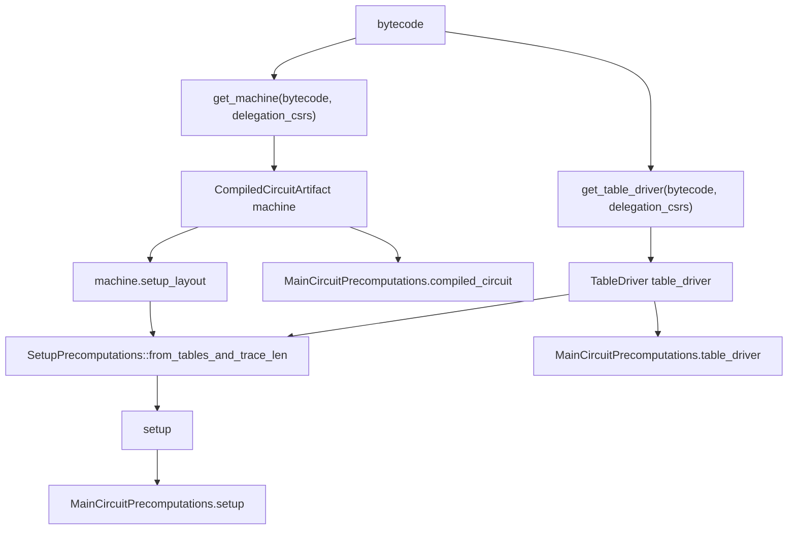
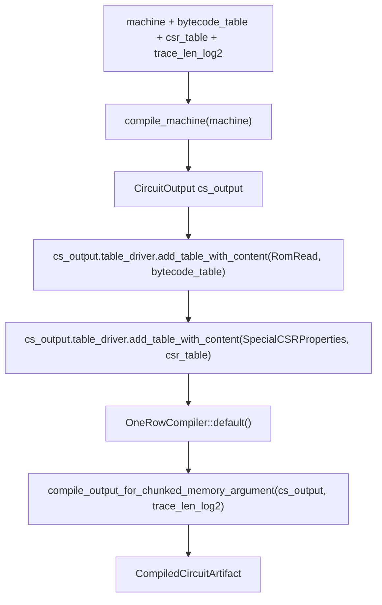

下面是按“源码阅读笔记”标准重排后的第五章正文。第五章的入口从旧大纲的“witness trace 给 CircuitOutput 里的 Variable 填真实执行值”改为“main RISC-V setup 路径”。第四章已经覆盖了 `Machine代码 -> BasicAssembly -> CircuitOutput`，并且已经讲清 `Variable` 还不是 trace 列、`CircuitOutput` 不保存真实执行值、`OneRowCompiler` 后续才把变量映射到列，因此第五章不重复单行状态转移和 witness 填值逻辑；本章只写 setup 层对象如何从源码路径生成。

# 第五章 main RISC-V setup 路径：从 Machine 规则到 setup 输入

第四章已经结束在这个边界：

```text
Machine代码
  -> BasicAssembly
  -> CircuitOutput
```

第四章解释的是：一行 RISC-V 执行怎样被写成 `Variable`、`Constraint`、lookup query、shuffle RAM query。`CircuitOutput`保存这些规则对象，不保存真实执行值，也不保存最终 trace 列地址。第四章也已经说明：真实的 `x1=7`、`x2=9`、`rd=16` 属于 witness trace；固定表内容属于 setup trace；列布局属于 `CompiledCircuitArtifact`。

第五章进入另一条主线：

```text
bytecode
  -> get_main_riscv_circuit_setup
  -> get_machine
  -> default_compile_machine
  -> compile_machine
  -> CircuitOutput
  -> OneRowCompiler
  -> CompiledCircuitArtifact

bytecode
  -> get_table_driver
  -> TableDriver

CompiledCircuitArtifact.setup_layout + TableDriver
  -> SetupPrecomputations
  -> setup trace LDE
  -> setup Merkle tree
```

本章只处理 setup 层。setup 层处理固定结构和固定表：

```text
setup层包含：
  CompiledCircuitArtifact
  TableDriver
  SetupLayout
  SetupPrecomputations
  Twiddles
  LdePrecomputations

setup层不包含：
  某一行 x1 = 7
  某一行 x2 = 9
  某一行 pc = 0
  某一行 low_opcode_var = ADD_low16
  guest程序实际跑出来的 CycleData
```

第五章的源码入口：

```text
circuit_defs/setups/src/circuits/main_riscv/mod.rs
  get_main_riscv_circuit_setup
```

------

## 5.1 get_main_riscv_circuit_setup 是 main RISC-V setup 的总入口

源码文件：

```text
circuit_defs/setups/src/circuits/main_riscv/mod.rs
```

源码片段：

```rust
pub fn get_main_riscv_circuit_setup<A: GoodAllocator, B: GoodAllocator>(
    bytecode: &[u32],
    worker: &Worker,
) -> MainCircuitPrecomputations<IMStandardIsaConfig, A, B> {
    let delegation_csrs = IMStandardIsaConfig::ALLOWED_DELEGATION_CSRS;
    let machine: cs::one_row_compiler::CompiledCircuitArtifact<Mersenne31Field> =
        ::risc_v_cycles::get_machine(bytecode, delegation_csrs);
    let table_driver = ::risc_v_cycles::get_table_driver(bytecode, delegation_csrs);

    let twiddles: Twiddles<_, A> = Twiddles::new(::risc_v_cycles::DOMAIN_SIZE, &worker);
    let lde_precomputations = LdePrecomputations::new(
        ::risc_v_cycles::DOMAIN_SIZE,
        ::risc_v_cycles::LDE_FACTOR,
        ::risc_v_cycles::LDE_SOURCE_COSETS,
        &worker,
    );
    let setup =
        SetupPrecomputations::<DEFAULT_TRACE_PADDING_MULTIPLE, A, DefaultTreeConstructor>::from_tables_and_trace_len(
            &table_driver,
            ::risc_v_cycles::DOMAIN_SIZE,
            &machine.setup_layout,
            &twiddles,
            &lde_precomputations,
            ::risc_v_cycles::LDE_FACTOR,
            ::risc_v_cycles::TREE_CAP_SIZE,
            &worker,
        );

    MainCircuitPrecomputations {
        compiled_circuit: machine,
        table_driver,
        twiddles,
        lde_precomputations,
        setup,
        witness_eval_fn_for_gpu_tracer: ::risc_v_cycles::witness_eval_fn_for_gpu_tracer,
    }
}
```

这个函数的调用者是 setup 构造路径。输入是：

```text
bytecode: &[u32]
  已经按 32-bit word 表示的 guest 程序。

worker: &Worker
  并行执行器。后面生成 setup trace、LDE、Merkle tree 时会用。
```

本地执行顺序是：



`get_main_riscv_circuit_setup`返回 `MainCircuitPrecomputations`。这个对象属于 setup 层。它会被后续证明入口 `prove_image_execution` 消费。它内部放了五类对象：

```text
compiled_circuit:
  类型是 CompiledCircuitArtifact。
  消费者是 witness generation、prove、verifier generator。
  层级是 setup/prove 边界对象。
  它描述列布局、约束布局、lookup布局、memory布局。

table_driver:
  类型是 TableDriver。
  消费者是 SetupPrecomputations 和 witness lookup helper。
  层级是 setup层固定表内容。

twiddles:
  FFT/LDE相关预计算。
  消费者是 SetupPrecomputations 和 prove。
  层级是 setup/prove 的后端辅助对象。

lde_precomputations:
  LDE相关预计算。
  消费者是 SetupPrecomputations 和 prove。
  层级是 setup/prove 的后端辅助对象。

setup:
  类型是 SetupPrecomputations。
  消费者是 prove。
  层级是 setup层承诺结果。
```

`get_main_riscv_circuit_setup`内部最重要的结构是双路径：

```text
get_machine 路径：
  产出 CompiledCircuitArtifact。
  解决“约束和列布局长什么样”。

get_table_driver 路径：
  产出 TableDriver。
  解决“固定 lookup 表内容是什么”。

SetupPrecomputations：
  把 TableDriver 的固定表内容按 CompiledCircuitArtifact.setup_layout 写入 setup trace。
```

这里的 `machine` 变量名容易误读。源码里：

```rust
let machine: cs::one_row_compiler::CompiledCircuitArtifact<Mersenne31Field> =
    ::risc_v_cycles::get_machine(bytecode, delegation_csrs);
```

`machine`不是 VM，也不是 RISC-V simulator。它是已经编译好的电路 artifact。这个 artifact 包含 trace 布局、约束布局和 setup layout。源码明确把 `machine.setup_layout` 传给 `SetupPrecomputations::from_tables_and_trace_len`。

------

## 5.2 get_machine 路径：从 bytecode 到 CompiledCircuitArtifact

源码文件：

```text
circuit_defs/risc_v_cycles/src/lib.rs
```

入口：

```rust
pub fn get_machine(
    bytecode: &[u32],
    delegation_csrs: &[u32],
) -> one_row_compiler::CompiledCircuitArtifact<field::Mersenne31Field> {
    get_machine_for_rom_bound::<ROM_ADDRESS_SPACE_SECOND_WORD_BITS>(bytecode, delegation_csrs)
}
```

`get_machine` 的调用者是 `get_main_riscv_circuit_setup`。输入是：

```text
bytecode:
  guest程序的 u32 word 数组。

delegation_csrs:
  允许 delegation 的 CSR 编号列表。
```

返回是：

```text
CompiledCircuitArtifact<Mersenne31Field>
```

`CompiledCircuitArtifact` 属于 setup/prove 边界对象。它由 `get_machine` 创建，被 `get_main_riscv_circuit_setup` 放进 `MainCircuitPrecomputations.compiled_circuit`，后续被 `evaluate_witness` 和 `prove` 消费。源码里的 `prove_image_execution_for_machine_with_gpu_tracers` 会读取 `risc_v_circuit_precomputations.compiled_circuit.trace_len`，并在 `evaluate_witness` 和 `prove` 中传入 `compiled_circuit`。

### 5.2.1 get_machine_for_rom_bound 逐行

源码片段：

```rust
pub fn get_machine_for_rom_bound<const ROM_ADDRESS_SPACE_SECOND_WORD_BITS: usize>(
    bytecode: &[u32],
    delegation_csrs: &[u32],
) -> one_row_compiler::CompiledCircuitArtifact<field::Mersenne31Field> {
    assert_eq!(
        bytecode.len(),
        (1 << (16 + ROM_ADDRESS_SPACE_SECOND_WORD_BITS)) / 4
    );
    use crate::machine::machine_configurations::create_csr_table_for_delegation;
    use prover::cs::machine::machine_configurations::create_table_for_rom_image;
    use prover::cs::tables::TableType;

    let machine = FullIsaMachineWithDelegationNoExceptionHandling;
    let rom_table = create_table_for_rom_image::<_, ROM_ADDRESS_SPACE_SECOND_WORD_BITS>(
        &bytecode,
        TableType::RomRead.to_table_id(),
    );
    let csr_table = create_csr_table_for_delegation(
        true,
        delegation_csrs,
        TableType::SpecialCSRProperties.to_table_id(),
    );

    let compiled_machine = default_compile_machine::<_, ROM_ADDRESS_SPACE_SECOND_WORD_BITS>(
        machine,
        rom_table,
        Some(csr_table),
        DOMAIN_SIZE.trailing_zeros() as usize,
    );

    compiled_machine
}
```

执行顺序如下：

```text
1. 检查 bytecode 长度等于固定 ROM word 数量。
2. 创建 FullIsaMachineWithDelegationNoExceptionHandling。
3. 根据 bytecode 创建 RomRead 表。
4. 根据 delegation_csrs 创建 SpecialCSRProperties 表。
5. 调 default_compile_machine。
6. 返回 CompiledCircuitArtifact。
```

### 5.2.2 bytecode 长度检查属于 setup 层

源码：

```rust
assert_eq!(
    bytecode.len(),
    (1 << (16 + ROM_ADDRESS_SPACE_SECOND_WORD_BITS)) / 4
);
```

`bytecode.len()`必须等于 ROM 地址空间可容纳的 word 数量。这里的 `bytecode` 已经是 padded bytecode。padding 在更早的输入准备阶段完成。这里不处理某一行 witness 的 pc，也不处理某一条指令执行，只检查 setup 需要的固定 ROM 表大小。

这个检查属于 setup 层，因为它决定 `RomRead` 固定表的大小。`RomRead` 表大小进入 `TableDriver.total_tables_len`，后面影响 `setup_layout.generic_lookup_setup_columns` 的数量。

### 5.2.3 FullIsaMachineWithDelegationNoExceptionHandling 是 Machine 描述

源码：

```rust
let machine = FullIsaMachineWithDelegationNoExceptionHandling;
```

这个对象在本章作为 compile-time machine description 使用。它由 `get_machine_for_rom_bound` 创建，被 `default_compile_machine` 消费。它属于 setup/compile 层，不属于 witness 层。

它会影响：

```text
支持哪些 opcode family
create_decoder_table 怎样生成 OpTypeBitmask 表
describe_state_transition 怎样写一行 CPU 规则
define_used_tables 返回哪些通用表
define_additional_tables 返回哪些额外表
```

第四章已经沿着 `describe_state_transition` 展开了单行规则。本章只看这个 machine 如何进入 setup 路径。

### 5.2.4 create_table_for_rom_image 创建 RomRead 表

源码：

```rust
let rom_table = create_table_for_rom_image::<_, ROM_ADDRESS_SPACE_SECOND_WORD_BITS>(
    &bytecode,
    TableType::RomRead.to_table_id(),
);
```

`RomRead` 表首次出现时需要固定四点：

```text
文件：
  cs/src/machine/machine_configurations/mod.rs

创建者：
  get_machine_for_rom_bound 调 create_table_for_rom_image。
  get_table_driver_for_rom_bound 也会调 create_table_for_rom_image。

消费者：
  default_compile_machine 把它补进 cs_output.table_driver。
  get_table_driver_for_rom_bound 把它补进独立 TableDriver。
  SetupPrecomputations 后面 dump TableDriver 时把它写入 setup trace。
  witness generation 的 placer.lookup 也会用 TableDriver 查 RomRead。

层级：
  setup层固定表。
```

`create_table_for_rom_image` 的注释说明这张表有固定大小，行形状是：

```text
(0, image bytes 0..2, image bytes 2..4)
(4, image bytes 4..6, image bytes 6..8)
```

源码注释还说明，field 比 32 bit 小，所以表行把 instruction 拆成两个 16-bit limb；超过 image 的 entry 填 `UNIMP_OPCODE`。

本章只记录 RomRead 的 setup 身份：

```text
RomRead:
  key = pc address
  value = opcode_low16, opcode_high16
```

第四章已经讲过 `read_opcode_from_rom` 怎样登记 `RomRead` lookup，且构造期不当场查表。本章不重复那条单行取指路径。

### 5.2.5 create_csr_table_for_delegation 创建 SpecialCSRProperties 表

源码：

```rust
let csr_table = create_csr_table_for_delegation(
    true,
    delegation_csrs,
    TableType::SpecialCSRProperties.to_table_id(),
);
```

`SpecialCSRProperties` 表首次出现时固定四点：

```text
文件：
  cs/src/machine/machine_configurations/mod.rs

创建者：
  get_machine_for_rom_bound 调 create_csr_table_for_delegation。
  get_table_driver_for_rom_bound 也会创建同一类表。

消费者：
  default_compile_machine 把它补进 cs_output.table_driver。
  get_table_driver_for_rom_bound 把它补进独立 TableDriver。
  CSR / SYSTEM 相关约束路径会查这张表。
  SetupPrecomputations 后面把它写入 setup trace。

层级：
  setup层固定表。
```

它依赖 `delegation_csrs`。`delegation_csrs`来自：

```rust
let delegation_csrs = IMStandardIsaConfig::ALLOWED_DELEGATION_CSRS;
```

这是 `get_main_riscv_circuit_setup`里第一行本地配置。它决定哪些 CSR 支持 delegation。当前第五章只写 main RISC-V setup 主线，不展开 CSR 指令语义和 delegation circuit 内部。

### 5.2.6 default_compile_machine 消费 machine、RomRead 表、CSR 表

源码：

```rust
let compiled_machine = default_compile_machine::<_, ROM_ADDRESS_SPACE_SECOND_WORD_BITS>(
    machine,
    rom_table,
    Some(csr_table),
    DOMAIN_SIZE.trailing_zeros() as usize,
);
```

输入：

```text
machine:
  FullIsaMachineWithDelegationNoExceptionHandling

rom_table:
  LookupTable<Mersenne31Field, 3>
  表类型是 RomRead

csr_table:
  LookupTable<Mersenne31Field, 3>
  表类型是 SpecialCSRProperties

trace_len_log2:
  DOMAIN_SIZE.trailing_zeros()
```

返回：

```text
CompiledCircuitArtifact<Mersenne31Field>
```

这里开始从“表对象准备”进入“电路编译”。下一节追入 `default_compile_machine`。

------

## 5.3 default_compile_machine 连接 CircuitOutput 和 OneRowCompiler

源码文件：

```text
cs/src/lib.rs
```

源码片段：

```rust
pub fn default_compile_machine<
    M: crate::machine::Machine<::field::Mersenne31Field>,
    const ROM_ADDRESS_SPACE_SECOND_WORD_BITS: usize,
>(
    machine: M,
    bytecode_table: crate::tables::LookupTable<field::Mersenne31Field, 3>,
    csr_table: Option<crate::tables::LookupTable<field::Mersenne31Field, 3>>,
    trace_len_log2: usize,
) -> crate::one_row_compiler::CompiledCircuitArtifact<::field::Mersenne31Field>
where
    [(); { <M as crate::machine::Machine<::field::Mersenne31Field>>::ASSUME_TRUSTED_CODE }
        as usize]:,
    [(); { <M as crate::machine::Machine<::field::Mersenne31Field>>::OUTPUT_EXACT_EXCEPTIONS }
        as usize]:,
{
    use ::field::Mersenne31Field;
    // now test compilation into AIR
    use crate::cs::cs_reference::BasicAssembly;
    use crate::machine::machine_configurations::compile_machine;
    use crate::one_row_compiler::OneRowCompiler;
    use crate::tables::TableType;

    let mut cs_output = compile_machine::<
        Mersenne31Field,
        BasicAssembly<Mersenne31Field>,
        M,
        ROM_ADDRESS_SPACE_SECOND_WORD_BITS,
    >(machine);
    // add the ROM table to account for size
    cs_output.table_driver.add_table_with_content(
        TableType::RomRead,
        crate::tables::LookupWrapper::Dimensional3(bytecode_table),
    );
    if let Some(csr_table) = csr_table {
        cs_output.table_driver.add_table_with_content(
            TableType::SpecialCSRProperties,
            crate::tables::LookupWrapper::Dimensional3(csr_table),
        );
    }
    let compiler = OneRowCompiler::default();
    let compiler_output =
        compiler.compile_output_for_chunked_memory_argument(cs_output, trace_len_log2);

    compiler_output
}
```

`default_compile_machine` 的调用者是 `get_machine_for_rom_bound`。输入是上一节创建好的 `machine`、`bytecode_table`、`csr_table`、`trace_len_log2`。返回是 `CompiledCircuitArtifact`。

执行顺序：



### 5.3.1 compile_machine 产出 CircuitOutput

源码：

```rust
let mut cs_output = compile_machine::<
    Mersenne31Field,
    BasicAssembly<Mersenne31Field>,
    M,
    ROM_ADDRESS_SPACE_SECOND_WORD_BITS,
>(machine);
```

`compile_machine`属于 compile/setup 前半段。它由 `default_compile_machine` 调用，输入是 `machine`，返回 `CircuitOutput`。第四章已经详细展开 `compile_machine -> describe_state_transition` 写单行规则。本章只看 `default_compile_machine` 对它的后续处理。

`CircuitOutput`在第五章的身份：

```text
文件：
  cs/src/cs/circuit.rs

创建者：
  BasicAssembly::finalize，由 compile_machine 调用后返回。

消费者：
  default_compile_machine 后续补 RomRead / CSR 表。
  OneRowCompiler::compile_output_for_chunked_memory_argument 读取它。

层级：
  setup/compile层中间产物。
```

第四章已经覆盖 `CircuitOutput`里的 `constraints`、`lookups`、`shuffle_ram_queries`、`range_check_expressions` 等字段如何被填入。本章不再重复 ADD 行如何进入这些字段。

### 5.3.2 RomRead 在 compile_machine 之后补入 cs_output.table_driver

源码：

```rust
cs_output.table_driver.add_table_with_content(
    TableType::RomRead,
    crate::tables::LookupWrapper::Dimensional3(bytecode_table),
);
```

这一步属于 setup/compile 层。它把 `get_machine_for_rom_bound` 创建好的 `bytecode_table` 加入 `CircuitOutput.table_driver`。

执行到这里时，第四章里的 `describe_state_transition` 已经登记了 `RomRead` lookup query。`RomRead` 的真实表内容在这一步才补进 `cs_output.table_driver`。

这个顺序的原因来自函数签名：

```text
compile_machine(machine)
  只接收 machine，不接收 bytecode_table。

default_compile_machine(machine, bytecode_table, csr_table, trace_len_log2)
  接收 bytecode_table，所以在 compile_machine 返回后补表。
```

这一步影响下游 `OneRowCompiler`。`OneRowCompiler`会读取 `table_driver.total_tables_len` 计算 setup layout 的列组数量。缺少 `RomRead` 表会导致 table size 不完整，setup layout 计算错误。

### 5.3.3 SpecialCSRProperties 在 compile_machine 之后补入 cs_output.table_driver

源码：

```rust
if let Some(csr_table) = csr_table {
    cs_output.table_driver.add_table_with_content(
        TableType::SpecialCSRProperties,
        crate::tables::LookupWrapper::Dimensional3(csr_table),
    );
}
```

CSR 表同样在 `compile_machine`之后补入。它依赖 `delegation_csrs`，也属于程序/配置相关固定表。后续 `OneRowCompiler`读取 table size 时同样需要这张表。

### 5.3.4 OneRowCompiler 消费 CircuitOutput

源码：

```rust
let compiler = OneRowCompiler::default();
let compiler_output =
    compiler.compile_output_for_chunked_memory_argument(cs_output, trace_len_log2);
```

`OneRowCompiler`首次出现时固定四点：

```text
文件：
  cs/src/one_row_compiler/compile_layout.rs
  cs/src/one_row_compiler/mod.rs

创建者：
  default_compile_machine 通过 OneRowCompiler::default() 创建。

消费者：
  default_compile_machine 立即调用 compile_output_for_chunked_memory_argument。

层级：
  setup/compile层。
```

`OneRowCompiler`输入是 `CircuitOutput`，输出是 `CompiledCircuitArtifact`。它处理的是布局编译，不生成 witness trace，不生成 setup trace commitment。

------

## 5.4 compile_machine：第四章已覆盖的边界

源码文件：

```text
cs/src/machine/machine_configurations/mod.rs
```

源码片段：

```rust
pub fn compile_machine<
    F: PrimeField,
    C: Circuit<F>,
    M: Machine<F>,
    const ROM_ADDRESS_SPACE_SECOND_WORD_BITS: usize,
>(
    machine: M,
) -> CircuitOutput<F>
where
    [(); { <M as Machine<F>>::ASSUME_TRUSTED_CODE } as usize]:,
    [(); { <M as Machine<F>>::OUTPUT_EXACT_EXCEPTIONS } as usize]:,
{
    let mut cs = C::new();

    create_table_driver_into_cs::<F, C, M, ROM_ADDRESS_SPACE_SECOND_WORD_BITS>(&mut cs, machine);

    let (initial_state, final_state) =
        M::describe_state_transition::<_, ROM_ADDRESS_SPACE_SECOND_WORD_BITS>(&mut cs);

    let mut initial_state_vars = vec![];
    initial_state.append_into_variables_set(&mut initial_state_vars);

    let mut final_state_vars = vec![];
    final_state.append_into_variables_set(&mut final_state_vars);

    let (mut output, _) = cs.finalize();
    output.state_input = initial_state_vars;
    output.state_output = final_state_vars;

    output
}
```

这一段在第四章已经作为主锚点讲过：`C::new()`创建 `BasicAssembly`，`create_table_driver_into_cs`注册通用表，`describe_state_transition`写单行状态转移规则，`cs.finalize()`返回 `CircuitOutput`。第四章还明确说 `Variable`不是 trace 列，`CircuitOutput`只是规则集合，`OneRowCompiler`后续才把规则排成布局。

第五章只保留本函数的 setup 相关边界：

```text
输入：
  machine

本地动作：
  创建 BasicAssembly
  注册部分固定表到 cs.table_driver
  调 describe_state_transition 写规则
  finalize 得到 CircuitOutput
  填 state_input / state_output

返回：
  CircuitOutput

下游：
  default_compile_machine 补 RomRead / CSR 表
  OneRowCompiler 编译成 CompiledCircuitArtifact
```

这里的 `create_table_driver_into_cs` 是第五章需要继续追入的函数，因为它和 setup 表注册有关。

------

## 5.5 create_table_driver_into_cs：把通用固定表注册进 Circuit

源码文件：

```text
cs/src/machine/machine_configurations/mod.rs
```

入口：

```rust
create_table_driver_into_cs::<F, C, M, ROM_ADDRESS_SPACE_SECOND_WORD_BITS>(&mut cs, machine);
```

调用者是 `compile_machine`。输入是：

```text
cs: &mut CS
  当前 Circuit 构造器，默认是 BasicAssembly。

machine: M
  当前 RISC-V machine description。
```

返回值是 `()`。它直接修改 `cs`，把固定表注册进 `BasicAssembly.table_driver`。

这一步属于 setup/compile 层，不属于 witness 层。

### 5.5.1 函数主体逐段

源码片段：

```rust
pub fn create_table_driver_into_cs<
    F: PrimeField,
    CS: Circuit<F>,
    M: Machine<F>,
    const ROM_ADDRESS_SPACE_SECOND_WORD_BITS: usize,
>(
    cs: &mut CS,
    machine: M,
) {
    // materialize all tables
    let used_tables = M::define_used_tables();
    assert!(
        used_tables.contains(&TableType::ZeroEntry) == false,
        "machine must not define zero entry table as used"
    );
    assert!(
        used_tables.contains(&TableType::OpTypeBitmask) == false,
        "machine must not define decoder table"
    );
    assert!(
        used_tables.contains(&TableType::CsrBitmask) == false,
        "machine must not define CSR support table"
    );
    assert!(
        used_tables.contains(&TableType::RangeCheckSmall) == false,
        "machine must not define 8-bit range check table"
    );

    let extra_tables = machine.define_additional_tables();
    for (table, _) in extra_tables.iter() {
        assert!(used_tables.contains(table) == false);
    }

    for table in used_tables.into_iter() {
        cs.materialize_table(table);
    }

    for (table, content) in extra_tables.into_iter() {
        cs.add_table_with_content(table, content);
    }

    cs.materialize_table(TableType::And);
    cs.materialize_table(TableType::ZeroEntry);
    cs.materialize_table(TableType::QuickDecodeDecompositionCheck4x4x4);
    cs.materialize_table(TableType::QuickDecodeDecompositionCheck7x3x6);
    cs.materialize_table(TableType::U16GetSignAndHighByte);
    cs.materialize_table(TableType::RangeCheckSmall);

    let decoder_table = M::create_decoder_table(TableType::OpTypeBitmask.to_table_id());
    cs.add_table_with_content(
        TableType::OpTypeBitmask,
        LookupWrapper::Dimensional3(decoder_table),
    );

    if M::USE_ROM_FOR_BYTECODE {
        // manual call here, to later on easily control address bits
        let id = TableType::RomAddressSpaceSeparator.to_table_id();
        use crate::tables::create_rom_separator_table;
        let table = LookupWrapper::Dimensional3(create_rom_separator_table::<
            F,
            ROM_ADDRESS_SPACE_SECOND_WORD_BITS,
        >(id));
        cs.add_table_with_content(TableType::RomAddressSpaceSeparator, table);
    }
}
```

### 5.5.2 used_tables 是 Machine 声明的表集合

源码：

```rust
let used_tables = M::define_used_tables();
```

`used_tables`由当前 machine 类型提供。它列出 opcode family 或 gadget 需要的固定表。它属于 setup/compile 层，因为它决定哪些 lookup table 被放入 `TableDriver`。

紧接着的断言排除几类特殊表：

```rust
assert!(used_tables.contains(&TableType::ZeroEntry) == false);
assert!(used_tables.contains(&TableType::OpTypeBitmask) == false);
assert!(used_tables.contains(&TableType::CsrBitmask) == false);
assert!(used_tables.contains(&TableType::RangeCheckSmall) == false);
```

这些表由 `create_table_driver_into_cs`自己统一加入。machine 不应重复声明。

### 5.5.3 extra_tables 是 machine 附加表

源码：

```rust
let extra_tables = machine.define_additional_tables();
for (table, _) in extra_tables.iter() {
    assert!(used_tables.contains(table) == false);
}
```

`extra_tables`是已经带内容的表。每个元素是：

```text
(table_type, content)
```

它们通过 `cs.add_table_with_content`加入，而不是通过 `materialize_table`生成。

### 5.5.4 materialize_table 注册可自动生成的表

源码：

```rust
for table in used_tables.into_iter() {
    cs.materialize_table(table);
}
```

`materialize_table` 的意思是：

```text
根据 TableType 自动生成表内容，并放入当前 Circuit 的 table_driver。
```

例如：

```text
And
ZeroEntry
QuickDecodeDecompositionCheck4x4x4
RangeCheckSmall
```

这些表由 `TableType::generate_table` 或相关生成逻辑创建。它们不依赖当前 guest bytecode。

`materialize_table`属于 setup/compile 层。它不创建 witness 值，不执行 RISC-V 程序。

### 5.5.5 add_table_with_content 注册已经构造好的表

源码：

```rust
for (table, content) in extra_tables.into_iter() {
    cs.add_table_with_content(table, content);
}
```

`add_table_with_content` 的意思是：

```text
调用者已经构造好 LookupTable 或 LookupWrapper。
现在把它放入 table_driver。
```

本函数后面也用它加入 decoder 表和 ROM 地址空间分隔表。

### 5.5.6 基础表注册

源码：

```rust
cs.materialize_table(TableType::And);
cs.materialize_table(TableType::ZeroEntry);
cs.materialize_table(TableType::QuickDecodeDecompositionCheck4x4x4);
cs.materialize_table(TableType::QuickDecodeDecompositionCheck7x3x6);
cs.materialize_table(TableType::U16GetSignAndHighByte);
cs.materialize_table(TableType::RangeCheckSmall);
```

这些表首次出现时按作用分组：

```text
And:
  位运算辅助表。

ZeroEntry:
  lookup padding / zero entry 相关表。

QuickDecodeDecompositionCheck4x4x4:
  decoder 快速分解小字段用的表。

QuickDecodeDecompositionCheck7x3x6:
  decoder 快速分解 opcode/funct3/imm 等字段用的表。

U16GetSignAndHighByte:
  从 u16 高 limb 中提取符号位和高字节的表。

RangeCheckSmall:
  8-bit range check 表。
```

这些表由 `create_table_driver_into_cs`注册到 `BasicAssembly.table_driver`，被 `OneRowCompiler`用于计算表布局，被 `SetupPrecomputations`通过另一条独立 `get_table_driver`路径写入 setup trace。

### 5.5.7 OpTypeBitmask decoder 表注册

源码：

```rust
let decoder_table = M::create_decoder_table(TableType::OpTypeBitmask.to_table_id());
cs.add_table_with_content(
    TableType::OpTypeBitmask,
    LookupWrapper::Dimensional3(decoder_table),
);
```

`OpTypeBitmask`首次出现时固定四点：

```text
文件：
  cs/src/machine/machine_configurations/mod.rs 调 M::create_decoder_table。
  decoder 具体生成逻辑在 Machine trait 相关实现中。

创建者：
  create_table_driver_into_cs 创建 decoder_table。
  create_table_driver 也会创建同样的 decoder_table。

消费者：
  OptimizedDecoder::decode 登记 OpTypeBitmask lookup。
  OneRowCompiler 编译 lookup 布局。
  SetupPrecomputations 把表内容写入 setup trace。

层级：
  setup层固定表。
```

第四章已经讲过 `OptimizedDecoder::decode`怎样使用这张表：输入是 `opcode + 2^7 * funct3 + 2^10 * funct7`，输出是 `is_invalid`、format flags、opcode family flags。第四章也已经讲过 `set_values` 和 lookup 约束分工，本章不重复 witness 查 bitmask 的细节。

### 5.5.8 RomAddressSpaceSeparator 表注册

源码：

```rust
if M::USE_ROM_FOR_BYTECODE {
    let id = TableType::RomAddressSpaceSeparator.to_table_id();
    use crate::tables::create_rom_separator_table;
    let table = LookupWrapper::Dimensional3(create_rom_separator_table::<
        F,
        ROM_ADDRESS_SPACE_SECOND_WORD_BITS,
    >(id));
    cs.add_table_with_content(TableType::RomAddressSpaceSeparator, table);
}
```

`RomAddressSpaceSeparator`首次出现时固定四点：

```text
文件：
  cs/src/machine/machine_configurations/mod.rs

创建者：
  create_table_driver_into_cs 调 create_rom_separator_table。
  create_table_driver 也会创建同一张表。

消费者：
  read_opcode_from_rom 使用它处理 pc 高位。
  LoadOp / StoreOp 地址空间判断也会用它。
  SetupPrecomputations 通过 TableDriver dump 它。

层级：
  setup层固定表。
```

这张表和 `RomRead` 不同：

```text
RomAddressSpaceSeparator:
  处理地址高位，判断 ROM/RAM 范围，并输出 ROM 地址拼接所需部分。

RomRead:
  处理完整 ROM 地址，输出 opcode_low16 / opcode_high16。
```

`create_table_driver_into_cs`注册 `RomAddressSpaceSeparator`，但不注册 `RomRead`。`RomRead`依赖当前 bytecode，所以在 `default_compile_machine`里补进 `cs_output.table_driver`。

------

## 5.6 create_table_driver：创建 setup 使用的独立 TableDriver

`get_main_riscv_circuit_setup`除了调用 `get_machine`，还调用：

```rust
let table_driver = ::risc_v_cycles::get_table_driver(bytecode, delegation_csrs);
```

这条路径返回独立 `TableDriver`。它用于 `SetupPrecomputations::from_tables_and_trace_len`。源码在：

```text
circuit_defs/risc_v_cycles/src/lib.rs
cs/src/machine/machine_configurations/mod.rs
```

### 5.6.1 get_table_driver_for_rom_bound 逐行

源码片段：

```rust
pub fn get_table_driver_for_rom_bound<const ROM_ADDRESS_SPACE_SECOND_WORD_BITS: usize>(
    bytecode: &[u32],
    delegation_csrs: &[u32],
) -> prover::cs::tables::TableDriver<Mersenne31Field> {
    assert_eq!(
        bytecode.len(),
        (1 << (16 + ROM_ADDRESS_SPACE_SECOND_WORD_BITS)) / 4
    );

    use crate::machine::machine_configurations::create_csr_table_for_delegation;
    use prover::cs::machine::machine_configurations::create_table_driver;
    use prover::cs::machine::machine_configurations::create_table_for_rom_image;
    use prover::cs::tables::LookupWrapper;
    use prover::cs::tables::TableType;

    let machine = FullIsaMachineWithDelegationNoExceptionHandling;
    let mut table_driver = create_table_driver::<_, _, ROM_ADDRESS_SPACE_SECOND_WORD_BITS>(machine);
    let rom_table = create_table_for_rom_image::<_, ROM_ADDRESS_SPACE_SECOND_WORD_BITS>(
        &bytecode,
        TableType::RomRead.to_table_id(),
    );
    table_driver.add_table_with_content(TableType::RomRead, LookupWrapper::Dimensional3(rom_table));
    let csr_table = create_csr_table_for_delegation(
        true,
        delegation_csrs,
        TableType::SpecialCSRProperties.to_table_id(),
    );
    table_driver.add_table_with_content(
        TableType::SpecialCSRProperties,
        LookupWrapper::Dimensional3(csr_table),
    );

    table_driver
}
```

执行顺序：

```text
1. 检查 bytecode 长度。
2. 创建 FullIsaMachineWithDelegationNoExceptionHandling。
3. 调 create_table_driver(machine) 创建通用 TableDriver。
4. 根据 bytecode 创建 RomRead 表。
5. 把 RomRead 表加入 TableDriver。
6. 根据 delegation_csrs 创建 SpecialCSRProperties 表。
7. 把 SpecialCSRProperties 表加入 TableDriver。
8. 返回 TableDriver。
```

`TableDriver`首次出现时固定四点：

```text
文件：
  cs/src/tables.rs

创建者：
  create_table_driver 创建基础 TableDriver。
  get_table_driver_for_rom_bound 补 RomRead / SpecialCSRProperties。

消费者：
  get_main_riscv_circuit_setup 把它传给 SetupPrecomputations。
  setup trace 生成阶段调用 table_driver.dump_tables。
  witness generation 阶段也会用它执行 lookup helper。

层级：
  setup层固定表容器。
```

### 5.6.2 create_table_driver 和 create_table_driver_into_cs 的并行关系

源码文件：

```text
cs/src/machine/machine_configurations/mod.rs
```

`create_table_driver`源码片段：

```rust
pub fn create_table_driver<
    F: PrimeField,
    M: Machine<F>,
    const ROM_ADDRESS_SPACE_SECOND_WORD_BITS: usize,
>(
    machine: M,
) -> TableDriver<F> {
    // materialize all tables
    let used_tables = M::define_used_tables();
    ...
    let extra_tables = machine.define_additional_tables();
    ...
    let mut table_driver = TableDriver::new();

    for table in used_tables.into_iter() {
        table_driver.materialize_table(table);
    }

    for (table, content) in extra_tables.into_iter() {
        table_driver.add_table_with_content(table, content);
    }

    table_driver.materialize_table(TableType::And);
    table_driver.materialize_table(TableType::ZeroEntry);
    table_driver.materialize_table(TableType::QuickDecodeDecompositionCheck4x4x4);
    table_driver.materialize_table(TableType::QuickDecodeDecompositionCheck7x3x6);
    table_driver.materialize_table(TableType::U16GetSignAndHighByte);
    table_driver.materialize_table(TableType::RangeCheckSmall);

    let decoder_table = M::create_decoder_table(TableType::OpTypeBitmask.to_table_id());
    table_driver.add_table_with_content(
        TableType::OpTypeBitmask,
        LookupWrapper::Dimensional3(decoder_table),
    );

    if M::USE_ROM_FOR_BYTECODE {
        let id = TableType::RomAddressSpaceSeparator.to_table_id();
        use crate::tables::create_rom_separator_table;
        let table = LookupWrapper::Dimensional3(create_rom_separator_table::<
            F,
            ROM_ADDRESS_SPACE_SECOND_WORD_BITS,
        >(id));
        table_driver.add_table_with_content(TableType::RomAddressSpaceSeparator, table);
    }

    table_driver
}
```

`create_table_driver` 和 `create_table_driver_into_cs`的动作几乎对应：

```text
create_table_driver:
  table_driver.materialize_table(...)
  table_driver.add_table_with_content(...)

create_table_driver_into_cs:
  cs.materialize_table(...)
  cs.add_table_with_content(...)
```

区别在目标对象：

```text
create_table_driver:
  返回独立 TableDriver。
  下游是 SetupPrecomputations。

create_table_driver_into_cs:
  修改 BasicAssembly / Circuit 内部 table_driver。
  下游是 CircuitOutput 和 OneRowCompiler。
```

这两条路径需要产生一致的表集合。`CompiledCircuitArtifact.setup_layout`是根据 `cs_output.table_driver.total_tables_len`算出来的；`SetupPrecomputations`真正写表时使用的是独立 `get_table_driver`返回的 `table_driver`。两边表集合不一致，会导致 `total_tables_len`、table offsets、setup columns 对不上。

------

## 5.7 OneRowCompiler：从 CircuitOutput 到 CompiledCircuitArtifact

源码文件：

```text
cs/src/one_row_compiler/compile_layout.rs
cs/src/one_row_compiler/mod.rs
```

入口来自 `default_compile_machine`：

```rust
let compiler = OneRowCompiler::default();
let compiler_output =
    compiler.compile_output_for_chunked_memory_argument(cs_output, trace_len_log2);
```

`compile_output_for_chunked_memory_argument`源码：

```rust
impl<F: PrimeField> OneRowCompiler<F> {
    pub fn compile_output_for_chunked_memory_argument(
        &self,
        circuit_output: CircuitOutput<F>,
        trace_len_log2: usize,
    ) -> CompiledCircuitArtifact<F> {
        Self::compile_inner::<false>(self, circuit_output, trace_len_log2)
    }

    pub fn compile_to_evaluate_delegations(
        &self,
        circuit_output: CircuitOutput<F>,
        trace_len_log2: usize,
    ) -> CompiledCircuitArtifact<F> {
        Self::compile_inner::<true>(self, circuit_output, trace_len_log2)
    }
}
```

`OneRowCompiler`首次出现时固定四点：

```text
文件：
  cs/src/one_row_compiler/compile_layout.rs
  cs/src/one_row_compiler/mod.rs

创建者：
  default_compile_machine 创建 OneRowCompiler::default()。

消费者：
  default_compile_machine 调 compile_output_for_chunked_memory_argument。
  delegation circuit setup 会调 compile_to_evaluate_delegations。

层级：
  setup/compile层。
```

### 5.7.1 compile_inner 的输入拆包

源码片段：

```rust
fn compile_inner<const FOR_DELEGATION: bool>(
    &self,
    circuit_output: CircuitOutput<F>,
    trace_len_log2: usize,
) -> CompiledCircuitArtifact<F> {
    // our main purposes are:
    // - place variables in particular grid places
    // - select whether they go into witness subtree or memory subtree
    // - normalize constraints to address particular columns insteap of variable indexes
    // - try to apply some heuristrics

    let CircuitOutput {
        state_input,
        state_output,
        table_driver,
        num_of_variables,
        constraints,
        lookups,
        shuffle_ram_queries,
        linked_variables,
        range_check_expressions,
        boolean_vars,
        substitutions,
        delegated_computation_requests,
        degegated_request_to_process,
        batched_memory_accesses,
        register_and_indirect_memory_accesses,
    } = circuit_output;
```

这段把 `CircuitOutput`拆成具体字段。每个字段的来源在第四章已经讲过：

```text
state_input / state_output:
  compile_machine 从 initial_state / final_state 提取。

table_driver:
  create_table_driver_into_cs 注册的表 + default_compile_machine 后补的 RomRead/CSR 表。

constraints:
  Machine 代码通过 cs.add_constraint 写入。

lookups:
  RomRead、decoder、bit表、range表相关 lookup query。

shuffle_ram_queries:
  slot0/slot1/slot2 memory/register query。

range_check_expressions:
  require_invariant RangeChecked 产生。

boolean_vars:
  add_boolean_variable / require_invariant Boolean 产生。

substitutions:
  placeholder 到 Variable 的映射。
```

本节关注 `OneRowCompiler`怎样消费这些字段。

### 5.7.2 main RISC-V 路径 FOR_DELEGATION = false

`compile_output_for_chunked_memory_argument`调用：

```rust
Self::compile_inner::<false>(...)
```

所以 `FOR_DELEGATION=false`。源码中的 main RISC-V 检查是：

```rust
if FOR_DELEGATION {
    ...
} else {
    assert_eq!(shuffle_ram_queries.len(), 3);
    assert!(linked_variables.is_empty());
    assert!(degegated_request_to_process.is_none());
    assert!(batched_memory_accesses.is_empty());
    assert!(register_and_indirect_memory_accesses.is_empty());
}
```

main RISC-V 单行固定三个 shuffle RAM query。第四章已经讲过 slot0、slot1、slot2。第五章只记录 compiler 在这里把这个固定形状作为 layout 前提。

### 5.7.3 trace_len 和 setup layout 的关系

源码：

```rust
let trace_len = 1usize << trace_len_log2;
let total_tables_size = table_driver.total_tables_len;
let lookup_table_encoding_capacity = trace_len - 1;
let mut num_required_tuples_for_generic_lookup_setup =
    total_tables_size / lookup_table_encoding_capacity;
if total_tables_size % lookup_table_encoding_capacity != 0 {
    num_required_tuples_for_generic_lookup_setup += 1;
}

drop(linked_variables);

// we can immediately make setup layout
let need_timestamps = !FOR_DELEGATION;
let setup_layout =
    SetupLayout::layout_for_lookup_size(total_tables_size, trace_len, need_timestamps);
```

这里是第五章的关键连接点：

```text
table_driver.total_tables_len
  -> total_tables_size
  -> SetupLayout::layout_for_lookup_size
  -> setup_layout.generic_lookup_setup_columns
```

`trace_len - 1` 是每个 generic lookup setup 列组可编码的表行数量。最后一行不用于普通表内容。这个设计在 `SetupPrecomputations::get_main_domain_trace`里会再次出现。

`SetupLayout`首次出现时固定四点：

```text
文件：
  cs/src/definitions/setup_tree.rs

创建者：
  OneRowCompiler::compile_inner 调 SetupLayout::layout_for_lookup_size。

消费者：
  get_main_riscv_circuit_setup 把 machine.setup_layout 传给 SetupPrecomputations。
  SetupPrecomputations::get_main_domain_trace 根据 setup_layout 写固定列。
  prove/verifier 后续根据 setup_layout 读取 setup columns。

层级：
  setup层布局对象。
```

`SetupLayout`不保存表内容。它只说明 setup trace 中哪些列放：

```text
timestamp setup columns
range_check_16 setup column
timestamp_range_check setup column
generic lookup setup columns
```

### 5.7.4 variable_mapping：Variable 变成 ColumnAddress

`OneRowCompiler`内部创建布局映射：

```rust
let mut layout = BTreeMap::<Variable, ColumnAddress>::new();
```

`layout`最后会进入 `CompiledCircuitArtifact.variable_mapping`。第四章已经解释：`Variable(17)`不是第17列，compiler 阶段才会变成 `ColumnAddress`。本章只记录这个转换发生在 `OneRowCompiler`。

`ColumnAddress`有几类位置，源码中的 `ToTokens`实现列出：

```rust
match *self {
    ColumnAddress::WitnessSubtree(offset) => { ... }
    ColumnAddress::MemorySubtree(offset) => { ... }
    ColumnAddress::SetupSubtree(offset) => { ... }
    ColumnAddress::OptimizedOut(offset) => { ... }
}
```

含义：

```text
WitnessSubtree:
  witness trace 列。

MemorySubtree:
  memory argument 相关列。

SetupSubtree:
  setup trace 固定列。

OptimizedOut:
  优化输出位置。
```

### 5.7.5 CompiledCircuitArtifact 的身份

`CompiledCircuitArtifact`首次出现时固定四点：

```text
文件：
  cs/src/one_row_compiler/mod.rs
  相关 verifier 视图在 cs/src/definitions/mod.rs

创建者：
  OneRowCompiler::compile_output_for_chunked_memory_argument。

消费者：
  get_main_riscv_circuit_setup 放入 MainCircuitPrecomputations.compiled_circuit。
  evaluate_witness 根据它填 witness trace。
  prove 根据它评价约束、lookup、memory argument。
  verifier generator 根据它生成 verifier 代码。

层级：
  setup/prove 边界对象。
```

Verifier 视图里可以看到核心字段：

```rust
pub struct VerifierCompiledCircuitArtifact<'a, F: PrimeField> {
    pub witness_layout: CompiledWitnessSubtree<'a, F>,
    pub memory_layout: CompiledMemorySubtree<'a>,
    pub setup_layout: SetupLayout,
    pub stage_2_layout: LookupAndMemoryArgumentLayout,
    pub degree_2_constraints: &'a [VerifierCompiledDegree2Constraint<'a, F>],
    pub degree_1_constraints: &'a [VerifierCompiledDegree1Constraint<'a, F>],
    pub state_linkage_constraints: &'a [(ColumnAddress, ColumnAddress)],
    pub public_inputs: &'a [(BoundaryConstraintLocation, ColumnAddress)],
    pub lazy_init_address_aux_vars: Option<ShuffleRamAuxComparisonSet>,
    pub trace_len_log2: usize,
}
```

这些字段说明 `CompiledCircuitArtifact`包含的是布局和约束，不包含 guest 执行结果。

------

## 5.8 SetupPrecomputations：把 TableDriver 写进 setup trace

源码文件：

```text
prover/src/prover_stages/mod.rs
```

调用位置在 `get_main_riscv_circuit_setup`：

```rust
let setup =
    SetupPrecomputations::<DEFAULT_TRACE_PADDING_MULTIPLE, A, DefaultTreeConstructor>::from_tables_and_trace_len(
        &table_driver,
        ::risc_v_cycles::DOMAIN_SIZE,
        &machine.setup_layout,
        &twiddles,
        &lde_precomputations,
        ::risc_v_cycles::LDE_FACTOR,
        ::risc_v_cycles::TREE_CAP_SIZE,
        &worker,
    );
```

`SetupPrecomputations`首次出现时固定四点：

```text
文件：
  prover/src/prover_stages/mod.rs

创建者：
  get_main_riscv_circuit_setup 调 from_tables_and_trace_len。

消费者：
  prove 阶段读取 setup LDE 和 setup Merkle tree。
  verifier 使用 setup caps 参与 transcript / opening 检查。

层级：
  setup层承诺预计算对象。
```

### 5.8.1 from_tables_and_trace_len 逐行

源码片段：

```rust
pub fn from_tables_and_trace_len(
    table_driver: &TableDriver<Mersenne31Field>,
    trace_len: usize,
    setup_layout: &SetupLayout,
    twiddles: &Twiddles<Mersenne31Complex, A>,
    lde_precomputations: &LdePrecomputations<A>,
    lde_factor: usize,
    _tree_cap_size: usize,
    worker: &Worker,
) -> Self {
    assert!(trace_len.is_power_of_two());

    let optimal_folding =
        crate::definitions::OPTIMAL_FOLDING_PROPERTIES[trace_len.trailing_zeros() as usize];
    let subtree_cap_size = (1 << optimal_folding.total_caps_size_log2) / lde_factor;
    assert!(subtree_cap_size > 0);

    let mut main_domain_trace =
        Self::get_main_domain_trace(table_driver, trace_len, setup_layout, worker);

    // NOTE: we do not use last row of the setup (and in general last of of circuit),
    // and we must adjust it to be c0 == 0
    adjust_to_zero_c0_var_length(&mut main_domain_trace, 0..setup_layout.total_width, worker);

    // LDE them
    let ldes = compute_wide_ldes(
        main_domain_trace,
        twiddles,
        lde_precomputations,
        0,
        lde_factor,
        worker,
    );

    assert_eq!(ldes.len(), lde_factor);

    let mut trees = Vec::with_capacity(lde_factor);
    for domain in ldes.iter() {
        let tree = T::construct_for_coset(&domain.trace, subtree_cap_size, true, worker);
        trees.push(tree);
    }

    Self { ldes, trees }
}
```

输入：

```text
table_driver:
  固定 lookup 表内容。

trace_len:
  main RISC-V domain size。

setup_layout:
  setup trace 列布局，来自 CompiledCircuitArtifact.setup_layout。

twiddles:
  FFT twiddle factors。

lde_precomputations:
  LDE 预计算。

lde_factor:
  LDE 放大因子。

worker:
  并行执行器。
```

本地动作：

```text
1. 检查 trace_len 是 2 的幂。
2. 根据 trace_len 和 lde_factor 计算 Merkle subtree cap size。
3. 调 get_main_domain_trace 生成 setup 主域 trace。
4. 调 adjust_to_zero_c0_var_length 处理最后一行。
5. 调 compute_wide_ldes 对 setup trace 做 LDE。
6. 对每个 LDE coset 构造 Merkle tree。
7. 返回 SetupPrecomputations { ldes, trees }。
```

返回：

```text
SetupPrecomputations {
  ldes,
  trees,
}
```

下游：

```text
prove 阶段把它作为 fixed setup commitment / fixed setup LDE 使用。
```

这一步仍然没有 witness trace。`main_domain_trace`是 setup trace，里面写的是固定表、range table、timestamp table，不是 CPU 执行值。

### 5.8.2 get_main_domain_trace 创建 setup 主域 trace

源码片段：

```rust
pub fn get_main_domain_trace(
    table_driver: &TableDriver<Mersenne31Field>,
    trace_len: usize,
    setup_layout: &SetupLayout,
    worker: &Worker,
) -> RowMajorTrace<Mersenne31Field, { N }, A> {
    let main_domain_trace =
        RowMajorTrace::new_zeroed_for_size(trace_len, setup_layout.total_width, A::default());

    let table_encoding_capacity_per_tuple = trace_len - 1;

    let mut num_table_subsets =
        table_driver.total_tables_len / table_encoding_capacity_per_tuple;
    if table_driver.total_tables_len % table_encoding_capacity_per_tuple != 0 {
        num_table_subsets += 1;
    }

    assert_eq!(
        num_table_subsets,
        setup_layout.generic_lookup_setup_columns.num_elements()
    );

    // dump tables
```

执行顺序：

```text
1. 创建全零 setup trace。
2. 设置每个 generic table tuple 的容量为 trace_len - 1。
3. 根据 table_driver.total_tables_len 计算需要几个 table subset。
4. 检查这个数量等于 setup_layout.generic_lookup_setup_columns.num_elements()。
5. 开始 dump 固定表。
```

这里出现两个对象。

`RowMajorTrace`：

```text
文件：
  prover trace holder 相关模块。

创建者：
  SetupPrecomputations::get_main_domain_trace。

消费者：
  compute_wide_ldes。
  后续 Merkle tree 构造。

层级：
  setup层 trace。
```

`generic_lookup_setup_columns`：

```text
文件：
  SetupLayout 字段。

创建者：
  OneRowCompiler 通过 SetupLayout::layout_for_lookup_size 创建。

消费者：
  SetupPrecomputations::get_main_domain_trace 写表行。

层级：
  setup层列布局。
```

### 5.8.3 dump_tables 把 TableDriver 的表展开

源码片段：

```rust
let all_generic_tables = table_driver.dump_tables();
assert_eq!(all_generic_tables.len(), table_driver.total_tables_len);

let range_check_16_table: Vec<_> = (0..(1 << 16))
    .map(|el| Mersenne31Field(el as u32))
    .collect();

let timestamp_range_check_table: Vec<_> = (0..(1 << TIMESTAMP_COLUMNS_NUM_BITS))
    .map(|el| Mersenne31Field(el as u32))
    .collect();

// chunk generic tables encoding
let generic_tables_chunks: Vec<_> = all_generic_tables
    .chunks(table_encoding_capacity_per_tuple)
    .collect();
assert_eq!(
    generic_tables_chunks.len(),
    setup_layout.generic_lookup_setup_columns.num_elements()
);
```

这段做三件事：

```text
1. table_driver.dump_tables()
   把 RomRead、OpTypeBitmask、CSR、bit表等 generic lookup 表拼成一组固定行。

2. 构造 range_check_16_table
   值是 0..2^16-1。

3. 构造 timestamp_range_check_table
   值是 timestamp low limb 可取范围。

4. 把 all_generic_tables 按 trace_len - 1 切成 chunks。
```

`all_generic_tables`里的每一行是 setup fixed lookup row。对于 `RomRead`，概念上是：

```text
[pc, opcode_low16, opcode_high16, RomRead_table_id]
```

具体是否附加 table id 取决于 table dump 的 common width encoding。第四章之前已经问过：`LookupTable::dump_into`会把 `id`写到行尾。第五章只关注 `SetupPrecomputations`拿到的是已经统一编码后的 table rows。

### 5.8.4 写 range check 表和 generic lookup 表

源码片段：

```rust
worker.scope(trace_len - 1, |scope, geometry| {
    for thread_idx in 0..geometry.len() {
        let chunk_size = geometry.get_chunk_size(thread_idx);
        let chunk_start = geometry.get_chunk_start_pos(thread_idx);

        let range = chunk_start..(chunk_start + chunk_size);
        let mut trace_view = main_domain_trace.row_view(range);

        Worker::smart_spawn(scope, thread_idx == geometry.len() - 1, move |_| {
            for i in 0..chunk_size {
                let absolute_row_idx = chunk_start + i;

                let trace_view_row = trace_view.current_row();

                if absolute_row_idx < range_check_16_table_content_len {
                    trace_view_row[setup_layout.range_check_16_setup_column.start()] =
                        range_check_16_table_content_ref[absolute_row_idx];
                }

                if absolute_row_idx < timestamp_range_check_table_content_len {
                    trace_view_row
                        [setup_layout.timestamp_range_check_setup_column.start()] =
                        timestamp_range_check_table_content_ref[absolute_row_idx];
                }

                for (tuple_idx, encoding_chunk) in all_generic_tables_ref.iter().enumerate()
                {
                    if absolute_row_idx < encoding_chunk.len() {
                        let table_row = encoding_chunk[absolute_row_idx];
                        let range = setup_layout
                            .generic_lookup_setup_columns
                            .get_range(tuple_idx);
                        trace_view_row[range].copy_from_slice(&table_row);
                    }
                }
```

执行顺序：

```text
1. 遍历 setup trace 的前 trace_len - 1 行。
2. 如果当前行在 range_check_16_table 范围内，写 range_check_16_setup_column。
3. 如果当前行在 timestamp_range_check_table 范围内，写 timestamp_range_check_setup_column。
4. 遍历 generic table chunks。
5. 如果当前行在当前 chunk 内，把 table_row 写进 generic_lookup_setup_columns 对应列范围。
```

这里有两个 padding 规则：

```text
setup trace 初始是全零。
某个表内容写完后，剩余行保持零。
最后一行不在 worker.scope(trace_len - 1) 范围内，后续由 adjust_to_zero_c0_var_length 处理。
```

这一步是 setup 层写固定表。它不读取 `CycleData`，不读取 `MainRiscVOracle`，不执行 guest。

------

## 5.9 两条路径的对象对齐

到这里，main RISC-V setup 路径有两条并行产物：

```text
get_machine(bytecode)
  -> CompiledCircuitArtifact

get_table_driver(bytecode)
  -> TableDriver
```

它们在 `SetupPrecomputations::from_tables_and_trace_len` 对齐：

```text
CompiledCircuitArtifact.setup_layout
  指定 setup trace 哪些列放表。

TableDriver
  提供实际表行。

trace_len
  指定每组 setup columns 最多容纳 trace_len - 1 行。

SetupPrecomputations
  生成 setup trace LDE 和 Merkle tree。
```

ASCII 图：

```text
                    ┌─────────────────────────────┐
                    │ bytecode + delegation_csrs   │
                    └──────────────┬──────────────┘
                                   │
        ┌──────────────────────────┴──────────────────────────┐
        │                                                     │
        ▼                                                     ▼
┌───────────────────┐                              ┌────────────────────┐
│ get_machine        │                              │ get_table_driver    │
└─────────┬─────────┘                              └──────────┬─────────┘
          │                                                   │
          ▼                                                   ▼
┌────────────────────────────┐                    ┌──────────────────────┐
│ CompiledCircuitArtifact     │                    │ TableDriver           │
│ - witness_layout            │                    │ - RomRead             │
│ - memory_layout             │                    │ - OpTypeBitmask       │
│ - setup_layout              │                    │ - CSR table           │
│ - constraints               │                    │ - range/bit tables    │
│ - variable_mapping          │                    └──────────┬───────────┘
└──────────────┬─────────────┘                               │
               │                                             │
               └──────────────────────┬──────────────────────┘
                                      ▼
                    ┌────────────────────────────────────┐
                    │ SetupPrecomputations                │
                    │ - get_main_domain_trace             │
                    │ - dump table rows into setup trace   │
                    │ - LDE                               │
                    │ - Merkle trees                      │
                    └────────────────────────────────────┘
```

这个图也解释了为什么 `get_main_riscv_circuit_setup`同时保存 `compiled_circuit` 和 `table_driver`：

```text
compiled_circuit:
  后续 witness/prove 需要布局和约束。

table_driver:
  setup 已经用它生成 setup commitment。
  witness lookup helper 还会用它给某些 lookup 输出变量填值。

setup:
  固定表承诺结果，prove 使用它。
```

------

## 5.10 setup 层对象清单

### 5.10.1 MainCircuitPrecomputations

文件：

```text
circuit_defs/setups/src/circuits/main_riscv/mod.rs
```

创建者：

```text
get_main_riscv_circuit_setup
```

消费者：

```text
prove_image_execution
prove_image_execution_for_machine_with_gpu_tracers
```

层级：

```text
setup/prove 边界对象
```

字段：

```text
compiled_circuit:
  CompiledCircuitArtifact

table_driver:
  TableDriver

twiddles:
  FFT/LDE预计算

lde_precomputations:
  LDE预计算

setup:
  SetupPrecomputations

witness_eval_fn_for_gpu_tracer:
  witness生成函数入口，第六章讲
```

### 5.10.2 CompiledCircuitArtifact

文件：

```text
cs/src/one_row_compiler/mod.rs
cs/src/definitions/mod.rs verifier view
```

创建者：

```text
OneRowCompiler::compile_output_for_chunked_memory_argument
```

消费者：

```text
evaluate_witness
prove
verifier generator
```

层级：

```text
setup/prove 边界对象
```

保存内容：

```text
witness_layout
memory_layout
setup_layout
stage_2_layout
degree_1_constraints
degree_2_constraints
state_linkage_constraints
public_inputs
variable_mapping
trace_len
table_offsets / total table size
```

### 5.10.3 TableDriver

文件：

```text
cs/src/tables.rs
```

创建者：

```text
create_table_driver
get_table_driver_for_rom_bound
default_compile_machine 内部也补 cs_output.table_driver
```

消费者：

```text
OneRowCompiler 读取 total_tables_len
SetupPrecomputations dump_tables
witness generation lookup helper
```

层级：

```text
setup层固定表容器
```

保存内容：

```text
RomRead
OpTypeBitmask
RomAddressSpaceSeparator
SpecialCSRProperties
And
ZeroEntry
QuickDecodeDecompositionCheck4x4x4
QuickDecodeDecompositionCheck7x3x6
U16GetSignAndHighByte
RangeCheckSmall
Machine used tables
```

### 5.10.4 SetupLayout

文件：

```text
cs/src/definitions/setup_tree.rs
```

创建者：

```text
OneRowCompiler::compile_inner
```

消费者：

```text
SetupPrecomputations::get_main_domain_trace
prove/verifier setup column access
```

层级：

```text
setup层布局对象
```

保存内容：

```text
timestamp_setup_columns
range_check_16_setup_column
timestamp_range_check_setup_column
generic_lookup_setup_columns
total_width
```

### 5.10.5 SetupPrecomputations

文件：

```text
prover/src/prover_stages/mod.rs
```

创建者：

```text
SetupPrecomputations::from_tables_and_trace_len
```

消费者：

```text
prove
verifier transcript / opening path
```

层级：

```text
setup层承诺预计算对象
```

保存内容：

```text
ldes:
  setup trace 的 low degree extension

trees:
  setup LDE trace 的 Merkle trees
```

------

## 5.11 本章产物

第五章产物是 main RISC-V setup 路径的对象关系：

```text
get_main_riscv_circuit_setup
  -> MainCircuitPrecomputations {
       compiled_circuit,
       table_driver,
       twiddles,
       lde_precomputations,
       setup,
       witness_eval_fn_for_gpu_tracer,
     }
```

本章确定了四个边界：

```text
CircuitOutput:
  第四章产物，保存规则。

CompiledCircuitArtifact:
  OneRowCompiler 产物，保存布局和已编译约束。

TableDriver:
  固定表容器，保存 RomRead / decoder / CSR / range / bit 表。

SetupPrecomputations:
  setup trace 写表、LDE、Merkle tree 后的预计算结果。
```

本章执行顺序总结：

```text
bytecode
  -> get_machine
      -> create RomRead table
      -> create CSR table
      -> default_compile_machine
          -> compile_machine
          -> add RomRead / CSR into cs_output.table_driver
          -> OneRowCompiler
      -> CompiledCircuitArtifact

bytecode
  -> get_table_driver
      -> create_table_driver
      -> add RomRead / CSR
      -> TableDriver

CompiledCircuitArtifact.setup_layout + TableDriver
  -> SetupPrecomputations::from_tables_and_trace_len
      -> get_main_domain_trace
      -> dump tables into setup trace
      -> LDE
      -> Merkle tree
```

------

## 5.12 与下一章的边界

第六章进入 witness 侧。第六章不再重新解释 `get_main_riscv_circuit_setup`。第六章从证明入口看：

```text
prove_image_execution
  -> trace_execution_for_gpu
  -> run_and_split_for_gpu
  -> CycleData
  -> MainRiscVOracle
  -> evaluate_witness
```

第五章留下的对象会在第六章被消费：

```text
compiled_circuit:
  evaluate_witness 用它知道每个 Variable 对应哪一列。

table_driver:
  witness lookup helper 用它查 RomRead、OpTypeBitmask 等固定表。

witness_eval_fn_for_gpu_tracer:
  第六章追入它怎样根据 CycleData 填 witness columns。

setup:
  第七章 prove 阶段使用。
```

第五章没有生成：

```text
CycleData
MainRiscVOracle
witness_trace
x1=7 / x2=9 / rd=16
memory tree
proof
```

这些对象从第六章开始处理。