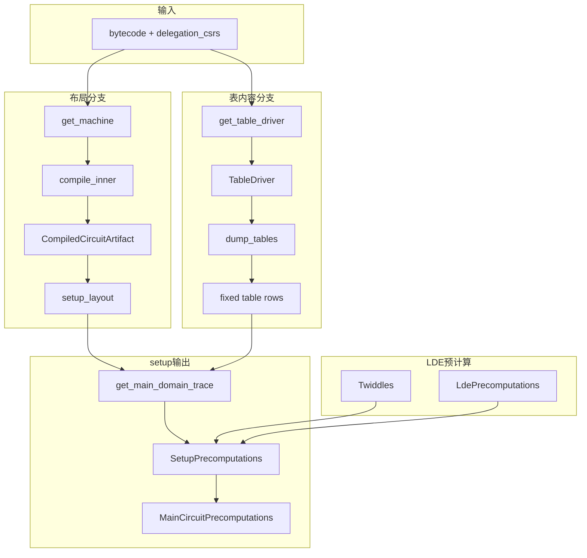
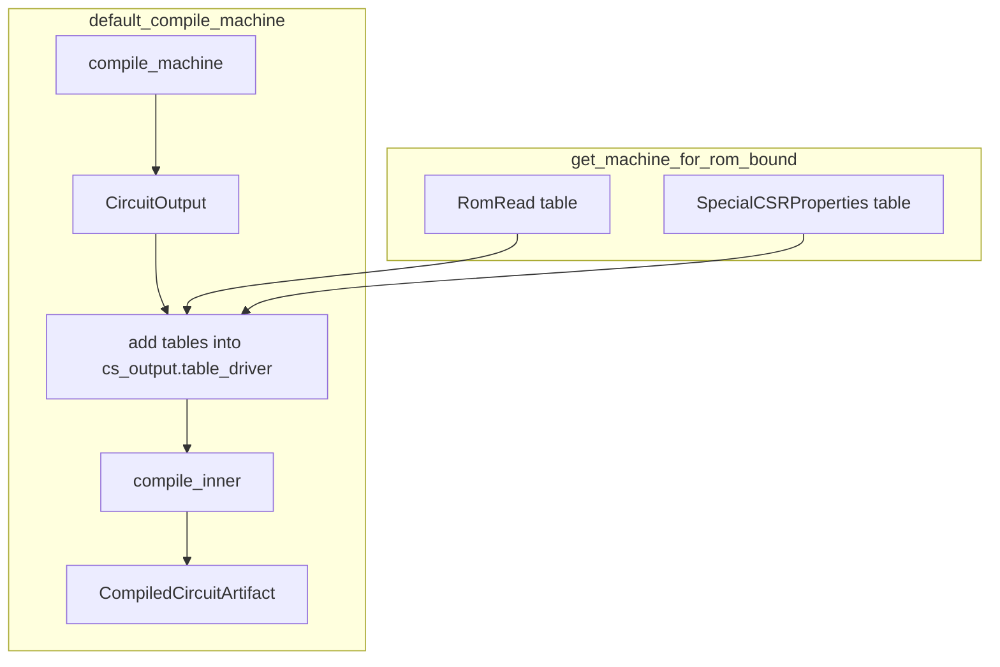
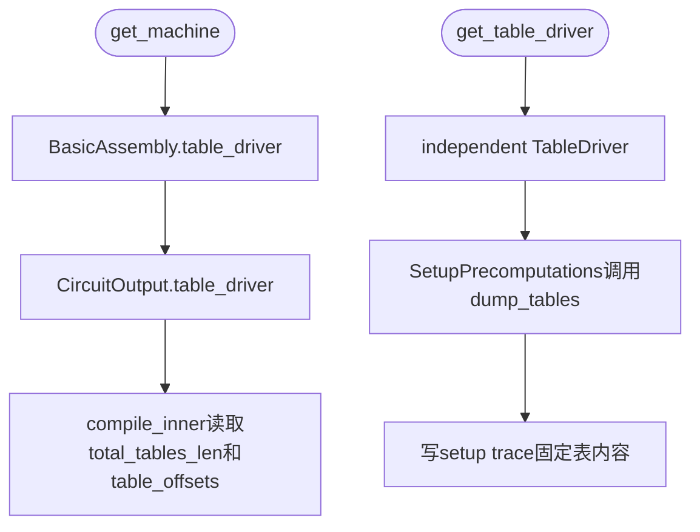
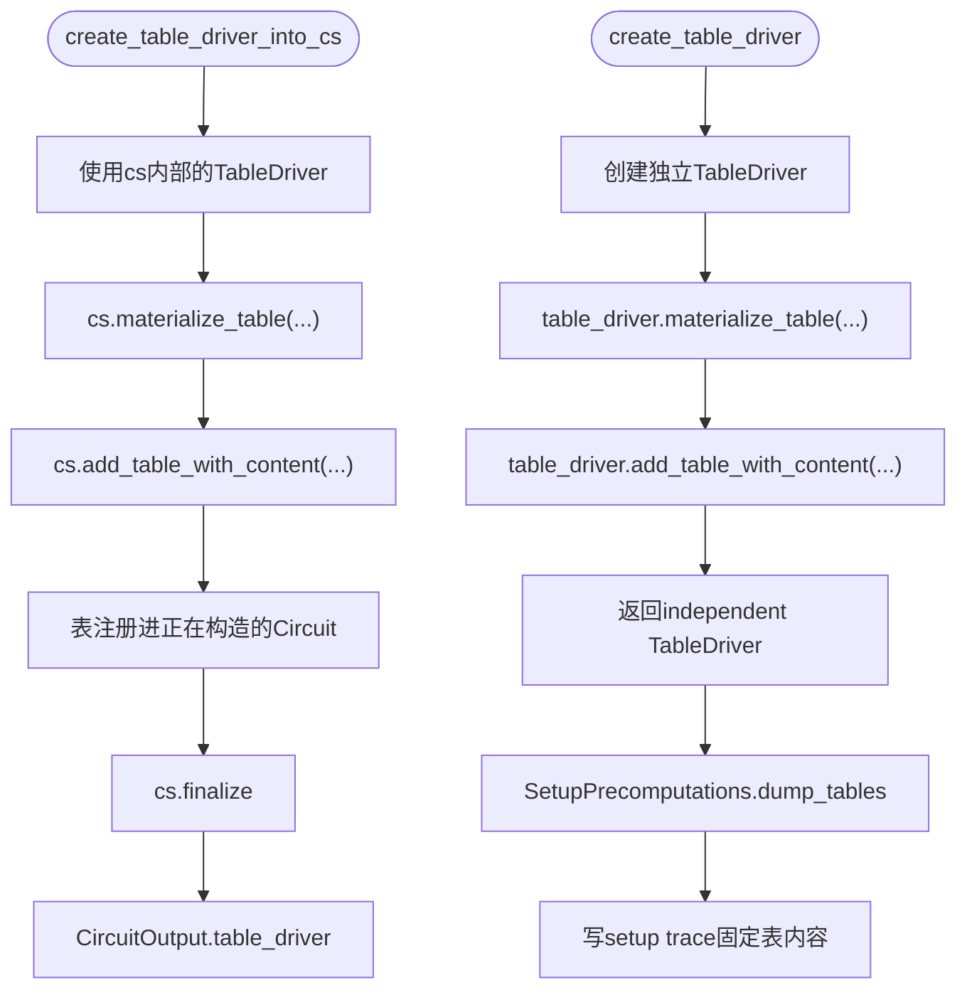

# main RISC-V setup路径

[TOC]


## 0. 前后关系

Airbender证明流程分成setup、witness、prove三层：

- setup层准备证明前的固定结构，根据bytecode和machine定义生成固定lookup表、已编译电路布局、setup trace，以及setup trace的LDE和merkle tree预计算。固定lookup表包括ROM地址到opcode的RomRead表、decoder表、range check表、CSR相关表；已编译电路布局说明witness、memory、setup各自使用哪些列，约束和lookup应该读取哪些列。guest不在setup层运行，因此也不会产生某个cycle的真实CPU状态。
- witness层填真实值。它运行guest，得到每个cycle的pc、寄存器读写值、RAM读写值、当前opcode、lookup查询等执行数据。然后根据setup阶段返回的MainCircuitPrecomputations.compiled_circuit，也就是CompiledCircuitArtifact中的列布局，把这些真实值写入witness trace的对应列。
- prove层拿到setup层生成的预计算结果、已编译电路布局与约束，以及witness层生成的witness trace，检查约束、lookup argument、memory argument等证明条件，最后生成proof。

#### setup结构图



图中左侧分支从bytecode进入get_machine，返回CompiledCircuitArtifact。CompiledCircuitArtifact保存main RISC-V一行规则编译后的列布局、约束布局、witness layout、memory layout和setup_layout。setup_layout里的generic lookup列组数由table_driver.total_tables_len和trace_len决定。

图中右侧分支从bytecode进入get_table_driver，返回独立TableDriver，保存固定lookup表的真实行内容，包括当前bytecode生成的RomRead行。RomRead行里的low和high来自当前bytecode，分别是opcode低16位和高16位。

SetupPrecomputations使用CompiledCircuitArtifact.setup_layout和独立TableDriver.dump_tables生成setup trace。get_main_domain_trace按setup_layout指定的列范围，把固定表行写入setup trace。之后compute_wide_ldes用twiddles和lde_precomputations对setup trace做LDE，并为每个LDE coset生成Merkle tree。

最终get_main_riscv_circuit_setup返回MainCircuitPrecomputations。

> [!TIP]
> 当前main RISC-V setup入口使用固定ROM上限。如果有两个程序，都padding到相同ROM上限时，RomRead表行数相同，get_machine得到的total_tables_len相同，setup_layout里的generic lookup列组数也相同。但不同程序的RomRead表行内容可以不同，例如程序A在pc=0处的low和high，可能不同于程序B在pc=0处的low和high。因此列布局相同，setup固定表可能内容不同。

## 1. setup层数据结构

### 1.1 CircuitOutput

CircuitOutput位于cs/src/cs/circuit.rs。compile_machine返回CircuitOutput。

Machine::describe_state_transition把一行RISC-V规则登记到BasicAssembly中，包括Variable、Constraint、LookupQuery、RangeCheckQuery、ShuffleRamQuery和placeholder substitution。compile_machine调用cs.finalize后得到CircuitOutput，再把它传给OneRowCompiler。

CircuitOutput仍处在Variable编号阶段。它没有最终列布局，也没有witness真实执行值。

```rust
// cs/src/cs/circuit.rs
pub struct CircuitOutput<F: PrimeField> {
    pub state_input: Vec<Variable>,
    pub state_output: Vec<Variable>,
    pub table_driver: TableDriver<F>,
    pub num_of_variables: usize,
    pub constraints: Vec<(Constraint<F>, bool)>,
    pub lookups: Vec<LookupQuery<F>>,
    pub shuffle_ram_queries: Vec<ShuffleRamMemQuery>,
    pub delegated_computation_requests: Vec<DelegatedComputationRequest>,
    pub degegated_request_to_process: Option<DelegatedProcessingData>,
    pub batched_memory_accesses: Vec<BatchedMemoryAccessType>,
    pub register_and_indirect_memory_accesses: Vec<RegisterAndIndirectAccesses>,
    pub linked_variables: Vec<LinkedVariablesPair>,
    pub range_check_expressions: Vec<RangeCheckQuery<F>>,
    pub boolean_vars: Vec<Variable>,
    pub substitutions: HashMap<(Placeholder, usize), Variable>,
}
```

default_compile_machine会在compile_machine返回CircuitOutput后，把RomRead和SpecialCSRProperties补进CircuitOutput.table_driver，再调用OneRowCompiler传进去CircuitOutput。compile_inner读取CircuitOutput中的table_driver.total_tables_len和table_starts_offsets，生成setup_layout、table_offsets和total_tables_size。

CircuitOutput中的约束来自Machine::describe_state_transition对Circuit接口的调用：普通多项式约束进入constraints、固定表成员关系进入lookups、寄存器和RAM访问进入shuffle_ram_queries、范围检查进入range_check_expressions、0/1变量进入boolean_vars、placeholder变量进入substitutions。CircuitOutput只保存这些规则的Variable编号版本，compile_inner后续再把Variable替换成ColumnAddress。

### 1.2 CompiledCircuitArtifact

CompiledCircuitArtifact位于cs/src/one_row_compiler/mod.rs，由OneRowCompiler内部的compile_inner构建并返回。

它把Variable编号替换成ColumnAddress，保存一系列layout，最终在setup阶段读取setup_layout，其他都在后续witness和proving阶段继续用。

```rust
// cs/src/one_row_compiler/mod.rs
pub struct CompiledCircuitArtifact<F: PrimeField> {
    pub witness_layout: WitnessSubtree<F>,
    pub memory_layout: MemorySubtree,
    pub setup_layout: SetupLayout,
    pub stage_2_layout: LookupAndMemoryArgumentLayout,
    pub degree_2_constraints: Vec<CompiledDegree2Constraint<F>>,
    pub degree_1_constraints: Vec<CompiledDegree1Constraint<F>>,
    pub state_linkage_constraints: Vec<(ColumnAddress, ColumnAddress)>,
    pub public_inputs: Vec<(BoundaryConstraintLocation, ColumnAddress)>,
    pub variable_mapping: BTreeMap<Variable, ColumnAddress>,
    pub scratch_space_size_for_witness_gen: usize,
    pub lazy_init_address_aux_vars: Option<ShuffleRamAuxComparisonSet>,
    pub memory_queries_timestamp_comparison_aux_vars: Vec<ColumnAddress>,
    pub batched_memory_access_timestamp_comparison_aux_vars: BatchedRamTimestampComparisonAuxVars,
    pub register_and_indirect_access_timestamp_comparison_aux_vars:
        RegisterAndIndirectAccessTimestampComparisonAuxVars,
    pub trace_len: usize,
    pub table_offsets: Vec<u32>,
    pub total_tables_size: usize,
}
```

CompiledCircuitArtifact还保存固定表拼接后的table_offsets和total_tables_size，后续lookup argument使用这组offset定位固定表行。

### 1.3 TableDriver和SetupLayout

TableDriver保存固定lookup表内容，对应代码里的RomRead、OpTypeBitmask、SpecialCSRProperties、RomAddressSpaceSeparator、range/bit/decode相关表。setup阶段调用TableDriver.dump_tables取出固定表行。

```rust
// cs/src/tables.rs
pub struct TableDriver<F: PrimeField> {
    pub tables: [LookupWrapper<F>; TABLE_TYPES_UPPER_BOUNDS],
    offsets_for_multiplicities: [usize; TABLE_TYPES_UPPER_BOUNDS],
    pub total_tables_len: usize,
}
```

SetupLayout由OneRowCompiler::compile_inner创建，它只说明setup trace中的timestamp列、range check列、timestamp range check列、generic lookup列从哪里开始、有几组，不保存任何RomRead或decoder表行的真实值。

```rust
// cs/src/definitions/setup_tree.rs
pub struct SetupLayout {
    pub timestamp_setup_columns: ColumnSet<NUM_TIMESTAMP_COLUMNS_FOR_RAM>,
    pub range_check_16_setup_column: ColumnSet<1>,
    pub timestamp_range_check_setup_column: ColumnSet<1>,
    pub generic_lookup_setup_columns: ColumnSet<NUM_COLUMNS_FOR_COMMON_TABLE_WIDTH_SETUP>,
    pub total_width: usize,
}
```

> [!NOTE]
>
> TableDriver保存表内容，SetupLayout保存列位置。SetupPrecomputations同时需要二者：TableDriver.dump_tables提供要写入的表行，SetupLayout.generic_lookup_setup_columns提供写入列。

### 1.4 SetupPrecomputations、Twiddles、LdePrecomputations

SetupPrecomputations的关联函数from_tables_and_trace_len先按SetupLayout写main-domain setup trace，再对这张trace做LDE并构造Merkle tree。

```rust
// prover/src/prover_stages/mod.rs
pub struct SetupPrecomputations<const N: usize, A: GoodAllocator, T: MerkleTreeConstructor> {
    pub ldes: Vec<CosetBoundTracePart<N, A>>,
    pub trees: Vec<T>,
}
```

Twiddles和LdePrecomputations用于setup trace的LDE计算。它们不参与Machine::describe_state_transition，不进入CircuitOutput，不改变TableDriver，不改变SetupLayout。

```rust
// fft/src/row_major/precomputes.rs
pub struct Twiddles<E: TwoAdicField, A: GoodAllocator> {
    pub forward_twiddles: Vec<E, A>,
    // 省略代码...
    pub inverse_twiddles: Vec<E, A>,
    pub omega: E,
    pub omega_inv: E,
    pub domain_size: usize,
    // 省略代码...
}

pub struct LdePrecomputations<A: GoodAllocator> {
    pub domain_bound_precomputations: Vec<Option<DomainBoundLdePrecomputations<A>>>,
    pub domain_size: usize,
    pub lde_factor: usize,
}
```

### 1.5 MainCircuitPrecomputations

setup主函数get_main_riscv_circuit_setup返回这个结构。字段包含编译结果、固定表内容、FFT/LDE预计算、setup预计算和witness evaluator函数指针。

```rust
// circuit_defs/setups/src/lib.rs
pub struct MainCircuitPrecomputations<C: MachineConfig, A: GoodAllocator, B: GoodAllocator = Global> {
    pub compiled_circuit: CompiledCircuitArtifact<Mersenne31Field>,
    pub table_driver: TableDriver<Mersenne31Field>,
    pub twiddles: Twiddles<Mersenne31Complex, A>,
    pub lde_precomputations: LdePrecomputations<A>,
    pub setup: SetupPrecomputations<DEFAULT_TRACE_PADDING_MULTIPLE, A, DefaultTreeConstructor>,
    pub witness_eval_fn_for_gpu_tracer: fn(&mut SimpleWitnessProxy<'_, MainRiscVOracle<'_, C, B>>),
}
```

## 2. 入口和两条路径

### 2.1 get_main_riscv_circuit_setup

get_main_riscv_circuit_setup接收bytecode和worker，返回MainCircuitPrecomputations。当前固定ROM上限下，CompiledCircuitArtifact的布局由machine定义和固定表集合规模决定。bytecode内容影响RomRead表内容，进而影响独立TableDriver和setup trace。worker用于Twiddles、LdePrecomputations和SetupPrecomputations的并行预计算。

```rust
// circuit_defs/setups/src/circuits/main_riscv/mod.rs
pub fn get_main_riscv_circuit_setup<A: GoodAllocator, B: GoodAllocator>(
    bytecode: &[u32],
    worker: &Worker,
) -> MainCircuitPrecomputations<IMStandardIsaConfig, A, B> {
    // 省略代码...
    let delegation_csrs = IMStandardIsaConfig::ALLOWED_DELEGATION_CSRS;

    let machine: cs::one_row_compiler::CompiledCircuitArtifact<Mersenne31Field> =
        ::risc_v_cycles::get_machine(bytecode, delegation_csrs);

    let table_driver = ::risc_v_cycles::get_table_driver(bytecode, delegation_csrs);

    let twiddles: Twiddles<_, A> = Twiddles::new(::risc_v_cycles::DOMAIN_SIZE, &worker);
    let lde_precomputations = LdePrecomputations::new(
        ::risc_v_cycles::DOMAIN_SIZE,
        ::risc_v_cycles::LDE_FACTOR,
        ::risc_v_cycles::LDE_SOURCE_COSETS,
        &worker,
    );

    let setup =
        SetupPrecomputations::<DEFAULT_TRACE_PADDING_MULTIPLE, A, DefaultTreeConstructor>::from_tables_and_trace_len(
            &table_driver,
            ::risc_v_cycles::DOMAIN_SIZE,
            &machine.setup_layout,
            &twiddles,
            &lde_precomputations,
            ::risc_v_cycles::LDE_FACTOR,
            ::risc_v_cycles::TREE_CAP_SIZE,
            &worker,
        );

    MainCircuitPrecomputations {
        compiled_circuit: machine,
        table_driver,
        twiddles,
        lde_precomputations,
        setup,
        witness_eval_fn_for_gpu_tracer: ::risc_v_cycles::witness_eval_fn_for_gpu_tracer,
    }
}
```

delegation_csrs来自IMStandardIsaConfig::ALLOWED_DELEGATION_CSRS，main RISC-V machine和CSR固定表都使用这份delegation CSR白名单，并不依赖当前bytecode。

machine，也就是1.2的CompiledCircuitArtifact类型。get_machine接收bytecode，因为default_compile_machine需要把RomRead表加入cs_output.table_driver，让compile_inner读取完整表集合的total_tables_len和table_offsets。

table_driver变量来自get_table_driver，依赖bytecode，因为RomRead表内容来自当前程序。

twiddles和lde_precomputations属于setup/prove交接对象，不依赖bytecode。

setup来自SetupPrecomputations::from_tables_and_trace_len，依赖独立TableDriver中的固定表内容，所以setup trace会随RomRead表内容变化。

### 2.2 get_machine

文件：circuit_defs/risc_v_cycles/src/lib.rs

get_machine转发到get_machine_for_rom_bound。ROM_ADDRESS_SPACE_SECOND_WORD_BITS来自MAX_ROM_SIZE，当前MAX_ROM_SIZE是2MB，bytecode按u32保存，所以当前main RISC-V setup入口要求bytecode长度为2^19个u32。

```rust
// circuit_defs/risc_v_cycles/src/lib.rs
pub const MAX_ROM_SIZE: usize = 1 << 21; // bytes
pub const ROM_ADDRESS_SPACE_SECOND_WORD_BITS: usize = (MAX_ROM_SIZE.trailing_zeros() - 16) as usize;

// ...

pub fn get_machine(
    bytecode: &[u32],
    delegation_csrs: &[u32],
) -> one_row_compiler::CompiledCircuitArtifact<field::Mersenne31Field> {
    get_machine_for_rom_bound::<ROM_ADDRESS_SPACE_SECOND_WORD_BITS>(bytecode, delegation_csrs)
}

pub fn get_machine_for_rom_bound<const ROM_ADDRESS_SPACE_SECOND_WORD_BITS: usize>(
    bytecode: &[u32],
    delegation_csrs: &[u32],
) -> one_row_compiler::CompiledCircuitArtifact<field::Mersenne31Field> {
    assert_eq!(
        bytecode.len(),
        (1 << (16 + ROM_ADDRESS_SPACE_SECOND_WORD_BITS)) / 4
    );
    // 省略代码...

    let machine = FullIsaMachineWithDelegationNoExceptionHandling;

    let rom_table = create_table_for_rom_image::<_, ROM_ADDRESS_SPACE_SECOND_WORD_BITS>(
        &bytecode,
        TableType::RomRead.to_table_id(),
    );

    let csr_table = create_csr_table_for_delegation(
        true,
        delegation_csrs,
        TableType::SpecialCSRProperties.to_table_id(),
    );

    let compiled_machine = default_compile_machine::<_, ROM_ADDRESS_SPACE_SECOND_WORD_BITS>(
        machine,
        rom_table,
        Some(csr_table),
        DOMAIN_SIZE.trailing_zeros() as usize,
    );

    compiled_machine
}
```

bytecode.len检查保证进入setup路径的是固定大小ROM image，固定长度让compile_inner看到的TableDriver.total_tables_len稳定，也让setup_layout与独立TableDriver的dump结果对齐。

FullIsaMachineWithDelegationNoExceptionHandling是machine description，描述一行main RISC-V状态转移会向Circuit登记哪些变量、约束、lookup和memory query。

RomRead表在get_machine_for_rom_bound中由create_table_for_rom_image创建，SpecialCSRProperties表由create_csr_table_for_delegation创建。default_compile_machine消费machine、RomRead表、CSR表和trace_len_log2，最终返回CompiledCircuitArtifact。

### 2.3 RomRead和CSR表

create_table_for_rom_image位于cs/src/machine/machine_configurations/mod.rs。RomRead属于setup固定表，依赖当前bytecode。key是ROM address，value是low和high，分别对应opcode低16位和高16位。

```rust
// cs/src/machine/machine_configurations/mod.rs
pub fn create_table_for_rom_image<
    F: PrimeField,
    const ROM_ADDRESS_SPACE_SECOND_WORD_BITS: usize,
>(
    image: &[u32],
    id: u32,
) -> LookupTable<F, 3> {
    // 省略代码...
    let keys_len = 1usize << (16 + ROM_ADDRESS_SPACE_SECOND_WORD_BITS - 2);
    let mut keys = Vec::with_capacity(keys_len);

    (0..keys_len)
        .into_par_iter()
        .map(|i| {
            let mut key = [F::ZERO; 3];
            let address = i * 4;
            key[0] = F::from_u64_unchecked(address as u64);
            key
        })
        .collect_into_vec(&mut keys);

    // 省略代码...
    const TABLE_NAME: &'static str = "ROM table";
    let image = image.to_vec();
    LookupTable::<F, 3>::create_table_from_key_and_key_generation_closure(
        &keys,
        TABLE_NAME.to_string(),
        1,
        move |key| {
            let pc = key[0].as_u64_reduced();
            // 省略代码...
            assert!(pc % 4 == 0, "PC = {} is not aligned", pc);
            let index = (pc as usize) / 4;
            let opcode = if index < image.len() {
                image[index]
            } else {
                UNIMP_OPCODE
            };

            let low = opcode as u16;
            let high = (opcode >> 16) as u16;

            let mut result = [F::ZERO; 3];
            result[0] = F::from_u64_unchecked(low as u64);
            result[1] = F::from_u64_unchecked(high as u64);

            ((pc / 4) as usize, result)
        },
        Some(|keys| {
            let pc = keys[0].as_u64_reduced();
            // 省略代码...
            (pc / 4) as usize
        }),
        id,
    )
}
```

create_table_for_rom_image生成keys_len行。每行key[0]是4字节对齐PC。闭包按pc / 4读取image[index]，把32-bit opcode拆成两个16-bit field元素。index超出image长度时使用UNIMP_OPCODE。当前main RISC-V setup入口要求bytecode长度等于ROM上限。真实程序短于ROM上限时，调用方需要先把bytecode补齐到固定长度。create_table_for_rom_image内部保留index越界时写UNIMP_OPCODE的分支，但在get_machine_for_rom_bound的长度检查通过后，这个分支通常不会走到。

RomRead表内部的UNIMP_OPCODE padding和setup trace的zero padding要分开看。

RomRead表内部padding发生在create_table_for_rom_image，它决定某个ROM address对应的opcode value。setup trace zero padding发生在SetupPrecomputations::get_main_domain_trace，它创建全零RowMajorTrace，未写入固定表内容的位置保持0。

> [!TIP]
>
> RomRead的padding处理的是ROM表内容。某个ROM地址没有程序指令时，RomRead行需要有一个确定opcode，通常由调用方把bytecode补齐，函数内部也保留UNIMP_OPCODE兜底分支。setup trace的zero padding处理的是setup trace矩阵空位。固定表行写完后，generic lookup setup columns中没有对应table row的位置保持0。前者属于RomRead表内容，后者属于setup trace布局剩余空间。

SpecialCSRProperties表由create_csr_table_for_delegation创建。get_machine_for_rom_bound把它传给default_compile_machine，随后default_compile_machine把它加入cs_output.table_driver；get_table_driver_for_rom_bound也会创建同一张表，并加入独立TableDriver。前者让compile_inner看到SpecialCSRProperties的表长度和table offset，后者让SetupPrecomputations把表内容写进setup trace。

```rust
// cs/src/machine/machine_configurations/mod.rs
pub fn create_csr_table_for_delegation<F: PrimeField>(
    allow_non_determinism: bool,
    allowed_delegation_csrs: &[u32],
    id: u32,
) -> LookupTable<F, 3> {
    use crate::csr_properties::create_special_csr_properties_table;
    create_special_csr_properties_table(id, allow_non_determinism, allowed_delegation_csrs)
}
```

create_csr_table_for_delegation包装create_special_csr_properties_table。allow_non_determinism在main路径传true，delegation_csrs来自IMStandardIsaConfig::ALLOWED_DELEGATION_CSRS，id是TableType::SpecialCSRProperties.to_table_id()。

create_special_csr_properties_table创建宽度为3的LookupTable，key列是csr_index，两个value列是is_supported和is_allowed_for_delegation。key覆盖全部12-bit CSR空间，也就是0到4095的每个CSR编号都有确定属性。

```rust
// cs/src/csr_properties.rs
pub fn create_special_csr_properties_table<F: PrimeField>(
    id: u32,
    support_non_determinism_csr: bool,
    supported_delegations: &[u32],
) -> LookupTable<F, 3> {
    for el in supported_delegations.iter() {
        assert!(*el < (1 << 12));
    }

    let keys = key_for_continuous_log2_range(12);
    let supported_delegations = supported_delegations.to_vec();
    const TABLE_NAME: &'static str = "Special CSR properties";

    LookupTable::<F, 3>::create_table_from_key_and_key_generation_closure(
        &keys,
        TABLE_NAME.to_string(),
        1,
        move |key| {
            let input = key[0].as_u64_reduced();
            assert!(input < (1u64 << 12));

            let csr_index = input as u32;
            let is_nondeterminism_csr = csr_index == NON_DETERMINISM_CSR as u32;
            let is_allowed_for_delegation = supported_delegations.contains(&csr_index);
            assert!(is_nondeterminism_csr & is_allowed_for_delegation == false);

            let is_supported =
                (is_nondeterminism_csr & support_non_determinism_csr) | is_allowed_for_delegation;

            let result = [
                F::from_u64_unchecked(is_supported as u64),
                F::from_u64_unchecked(is_allowed_for_delegation as u64),
                F::ZERO,
            ];

            (input as usize, result)
        },
        Some(first_key_index_gen_fn::<F, 3>),
        id,
    )
}
```

> [!NOTE]
>
> 目前SpecialCSRProperties在表内是3列：
>
> [csr_index、is_supported、is_allowed_for_delegation]。
>
> 2.8节TableDriver.dump_tables会追加table id并写入generic lookup setup columns，得到4列：
>
> [csr_index, is_supported, is_allowed_for_delegation, SpecialCSRProperties table id]。

CSR opcode路径使用这张表的位置在cs/src/machine/ops/common_impls/csr_with_delegation.rs：apply_csr_with_delegation从decoder输出里取funct12作为csr_index，查询SpecialCSRProperties，得到is_supported_csr和is_for_delegation。

```rust
// cs/src/machine/ops/common_impls/csr_with_delegation.rs
pub fn apply_csr_with_delegation<
    F: PrimeField,
    CS: Circuit<F>,
    ST: BaseMachineState<F>,
    RS: RegisterValueSource<F>,
    DE: DecoderOutputSource<F, RS>,
    BS: IndexableBooleanSet,
    const SUPPORT_CSRRC: bool,
    const SUPPORT_CSRRS: bool,
    const SUPPORT_CSR_IMMEDIATES: bool,
    const ASSUME_TRUSTED_CODE: bool,
    const OUTPUT_EXACT_EXCEPTIONS: bool,
>(
    cs: &mut CS,
    _machine_state: &ST,
    inputs: &DE,
    boolean_set: &BS,
    opt_ctx: &mut OptimizationContext<F, CS>,
) -> CommonDiffs<F> {
    // 省略代码...
    let exec_flag = boolean_set.get_major_flag(CSR_COMMON_OP_KEY);
    let src1 = inputs.get_rs1_or_equivalent().get_register();

    if ASSUME_TRUSTED_CODE {
        // 省略代码...
        if SUPPORT_CSRRC == false && SUPPORT_CSRRS == false {
            let csr_index = inputs.funct12();
            let [is_supported_csr, is_for_delegation] = opt_ctx
                .append_lookup_relation_from_linear_terms::<1, 2>(
                    cs,
                    &[csr_index.clone()],
                    TableType::SpecialCSRProperties.to_num(),
                    exec_flag,
                );

            cs.add_constraint(
                (Term::from(1) - Term::from(is_supported_csr)) * exec_flag.get_terms(),
            );

            let should_delegate = cs.add_variable_from_constraint(
                Term::from(is_for_delegation) * Term::from(exec_flag),
            );

            let offset = src1.0[1];
            let offset_masked =
                cs.add_variable_from_constraint(Term::from(should_delegate) * Term::from(offset));
            let csr_index_masked =
                cs.add_variable_from_constraint(Term::from(should_delegate) * csr_index);

            let delegation_request = DelegatedComputationRequest {
                execute: should_delegate,
                degegation_type: csr_index_masked,
                memory_offset_high: offset_masked,
            };
            cs.add_delegation_request(delegation_request);

            cs.add_constraint(Term::from(is_for_delegation) * Term::from(external_oracle.0[0]));
            cs.add_constraint(Term::from(is_for_delegation) * Term::from(external_oracle.0[1]));

            // 省略代码...
        } else {
            todo!()
        }
    } else {
        todo!()
    }
}
```

apply_csr_with_delegation在CSR family路径登记四组约束和关系。

第一组是上面提到的SpecialCSRProperties lookup，只有当前行执行CSR family时才启用这条lookup。

第二组是CSR支持性约束：
(1 - is_supported_csr) * exec_flag == 0
当前行执行CSR family时，exec_flag==1，约束要求is_supported_csr==1。当前行不执行CSR family时，exec_flag==0，也就不限制csr_index。

第三组是delegation request字段约束，is_for_delegation表示这个csr_index是否需要交给delegation circuit处理：
should_delegate = is_for_delegation * exec_flag
然后从src1取高16位作为offset，再生成两个masked字段：
offset_masked = should_delegate * offset（只有发起delegation时保留offset，其它情况为0）
csr_index_masked = should_delegate * csr_index（只有发起delegation时保留csr_index，其它情况为0）
只有当前行执行CSR，并且SpecialCSRProperties表确认这个csr_index允许delegation时，main circuit才会生成有效DelegatedComputationRequest。否则request字段全部被约束成0。

第四组约束防止delegation CSR同时从external_oracle拿返回值。

### 2.4 default_compile_machine和compile_machine

文件：cs/src/lib.rs、cs/src/machine/machine_configurations/mod.rs

default_compile_machine先调用compile_machine生成CircuitOutput，再把RomRead和SpecialCSRProperties加入cs_output.table_driver，最后调用OneRowCompiler。



get_machine_for_rom_bound先创建RomRead和SpecialCSRProperties。compile_machine创建CircuitOutput时已经登记RomRead lookup query，但CircuitOutput.table_driver还没有当前bytecode对应的RomRead内容。default_compile_machine在compile_machine之后补表，再调用compile_inner生成CompiledCircuitArtifact。

```rust
// cs/src/lib.rs
pub fn default_compile_machine<
    M: crate::machine::Machine<::field::Mersenne31Field>,
    const ROM_ADDRESS_SPACE_SECOND_WORD_BITS: usize,
>(
    machine: M,
    bytecode_table: crate::tables::LookupTable<field::Mersenne31Field, 3>,
    csr_table: Option<crate::tables::LookupTable<field::Mersenne31Field, 3>>,
    trace_len_log2: usize,
) -> crate::one_row_compiler::CompiledCircuitArtifact<::field::Mersenne31Field> {
    let mut cs_output = compile_machine::<
        Mersenne31Field,
        BasicAssembly<Mersenne31Field>,
        M,
        ROM_ADDRESS_SPACE_SECOND_WORD_BITS,
    >(machine);

    cs_output.table_driver.add_table_with_content(
        TableType::RomRead,
        crate::tables::LookupWrapper::Dimensional3(bytecode_table),
    );

    if let Some(csr_table) = csr_table {
        cs_output.table_driver.add_table_with_content(
            TableType::SpecialCSRProperties,
            crate::tables::LookupWrapper::Dimensional3(csr_table),
        );
    }

    let compiler = OneRowCompiler::default();
    compiler.compile_output_for_chunked_memory_argument(cs_output, trace_len_log2)
}
```

compile_machine创建BasicAssembly，create_table_driver_into_cs注册machine类型即可确定的固定表，包括通用表、decoder表和RomAddressSpaceSeparator表。RomRead也是固定表，但RomRead表内容依赖当前bytecode。由于compile_machine只接收machine参数，所以不能生成pc到opcode的RomRead表行。

Machine::describe_state_transition可以登记RomRead lookup query，因为这一步只需要TableType::RomRead和一行中的pc、opcode变量关系，不需要RomRead表内容。default_compile_machine在compile_machine返回CircuitOutput后，把bytecode生成的RomRead表补进cs_output.table_driver，再调用compile_inner。compile_inner随后用完整TableDriver计算total_tables_len、table_offsets和setup_layout。

```rust
// cs/src/machine/machine_configurations/mod.rs
pub fn compile_machine<
    F: PrimeField,
    C: Circuit<F>,
    M: Machine<F>,
    const ROM_ADDRESS_SPACE_SECOND_WORD_BITS: usize,
>(
    machine: M,
) -> CircuitOutput<F> {
    let mut cs = C::new();

    create_table_driver_into_cs::<F, C, M, ROM_ADDRESS_SPACE_SECOND_WORD_BITS>(&mut cs, machine);

    let (initial_state, final_state) =
        M::describe_state_transition::<_, ROM_ADDRESS_SPACE_SECOND_WORD_BITS>(&mut cs);

    let mut initial_state_vars = vec![];
    initial_state.append_into_variables_set(&mut initial_state_vars);

    let mut final_state_vars = vec![];
    final_state.append_into_variables_set(&mut final_state_vars);

    let (mut output, _) = cs.finalize();
    output.state_input = initial_state_vars;
    output.state_output = final_state_vars;

    output
}
```

M::describe_state_transition描述一行RISC-V状态转移。它向BasicAssembly登记Constraint、LookupQuery、ShuffleRamQuery、RangeCheckQuery、Boolean variable和Placeholder substitution。

这些规则通过Circuit trait进入BasicAssembly。Machine代码不直接写CompiledCircuitArtifact，也不直接写setup trace。

```rust
// cs/src/cs/circuit.rs
pub trait Circuit<F: PrimeField>: Sized {
    type WitnessPlacer: WitnessPlacer<F>;
    // 省略代码...
    fn add_constraint(&mut self, constraint: Constraint<F>);
    fn add_constraint_allow_explicit_linear(&mut self, constraint: Constraint<F>);
    // 省略代码...
    fn add_shuffle_ram_query(&mut self, query: ShuffleRamMemQuery);
    // 省略代码...
    fn require_invariant(&mut self, variable: Variable, invariant: Invariant);
    fn finalize(self) -> (CircuitOutput<F>, Option<Self::WitnessPlacer>);
    fn materialize_table(&mut self, table_type: TableType);
    fn add_table_with_content(&mut self, table_type: TableType, table: LookupWrapper<F>);
    // 省略代码...
}
```

BasicAssembly对这些入口的处理是追加记录：add_constraint把degree 2约束放进constraint_storage；add_constraint_allow_explicit_linear把degree 1约束放进同一个storage；add_shuffle_ram_query把一次register/RAM访问放进shuffle_ram_queries；require_invariant根据Invariant::Boolean或Invariant::RangeChecked分别写boolean_variables或rangechecked_expressions；lookup相关helper把LookupQuery放进lookup_storage。cs.finalize把这些内部storage移动到CircuitOutput。

compile_machine返回CircuitOutput后，default_compile_machine把bytecode生成的RomRead表加入cs_output.table_driver。如果csr_table存在，default_compile_machine也把SpecialCSRProperties加入cs_output.table_driver。

### 2.5 create_table_driver_into_cs登记machine类型可确定的固定表

create_table_driver_into_cs把固定表登记到正在构造的Circuit。

```rust
// cs/src/machine/machine_configurations/mod.rs
pub fn create_table_driver_into_cs<
    F: PrimeField,
    CS: Circuit<F>,
    M: Machine<F>,
    const ROM_ADDRESS_SPACE_SECOND_WORD_BITS: usize,
>(
    cs: &mut CS,
    machine: M,
) {
    let used_tables = M::define_used_tables();

    assert!(used_tables.contains(&TableType::ZeroEntry) == false);
    assert!(used_tables.contains(&TableType::OpTypeBitmask) == false);
    assert!(used_tables.contains(&TableType::CsrBitmask) == false);
    assert!(used_tables.contains(&TableType::RangeCheckSmall) == false);

    let extra_tables = machine.define_additional_tables();
    for table in used_tables.into_iter() {
        cs.materialize_table(table);
    }
    for (table, content) in extra_tables.into_iter() {
        cs.add_table_with_content(table, content);
    }

    cs.materialize_table(TableType::And);
    cs.materialize_table(TableType::ZeroEntry);
    cs.materialize_table(TableType::QuickDecodeDecompositionCheck4x4x4);
    cs.materialize_table(TableType::QuickDecodeDecompositionCheck7x3x6);
    cs.materialize_table(TableType::U16GetSignAndHighByte);
    cs.materialize_table(TableType::RangeCheckSmall);

    let decoder_table = M::create_decoder_table(TableType::OpTypeBitmask.to_table_id());
    cs.add_table_with_content(
        TableType::OpTypeBitmask,
        LookupWrapper::Dimensional3(decoder_table),
    );

    if M::USE_ROM_FOR_BYTECODE {
        let id = TableType::RomAddressSpaceSeparator.to_table_id();
        let table = LookupWrapper::Dimensional3(create_rom_separator_table::<
            F,
            ROM_ADDRESS_SPACE_SECOND_WORD_BITS,
        >(id));
        cs.add_table_with_content(TableType::RomAddressSpaceSeparator, table);
    }
}
```

M::define_used_tables返回machine声明的标准表集合。create_table_driver_into_cs读取这个集合，禁止machine自己声明ZeroEntry、OpTypeBitmask、CsrBitmask和RangeCheckSmall。ZeroEntry、RangeCheckSmall和decode辅助表由create_table_driver_into_cs统一materialize，OpTypeBitmask也由Machine::create_decoder_table生成。

OpTypeBitmask是decoder固定表，解释opcode属于哪类指令。它由Machine::create_decoder_table根据machine支持的ISA生成表内容，把opcode、funct3、funct7组合映射到instruction family flags和variant flags。

> [!IMPORTANT]
>
> create_table_driver_into_cs不会用TableType::generate_table自动生成OpTypeBitmask，因为不同machine支持的opcode集合不同，必须由Machine自己生成decoder表。

RomAddressSpaceSeparator是地址空间辅助表，判断一个地址高位是否落在ROM地址空间。因为main RISC-V使用ROM存bytecode，普通RAM也用地址，电路需要区分某些地址计算走ROM读取还是走RAM访问。RomAddressSpaceSeparator按ROM_ADDRESS_SPACE_SECOND_WORD_BITS生成，表内容依赖ROM地址空间大小，不依赖当前bytecode。create_table_driver_into_cs在M::USE_ROM_FOR_BYTECODE为true时手动创建这张表，因为ROM地址位宽需要作为泛型参数传入，TableType::generate_table里不能直接生成。

### 2.6 describe_state_transition约束来源

create_table_driver_into_cs注册固定表后，compile_machine调用Machine::describe_state_transition。这个函数执行约束登记，把一行main RISC-V允许出现的关系写入BasicAssembly，随后BasicAssembly.finalize把这些记录移动到CircuitOutput，compile_inner再把CircuitOutput中的Variable编号换成ColumnAddress。

FullIsaMachineWithDelegationNoExceptionHandling的describe_state_transition首先生成decoder表划分和decoder key，再进入optimized_base_isa_state_transition。具体Constraint、LookupQuery和ShuffleRamMemQuery由state_transition_parts和各opcode family写入。

```rust
// cs/src/machine/machine_configurations/full_isa_with_delegation_no_exceptions/mod.rs
fn describe_state_transition<CS: Circuit<F>, const ROM_ADDRESS_SPACE_SECOND_WORD_BITS: usize>(
    cs: &mut CS,
) -> (Self::State, Self::State)
where
    // 省略代码...
{
    let (splitting, _) = <Self as Machine<F>>::produce_decoder_table_stub();
    let boolean_keys = <Self as Machine<F>>::all_decoder_keys();

    optimized_base_isa_state_transition::<
        F,
        CS,
        { <Self as Machine<F>>::ASSUME_TRUSTED_CODE },
        { <Self as Machine<F>>::OUTPUT_EXACT_EXCEPTIONS },
        true,
        true,
        ROM_ADDRESS_SPACE_SECOND_WORD_BITS,
    >(cs, splitting, boolean_keys)
}
```

optimized_base_isa_state_transition按固定顺序登记规则：初始化本行状态，约束pc低16位范围，用pc从ROM取opcode并decode；每个opcode family根据decoder flags登记候选结果和局部约束；CSR路径检查SpecialCSRProperties；OptimizationContext统一写入暂存约束；writeback选择最终rd和next_pc，并登记三个shuffle RAM query。

```rust
// cs/src/machine/machine_configurations/full_isa_no_exceptions/optimized_state_transition.rs
let initial_state = MinimalStateRegistersInMemory::<F>::initialize(cs);
let pc = *initial_state.get_pc();

cs.require_invariant(
    pc.0[0].get_variable(),
    Invariant::RangeChecked {
        width: LIMB_WIDTH as u32,
    },
);

let (memory_queries, src1, src2, raw_decoder_output, flags_source, opcode_types_bits) =
    optimized_decode_and_preallocate_mem_queries_for_bytecode_in_rom::<
        F,
        CS,
        ASSUME_TRUSTED_CODE,
        PERFORM_DELEGATION,
        ROM_ADDRESS_SPACE_SECOND_WORD_BITS,
    >(cs, pc, decode_table_splitting, boolean_keys);

let next_pc = calculate_pc_next_no_overflows(cs, pc);
let mut opt_ctx = OptimizationContext::<F, CS>::new();

// 省略代码...
let application_result = AddOp::apply(/* 省略参数... */);
application_results.push(application_result);
// 省略其它opcode family...

if PERFORM_DELEGATION == false {
    // 省略代码...
} else {
    let application_result = apply_csr_with_delegation(/* 省略参数... */);
    application_results.push(application_result);
};

opt_ctx.enforce_all(cs);

let final_state = writeback_no_exception_with_opcodes_in_rom(
    // 省略参数...
);
```

describe_state_transition登记的约束分成六组。

#### 2.6.1 pc范围约束

optimized_base_isa_state_transition从initial_state取pc，pc用两个16-bit limb表示。cs.require_invariant约束pc低16位进入16-bit range check，pc高位传给read_opcode_from_rom，再通过RomAddressSpaceSeparator lookup参与ROM/RAM地址空间判断。

这个约束给后续ROM取指提供可拆分的pc limb。没有pc低16位range check，rom_address = pc_low + 2^16 * rom_address_low无法按16-bit limb解释。

对应约束：

```text
pc == pc_low + 2^16 * pc_high
0 <= pc_low < 2^16
```

```rust
// cs/src/machine/machine_configurations/full_isa_no_exceptions/optimized_state_transition.rs
let initial_state = MinimalStateRegistersInMemory::<F>::initialize(cs);
let pc = *initial_state.get_pc();

cs.require_invariant(
    pc.0[0].get_variable(),
    Invariant::RangeChecked {
        width: LIMB_WIDTH as u32,
    },
);
```

#### 2.6.2 ROM取指约束

read_opcode_from_rom读取pc高16位，查询RomAddressSpaceSeparator，得到is_ram_range和rom_address_low。随后代码添加is_ram_range == 0线性约束，因为main RISC-V取指只能来自ROM地址空间，禁止把pc解释成RAM地址。

read_opcode_from_rom再构造rom_address = pc_low + 2^16 * rom_address_low，并用rom_address查询RomRead。RomRead表的key是4字节对齐ROM address，value是low和high。RomRead lookup约束rom_address必须存在于ROM表key集合中，low和high必须等于当前bytecode在该地址处的指令编码。源码中rom_address对应rom_address_constraint这个线性表达式。

如下公式中lookup_X(key) == value标出固定表的key/value读法，[key, value...] ∈ rows(X)标出lookup argument实际检查的固定表成员关系，这两行描述同一个lookup query。

对应约束：

```text
lookup_RomAddressSpaceSeparator(pc_high) == (is_ram_range, rom_address_low)
[pc_high, is_ram_range, rom_address_low] ∈ rows(RomAddressSpaceSeparator)
is_ram_range == 0

rom_address = pc_low + 2^16 * rom_address_low
lookup_RomRead(rom_address) == (low, high)
[rom_address, low, high] ∈ rows(RomRead)
instruction = low + 2^16 * high
```

```rust
// cs/src/machine/utils.rs
let [is_ram_range, rom_address_low] = cs.get_variables_from_lookup_constrained(
    &[LookupInput::from(pc.0[1].get_variable())],
    TableType::RomAddressSpaceSeparator,
);

cs.add_constraint_allow_explicit_linear(Constraint::<F>::from(is_ram_range));

let rom_address_constraint = Term::from(pc.0[0].get_variable())
    + Term::from((F::from_u64_unchecked(1 << 16), rom_address_low));

let [low, high] = cs.get_variables_from_lookup_constrained(
    &[LookupInput::from(rom_address_constraint)],
    TableType::RomRead,
);
```

#### 2.6.3 decoder约束

optimized_decode_and_preallocate_mem_queries_for_bytecode_in_rom把RomRead返回的low和high包装成DecoderInput，并调用OptimizedDecoder::decode。decoder把32-bit instruction拆成opcode、funct3、rs1、rs2、rd、imm、format bit和opcode family flags。

QuickDecodeDecompositionCheck4x4x4约束imm4_1、rs1_high、rs2_high都落在4-bit范围。QuickDecodeDecompositionCheck7x3x6约束opcode是7-bit，funct3是3-bit，imm10_5是6-bit。decoder再用多项式约束把拆出来的小字段重新组合回low和high。公式用imm11和rs2_low表示instruction[7]和instruction[20]，源码中这两个bit由imm11_constraint和rs2_low_constraint两个线性表达式导出，没有分配独立变量，通过b * (b - 1) == 0限制为0或1。

OpTypeBitmask lookup把opcode/funct3/funct7组合关联到decoder输出的family flags和variant flags，后续AddOp、LoadOp、StoreOp等family读取这些flags，决定本行哪组候选关系生效。

对应约束：

```text
instruction[6:0]   == opcode
instruction[7]     == imm11
instruction[11:8]  == imm4_1
instruction[14:12] == funct3
instruction[15]    == rs1_low
instruction[19:16] == rs1_high
instruction[20]    == rs2_low
instruction[24:21] == rs2_high
instruction[30:25] == imm10_5
instruction[31]    == sign_bit

low == opcode + 2^7 * imm11 + 2^8 * imm4_1 + 2^12 * funct3 + 2^15 * rs1_low
high == rs1_high + 2^4 * rs2_low + 2^5 * rs2_high + 2^9 * imm10_5 + 2^15 * sign_bit

0 <= imm4_1, rs1_high, rs2_high < 2^4
0 <= opcode < 2^7
0 <= funct3 < 2^3
0 <= imm10_5 < 2^6
[imm4_1, rs1_high, rs2_high] ∈ rows(QuickDecodeDecompositionCheck4x4x4)
[opcode, funct3, imm10_5] ∈ rows(QuickDecodeDecompositionCheck7x3x6)

imm11 * (imm11 - 1) == 0
rs2_low * (rs2_low - 1) == 0

lookup_OpTypeBitmask(table_input) == (splitting_0, splitting_1)
[table_input, splitting_0, splitting_1] ∈ rows(OpTypeBitmask)
```

```rust
// cs/src/machine/decoder/decode_optimized_must_handle_csr.rs
// 保证imm4_1, rs1_high, rs2_high 都在 0..15
circuit.enforce_lookup_tuple_for_fixed_table(
    &[
        imm4_1.get_variable(),
        rs1_high.get_variable(),
        rs2_high.get_variable(),
    ]
    .map(|el| LookupInput::from(el)),
    TableType::QuickDecodeDecompositionCheck4x4x4,
    false,
);
// 保证opcode 在 0..127
// funct3 在 0..7
// imm10_5 在 0..63
circuit.enforce_lookup_tuple_for_fixed_table(
    &[
        opcode.get_variable(),
        funct3.get_variable(),
        imm10_5.get_variable(),
    ]
    .map(|el| LookupInput::from(el)),
    TableType::QuickDecodeDecompositionCheck7x3x6,
    false,
);

// 省略代码...
circuit.add_constraint(
    rs2_low_constraint.clone() * (rs2_low_constraint.clone() - Term::from(1)),
);

// 省略代码...
circuit.enforce_lookup_tuple_for_fixed_table(
    &[
        LookupInput::from(table_input_constraint),
        LookupInput::from(splitting_constraint_0),
        LookupInput::from(splitting_constraint_1),
    ],
    TableType::OpTypeBitmask,
    true,
);
```

trusted code配置下，decode返回的invalid_opcode还会被约束为0。unsupported opcode无法满足这条线性约束。对应约束：

```text
invalid_opcode == 0
```

```rust
// cs/src/machine/machine_configurations/state_transition_parts/decode_and_read_operands.rs
let (invalid_opcode, raw_decoder_output, opcode_format_bits, other_bits) =
    OptimizedDecoder::decode::<F, CS>(&decoder_input, cs, decode_table_splitting);

if ASSUME_TRUSTED_CODE {
    cs.add_constraint_allow_explicit_linear_prevent_optimizations(Constraint::<F>::from(
        invalid_opcode,
    ));
}
```

#### 2.6.4 opcode family约束

optimized_base_isa_state_transition把decoder输出整理成BasicDecodingResultWithSigns，再依次调用AddOp、SubOp、LoadOp、StoreOp、JumpOp、CSR等apply函数，每个family读取自己的exec_flag。exec_flag来自decoder flags（代码里的flags_source变量）。本行instruction属于某个family时，对应exec_flag为1；其它family的exec_flag为0。

family函数登记候选关系：AddOp登记src1 + src2 = rd候选值。LoadOp登记地址空间、对齐、load字节选择、读值扩展和写回候选值；StoreOp登记store地址、字节写入贡献、旧值保留贡献和RAM写入候选值；JumpOp和ConditionalOp登记next_pc候选值；CSR路径查询SpecialCSRProperties并生成DelegatedComputationRequest字段。

**ADD**

exec_flag类似一个门控，整体约束：

```text
exec_flag * (res - (src1 + src2 mod 2^32)) == 0
returned_value = [res.0[0], res.0[1]]
CommonDiffs.rd_value = [(returned_value, exec_flag)]
```

源码按两个16-bit limb和carry登记加法关系，CommonDiffs只保存候选rd值和exec_flag。

```rust
// cs/src/machine/ops/add_sub.rs
opt_ctx.reset_indexers();
let exec_flag = boolean_set.get_major_flag(ADD_OP_KEY);

let src1 = inputs.get_rs1_or_equivalent().get_register();
let src2 = inputs.get_rs2_or_equivalent().get_register();

let (res, _of_flag) = opt_ctx.append_add_relation(src1, src2, exec_flag, cs);

// 省略代码...
let returned_value = [
    Constraint::<F>::from(res.0[0].get_variable()),
    Constraint::<F>::from(res.0[1].get_variable()),
];

CommonDiffs {
    exec_flag,
    trapped: None,
    trap_reason: None,
    rd_value: vec![(returned_value, exec_flag)],
    new_pc_value: NextPcValue::Default,
}
```

AddOp没有直接选择最终rd。它只返回CommonDiffs。writeback_no_exception_with_opcodes_in_rom稍后从所有family的CommonDiffs里选择最终写回值。

**CSR**

CSR路径出现在main RISC-V circuit里。FullIsaMachineWithDelegationNoExceptionHandling在PERFORM_DELEGATION=true时调用apply_csr_with_delegation。该函数只约束main circuit当前这一行CSR指令的行为，不展开delegation circuit内部计算。

CSR指令的csr_index来自funct12。main circuit用csr_index查询SpecialCSRProperties表，得到两个flag：is_supported_csr表示该CSR编号是否被main circuit接受；is_for_delegation表示该CSR编号是否需要生成DelegatedComputationRequest。CSR_COMMON_OP_KEY对应的exec_flag记作csr_exec，csr_exec==1表示当前行执行CSR family，csr_exec==0表示当前行不是CSR，CSR路径登记的约束不限制本行。

SpecialCSRProperties lookup约束可写成：

```
lookup_SpecialCSRProperties(csr_index) == (is_supported_csr, is_for_delegation)
[csr_index, is_supported_csr, is_for_delegation] ∈ rows(SpecialCSRProperties)
```

其中csr_index是key，后两个flag是value。该lookup由csr_exec门控，只有当前行执行CSR family时才生效。

支持性约束为：

```
(1 - is_supported_csr) * csr_exec == 0
```

当前行执行CSR时，is_supported_csr必须为1。普通未知CSR会让is_supported_csr==0，因此不能通过这条约束。

```rust
// cs/src/machine/ops/common_impls/csr_with_delegation.rs
let csr_index = inputs.funct12();
            let [is_supported_csr, is_for_delegation] = opt_ctx
                .append_lookup_relation_from_linear_terms::<1, 2>(
                    cs,
                    &[csr_index.clone()],
                    TableType::SpecialCSRProperties.to_num(),
                    exec_flag,
                );
            // panic if CSR is not supported - this way we can avoid comparing to the UNIMP before decoding
            cs.add_constraint(
                (Term::from(1) - Term::from(is_supported_csr)) * exec_flag.get_terms(),
            );

```

ExternalOracle是当前cycle的non-determinism外部见证值。simulator执行NON_DETERMINISM_CSR时，从NonDeterminismCSRSource.read()读取一个u32，tracer把它写入non_determinism_read；witness生成时，Placeholder::ExternalOracle读取这个字段。apply_csr_with_delegation把ExternalOracle拆成两个16-bit limb，记作oracle_low和oracle_high，并把它作为CSR路径的rd候选值。

delegation request字段由is_for_delegation和csr_exec共同决定：

```
should_delegate = is_for_delegation * csr_exec
offset = src1高16位
csr_index_masked = should_delegate * csr_index
offset_masked = should_delegate * offset
```

DelegatedComputationRequest使用三个字段：

```rust
let delegation_request = DelegatedComputationRequest {
                execute: should_delegate,
                degegation_type: csr_index_masked,
                memory_offset_high: offset_masked,
            };
```

因此，当前行执行CSR且csr_index属于delegation_csrs时，request启用，并记录csr_index和offset。当前行不是CSR，或csr_index只是普通non-determinism CSR时，should_delegate==0，request字段被约束为0。

delegation CSR还会清零ExternalOracle：

is_for_delegation * oracle_low == 0
is_for_delegation * oracle_high == 0

普通non-determinism CSR的is_for_delegation==0，ExternalOracle可以作为rd候选值返回。delegation CSR的is_for_delegation==1，oracle_low和oracle_high必须为0，main circuit本行不通过ExternalOracle写回非零rd值，只登记DelegatedComputationRequest给后续delegation circuit使用。

#### 2.6.5 opt_ctx.enforce_all

opcode family会把可合并的关系先写进OptimizationContext。AddOp、SubOp、LoadOp、StoreOp、JumpOp可以在相同index上登记加减关系；CSR、shift、load等路径可以登记lookup关系；writeback可以登记is_zero关系。opt_ctx.enforce_all按index读取这些候选关系，用各自的exec_flag选择当前行生效的表达式，再调用cs.add_constraint、cs.enforce_lookup_tuple_for_variable_table或cs.is_zero_reg_explicit写入BasicAssembly。

add/sub关系按flag选择a、b、c三个32-bit register候选值。enforce_all把它们拆成低16位和高16位两个约束，并引入carry。约束：

```text
a_eff = Σ flag_i * a_i
b_eff = Σ flag_i * b_i
c_eff = Σ flag_i * c_i

a_eff_low + b_eff_low - c_eff_low - 2^16 * carry == 0
a_eff_high + b_eff_high - c_eff_high + carry - 2^16 * carry_out == 0
```

```rust
// cs/src/devices/optimization_context.rs
let (flags, a_s, b_s, c_s): (Vec<_>, Vec<_>, Vec<_>, Vec<_>) = {
    itertools::multiunzip(self.add_sub_relations.iter().filter_map(|e| {
        if e.0 == cur_index {
            Some((e.1.exec_flag, e.1.a, e.1.b, e.1.c))
        } else {
            None
        }
    }))
};

// 省略代码...
let constraint_low = a_constraint_low + b_constraint_low - c_constraint_low;
let carry_intermediate = Boolean::new(cs);

let constraint_low = constraint_low
    - Term::<F>::from((
        F::from_u64_unchecked(1 << 16),
        carry_intermediate.get_variable().unwrap(),
    ));
cs.add_constraint(constraint_low);

let constraint_high = a_constraint_high + b_constraint_high - c_constraint_high
    + Term::<F>::from(carry_intermediate.get_variable().unwrap())
    - Term::<F>::from((
        F::from_u64_unchecked(1 << 16),
        carry_out.get_variable().unwrap(),
    ));
cs.add_constraint(constraint_high);
```

lookup关系按flag选择row和table id。没有执行对应opcode family时，该family的lookup不会贡献当前行的有效tuple。enforce_all生成变量表lookup，后续compile_inner把这个LookupQuery编译成LookupSetDescription。

```text
row_eff[j] = Σ flag_i * row_i[j]
table_eff = Σ flag_i * table_i

[row_eff[0], row_eff[1], row_eff[2]] ∈ rows(table_eff)
```

```rust
// cs/src/devices/optimization_context.rs
let (flags, var_arrays, table_ids): (Vec<_>, Vec<_>, Vec<_>) = {
    itertools::multiunzip(self.lookup_relations.iter().filter_map(|e| {
        if e.0 == cur_index {
            Some((e.1.exec_flag, e.1.row.clone(), e.1.table))
        } else {
            None
        }
    }))
};

// 省略代码...
let table_id = cs.choose_from_orthogonal_variants(&flags, &table_ids);
let inputs: [LookupInput<F>; COMMON_TABLE_WIDTH] =
    vars.map(|x| LookupInput::from(x.get_variable()));

let table_id_var = table_id.get_variable();
cs.enforce_lookup_tuple_for_variable_table(&inputs, table_id_var);
```

is_zero关系按flag选择一个register，再调用cs.is_zero_reg_explicit。该helper利用两个16-bit limb的和生成zero flag和inverse辅助变量。reg_low和reg_high已经是range checked limb，reg_low + reg_high == 0等价于两个limb都为0。

```text
sum = reg_low + reg_high
not_zero = 1 - is_zero

inv * sum - not_zero == 0（inv是sum的逆元）
is_zero * sum == 0
```

```rust
// cs/src/devices/optimization_context.rs
let reg = Register::choose_from_orthogonal_variants::<CS>(cs, &flags, &regs);
let is_zero = self.is_zero_flags[cur_index].get_variable().unwrap();
cs.is_zero_reg_explicit(reg, is_zero);

// cs/src/cs/circuit.rs
let not_zero_flag = Constraint::from(1) - Term::from(is_zero_flag);
self.add_constraint(
    Constraint::from(inv) * (Term::from(low) + Term::from(high))
        - not_zero_flag.clone(),
);
self.add_constraint(
    (Constraint::from(1) - not_zero_flag) * (Term::from(low) + Term::from(high)),
);
```

enforce_all不重新决定RISC-V语义。opcode family已经决定候选关系和exec_flag，enforce_all把这些候选关系转换成BasicAssembly中的Constraint和LookupQuery。enforce_all结束后，CircuitOutput.constraints和CircuitOutput.lookups已经包含这些普通约束和lookup query。

#### 2.6.6 writeback和shuffle RAM约束

slot0、slot1、slot2是当前行固定预分配的三个ShuffleRamMemQuery位置。optimized_decode_and_preallocate_mem_queries_for_bytecode_in_rom在decode阶段创建它们，后续opcode family只修改slot1和slot2的含义，writeback_no_exception_with_opcodes_in_rom最后把三个query登记到BasicAssembly。

三个slot的初始用途如下：

```text
slot0 = rs1 register read
slot1 = rs2 register read，LoadOp可以改成RAM read
slot2 = rd register write，StoreOp可以改成RAM write
```

slot0读取rs1，后续src1直接使用这个读值。slot1先按rs2寄存器读创建，R-type指令把它当rs2；I-type指令使用立即数，slot1仍保留一个固定位置；LoadOp可以把slot1改成RAM read。slot2先按rd写回创建，普通写rd指令把最终rd值写进slot2；StoreOp可以把slot2改成RAM write。

```rust
// cs/src/machine/machine_configurations/state_transition_parts/decode_and_read_operands.rs
// slot 1固定表示rs2读取或LOAD的RAM读取。
let query = ShuffleRamMemQuery {
    query_type: ShuffleRamQueryType::RegisterOrRam {
        is_register: Boolean::Constant(true),
        address: read_address.0.map(|el| el.get_variable()),
    },
    local_timestamp_in_cycle,
    read_value: value.0.map(|el| el.get_variable()),
    write_value: value.0.map(|el| el.get_variable()),
};
memory_queries.push(query);

// 省略代码...

// slot 2固定表示rd写回或STORE的RAM写入。
let query = ShuffleRamMemQuery {
    query_type: ShuffleRamQueryType::RegisterOrRam {
        is_register: Boolean::Constant(true),
        address: read_address.0.map(|el| el.get_variable()),
    },
    local_timestamp_in_cycle,
    read_value: read_value.0.map(|el| el.get_variable()),
    write_value: write_value.0.map(|el| el.get_variable()),
};
memory_queries.push(query);
```

optimized_base_isa_state_transition把三个query拆出来，LoadOp拿到可变的rs2_or_mem_load_query，StoreOp拿到可变的rd_or_mem_store_query。其它opcode family只返回CommonDiffs，不直接登记shuffle RAM query。

```rust
// cs/src/machine/machine_configurations/full_isa_no_exceptions/optimized_state_transition.rs
let [rs1_query, mut rs2_or_mem_load_query, mut rd_or_mem_store_query] = memory_queries;

let application_result = LoadOp::<true, true>::spec_apply(
    // 省略代码...
    &mut rs2_or_mem_load_query,
    &mut opt_ctx,
);
application_results.push(application_result);

let application_result = StoreOp::<true>::spec_apply(
    // 省略代码...
    &mut rd_or_mem_store_query,
    &mut opt_ctx,
);
application_results.push(application_result);

// 省略其它opcode family...
```

writeback_no_exception_with_opcodes_in_rom读取所有CommonDiffs，使用CommonDiffs::select_final_rd_value按各family的exec_flag选择最终rd候选值，CommonDiffs::select_final_pc_value选择最终new_pc。顺序执行使用默认pc + 4，jump和branch可以提供自定义new_pc。

update_rd由instruction format flag生成，判断当前指令是否写rd：R/I/U/J格式写rd，B格式不写rd，S格式store写RAM。rd=x0时，reg_is_zero使reg_write_value_low和reg_write_value_high变成0，保留RISC-V的x0规则。

公式用rd_index表示decoder给出的rd寄存器编号；slot2_addr_low和slot2_addr_high对应rd_or_mem_store_query.query_type里的address[0]和address[1]；slot2_value_low和slot2_value_high对应rd_or_mem_store_query.write_value[0]和write_value[1]。

对应约束表达式如下，约束形如update_rd * (期望值 - 实际变量) == 0，update_rd==0时不强制：

```text
update_rd = r_insn + i_insn + u_insn + j_insn

（rd==x0时写回值被强制变成0，rd==0则reg_is_zero==1）
reg_write_value_low = (1 - reg_is_zero) * new_reg_val_low
reg_write_value_high = (1 - reg_is_zero) * new_reg_val_high

（当update_rd == 1，slot2_addr_low == rd_index，slot2_addr_high == 0）
update_rd * (rd_index - slot2_addr_low) == 0
update_rd * slot2_addr_high == 0

（当update_rd == 1，两者相等）
update_rd * (reg_write_value_low - slot2_value_low) == 0
update_rd * (reg_write_value_high - slot2_value_high) == 0

（B格式branch把slot2强制为空）
b_insn * slot2_addr_low == 0
b_insn * slot2_addr_high == 0
b_insn * slot2_value_low == 0
b_insn * slot2_value_high == 0

final_state.pc == new_pc
```

```rust
// cs/src/machine/machine_configurations/state_transition_parts/writeback_no_exceptions.rs
let new_reg_val = CommonDiffs::select_final_rd_value(cs, &application_results);

let [r_insn, i_insn, _s_insn, b_insn, u_insn, j_insn] = opcode_format_bits;
let update_rd = Constraint::from(r_insn.get_variable().unwrap())
    + Constraint::from(i_insn.get_variable().unwrap())
    + Constraint::from(j_insn.get_variable().unwrap())
    + Constraint::from(u_insn.get_variable().unwrap());

let rd = cs.add_variable_from_constraint_allow_explicit_linear(rd_constraint.clone());
let reg_is_zero = cs.is_zero(Num::Var(rd));
let reg_write_value_low = cs.add_variable_from_constraint(
    (Term::from(1) - Term::from(reg_is_zero.get_variable().unwrap()))
        * Term::from(new_reg_val.0[0]),
);
let reg_write_value_high = cs.add_variable_from_constraint(
    (Term::from(1) - Term::from(reg_is_zero.get_variable().unwrap()))
        * Term::from(new_reg_val.0[1]),
);

// 省略代码...
cs.add_constraint((rd_constraint.clone() - Term::from(address[0])) * update_rd.clone());
cs.add_constraint((Term::from(address[1])) * update_rd.clone());

cs.add_constraint((Term::from(address[0])) * Term::from(b_insn));
cs.add_constraint((Term::from(address[1])) * Term::from(b_insn));

cs.add_constraint(
    (Term::from(reg_write_value_low)
        - Term::from(rd_or_mem_store_query.write_value[0]))
        * update_rd.clone(),
);
cs.add_constraint(
    (Term::from(reg_write_value_high)
        - Term::from(rd_or_mem_store_query.write_value[1]))
        * update_rd.clone(),
);

// 省略代码...
cs.add_shuffle_ram_query(rs1_query);
cs.add_shuffle_ram_query(rs2_or_mem_load_query);
cs.add_shuffle_ram_query(rd_or_mem_store_query);
```

cs.add_shuffle_ram_query把slot0、slot1、slot2追加到BasicAssembly.shuffle_ram_queries。compile_machine返回CircuitOutput后，CircuitOutput.shuffle_ram_queries.len()在main RISC-V setup中等于3。

以上六类约束按顺序连接同一行CPU语义：pc决定ROM地址，RomRead决定instruction，decoder决定字段和family flags，family函数生成候选rd、next_pc和CSR delegation request，opt_ctx.enforce_all把暂存候选关系写入BasicAssembly，writeback选择最终结果，shuffle RAM query记录本行寄存器/RAM访问。compile_inner后续把这些规则换成列地址和layout。

#### 2.6.7 describe_state_transition约束汇总

从default_compile_machine开始，BasicAssembly执行过程中收集Constraint、LookupQuery、RangeCheckQuery、Boolean variable和ShuffleRamQuery。compile_machine调用finalize后，这些对象进入CircuitOutput，随后default_compile_machine把RomRead和SpecialCSRProperties补进CircuitOutput.table_driver。

cs/src/machine/utils.rs::read_opcode_from_rom的**取指约束(2.6.1, 2.6.2)**把pc连接到当前bytecode里的instruction，pc_high查询RomAddressSpaceSeparator，得到的is_ram_range约束为0，表示取指必须来自ROM；pc_low和rom_address_low组合出RomRead地址，RomRead返回instruction的low和high两个16-bit limb。

```text
lookup_RomAddressSpaceSeparator(pc_high) == (is_ram_range, rom_address_low)
is_ram_range == 0

rom_address = pc_low + 2^16 * rom_address_low
lookup_RomRead(rom_address) == (low, high)
instruction = low + 2^16 * high
```

cs/src/machine/decoder/decode_optimized_must_handle_csr.rs::OptimizedDecoder::decode登机**decoder约束(2.6.3)**。decoder输入是Register([low, high])，也就是取指得到的两个16-bit limb。它从low/high里切出opcode、imm4_1、funct3、rs1_low、rs1_high、rs2_high、imm10_5、sign_bit，并用代数约束把字段重新组合回low和high。QuickDecodeDecompositionCheck4x4x4检查imm4_1、rs1_high、rs2_high分别是4-bit，QuickDecodeDecompositionCheck7x3x6检查opcode、funct3、imm10_5分别是7-bit、3-bit、6-bit。

```text
low == opcode + 2^7 * imm11 + 2^8 * imm4_1 + 2^12 * funct3 + 2^15 * rs1_low
high == rs1_high + 2^4 * rs2_low + 2^5 * rs2_high + 2^9 * imm10_5 + 2^15 * sign_bit

[imm4_1, rs1_high, rs2_high] ∈ rows(QuickDecodeDecompositionCheck4x4x4)
[opcode, funct3, imm10_5] ∈ rows(QuickDecodeDecompositionCheck7x3x6)
```

源码通过low/high减去已知字段后解出imm11和rs2_low，再添加**boolean约束**，保证这两个剩余字段确实是1-bit。

```
imm11 * (imm11 - 1) == 0
rs2_low * (rs2_low - 1) == 0
```

OpTypeBitmask根据opcode、funct3、funct7生成opcode family flags和variant bits。decoder先构造：

```
funct7 = sign_bit * 2^6 + imm10_5
table_input = opcode + 2^7  * funct3 + 2^10 * funct7
```

然后把table_input和两个由boolean bits组成的splitting字段登记为**OpTypeBitmask lookup**，约束当前instruction属于某个合法opcode family。

```
lookup_OpTypeBitmask(table_input) == (splitting_0, splitting_1)
```

trusted code配置添加invalid_opcode清零约束invalid_opcode==0。

**opcode family约束**由exec_flag门控，每个family函数生成自己的候选rd、候选next_pc、load/store地址和值、CSR request字段。exec_flag==1时对应family表达式生效，exec_flag==0时该family表达式不限制当前行。

```text
exec_flag * family_expr == 0
```

**CSR约束**查询SpecialCSRProperties。当前行执行CSR时，is_supported_csr必须为1。若CSR属于delegation CSR，电路会启用delegation request，并把ExternalOracle返回值清零。

```text
lookup_SpecialCSRProperties(csr_index) == (is_supported_csr, is_for_delegation)
(1 - is_supported_csr) * csr_exec == 0

should_delegate = is_for_delegation * csr_exec
csr_index_masked = should_delegate * csr_index
offset_masked = should_delegate * offset

is_for_delegation * oracle_low == 0
is_for_delegation * oracle_high == 0
```

**opt_ctx.enforce_all**把family函数暂存的add/sub、lookup、is_zero关系写入BasicAssembly，比如add/sub关系按exec_flag选择候选a、b、c，再生成低16位和高16位加法约束。

```text
a_eff = Σ flag_i * a_i
b_eff = Σ flag_i * b_i
c_eff = Σ flag_i * c_i

a_eff_low + b_eff_low - c_eff_low - 2^16 * carry == 0
a_eff_high + b_eff_high - c_eff_high + carry - 2^16 * carry_out == 0
```

**lookup约束**同样按exec_flag选择当前row实际生效的row和table id，被选中的row_eff作为lookup输入，table_eff决定查询哪张固定表。

```text
row_eff[j] = Σ flag_i * row_i[j]
table_eff = Σ flag_i * table_i
[row_eff[0], row_eff[1], row_eff[2]] ∈ rows(table_eff)
```

**is_zero约束**把两个16-bit limb合并成sum，用inverse和is_zero约束零判断。sum为0时is_zero可以为1，sum非0时inverse必须是sum的逆元，is_zero只能为0。

```text
sum = reg_low + reg_high， not_zero = 1 - is_zero

inv * sum - not_zero == 0
is_zero * sum == 0
```

**writeback约束**选择最终rd和最终pc。update_rd控制slot2是否写寄存器，rd=x0时写回值被清零，B格式branch写rd，因此slot2被清空。最终pc写入final_state.pc。

```text
update_rd = r_insn + i_insn + u_insn + j_insn

reg_write_value_low = (1 - reg_is_zero) * new_reg_val_low
reg_write_value_high = (1 - reg_is_zero) * new_reg_val_high

update_rd * (rd_index - slot2_addr_low) == 0
update_rd * slot2_addr_high == 0
update_rd * (reg_write_value_low - slot2_value_low) == 0
update_rd * (reg_write_value_high - slot2_value_high) == 0

b_insn * slot2_addr_low == 0
b_insn * slot2_addr_high == 0
b_insn * slot2_value_low == 0
b_insn * slot2_value_high == 0

final_state.pc == new_pc
```

**shuffle RAM登记约束**把slot0、slot1、slot2应的寄存器/RAM访问写入BasicAssembly.shuffle_ram_queries。describe_state_transition只登记query访问类型、read_value、write_value和local_timestamp_in_cycle，compile_inner后续会检查main路径是否固定登记3个query，并验证slot顺序和slot形状是否符合main RISC-V执行约定。

```text
slot0 = rs1 register read
slot1 = rs2 register read or RAM read
slot2 = rd register write or RAM write
```

### 2.7 get_table_driver

文件：circuit_defs/risc_v_cycles/src/lib.rs、cs/src/machine/machine_configurations/mod.rs

get_table_driver返回独立TableDriver。按照get_main_riscv_circuit_setup源码顺序，get_machine(bytecode)先执行compile_inner并返回CompiledCircuitArtifact，随后get_table_driver(bytecode)才创建独立TableDriver。在setup流程末尾，SetupPrecomputations使用这个独立TableDriver生成setup trace。

同名TableDriver有两个使用位置：



本节说明独立TableDriver的创建方式。源码中get_table_driver在compile_inner之后执行，笔记提前说明它，是为了先说明固定表集合的一致性要求：独立TableDriver里的固定表，必须和compile_inner读取的CircuitOutput.table_driver保持一致。

```rust
// circuit_defs/risc_v_cycles/src/lib.rs
pub fn get_table_driver(
    bytecode: &[u32],
    delegation_csrs: &[u32],
) -> prover::cs::tables::TableDriver<Mersenne31Field> {
    get_table_driver_for_rom_bound::<ROM_ADDRESS_SPACE_SECOND_WORD_BITS>(bytecode, delegation_csrs)
}

pub fn get_table_driver_for_rom_bound<const ROM_ADDRESS_SPACE_SECOND_WORD_BITS: usize>(
    bytecode: &[u32],
    delegation_csrs: &[u32],
) -> prover::cs::tables::TableDriver<Mersenne31Field> {
    assert_eq!(
        bytecode.len(),
        (1 << (16 + ROM_ADDRESS_SPACE_SECOND_WORD_BITS)) / 4
    );
    // 省略代码...

    let machine = FullIsaMachineWithDelegationNoExceptionHandling;
    let mut table_driver = create_table_driver::<_, _, ROM_ADDRESS_SPACE_SECOND_WORD_BITS>(machine);

    let rom_table = create_table_for_rom_image::<_, ROM_ADDRESS_SPACE_SECOND_WORD_BITS>(
        &bytecode,
        TableType::RomRead.to_table_id(),
    );
    table_driver.add_table_with_content(TableType::RomRead, LookupWrapper::Dimensional3(rom_table));

    let csr_table = create_csr_table_for_delegation(
        true,
        delegation_csrs,
        TableType::SpecialCSRProperties.to_table_id(),
    );
    table_driver.add_table_with_content(
        TableType::SpecialCSRProperties,
        LookupWrapper::Dimensional3(csr_table),
    );

    table_driver
}
```

create_table_driver和create_table_driver_into_cs执行平行的表注册逻辑：读取M::define_used_tables，检查系统级表，处理machine.define_additional_tables，materialize通用表，创建OpTypeBitmask，按需创建RomAddressSpaceSeparator。区别在调用目标：



> [!IMPORTANT]
>
> 只有那些能由TableType自动生成内容的通用表，才走materialize_table；带程序内容或配置内容的表，走add_table_with_content。

Airbender里有Circuit::materialize_table和TableDriver::materialize_table，它们接收同一个TableType，但调用对象不同：对BasicAssembly来说，Circuit::materialize_table最终会转发到它内部的BasicAssembly.TableDriver；create_table_driver则会新建另一份独立TableDriver，再直接调用TableDriver::materialize_table。

create_table_driver_into_cs服务于电路编译。它接收cs: Circuit并通过cs.materialize_table(table_type)向当前Circuit登记：这张固定表会参与lookup。当前CS如果是BasicAssembly，BasicAssembly::materialize_table会调用self.table_driver.materialize_table(table_type)，把表登记到BasicAssembly内部的table_driver。finalize时，这份table_driver被移动进CircuitOutput。compile_inner看到的就是这份来自BasicAssembly的表信息，包括已初始化的tables、total_tables_len和table_starts_offsets，据此计算setup layout和table_offsets。

create_table_driver自己再创建一份新的TableDriver，然后对这份新driver调用table_driver.materialize_table(table_type)。这份TableDriver最终也不进入compile_inner，主要给setup、witness和proving阶段使用：setup阶段用它把固定表内容写入setup trace，witness/proving阶段用它查询表值、表行和绝对表索引。

> [!IMPORTANT]
>
> 因此，同一类通用固定表会被登记两次：第一次登记到BasicAssembly内部，让compile_inner知道电路使用了哪些固定表、总长度是多少、每张表从哪里开始；第二次登记到独立TableDriver，让setup/prover拿到实际固定表内容。两份driver不是同一个对象，但必须描述同一套表布局。对于And、RangeCheckSmall、QuickDecodeDecompositionCheck4x4x4这类只依赖TableType的通用固定表，两份driver中的表内容应一致；对于ROM、CSR这类额外表，setup/proving使用的表内容必须和本次bytecode、delegation_csrs匹配，并且表长度、table id和offset要和编译产物一致。否则compile_inner算出的table_offsets会和后续实际使用的表内容错位。

```rust
// cs/src/tables.rs
pub fn materialize_table(&mut self, table_type: TableType) {
    // 省略代码...
    let wrapper = map
        .entry(table_type)
        .or_insert_with(|| table_type.generate_table::<F>());
    let table = wrapper.clone();
    self.add_table_with_content(table_type, table);
}
```

```rust
// cs/src/cs/cs_reference.rs
fn materialize_table(&mut self, table_type: TableType) {
    self.table_driver.materialize_table(table_type);
    if let Some(witness_placer) = self.witness_placer.as_mut() {
        // 省略代码...
        t.table_driver.materialize_table(table_type);
    }
}
```

get_machine(bytecode)和get_table_driver(bytecode)分成两条路径，因为编译布局和写setup trace分别需要不同对象。get_machine路径需要表的id、大小和offset，用于compile_inner生成SetupLayout、LookupSetDescription和table_offsets；get_table_driver路径需要真实表内容，用于SetupPrecomputations调用dump_tables写setup trace。如果两边缺少表、表大小不同或table id不同，setup layout和实际表内容会错位。

> [!TIP]
> create_table_driver_into_cs少登记RomAddressSpaceSeparator时，compile_inner计算出的total_tables_len会比独立TableDriver少一段表内容，SetupLayout会少分配generic lookup setup列组或生成错误table_offsets。证明阶段使用CompiledCircuitArtifact中的lookup布局读取setup trace时，RomRead、decoder或CSR表行也会落到错误offset。

### 2.8 TableDriver写入和dump

文件：cs/src/tables.rs

TableDriver.add_table_with_content检查LookupWrapper的table_id和TableType一致。表已经初始化时函数返回，避免重复登记。新表加入后，total_tables_len增加，update_table_offsets重新计算每张表在拼接总表中的起始offset。

add_table_with_content出现过两次：

- compile_inner之前:
  default_compile_machine把RomRead和SpecialCSRProperties补进CircuitOutput.table_driver，compile_inner读取这个table_driver计算SetupLayout。
- compile_inner之后:
  get_table_driver_for_rom_bound把RomRead和SpecialCSRProperties补进独立TableDriver，SetupPrecomputations后续调用dump_tables写setup trace。

dump_tables只发生在SetupPrecomputations::get_main_domain_trace里，时间在compile_inner之后，按TableType id顺序遍历已初始化表，把每张表dump成宽度4的行，在原来common width为3的基础上额外加一列表示table id。比如RomRead行在setup trace中以统一generic lookup格式出现，形如[rom_address、low、high、RomRead_table_id]。

## 3. compile_inner生成CompiledCircuitArtifact

compile_inner接收CircuitOutput，返回CompiledCircuitArtifact。CircuitOutput里的对象仍以Variable编号描述：约束使用Variable，lookup query使用LookupInput，range check和boolean也只记录变量编号。CompiledCircuitArtifact里的对象使用ColumnAddress描述：变量已经放进WitnessSubtree、MemorySubtree、SetupSubtree或OptimizedOut，约束和lookup都能按列读取。

本章只展开compile/ setup层。compile_inner不运行guest，不填witness trace，不写setup trace，不计算lookup或memory argument的grand product。

### 3.1 入口和CircuitOutput拆解

default_compile_machine创建OneRowCompiler::default后调用compile_output_for_chunked_memory_argument，再调用compile_inner::<false>。false表示main RISC-V路径，true用于delegation circuit路径。

compile_inner先拆开CircuitOutput，编译成CompiledCircuitArtifact。

```rust
// cs/src/one_row_compiler/compile_layout.rs
    let CircuitOutput {
        state_input,// A
        state_output,// A
        table_driver,//B
        num_of_variables,
        constraints,//C
        lookups,//D
        shuffle_ram_queries,//E
        linked_variables,
        range_check_expressions,//F
        boolean_vars,//F
        substitutions,//G
        delegated_computation_requests,
        degegated_request_to_process,
        batched_memory_accesses,
        register_and_indirect_memory_accesses,
    } = circuit_output;
    // 省略代码...
    let result = CompiledCircuitArtifact {
        witness_layout,//D F
        memory_layout: memory_subtree_placement,//E
        setup_layout,//B
        stage_2_layout,
        degree_2_constraints: compiled_quadratic_terms,//C F
        degree_1_constraints: compiled_linear_terms,//C
        state_linkage_constraints: linking_constraints,//A
        public_inputs,//A
        scratch_space_size_for_witness_gen,
        variable_mapping: layout,// A C D E F G
        lazy_init_address_aux_vars,
        memory_queries_timestamp_comparison_aux_vars,//E
        batched_memory_access_timestamp_comparison_aux_vars,
        register_and_indirect_access_timestamp_comparison_aux_vars,
        trace_len,
        table_offsets,//B
        total_tables_size,//B
    };
```

对应上方代码：

A. state_input和state_output来自compile_machine收集的initial_state和final_state，compile_inner后面把它们转成state_linkage_constraints和public_inputs。

```
state_linkage_constraints: 
	state_output(row k) = state_input(row k + 1) 
public_inputs: 
    initial_state = state_input(row 0) 
    final_state = state_output(row trace_len - 2)
```

B. table_driver来自CircuitOutput，default_compile_machine已经把RomRead和SpecialCSRProperties补进去了。compile_inner读取table_driver.total_tables_len创建SetupLayout，读取table_driver.table_starts_offsets生成table_offsets。

C. constraints来自Machine::describe_state_transition登记的普通多项式关系，保存了decoder拆解、opcode family候选值、writeback选择、CSR delegation request、PC更新。compile_inner把Constraint<Variable>转换成CompiledDegree1Constraint或CompiledDegree2Constraint。

D. lookups来自电路构造阶段登记的lookup query，包含RomRead、OpTypeBitmask、SpecialCSRProperties、RangeCheckSmall和decode辅助表的query。compile_inner把LookupQuery转换成LookupSetDescription。

E. shuffle_ram_queries来自main RISC-V每行的register/RAM访问描述，要求固定3个shuffle RAM query。compile_inner用它们创建MemorySubtree。

F. range_check_expressions和boolean_vars来自require_invariant。compile_inner给这些变量分配WitnessSubtree列，并生成range lookup表达式或boolean约束。

G. substitutions保存Placeholder到Variable的关系。compile_inner结尾会遍历substitutions，并用本地layout查询目标Variable对应的ColumnAddress。

### 3.2 main路径形状检查和SetupLayout

main RISC-V路径使用compile_inner::<false>，处理CPU状态转移和3个shuffle RAM query，不处理delegation circuit内部的batched memory或register-indirect访问。

shuffle_ram_queries.len() == 3对应第2章writeback登记的三个slot：

```text
slot0 = rs1 register read
slot1 = rs2 register read or RAM read
slot2 = rd register write or RAM write
```

计算trace_len、固定表总大小和setup generic lookup列组数。

```rust
// cs/src/one_row_compiler/compile_layout.rs
let trace_len = 1usize << trace_len_log2;
let total_tables_size = table_driver.total_tables_len;
let lookup_table_encoding_capacity = trace_len - 1;

let mut num_required_tuples_for_generic_lookup_setup =
    total_tables_size / lookup_table_encoding_capacity;
if total_tables_size % lookup_table_encoding_capacity != 0 {
    num_required_tuples_for_generic_lookup_setup += 1;
}
// 省略代码...

let need_timestamps = !FOR_DELEGATION;
let setup_layout =
    SetupLayout::layout_for_lookup_size(total_tables_size, trace_len, need_timestamps);
```

total_tables_size来自CircuitOutput.table_driver，包含RomRead、OpTypeBitmask、SpecialCSRProperties、RomAddressSpaceSeparator和其它固定表。lookup_table_encoding_capacity等于trace_len - 1，因为setup trace最后一行不写普通固定表内容。

```text
trace_len = 2^trace_len_log2
lookup_table_encoding_capacity = trace_len - 1
num_generic_lookup_setup_column_groups = ceil(total_tables_size / (trace_len - 1))
```

SetupLayout只保存setup trace列布局，不保存固定表行内容。SetupPrecomputations后续用SetupLayout确定列，用独立TableDriver.dump_tables取得固定表行内容。

```rust
// cs/src/definitions/setup_tree.rs
impl SetupLayout {
    pub fn layout_for_lookup_size(
        lookups_total_table_len: usize,
        trace_len: usize,
        need_shuffle_ram_timestamps: bool,
    ) -> Self {
        let encoding_capacity = trace_len - 1;
        let mut num_required_setup_tuples = lookups_total_table_len / encoding_capacity;
        if lookups_total_table_len % encoding_capacity != 0 {
            num_required_setup_tuples += 1;
        }

        let mut offset = 0;
        let timestamp_setup_columns = if need_shuffle_ram_timestamps {
            ColumnSet::layout_at(&mut offset, 1)
        } else {
            ColumnSet::empty()
        };

        let range_check_16_setup_column = ColumnSet::layout_at(&mut offset, 1);
        let timestamp_range_check_setup_column = ColumnSet::layout_at(&mut offset, 1);
        let generic_lookup_setup_columns =
            ColumnSet::layout_at(&mut offset, num_required_setup_tuples);
        let total_width = offset;

        Self {
            timestamp_setup_columns,
            range_check_16_setup_column,
            timestamp_range_check_setup_column,
            generic_lookup_setup_columns,
            total_width,
        }
    }
}
```

main RISC-V下need_timestamps为true，所以SetupLayout包含timestamp_setup_columns、range_check_16_setup_column、timestamp_range_check_setup_column和generic_lookup_setup_columns。

### 3.3 Variable到ColumnAddress布局状态

compile_inner创建all_variables_to_place和layout：all_variables_to_place收录所有还没分配列的Variable，layout记录Variable到ColumnAddress的映射。

```rust
// cs/src/one_row_compiler/compile_layout.rs
let mut num_variables = num_of_variables as u64;

let mut all_variables_to_place = BTreeSet::new();
for variable_idx in 0..num_variables {
    all_variables_to_place.insert(Variable(variable_idx));
}

let mut memory_tree_offset = 0;
let mut layout = BTreeMap::<Variable, ColumnAddress>::new();
```

ColumnAddress有四类：

- ColumnAddress::MemorySubtree(offset):
  memory argument需要的address、timestamp、read value、write value、lazy init、teardown列。

- ColumnAddress::WitnessSubtree(offset):
  boolean、range check变量、lookup输入、scratch变量和普通witness变量。

- ColumnAddress::SetupSubtree(offset):
  setup trace固定列，例如timestamp setup列。

- ColumnAddress::OptimizedOut(offset):
  不占witness列，由线性约束在witness generation scratch space中临时算出。

compile_inner的主要工作就是把Variable级对象替换成ColumnAddress级对象。替换完成后，后续prover evaluate约束时，ColumnAddress告诉prover从哪棵trace取值，比如ColumnAddress::WitnessSubtree(i)对应witness_row[i]。

### 3.4 MemorySubtree、lazy init和3个shuffle RAM query

MemorySubtree保存memory trace列布局。main RISC-V每行有3个shuffle RAM query，compile_inner先为lazy init/teardown分配列，再为三个query分配address、read timestamp、read value和可选write value列。

一行CPU包含多个内存动作。典型寄存器指令会读rs1、读rs2、写rd；load/store会读寄存器、访问RAM、写回寄存器或RAM。Airbender把这些访问放进同一行里的3个slot。

```text
slot0: read  register
slot1: read  register or RAM
slot2: write register or RAM

local_timestamp_in_cycle:
  slot0 = 0
  slot1 = 1
  slot2 = 2
```

lazy init和teardown在compile_inner里表现为MemorySubtree列布局。lazy init包含初始化address列，teardown包含value列和timestamp列。排序和padding约束在3.8生成。

lazy init记录某个地址第一次进入memory argument时的初始记录，teardown记录chunk结束时该地址的最终值和最终timestamp。compile_inner先给lazy init/teardown分配MemorySubtree列。address和value是32-bit，使用两个16-bit limb；timestamp使用NUM_TIMESTAMP_COLUMNS_FOR_RAM个limb。compile_inner只分配列，不填当前chunk的真实init/teardown数据。

```rust
// cs/src/one_row_compiler/compile_layout.rs
let shuffle_ram_init_addresses =
    add_multiple_compiler_defined_variables::<REGISTER_SIZE>(
        &mut num_variables,
        &mut all_variables_to_place,
    );
let shuffle_ram_teardown_values =
    add_multiple_compiler_defined_variables::<REGISTER_SIZE>(
        &mut num_variables,
        &mut all_variables_to_place,
    );
let shuffle_ram_teardown_timestamps =
    add_multiple_compiler_defined_variables::<NUM_TIMESTAMP_COLUMNS_FOR_RAM>(
        &mut num_variables,
        &mut all_variables_to_place,
    );

let lazy_init_addresses_columns = layout_memory_subtree_multiple_variables(
    &mut memory_tree_offset,
    shuffle_ram_init_addresses,
    &mut all_variables_to_place,
    &mut layout,
);
// 省略代码...
```

layout_memory_subtree_multiple_variables从memory_tree_offset开始分配连续列，把Variable -> ColumnAddress::MemorySubtree(offset)写入layout，从all_variables_to_place删除这些Variable，推进memory_tree_offset。

3个query对应slot0、slot1、slot2。slot编号来自local_timestamp_in_cycle。compile_inner要求slot递增、连续，并要求readonly slot排在write slot前面。

```rust
// cs/src/one_row_compiler/compile_layout.rs
assert!(shuffle_ram_queries
    .is_sorted_by(|a, b| a.local_timestamp_in_cycle < b.local_timestamp_in_cycle));
shuffle_ram_queries.windows(2).for_each(|el| {
    assert!(el[0].local_timestamp_in_cycle + 1 == el[1].local_timestamp_in_cycle)
});

assert_eq!(min_read, 0);
assert!(max_read < min_write);
```

对应约束目的：

```text
slot0.local_timestamp_in_cycle == 0
slot1.local_timestamp_in_cycle == 1
slot2.local_timestamp_in_cycle == 2
min(read_slots) == 0
max(read_slots) < min(write_slots)
```

min(read_slots)==0要求一行里的read访问从slot0开始。max(read_slots)<min(write_slots)要求所有read排在所有write前面。同一行CPU遵守先读旧值、再写新值。compile_inner保存slot编号，3.8用它生成timestamp比较表达式。

> [!TIP]
> 一条寄存器加法指令占用3个slot：slot0读取rs1，slot1读取rs2，slot2写rd。slot0和slot1是readonly query，slot2是write query。

read timestamp说明read_value来自该地址的哪一次历史写入。write timestamp说明当前slot产生的新版本时间。

compile_inner给每个query创建read_timestamp_low/read_timestamp_high列。write timestamp没有单独列，ShuffleRamQueryColumns只保存in_cycle_write_index，3.8用SetupSubtree的timestamp列加slot编号表示write timestamp。

```text
write_timestamp_low  = setup_timestamp_low + local_timestamp_in_cycle
write_timestamp_high = setup_timestamp_high + circuit_sequence_offset

timestamp comparison:
  read_timestamp < write_timestamp
```

read_timestamp < write_timestamp保证本次读取不会读到当前slot之后的版本，3.8会把这个比较编译成TimestampRangeCheck表达式。

```rust
// cs/src/one_row_compiler/compile_layout.rs
let [read_timestamp_low, read_timestamp_high] =
    add_multiple_compiler_defined_variables::<NUM_TIMESTAMP_COLUMNS_FOR_RAM>(
        &mut num_variables,
        &mut all_variables_to_place,
    );
let read_timestamp = layout_memory_subtree_multiple_variables(
    &mut memory_tree_offset,
    [read_timestamp_low, read_timestamp_high],
    &mut all_variables_to_place,
    &mut layout,
);

let borrow_var =
    add_compiler_defined_variable(&mut num_variables, &mut all_variables_to_place);
boolean_vars.push(borrow_var);
```

readonly query也会产生write_record，但要求write_value等于read_value，所以compile_inner只保存一组read_value列。write query需要保存read_value和write_value两组列。

```text
readonly query:
  read_record  = (address, read_timestamp, read_value)
  write_record = (address, write_timestamp, read_value)

write query:
  read_record  = (address, read_timestamp, old_value)
  write_record = (address, write_timestamp, new_value)
```

readonly query在MemorySubtree里没有单独write_value列，write query有单独write_value列。compile_inner只保存列布局和query类型。

address还要区分register地址空间和RAM地址空间。RegisterOnly表示该slot只访问寄存器，编码里使用固定tag。RegisterOrRam表示该slot可能访问寄存器也可能访问RAM，编码里加入is_register。

```text
RegisterOnly:
address_contribution = 1 + alpha_addr_low * register_index

RegisterOrRam:
address_contribution = is_register + alpha_addr_low * address_low + alpha_addr_high * address_high

is_register * (is_register - 1) == 0
```

is_register==1时record属于register地址空间，否则属于RAM地址空间。这个约束确保即使register编号和RAM地址数值相同，address_contribution也不同。

MemorySubtree保存这些列的布局。shuffle_ram_access_sets记录3个slot各自的address、read_timestamp、read_value和可选write_value列。

```rust
// cs/src/one_row_compiler/compile_layout.rs
let memory_subtree_placement = MemorySubtree {
    shuffle_ram_inits_and_teardowns: Some(shuffle_ram_inits_and_teardowns),
    shuffle_ram_access_sets,
    delegation_request_layout,
    delegation_processor_layout: None,
    batched_ram_accesses: vec![],
    register_and_indirect_accesses: vec![],
    total_width: memory_tree_offset,
};
```

### 3.5 WitnessSubtree和multiplicity columns

compile_inner接着分配lookup相关witness列，WitnessSubtree保存multiplicity列范围、width-3 lookup描述、width-1 range/timestamp lookup表达式。

代码里RangeCheck16和TimestampRangeCheck各有一组列，generic lookup按setup_layout.generic_lookup_setup_columns分配多组列，因为RomRead、OpTypeBitmask、SpecialCSRProperties、RangeCheckSmall等固定表会合并成一个generic table流，长度可能超过trace_len-1。

```rust
// cs/src/one_row_compiler/compile_layout.rs
let mut witness_tree_offset = 0;
let multiplicities_columns_for_range_check_16 =
    ColumnSet::layout_at(&mut witness_tree_offset, 1);
let multiplicities_columns_for_timestamp_range_check =
    ColumnSet::layout_at(&mut witness_tree_offset, 1);
let multiplicities_columns_for_generic_lookup = ColumnSet::layout_at(
    &mut witness_tree_offset,
    num_required_tuples_for_generic_lookup_setup,
);
// 省略代码...
```

三类multiplicity列对应三类lookup表达式来源，依次记录16-bit range check表每个值被使用多少次；记录timestamp range check表每个值被使用多少次；记录RomRead、OpTypeBitmask、SpecialCSRProperties等generic lookup表行被使用多少次。

multiplicity对应的约束目标：

```text
RangeCheck16:
  multiplicity_16(v) == count(row k where range_check_16_expr(k) == v)
  v ∈ rows(RangeCheck16)

TimestampRangeCheck:
  multiplicity_ts(v) == count(row k where timestamp_expr(k) == v)
  v ∈ rows(TimestampRangeCheck)

Generic lookup:
  multiplicity_generic(table_row) == count(row k where lookup_row(k) == table_row)
  table_row ∈ rows(RomRead ∪ OpTypeBitmask ∪ SpecialCSRProperties ∪ ...)
```

range_check_16_expr来自两处：describe_state_transition登记的16-bit RangeCheckQuery，以及compile_inner为timestamp比较、lazy init地址排序创建的额外16-bit表达式。timestamp_expr来自3.8的read_timestamp < write_timestamp。generic_lookup_row来自CircuitOutput.lookups，包含decoder、ROM读、CSR属性、8-bit range pair等width-3 lookup。

compile_inner只保存multiplicity列地址和lookup表达式，multiplicity真实值在witness/prover阶段统计。

```rust
// cs/src/definitions/witness_tree.rs
// 省略代码...
pub struct WitnessSubtree<F: PrimeField> {
    pub multiplicities_columns_for_range_check_16: ColumnSet<1>,
    pub multiplicities_columns_for_timestamp_range_check: ColumnSet<1>,
    pub multiplicities_columns_for_generic_lookup: ColumnSet<1>,
    pub width_3_lookups: Vec<LookupSetDescription<F>>,
    pub range_check_16_lookup_expressions: Vec<LookupExpression<F>>,
    pub timestamp_range_check_lookup_expressions: Vec<LookupExpression<F>>,
    pub boolean_vars_columns_range: ColumnSet<1>,
    pub scratch_space_columns_range: ColumnSet<1>,
    pub total_width: usize,
}
```

> [!TIP]
> 如果某一行CPU做了一次RomRead，compile_inner只保存[rom_address, low, high]所在列和RomRead的table_index，不读取RomRead表内容。

### 3.6 state linkage、public inputs和substitutions

state_input和state_output来自compile_machine返回的initial_state和final_state。main RISC-V的状态目前是pc。describe_state_transition生成一行CPU的pc输入和pc输出，compile_inner把相邻行连接起来，要求两者等长，然后把每对变量转换成ColumnAddress。

```rust
// cs/src/one_row_compiler/compile_layout.rs
assert_eq!(state_input.len(), state_output.len());
for (i, f) in state_input.into_iter().zip(state_output.into_iter()) {
    let i = layout.get(&i).expect("must be compiled");
    let f = layout.get(&f).expect("must be compiled");
    linking_constraints.push((*f, *i));
    public_inputs_first_row.push((BoundaryConstraintLocation::FirstRow, *i));
    public_inputs_one_row_before_last
        .push((BoundaryConstraintLocation::OneBeforeLastRow, *f));
}
```

state linkage约束相邻行的状态连续：

```text
state_output_i(row k) == state_input_i(row k + 1)，也就是pc_out(row k) == pc_in(row k + 1)
```

public input约束执行段的起点和终点：

```text
public_input_first_i == state_input_i(first row)
public_input_last_i == state_output_i(one-before-last row)
```

OneBeforeLastRow保存最后有效CPU状态，但最后一行保留给trace调整和约束系统内部使用，不承载普通CPU状态输出。

substitutions保存Placeholder到Variable的写入关系。Placeholder表示witness generation阶段的外部取值来源，例如shuffle RAM读值、delegation oracle或其它ExternalOracle。Variable表示电路里使用这个值的位置。

compile_inner已经把Variable分配到WitnessSubtree或MemorySubtree列。处理substitutions时，compile_inner读取layout，把Placeholder -> Variable改成Placeholder -> ColumnAddress，生成compiled_substitutions。

```rust
// cs/src/one_row_compiler/compile_layout.rs
let mut compiled_substitutions = Vec::with_capacity(substitutions.len());

for (k, v) in substitutions.iter() {
    let place = layout.get(&v).copied().expect("must be compiled");
    compiled_substitutions.push((*k, place));
}
```

compiled_substitutions不生成degree约束，它给witness generation使用：第k行生成trace时，从Placeholder读取外部值，并写入对应ColumnAddress。写入后的列值继续参与普通constraints、lookup query或memory argument。

### 3.7 boolean、range check和width-3 lookup

boolean_vars保存需要限制为0或1的变量。boolean_vars来自两类来源：describe_state_transition登记的selector、condition flag、carry、is_register；compile_inner创建的timestamp borrow和lazy init borrow。compile_inner给每个boolean变量分配WitnessSubtree列，并生成degree 2约束。

```rust
// cs/src/one_row_compiler/compile_layout.rs
for variable in boolean_vars.into_iter() {
    // 省略代码...
    let place = ColumnAddress::WitnessSubtree(witness_tree_offset);
    layout.insert(variable, place);
    witness_tree_offset += 1;
    let compiled_term = CompiledDegree2Constraint {
        quadratic_terms: vec![(F::ONE, place, place)].into_boxed_slice(),
        linear_terms: vec![(F::MINUS_ONE, place)].into_boxed_slice(),
        constant_term: F::ZERO,
    };
    compiled_quadratic_terms.push(compiled_term);
}
```

boolean约束：

```text
b * (b - 1) == 0
```

比如opcode selector s通常和门控约束配套出现，describe_state_transition生成门控约束，compile_inner为selector补boolean约束。

```text
s * expr == 0，比如s * (new_pc - pc - 4) == 0
compile_inner额外给s生成boolean约束：s * (s - 1) == 0
```

s==1时expr必须为0，s==0时该条opcode语义约束不限制当前行。borrow和carry使用同一条boolean约束，防止借位/进位取任意field元素。

range_check_expressions只允许8-bit和16-bit。8-bit range check在BasicAssembly.finalize中成对转换成RangeCheckSmall lookup；16-bit range check进入range_check_16_lookup_expressions。range check约束变量或表达式落在整数区间内，常见对象包括decoder limb、地址limb、timestamp比较差值、lazy init地址差值。

```rust
// cs/src/one_row_compiler/compile_layout.rs
for range_check in range_check_expressions.iter() {
    let RangeCheckQuery { input, width } = range_check;
    let LookupInput::Variable(..) = input else {
        unimplemented!()
    };
    assert!(
        *width == LARGE_RANGE_CHECK_TABLE_WIDTH || *width == SMALL_RANGE_CHECK_TABLE_WIDTH
    );
}
```

compile_inner只给这些变量分配列，让LookupQuery里的变量能找到ColumnAddress。

```text
8-bit pair:
  [a, b, 0] ∈ rows(RangeCheckSmall)
  0 <= a < 2^8
  0 <= b < 2^8

16-bit:
  v ∈ rows(RangeCheck16)
  0 <= v < 2^16
```

RangeCheckSmall一次检查两个8-bit值。第三个输入固定为0，匹配TableDriver里RangeCheckSmall的width-3行格式。RangeCheck16是width-1 lookup，查询对象可以是Variable，也可以是compile_inner创建的线性表达式。

width-3 lookup来自CircuitOutput.lookups。compile_inner把LookupInput::Variable替换成LookupExpression::Variable(ColumnAddress)，把LookupInput::Expression编译成CompiledDegree1Constraint。它只保存输入列和table index。

这里assert_eq!(row.len(), 3)是说每个lookup query的输入tuple宽度为3，比如row = [pc, instruction_low, instruction_high]，那么row.len() = 3。compile_inner把这三个LookupInput编译成三个LookupExpression，并把table单独编译成table_index。

```rust
// cs/src/one_row_compiler/compile_layout.rs
for lookup_query in lookups {
    let LookupQuery { row, table } = lookup_query;
    assert_eq!(row.len(), 3);
    // 省略代码...
    width_3_lookups.push(LookupSetDescription {
        input_columns: input_columns.try_into().unwrap(),
        table_index,
    });
}
```

> [!TIP]
>
> 举例此处compile_inner做的转换是：
>
> ```
> Variable级lookup query:
> row = [
> LookupInput::Variable(pc),
> LookupInput::Variable(instruction_low),
> LookupInput::Variable(instruction_high)
> ]
> table = RomRead
> 
> 转换后：
> input_columns = [
> LookupExpression::Variable(ColumnAddress(pc_col)),
> LookupExpression::Variable(ColumnAddress(low_col)),
> LookupExpression::Variable(ColumnAddress(high_col))
> ]
> table_index = TableIndex::Constant(RomRead)
> ```

常见固定表lookup：

```text
lookup_RomRead(rom_address) == (low, high)
lookup_OpTypeBitmask(table_input) == (splitting_0, splitting_1)
lookup_SpecialCSRProperties(csr_index) == (is_supported_csr, is_for_delegation)
```

compile_inner还检查generic lookup总查询次数小于field characteristic。width_3_lookups.len表示每个execution row包含多少个generic lookup query，trace_len表示execution trace行数，所以num_total_generic_lookup_queries = width_3_lookups.len * trace_len。

这个检查服务于后续lookup argument的multiplicity统计，因为prover会统计每个setup表行被query命中了多少次，并把次数写入multiplicity列，要求所有multiplicity之和等于num_total_generic_lookup_queries。由于multiplicity作为field元素参与约束，如果总查询次数达到或超过field characteristic，计数会在field里按模p折叠，真实次数和field表示可能不再一一对应。

因此，num_total_generic_lookup_queries < F::CHARACTERISTICS是规模安全检查，对应表达式：

```text
num_total_generic_lookup_queries = width_3_lookups.len * trace_len
num_total_generic_lookup_queries < field_characteristic
```

### 3.8 timestamp比较和lazy init地址排序

main RISC-V的shuffle RAM timestamp比较需要访问SetupSubtree中的timestamp列，每个query都要约束read_timestamp早于write_timestamp。read timestamp来自MemorySubtree列，write timestamp由setup timestamp和local_timestamp_in_cycle组成，compile_inner把比较拆成两个TimestampRangeCheck表达式：把write_low_place和write_high_place记作write_low和write_high，把intermediate_borrow记作borrow。

```text
ts_bits = TIMESTAMP_COLUMNS_NUM_BITS

read_timestamp = read_low + 2^ts_bits * read_high
write_timestamp = (write_low + local_timestamp_in_cycle) + 2^ts_bits * write_high

timestamp_low_expr = 2^ts_bits * borrow + read_low - write_low - local_timestamp_in_cycle
timestamp_high_expr = read_high - write_high - borrow + 2^ts_bits

timestamp_low_expr ∈ rows(TimestampRangeCheck)
timestamp_high_expr ∈ rows(TimestampRangeCheck)
borrow * (borrow - 1) == 0
```

低位表达式处理read_low - write_low - local_timestamp_in_cycle。低位需要借位时borrow==1，并加回2^ts_bits^。高位表达式扣掉borrow，再加2^ts_bits。两个表达式都落在TimestampRangeCheck表中，等价于read_timestamp < write_timestamp。

```rust
// cs/src/one_row_compiler/compile_layout.rs
let write_low_place =
    ColumnAddress::SetupSubtree(setup_layout.timestamp_setup_columns.start());
// 省略代码...
let write_high_place = ColumnAddress::SetupSubtree(
    setup_layout.timestamp_setup_columns.start() + 1,
);
```

compile_inner把这些表达式加入compiled_timestamp_comparison_expressions，并记录offset_for_special_shuffle_ram_timestamps_range_check_expressions。这个offset标记main路径专用shuffle RAM timestamp表达式从哪里开始。

```rust
// cs/src/one_row_compiler/compile_layout.rs
let offset_for_special_shuffle_ram_timestamps_range_check_expressions =
    compiled_timestamp_comparison_expressions.len();
// 省略代码...
compiled_timestamp_comparison_expressions.push(lookup_expr);
```

compile_inner还检查16-bit range check和timestamp range check总次数小于field characteristic。

```rust
// cs/src/one_row_compiler/compile_layout.rs
let total_lookups_for_range_checks_16 =
    range_check_16_lookup_expressions.len() as u64 * trace_len as u64;
assert!(total_lookups_for_range_checks_16 < F::CHARACTERISTICS);

let total_timestamp_range_check_lookups =
    compiled_timestamp_comparison_expressions.len() as u64 * trace_len as u64;
assert!(total_timestamp_range_check_lookups < F::CHARACTERISTICS);
```

对应规模检查：

```text
num_total_range_check_16_queries = range_check_16_lookup_expressions.len * trace_len
num_total_range_check_16_queries < field_characteristic

num_total_timestamp_range_check_queries = compiled_timestamp_comparison_expressions.len * trace_len
num_total_timestamp_range_check_queries < field_characteristic
```

lazy init地址排序约束一行lazy init地址小于下一行lazy init地址，padding行除外。设当前行lazy init地址为addr(k)，下一行地址为addr(k+1)，地址拆成low/high两个16-bit limb，则tmp_low/tmp_high必须进入16-bit表，borrow/final_borrow必须是boolean。

```text
addr(k) = addr_low(k) + 2^16 * addr_high(k)
tmp_low(k) = 2^16 * borrow(k) + addr_low(k) - addr_low(k + 1)
tmp_high(k) = 2^16 * final_borrow(k) + addr_high(k) - addr_high(k + 1) - borrow(k)

tmp_low(k) ∈ rows(RangeCheck16)
tmp_high(k) ∈ rows(RangeCheck16)

borrow(k) * (borrow(k) - 1) == 0
final_borrow(k) * (final_borrow(k) - 1) == 0
```

padding行由final_borrow控制。final_borrow==1表示正常的this_addr < next_addr，final_borrow==0表示padding行，padding行再被后面的零约束限制。

```text
(1 - final_borrow) * addr_low == 0
(1 - final_borrow) * addr_high == 0
(1 - final_borrow) * teardown_value_low == 0
(1 - final_borrow) * teardown_value_high == 0
(1 - final_borrow) * teardown_timestamp_low == 0
(1 - final_borrow) * teardown_timestamp_high == 0
```

padding约束让未使用的lazy init行形成address==0、timestamp==0、value==0的init/teardown记录。compile_inner保存lazy_init_address_aux_vars，后续prover按这些ColumnAddress读取tmp、borrow、地址和teardown列。

### 3.9 OptimizedOut和普通degree约束编译

compile_inner在普通constraints编译前尝试删除一部分变量，也就是把部分变量改成OptimizedOut。候选变量需要满足这些条件：尚未分配ColumnAddress；存在一个线性约束能解出该变量；代入其它约束后degree不超过2；变量不是substitution目标；变量不是state input/output。

```rust
// cs/src/one_row_compiler/compile_layout.rs
for (_, v) in substitutions.iter() {
    if v == variable {
        continue 'outer;
    }
}
if state_input.contains(&variable) {
    continue;
}
if state_output.contains(&variable) {
    continue;
}
// 省略代码...
```

线性定义约束：a * x + Σ b_i * y_i + c == 0

把x写成其它变量的表达式：x = -(Σ b_i * y_i + c) / a

compile_inner把x的表达式代入其它约束。如果某条约束变成degree>2，优化失败。优化成功时，compile_inner删除定义约束，把其它出现位置替换成新约束。x不占witness列，variable_mapping记录ColumnAddress::OptimizedOut(offset)。

优化成功后，该变量从all_variables_to_place删除，进入ColumnAddress::OptimizedOut，并占用witness generation scratch space。

> [!TIP]
>
> 举例：
> 若某条线性约束形如x - y - 7 == 0，compile_inner可以把x改写成x = y + 7。这样x不再占正式witness列，当witness generation需要x的值时，在scratch space里根据y + 7临时计算。
> 更一般地，若线性约束为a * x + rest == 0且a不为0，compile_inner可以解出x = -a^{-1} * rest。
> 这个优化减少trace列数，降低后续prover处理的列宽。

compile_inner只会优化没有被特殊结构占用的Variable。state_input和state_output不能OptimizedOut，因为它们要进入state_linkage_constraints和public_inputs，后续需要稳定ColumnAddress读取第一行、倒数第二行和相邻行。substitution目标也不能OptimizedOut，因为Placeholder要把外部值写入固定列地址。已经放进MemorySubtree或WitnessSubtree的变量也不会再优化，因为lookup、memory record、range check或boolean约束已经保存了它们的ColumnAddress。

OptimizedOut完成后，compile_inner继续处理剩余普通constraints。describe_state_transition生成的opcode语义约束、PC更新约束、decoder重组约束、CSR gate约束等，都在这一步从Variable级转换成ColumnAddress级。

转换前，普通约束使用Variable编号：

```text
Σ q_ij * v_i * v_j + Σ a_i * v_i + c == 0
```

compile_inner通过layout查询每个Variable的位置：

```text
v_i -> col(v_i)
```

转换后，约束使用ColumnAddress：

```text
Σ q_ij * col(v_i) * col(v_j) + Σ a_i * col(v_i) + c == 0
```

prover后续评价这些约束时，不再按Variable编号取值。CompiledDegree1Constraint和CompiledDegree2Constraint保存ColumnAddress，evaluate函数根据ColumnAddress从witness row、memory row或setup row读取当前行的列值，再代入表达式。

degree 1约束只包含线性项：

```text
L(row) = Σ a_i * value(col_i, row) + c
L(row) == 0
```

常见degree 1约束包括PC加常数、limb重组、bit decomposition的线性部分、substitution后留下的线性关系。例如：

```text
next_pc - pc - 4 == 0
value - low - 2^16 * high == 0
```

degree 2约束包含二次项：

```text
Q(row) =
  Σ q_ij * value(col_i, row) * value(col_j, row)
  + Σ a_i * value(col_i, row)
  + c
Q(row) == 0
```

常见degree 2约束包括boolean约束、selector门控、条件选择。比如boolean约束写成：

```text
s * (s - 1) == 0
```

> [!IMPORTANT]
>
> 普通degree约束和lookup约束检查不同对象。degree约束检查当前execution row内部的代数关系，例如PC更新、limb重组、selector gate和opcode语义表达式。lookup约束检查某个三元组是否属于固定表，例如RomRead、OpTypeBitmask、SpecialCSRProperties和RangeCheckSmall。
>
> compile_inner会把两类对象都转换成ColumnAddress级描述。普通constraints变成degree_1_constraints或degree_2_constraints；lookup query变成LookupSetDescription。后续prover按ColumnAddress读取trace列值，用普通约束检查行内代数关系，用lookup argument检查query是否属于setup trace里的固定表集合。

### 3.10 stage_2_layout和CompiledCircuitArtifact返回值

compile_inner收尾阶段生成stage_2_layout，归一化普通约束，生成table_offsets，然后返回CompiledCircuitArtifact。

stage_2_layout保存stage 2 trace的列范围，用于后续lookup argument、range check argument和memory argument的中间多项式。compile_inner只计算后续stage 2 trace需要多少列，以及这些列从哪里开始、占多宽，不会计算这些中间值。

```rust
let stage_2_layout = LookupAndMemoryArgumentLayout::from_compiled_parts(
    &witness_layout,
    &memory_subtree_placement,
    &setup_layout,
);
```

from_compiled_parts根据前面已经编译出的数量分配stage 2列（这里的输入compile_inner前面已经生成好的布局和表达式描述，不再是Variable）：

```text
num_range_check_16_exprs_per_row = witness_layout.range_check_16_lookup_expressions.len
num_timestamp_range_check_exprs_per_row = witness_layout.timestamp_range_check_lookup_expressions.len
num_generic_lookup_stage2_polys = witness_layout.width_3_lookups.len
num_generic_multiplicity_stage2_polys = setup_layout.generic_lookup_setup_columns.num_elements
```

num_range_check_16_exprs_per_row表示每一行需要检查多少个16-bit range check表达式。每个表达式都要落在16-bit范围内：v ∈ {0, 1, ..., 2^16 - 1}，其中v是range_check_16_lookup_expressions里保存的表达式，可能来自普通RangeCheck16，或者来自lazy init地址排序产生的辅助range check。

num_timestamp_range_check_exprs_per_row表示每一行由timestamp比较产生多少个range check表达式，每次比较表达：

```text
read_timestamp < write_timestamp
```

compile_inner把一次timestamp比较拆成low和high两条表达式，所以num_timestamp_range_check_exprs_per_row必须是偶数：

```text
num_timestamp_range_check_exprs_per_row % 2 == 0
num_timestamp_range_check_expr_pairs = num_timestamp_range_check_exprs_per_row / 2
```

num_generic_lookup_stage2_polys来自width_3_lookups数量，width_3_lookups里的每个LookupSetDescription表示一种width-3 lookup query：

```text
[x_0, x_1, x_2] 查询某个TableType，查哪张表由LookupSetDescription.table_index单独保存：
LookupSetDescription {
  input_columns: [x_0, x_1, x_2],
  table_index,
}
```

num_generic_multiplicity_stage2_polys来自setup_layout.generic_lookup_setup_columns数量（generic lookup固定表可能分成多组setup列，multiplicity相关stage 2列也按这些组数分配）。

main RISC-V路径有3个shuffle RAM access set。每个access set对应同一行内一次register/RAM访问，并产生read_record和write_record。memory argument后续要检查lazy_init_records、三个slot的write_record、三个slot的read_record和teardown_records能组成一致的读写版本集合。

```text
num_set_polys_for_memory_shuffle = 1 + memory_layout.shuffle_ram_access_sets.len + 1
```

main RISC-V中：

```text
memory_layout.shuffle_ram_access_sets.len == 3
num_set_polys_for_memory_shuffle = 1 + 3 + 1
num_set_polys_for_memory_shuffle == 5
```

这5组列分别服务lazy init/teardown、slot0、slot1、slot2和最终accumulator。compile_inner只把memory argument后续需要的stage 2列范围保存到stage_2_layout。

compile_inner随后归一化普通约束：

```rust
for el in compiled_quadratic_terms.iter_mut() {
    el.normalize();
}

for el in compiled_linear_terms.iter_mut() {
    el.normalize();
}
```

compiled_quadratic_terms对应degree_2_constraints，compiled_linear_terms对应degree_1_constraints。normalize整理约束内部的项顺序并合并同类项，不改变约束含义。例如线性约束3x + 5y + 2x - 7 == 0归一化后可以表示成5x + 5y - 7 == 0。

二次项也会整理成稳定顺序，例如x * y和y * x如果表示同一个二次项，normalize会把它们整理到同一种ColumnAddress顺序下，再合并系数。

compile_inner再生成table_offsets：

```rust
let table_offsets = table_driver
    .table_starts_offsets()
    .map(|el| el as u32)
    .to_vec();
```

table_offsets记录每个TableType在generic lookup合并固定表中的起始位置，比如table_offsets[RomRead]表示RomRead在合并固定表里的起始offset。

total_tables_size记录generic lookup合并固定表的总行数，table_offsets和total_tables_size一起描述固定表区域的边界。

compile_inner最后返回CompiledCircuitArtifact，保存compile_inner生成的电路编译结果。

字段含义：

- witness_layout: WitnessSubtree列布局、lookup query输入列、range check表达式和multiplicity列位置。
- memory_layout: MemorySubtree列布局，包括shuffle RAM、lazy init和teardown相关列。
- setup_layout: setup trace列布局，包括timestamp表、RangeCheck16表、TimestampRangeCheck表和generic lookup固定表列范围。
- stage_2_layout: stage 2 trace列布局。compile_inner只分配列范围，不计算stage 2中间值。
- degree_1_constraints / degree_2_constraints: ColumnAddress级普通AIR约束。每个Variable已经被替换成ColumnAddress。
- state_linkage_constraints / public_inputs: 相邻行状态连接关系、初始状态边界和最终状态边界。
- table_offsets / total_tables_size: generic lookup合并固定表的TableType起始offset和总长度。
- variable_mapping: Variable到ColumnAddress的映射。
- scratch_space_size_for_witness_gen: OptimizedOut变量需要的临时计算空间大小。
- lazy_init_address_aux_vars: lazy init地址排序辅助变量的列位置。
- memory_queries_timestamp_comparison_aux_vars: shuffle RAM timestamp比较辅助变量的列位置。

### 3.11 compile_inner约束汇总

compile_inner接收CircuitOutput，返回CompiledCircuitArtifact。CircuitOutput里的约束仍使用Variable编号，在本函数里转换成ColumnAddress级布局和约束描述。

main路径形状检查发生在布局前。compile_inner::<false>要求main RISC-V**只有3个shuffle RAM query**，不处理delegation circuit内部的batched memory和register-indirect访问。

```text
shuffle_ram_queries.len() == 3
degegated_request_to_process == None
batched_memory_accesses.len() == 0
register_and_indirect_memory_accesses.len() == 0
```

SetupLayout由CircuitOutput.table_driver.total_tables_len和trace_len生成，只描述setup trace列布局。

```text
trace_len = 2^trace_len_log2
lookup_table_encoding_capacity = trace_len - 1
num_generic_lookup_setup_column_groups = ceil(total_tables_size / (trace_len - 1))
```

**state linkage把一行的输出状态连接到下一行输入状态**：main RISC-V当前状态是pc，public input记录执行段起点和终点。

```text
pc_out(row k) == pc_in(row k + 1)
public_pc_start == pc_in(first row)
public_pc_end == pc_out(one-before-last row)
```

**boolean约束**来自describe_state_transition登记的selector、flag、carry、is_register，也来自compile_inner新增的timestamp borrow和lazy init borrow。这些变量分配WitnessSubtree列，并生成degree 2约束。

```text
b * (b - 1) == 0
```

**selector门控约束**已经在describe_state_transition进入CircuitOutput.constraints，compile_inner把它们从Variable级编译成ColumnAddress级degree约束。

```text
s * expr == 0
s * (s - 1) == 0
```

**range check约束**8-bit成对进入RangeCheckSmall width-3 lookup，16-bit进入range_check_16_lookup_expressions，timestamp比较和lazy init排序产生的tmp表达式也加入16-bit range check列表。

```text
[a, b, 0] ∈ rows(RangeCheckSmall)
0 <= a < 2^8
0 <= b < 2^8

v ∈ rows(RangeCheck16)
0 <= v < 2^16
```

**width-3 lookup**来自CircuitOutput.lookups。compile_inner把LookupInput::Variable替换成LookupExpression::Variable(ColumnAddress)，把LookupInput::Expression编译成CompiledDegree1Constraint。

```text
lookup_RomRead(rom_address) == (low, high)
lookup_OpTypeBitmask(table_input) == (splitting_0, splitting_1)
lookup_SpecialCSRProperties(csr_index) == (is_supported_csr, is_for_delegation)

num_total_generic_lookup_queries = width_3_lookups.len * trace_len
num_total_generic_lookup_queries < field_characteristic
```

**timestamp比较约束**来自3个shuffle RAM query。compile_inner把read_timestamp < write_timestamp拆成low/high两个TimestampRangeCheck表达式，write_low/write_high来自SetupSubtree的timestamp_setup_columns，read_low/read_high来自MemorySubtree。

```text
read_timestamp = read_low + 2^ts_bits * read_high
write_timestamp = (write_low + local_timestamp_in_cycle) + 2^ts_bits * write_high

timestamp_low_expr = 2^ts_bits * borrow + read_low - write_low - local_timestamp_in_cycle
timestamp_high_expr = read_high - write_high - borrow + 2^ts_bits

timestamp_low_expr ∈ rows(TimestampRangeCheck)
timestamp_high_expr ∈ rows(TimestampRangeCheck)
borrow * (borrow - 1) == 0

num_total_timestamp_range_check_queries = compiled_timestamp_comparison_expressions.len * trace_len
num_total_timestamp_range_check_queries < field_characteristic
```

**lazy init地址排序约束**比较相邻lazy init地址：tmp_low/tmp_high进入RangeCheck16，borrow/final_borrow进入**boolean约束**，而final_borrow==0时当前行被**约束成padding行**。

```text
addr(k) = addr_low(k) + 2^16 * addr_high(k)

tmp_low(k) = 2^16 * borrow(k) + addr_low(k) - addr_low(k + 1)
tmp_high(k) = 2^16 * final_borrow(k) + addr_high(k) - addr_high(k + 1) - borrow(k)

tmp_low(k) ∈ rows(RangeCheck16)
tmp_high(k) ∈ rows(RangeCheck16)
borrow(k) * (borrow(k) - 1) == 0
final_borrow(k) * (final_borrow(k) - 1) == 0

(1 - final_borrow) * addr_low == 0
(1 - final_borrow) * addr_high == 0
(1 - final_borrow) * teardown_value_low == 0
(1 - final_borrow) * teardown_value_high == 0
(1 - final_borrow) * teardown_timestamp_low == 0
(1 - final_borrow) * teardown_timestamp_high == 0
```

OptimizedOut只处理还没有固定ColumnAddress的变量。compile_inner用线性定义约束解出变量，并把表达式代入其它constraints，代入后degree超过2时不优化。

```text
a * x + Σ b_i * y_i + c == 0
x = -(Σ b_i * y_i + c) / a
```

普通constraints编译把Variable级约束换成ColumnAddress级约束，含义不变但取值地址改变。

```text
Variable约束：Σ q_ij * v_i * v_j + Σ a_i * v_i + c == 0
ColumnAddress级约束: Σ q_ij * col(v_i) * col(v_j) + Σ a_i * col(v_i) + c == 0

degree 1:
  L(row) = Σ a_i * value(col_i, row) + c
  L(row) == 0
degree 2:
  Q(row) = Σ q_ij * value(col_i, row) * value(col_j, row) + Σ a_i * value(col_i, row) + c
  Q(row) == 0
```

stage_2_layout只分配列范围

```text
num_range_check_16_exprs_per_row = witness_layout.range_check_16_lookup_expressions.len
num_timestamp_range_check_exprs_per_row = witness_layout.timestamp_range_check_lookup_expressions.len
num_generic_lookup_stage2_polys = witness_layout.width_3_lookups.len
```

## 4. SetupPrecomputations生成setup trace

### 4.1 Twiddles和LdePrecomputations

Twiddles和LdePrecomputations在get_main_riscv_circuit_setup创建，作为FFT/LDE预计算数据被SetupPrecomputations::from_tables_and_trace_len消费。

Twiddles::new接收domain_size（FFT域大小）和worker，预计算主域FFT/IFFT会反复用到的twiddle powers、omega和omega_inv。LdePrecomputations::new接收domain_size、lde_factor、source_cosets和worker，预计算LDE时需要的coset powers、缩放因子和bitreversed powers。

### 4.2 from_tables_and_trace_len

from_tables_and_trace_len检查trace_len是2的幂，计算subtree_cap_size，调用get_main_domain_trace生成setup main-domain trace，调用adjust_to_zero_c0_var_length处理最后一行相关约束，调用compute_wide_ldes生成LDE，再为每个LDE coset构造Merkle tree。

### 4.3 get_main_domain_trace

get_main_domain_trace把独立TableDriver中的固定表内容写入setup trace。

```rust
// prover/src/prover_stages/mod.rs
pub fn get_main_domain_trace(
    table_driver: &TableDriver<Mersenne31Field>,
    trace_len: usize,
    setup_layout: &SetupLayout,
    worker: &Worker,
) -> RowMajorTrace<Mersenne31Field, { N }, A> {
    let main_domain_trace =
        RowMajorTrace::new_zeroed_for_size(trace_len, setup_layout.total_width, A::default());
    let table_encoding_capacity_per_tuple = trace_len - 1;
    let mut num_table_subsets =
        table_driver.total_tables_len / table_encoding_capacity_per_tuple;
    if table_driver.total_tables_len % table_encoding_capacity_per_tuple != 0 {
        num_table_subsets += 1;
    }
    assert_eq!(
        num_table_subsets,
        setup_layout.generic_lookup_setup_columns.num_elements()
    );
    let all_generic_tables = table_driver.dump_tables();
    assert_eq!(all_generic_tables.len(), table_driver.total_tables_len);
    let range_check_16_table: Vec<_> = (0..(1 << 16))
        .map(|el| Mersenne31Field(el as u32))
        .collect();
    let timestamp_range_check_table: Vec<_> = (0..(1 << TIMESTAMP_COLUMNS_NUM_BITS))
        .map(|el| Mersenne31Field(el as u32))
        .collect();
    let generic_tables_chunks: Vec<_> = all_generic_tables
        .chunks(table_encoding_capacity_per_tuple)
        .collect();
    // 省略代码...
    main_domain_trace
}
```

table_driver.dump_tables dump的是固定表内容，包括RomRead、OpTypeBitmask、SpecialCSRProperties、RomAddressSpaceSeparator和其它固定表。

get_main_domain_trace遍历setup trace前trace_len - 1行。每行按列布局写入range_check_16_setup_column、timestamp_range_check_setup_column、generic_lookup_setup_columns和timestamp_setup_columns。最后一行不在worker.scope(trace_len - 1)范围内，后续adjust_to_zero_c0_var_length处理。

```rust
    for i in 0..chunk_size {
        let absolute_row_idx = chunk_start + i;
        let trace_view_row = trace_view.current_row();
        // 如果当前行号小于2^16，写入16-bit range table：
        if absolute_row_idx < range_check_16_table_content_len {
            trace_view_row[setup_layout.range_check_16_setup_column.start()] =
                range_check_16_table_content_ref[absolute_row_idx];
        }
        // 如果当前行号小于timestamp range表长度，写timestamp range table
        if absolute_row_idx < timestamp_range_check_table_content_len {
            trace_view_row
                [setup_layout.timestamp_range_check_setup_column.start()] =
                timestamp_range_check_table_content_ref[absolute_row_idx];
        }
        // 对每个generic table chunk，如果当前行号还在chunk范围内，就取出一行table row，并写入对应的generic lookup columns：
        // 把拼好的lookup表内容分块写进generic_lookup_setup_columns，每一块最多写trace_len - 1行，因为最后一行不用。
        for (tuple_idx, encoding_chunk) in all_generic_tables_ref.iter().enumerate()
        {
            if absolute_row_idx < encoding_chunk.len() {
                let table_row = encoding_chunk[absolute_row_idx];
                let range = setup_layout
                    .generic_lookup_setup_columns
                    .get_range(tuple_idx);
                trace_view_row[range].copy_from_slice(&table_row);
            }
        }
        // 如果setup layout里有timestamp setup columns，还写timestamp：
        // 这些timestamp列服务shuffle RAM argument。
        if setup_layout.timestamp_setup_columns.num_elements() > 0 {
            let timestamp = (absolute_row_idx as u64) + 1;
            let timestamp_shifted = timestamp << NUM_EMPTY_BITS_FOR_RAM_TIMESTAMP;
            let timestamp_low =
                timestamp_shifted & ((1 << TIMESTAMP_COLUMNS_NUM_BITS) - 1);
            let timestamp_high = timestamp_shifted >> TIMESTAMP_COLUMNS_NUM_BITS;
            trace_view_row[setup_layout.timestamp_setup_columns.start()] =
                Mersenne31Field(timestamp_low as u32);
            trace_view_row[setup_layout.timestamp_setup_columns.start() + 1] =
                Mersenne31Field(timestamp_high as u32);
        }
        trace_view.advance_row();
    }
```

### 4.4 setup trace一致性检查

SetupPrecomputations::from_tables_and_trace_len和get_main_domain_trace包含若干setup trace生成阶段的源码检查：

from_tables_and_trace_len先检查trace_len形状。

```text
trace_len.is_power_of_two() == true
```

get_main_domain_trace根据传入的TableDriver.total_tables_len计算generic lookup固定表需要多少组setup column group，每组列最多写入trace_len - 1条表记录，相当于把compile_inner生成的SetupLayout和当前TableDriver里的真实固定表长度对齐。compile_inner只根据table_driver.total_tables_len预先分配列组；get_main_domain_trace则拿真实表内容执行dump_tables，并按trace_len - 1切成多个chunk，分别写入setup_layout.generic_lookup_setup_columns对应的列组。

```text
table_encoding_capacity_per_tuple = trace_len - 1
num_table_subsets = ceil(table_driver.total_tables_len / (trace_len - 1))

num_table_subsets == setup_layout.generic_lookup_setup_columns.num_elements()
```

dump_tables检查TableDriver声明的总长度和实际dump出的固定表行数一致。

```text
all_generic_tables = table_driver.dump_tables()
all_generic_tables.len() == table_driver.total_tables_len
```

range_check_16_table和timestamp_range_check_table由setup阶段直接生成。

```text
range_check_16_table = [0, 1, ..., 2^16 - 1]
timestamp_range_check_table = [0, 1, ..., 2^TIMESTAMP_COLUMNS_NUM_BITS - 1]
```

get_main_domain_trace只遍历前trace_len - 1行。每行按SetupLayout写四类setup列。

```text
range_check_16_setup_column[row] = range_check_16_table[row]
timestamp_range_check_setup_column[row] = timestamp_range_check_table[row]
generic_lookup_setup_columns[chunk][row] = dump_tables_chunk[chunk][row]

timestamp = row + 1
timestamp_shifted = timestamp << NUM_EMPTY_BITS_FOR_RAM_TIMESTAMP
timestamp_setup_columns = (timestamp_low, timestamp_high)
```

> [!TIP]
>
> setup trace初始全零，range table、timestamp table或generic table没有覆盖的位置保持0。这与RomRead表内部UNIMP_OPCODE padding不同：这个zero padding只描述setup trace矩阵的未写入位置；RomRead表内部的UNIMP_OPCODE padding描述ROM地址对应的opcode内容。

setup trace一致性检查作用是保证固定表行、SetupLayout列组和trace长度匹配。

## 5. setup收尾

get_main_riscv_circuit_setup结束时，setup层已经生成以下对象：

1. compiled_circuit：CompiledCircuitArtifact，包含setup_layout、witness_layout、memory_layout、compiled constraints、public_inputs、state linkage、table_offsets和total_tables_size。
2. table_driver：独立TableDriver，包含当前bytecode对应的RomRead表和其它固定表。
3. twiddles：LDE/FFT预计算。
4. lde_precomputations：LDE domain/coset预计算。
5. setup：SetupPrecomputations，包含setup trace的LDE结果和Merkle trees。
6. witness_eval_fn_for_gpu_tracer：函数指针，后续witness阶段调用。