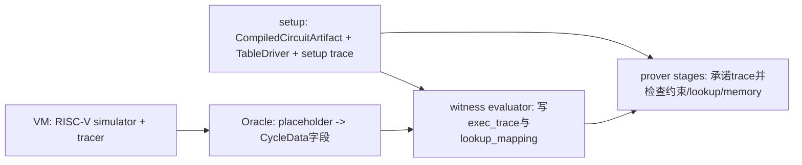
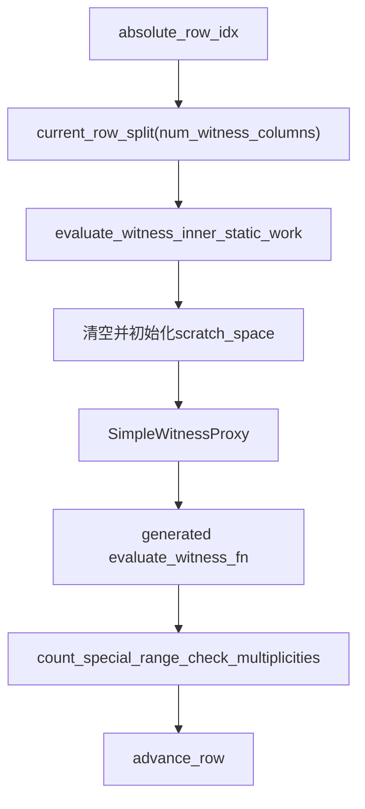
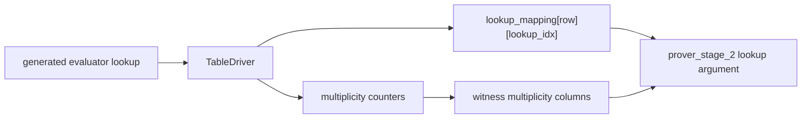

# main RISC-V VM 与 witness 阅读教程

[TOC]

## 0. 阅读目标

这份笔记接在 `airbender-main-riscv-setup-path.md` 后面。setup 笔记解释了 `get_main_riscv_circuit_setup` 如何生成固定表、列布局和 setup trace；这里解释 VM 和 witness 工程如何使用这些 setup 输出。

阅读 VM 和 witness 代码时，把 Airbender main RISC-V 分成四个边界：



setup 阶段决定一行 main RISC-V circuit 应该有哪些列、哪些表达式、哪些 lookup、哪些 memory argument。VM 阶段运行 guest，得到每个 cycle 的 pc、寄存器读写、RAM 读写、delegation request、timestamp。witness 阶段把 VM 记录转换成 field trace。prove 阶段用 setup 和 witness 检查约束系统。

初学者最容易混在一起的是三件事：

- `Machine::describe_state_transition` 描述一行约束，它不运行 guest。
- `GPUFriendlyTracer` 跟随模拟器执行，记录真实 CPU/RAM 事件，它不懂列布局。
- `evaluate_witness` 按 `CompiledCircuitArtifact` 写列，并统计 lookup multiplicity，它不重新解释 RISC-V 指令语义。

## 1. 主线文件

源码入口按执行顺序排列如下，从 setup 输出进入 prover 输入。

1. `circuit_defs/setups/src/circuits/main_riscv/mod.rs`

   `get_main_riscv_circuit_setup` 返回 `MainCircuitPrecomputations`。这里的 `compiled_circuit`、`table_driver`、`witness_eval_fn_for_gpu_tracer` 是 witness 阶段的三项关键输入。

2. `circuit_defs/risc_v_cycles/src/lib.rs`

   `witness_eval_fn_for_gpu_tracer` 包装 generated witness function。`DOMAIN_SIZE = 1 << 22`，`NUM_CYCLES = DOMAIN_SIZE - 1`。main circuit 每个 instance 承载 `2^22 - 1` 个 VM cycle，最后一行留给协议和边界处理。

3. `circuit_defs/trace_and_split/src/lib.rs`

   `run_till_end_for_gpu_for_machine_config` 运行 VM 并切分 chunks。`commit_memory_tree_for_riscv_circuit_using_gpu_tracer` 展示如何从一个 `CycleData` chunk 构造 memory trace。

4. `prover/src/tracers/main_cycle_optimized.rs`

   `GPUFriendlyTracer` 实现 simulator 的 `Tracer<C>`。它在回调中填 `SingleCycleTracingData`，并维护 RAM/register 最后访问 timestamp。

5. `prover/src/tracers/oracles/main_risc_v_circuit.rs`

   `MainRiscVOracle` 把 generated witness function 里的 `Placeholder` 解析到 `CycleData.per_cycle_data[row]`。

6. `prover/src/witness_evaluator/new/mod.rs`

   `evaluate_witness` 分配 `exec_trace` 和 `lookup_mapping`，逐行调用 static memory work 与 generated witness function，最后把 multiplicity 计数写回 witness columns。

7. `prover/src/witness_evaluator/memory_witness/main_circuit.rs`

   `process_lazy_init_work`、`process_delegation_requests`、`process_shuffle_ram_accesses` 写 memory subtree 和 timestamp 比较辅助 witness。

8. `cs/src/definitions/witness_tree.rs` 与 `cs/src/definitions/memory_tree.rs`

   这两个文件定义 `witness_layout` 和 `memory_layout` 的字段含义。看 witness 写列时，先确认目标列属于 witness subtree 还是 memory subtree。

9. `prover/src/prover_stages/stage1.rs` 与 `prover/src/prover_stages/stage2.rs`

   stage1 承诺 witness/memory trace，stage2 消费 setup trace、multiplicity columns 和 lookup mapping，构造 lookup/memory argument。

## 2. setup 输出如何进入 witness

`MainCircuitPrecomputations` 中，witness 阶段直接使用这些字段：

```rust
pub struct MainCircuitPrecomputations<C: MachineConfig, A: GoodAllocator, B: GoodAllocator = Global> {
    pub compiled_circuit: CompiledCircuitArtifact<Mersenne31Field>,
    pub table_driver: TableDriver<Mersenne31Field>,
    pub setup: SetupPrecomputations<DEFAULT_TRACE_PADDING_MULTIPLE, A, DefaultTreeConstructor>,
    pub witness_eval_fn_for_gpu_tracer: fn(&mut SimpleWitnessProxy<'_, MainRiscVOracle<'_, C, B>>),
}
```

`compiled_circuit` 给 witness evaluator 提供列布局：

- `witness_layout.total_width` 决定每行前多少列属于 witness subtree。
- `memory_layout.total_width` 决定每行后多少列属于 memory subtree。
- `memory_layout.shuffle_ram_access_sets` 描述每行寄存器/RAM 访问写入哪些 memory columns。
- `witness_layout.width_3_lookups` 决定 `lookup_mapping` 每行有多少个槽位。
- `scratch_space_size_for_witness_gen` 决定 generated evaluator 需要多少临时 field slots。

`table_driver` 给 generated witness function 提供固定表内容。调用 `SimpleWitnessProxy::lookup` 时，proxy 会在 `table_driver` 中查值，返回 lookup 输出，同时增加该 fixed table row 的 multiplicity，并把 absolute table index 写入 `lookup_mapping_row`。

`witness_eval_fn_for_gpu_tracer` 是一行 witness 的 generated evaluator。它由 `circuit_defs/risc_v_cycles/generated/witness_generation_fn.rs` 提供，源码中有很多 `eval_fn_N`。这些函数读 oracle、读已写列、做 field/u32/u16/boolean 运算、执行 lookup、写 witness columns。

## 3. VM 运行得到 CycleData

VM 主入口在 `circuit_defs/trace_and_split/src/lib.rs`：

```rust
let mut state = RiscV32StateForUnrolledProver::<C>::initial(ENTRY_POINT);
let mut tracer = GPUFriendlyTracer::<_, _, true, true, true>::new(...);

let finished = state.run_cycles(
    &mut memory,
    &mut tracer,
    non_determinism,
    &mut custom_csr_processor,
    cycles_per_chunk,
);
```

`state.run_cycles` 是 VM 执行。模拟器在每个 cycle 调用 tracer 回调。`GPUFriendlyTracer` 把当前 cycle 的信息写入 `trace_chunk.per_cycle_data`。

`SingleCycleTracingData` 是 main RISC-V witness 的 VM 原始记录：

```rust
pub struct SingleCycleTracingData {
    pub pc: u32,
    pub rs1_read_value: u32,
    pub rs1_read_timestamp: TimestampData,
    pub rs1_reg_idx: u16,
    pub rs2_or_mem_word_read_value: u32,
    pub rs2_or_mem_word_address: RegIndexOrMemWordIndex,
    pub rs2_or_mem_read_timestamp: TimestampData,
    pub delegation_request: u16,
    pub rd_or_mem_word_read_value: u32,
    pub rd_or_mem_word_write_value: u32,
    pub rd_or_mem_word_address: RegIndexOrMemWordIndex,
    pub rd_or_mem_read_timestamp: TimestampData,
    pub non_determinism_read: u32,
}
```

它的字段按一行 RISC-V transition 组织：

- `pc` 来自 `at_cycle_start`。
- `rs1_*` 来自 `trace_rs1_read`，对应第 0 个 shuffle RAM access。
- `rs2_or_mem_*` 来自 `trace_rs2_read` 或 `trace_ram_read`，对应第 1 个 shuffle RAM access。
- `rd_or_mem_*` 来自 `trace_rd_write` 或 `trace_ram_read_write`，对应第 2 个 shuffle RAM access。
- `delegation_request` 来自 `record_delegation`。
- `non_determinism_read` 来自 `trace_non_determinism_read`。

`GPUFriendlyTracer` 还维护 `RamTracingData`。每次寄存器或 RAM 被读写时，`mark_register_use` 或 `mark_ram_slot_use` 返回上一次写 timestamp，并把当前写 timestamp 写回 bookkeeping。这个 timestamp 后续进入 memory argument，证明同一个 register/RAM cell 的访问顺序一致。

## 4. CycleData 如何变成 Oracle

`MainRiscVOracle` 位于 `prover/src/tracers/oracles/main_risc_v_circuit.rs`。它实现 `Oracle<Mersenne31Field>`，核心职责是把 `Placeholder` 解析成某一行的 VM 记录。

例如：

```rust
Placeholder::PcInit => cycle_data.pc,
Placeholder::FirstRegMem => cycle_data.rs1_read_value,
Placeholder::SecondRegMem => cycle_data.rs2_or_mem_word_read_value,
Placeholder::WriteRdReadSetWitness => cycle_data.rd_or_mem_word_read_value,
Placeholder::ExternalOracle => cycle_data.non_determinism_read,
```

shuffle RAM 相关 placeholder 读取同一行的地址、读值、写值、读 timestamp：

```rust
Placeholder::ShuffleRamAddress(access_idx)
Placeholder::ShuffleRamReadValue(access_idx)
Placeholder::ShuffleRamWriteValue(access_idx)
Placeholder::ShuffleRamReadTimestamp(access_idx)
Placeholder::ShuffleRamIsRegisterAccess(access_idx)
```

这里的 `access_idx` 对 main RISC-V 固定为三类：

- `0`：rs1 register read。
- `1`：rs2 register read 或 RAM load。
- `2`：rd register write 或 RAM store。

`MainRiscVOracle` 不知道列号。它只知道第 `trace_step` 行的 VM 数据。列号由 generated witness function 和 `CompiledCircuitArtifact` 决定。

## 5. evaluate_witness 的执行顺序

`evaluate_witness` 位于 `prover/src/witness_evaluator/new/mod.rs`。它的输入包括 `compiled_circuit`、`witnes_eval_fn_ptr`、`cycles`、`oracle`、`lazy_init_data`、`table_driver` 和 `circuit_sequence`。

函数先分配两张 row-major trace：

```rust
let mut exec_trace = RowMajorTrace::new_zeroed_for_size_parallel(
    trace_len,
    num_witness_columns + num_memory_columns,
    ...
);

let lookup_mapping = RowMajorTrace::<u32, ...>::new_zeroed_for_size_parallel(
    trace_len,
    num_lookup_table_encoding_tuples,
    ...
);
```

`exec_trace` 每行由两段组成：

```text
exec_trace row = [ witness subtree columns | memory subtree columns ]
```

每行的写入顺序在 `evaluate_witness_inner` 中：



`evaluate_witness_inner_static_work` 写 memory subtree 以及与 memory 约束相关的辅助 witness：

1. `process_lazy_init_work::<true>` 写 lazy init address、teardown value、teardown timestamp，并计算 lazy init ordering 的辅助 borrow。
2. `process_delegation_requests` 写 delegation request multiplicity、delegation type 和 ABI offset。
3. `process_shuffle_ram_accesses::<O, true>` 写三组 shuffle RAM address/read timestamp/read value/write value，并计算 read timestamp < write timestamp 的 borrow。
4. `process_delegation_requests_execution` 和 `evaluate_indirect_memory_accesses` 服务 delegation circuit 的访问描述。main RISC-V 没有普通 batched RAM accesses。

static work 完成后，generated witness function 通过 `SimpleWitnessProxy` 写普通 witness columns、执行 fixed table lookup、记录 lookup mapping。

## 6. SimpleWitnessProxy 是 generated evaluator 的接口

`SimpleWitnessProxy` 位于 `prover/src/witness_evaluator/new/simple_proxy.rs`。generated evaluator 不直接拿 `exec_trace` 和 `CycleData`，它只通过 proxy 做五类操作：

```rust
get_witness_place(idx)
set_witness_place(idx, value)
get_memory_place(idx)
set_memory_place(idx, value)
get_oracle_value_u32(placeholder)
lookup(inputs, table_id, lookup_mapping_idx)
```

这些方法把约束系统中的对象连接起来：

- `get_oracle_value_*` 从 `MainRiscVOracle` 读取 VM 原始值。
- `set_witness_place` 写 `witness_row[idx]`。
- `set_memory_place` 写 `memory_row[idx]`。
- `lookup` 访问 setup 阶段构造的 `TableDriver`。
- `lookup_mapping_row[lookup_mapping_idx]` 记录本次 lookup 命中的 absolute table index。
- `multiplicity_counting_scratch[absolute_index] += 1` 统计 fixed table row 被查了多少次。

因此 generated evaluator 同时做两件事：计算普通 witness 列，记录普通 fixed lookup 的使用次数。它不负责 range check 16 和 timestamp range check 的全部 multiplicity，后者由 `count_special_range_check_multiplicities` 在每行末尾单独统计。

## 7. 以 pc 为例追一条 witness 数据

从 VM 到 witness，可以用 `pc` 练习一遍。

1. VM 每个 cycle 开始时，`GPUFriendlyTracer::at_cycle_start_ext` 把 `current_state.observable.pc` 写到 `trace_chunk.per_cycle_data.last_mut().pc`。

2. `MainRiscVOracle::get_u32_witness_from_placeholder` 处理 `Placeholder::PcInit`，返回 `cycle_data.pc`。

3. generated witness function 中，开头能看到类似代码：

```rust
let v_0 = witness_proxy.get_oracle_value_u32(Placeholder::PcInit);
```

4. generated evaluator 会把 `pc` 拆成低 16 位和高位，写入对应 witness columns，并执行 ROM lookup。ROM lookup 的固定表内容来自 setup 阶段的 `RomRead` 表。

5. `SimpleWitnessProxy::lookup` 在 `TableDriver` 中查 `[pc_low, pc_high, ...]` 对应的 ROM 行，记录 absolute table index。stage2 后续使用这个 index 和 setup trace 中的 fixed table row 做 lookup argument。

这条路径说明了一个关键点：VM 给的是 `pc` 的真实值，setup 给的是 ROM 固定表和 lookup 规则，witness evaluator 把二者连接成可证明的 lookup 关系。

## 8. memory subtree 与 shuffle RAM

main RISC-V 的寄存器和 RAM 访问走 shuffle RAM。`MemorySubtree` 中的 `shuffle_ram_access_sets` 保存每行三组访问列布局。

`process_shuffle_ram_accesses` 对每组 access 做以下写入：

- 根据 `ShuffleRamAddress` 写 register index 或 RAM formal address。
- 写 read timestamp。
- 写 read value。
- 如果该 access 是 write access，写 write value。
- 计算 read timestamp 与当前 write timestamp 的比较辅助变量。

当前行 write timestamp 不是 VM 随机给的值。它由 circuit sequence、row index 和 access index 组成：

```text
write_timestamp_base =
  timestamp_high_from_circuit_sequence
  + ((absolute_row_idx + 1) << NUM_EMPTY_BITS_FOR_RAM_TIMESTAMP)

write_timestamp = write_timestamp_base + access_idx
```

read timestamp 来自 `GPUFriendlyTracer` 的 bookkeeping。这个设计把跨行、跨 chunk 的内存顺序约束转成 timestamp 比较和 shuffle/memory argument。

## 9. multiplicity 和 lookup_mapping

lookup argument 需要比较两边：

- witness 查询了哪些 fixed table rows，以及每行查询了多少次。
- setup trace 承诺了哪些 fixed table rows。

Airbender 同时保留两类信息：



`lookup_mapping` 是每个 lookup query 在每行命中的 absolute table index。generic lookup multiplicity 会在所有行处理完之后，通过 `postprocess_multiplicities` 写回 witness subtree 的 multiplicity columns。

`count_special_range_check_multiplicities` 处理两类特殊 lookup：

- `range_check_16_lookup_expressions`，包括 trivial 变量列和非平凡表达式。
- `timestamp_range_check_lookup_expressions`，包括普通 timestamp 表达式和 shuffle RAM timestamp 表达式。

这些特殊表不通过 generated `lookup` 逐个记录 mapping，而是从 witness/memory/setup row 计算表达式值，然后按值增加对应 multiplicity。

## 10. witness 生成并不等于约束检查

`evaluate_witness` 负责填 trace。它会做一些 assert，例如值是否在 u16 范围内、read timestamp 是否小于 write timestamp、table size 是否匹配。但这些 assert 是工程侧的快速失败，不是完整证明。

完整约束检查发生在后续 proving stages：

- stage1：`prover_stage_1` 对 `exec_trace` 做 LDE，并分别为 witness subtree 和 memory subtree 构造 Merkle tree。
- stage2：`prover_stage_2` 使用 setup trace、witness multiplicity columns、lookup mapping、memory layout 和 transcript challenges，构造 lookup/memory argument 的 stage2 trace。
- quotient：generated quotient evaluator 根据 `degree_1_constraints`、`degree_2_constraints`、state linkage、boundary constraints、stage2 argument 等检查多项式约束。

所以读 witness 代码时，不要把 `set_witness_place` 当成约束成立。它只是把 prover 声称的值写到列里。约束成立要看 generated quotient 和 stage2 argument。

## 11. 初学者的三条练习路径

### 11.1 跟踪一条普通 placeholder

从 `Placeholder::PcInit` 开始：

1. 在 `generated/witness_generation_fn.rs` 搜 `Placeholder::PcInit`。
2. 看 generated evaluator 如何拆 pc、写 witness place、查 ROM table。
3. 跳到 `MainRiscVOracle`，确认这个 placeholder 读 `cycle_data.pc`。
4. 跳到 `GPUFriendlyTracer::at_cycle_start_ext`，确认 VM 在 cycle 开始时写 pc。
5. 回到 `create_table_for_rom_image` 和 setup 笔记，确认 ROM lookup 的 fixed table 来自 bytecode。

这条路径能建立 VM value、placeholder、witness column、fixed lookup 的关系。

### 11.2 跟踪一次 RAM load

从 `trace_ram_read` 开始：

1. `GPUFriendlyTracer::trace_ram_read` 判断 ROM read 特例，否则把 physical address 和 read value 写入 `rs2_or_mem_word_*` 字段。
2. `mark_ram_slot_use` 返回上次访问 timestamp。
3. `MainRiscVOracle` 对 `ShuffleRamAddress(1)`、`ShuffleRamReadValue(1)`、`ShuffleRamReadTimestamp(1)` 返回这组字段。
4. `process_shuffle_ram_accesses` 把它写入第 1 个 shuffle RAM access 的 memory columns。
5. timestamp 比较辅助 witness 写入 witness subtree。
6. stage2 和 quotient 后续检查 memory argument。

这条路径能理解 register/RAM 共用 access slot 的原因。

### 11.3 跟踪一次 fixed lookup multiplicity

从 generated evaluator 的 `lookup::<M, N>` 开始：

1. `SimpleWitnessProxy::lookup` 调用 `table_driver.lookup_values_and_get_absolute_index`。
2. proxy 把 `absolute_index` 写入 `lookup_mapping_row[lookup_mapping_idx]`。
3. proxy 增加 `generic_lookup_multiplicities[absolute_index]`。
4. `postprocess_multiplicities` 把 counter 写回 `witness_layout.multiplicities_columns_for_generic_lookup`。
5. stage2 从 setup trace 中读取同一个 absolute index 对应的 fixed table row，构造 lookup argument。

这条路径能理解 setup trace 和 witness trace 的对应关系。

## 12. 常见误区

`CycleData` 不是 witness trace。它是 VM tracer 的原始记录。witness trace 是 field trace，列布局由 `CompiledCircuitArtifact` 决定。

`MainRiscVOracle` 不检查 RISC-V 语义。它只按 placeholder 返回某行 VM 数据。

generated witness function 不生成 setup trace。setup trace 已经在 `SetupPrecomputations` 中生成，witness function 只使用 `TableDriver` 做 lookup。

`lookup_mapping` 不是 lookup 表内容。它记录 witness 查询命中的 fixed table absolute index。固定表内容在 setup trace 和 `TableDriver` 里。

`memory_row` 不是一块 RAM。它是一行执行 trace 的 memory subtree，保存本 cycle 的 RAM/register access 描述、timestamp、value 和 memory argument 辅助信息。

`trace_len = cycles + 1`。main RISC-V 每个 chunk 使用 `trace_len - 1` 个真实 cycle，最后一行保留给协议和边界。

## 13. 快速定位命令

常用搜索：

```bash
rg -n "Placeholder::PcInit|Placeholder::ShuffleRam" circuit_defs/risc_v_cycles/generated/witness_generation_fn.rs
rg -n "fn evaluate_witness|evaluate_witness_inner|SimpleWitnessProxy" prover/src/witness_evaluator
rg -n "struct SingleCycleTracingData|impl.*Tracer|trace_ram_read|trace_rd_write" prover/src/tracers/main_cycle_optimized.rs
rg -n "get_u32_witness_from_placeholder|get_timestamp_witness_from_placeholder" prover/src/tracers/oracles/main_risc_v_circuit.rs
rg -n "prover_stage_1|prover_stage_2" prover/src/prover_stages
```

读 layout：

```bash
rg -n "pub struct WitnessSubtree|pub struct MemorySubtree" cs/src/definitions
rg -n "witness_layout|memory_layout|setup_layout" cs/src/one_row_compiler
```

读 main RISC-V setup 与 wrapper：

```bash
rg -n "get_main_riscv_circuit_setup|witness_eval_fn_for_gpu_tracer|get_machine|get_table_driver" circuit_defs
```

## 14. 最短阅读路线

第一遍只看对象关系，不看 generated evaluator 的几百个 `eval_fn_N`：

```text
get_main_riscv_circuit_setup
  -> MainCircuitPrecomputations
  -> run_till_end_for_gpu_for_machine_config
  -> GPUFriendlyTracer
  -> CycleData
  -> MainRiscVOracle
  -> evaluate_witness
  -> SimpleWitnessProxy
  -> prover_stage_1 / prover_stage_2
```

第二遍挑一个字段追完整路径。`pc` 最适合入门，RAM load 适合理解 memory argument，ROM lookup 适合理解 setup trace 与 witness multiplicity 的连接。

第三遍再读 generated evaluator。读 generated code 时，不需要理解每个临时变量名，只要识别四类操作：

- `get_oracle_value_*`：从 VM 原始记录取值。
- `get_witness_place` / `set_witness_place`：读写 witness columns。
- `get_memory_place` / `set_memory_place`：读写 memory columns。
- `lookup` / `lookup_enforce`：访问 fixed table，记录 lookup mapping 和 multiplicity。

按这个顺序读，VM 与 witness 工程会收敛到同一个问题：某个 RISC-V cycle 的真实事件，如何被写成一行满足 Airbender 约束系统的 field trace。
