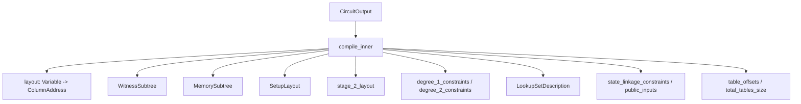
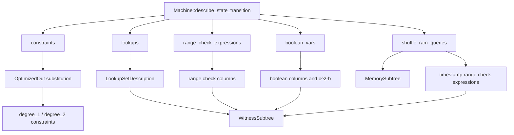

## 3. compile_inner生成CompiledCircuitArtifact

### 3.1 入口和CircuitOutput元素对应

default_compile_machine创建OneRowCompiler::default后调用compile_output_for_chunked_memory_argument。compile_output_for_chunked_memory_argument继续调用compile_inner::<false>。false表示main RISC-V路径，true表示delegation circuit路径。

compile_inner把CircuitOutput编译成CompiledCircuitArtifact。CircuitOutput保存Variable级别的数据：变量编号、约束、lookup query、range check query、boolean变量、memory访问描述和TableDriver。CompiledCircuitArtifact保存ColumnAddress级别的数据：witness_layout、memory_layout、setup_layout、stage_2_layout、degree_1_constraints、degree_2_constraints、LookupSetDescription、public_inputs、table_offsets和total_tables_size。

```rust
// cs/src/one_row_compiler/compile_layout.rs
let CircuitOutput {
    state_input,
    state_output,
    table_driver,
    num_of_variables,
    constraints,
    lookups,
    shuffle_ram_queries,
    linked_variables,
    range_check_expressions,
    boolean_vars,
    substitutions,
    delegated_computation_requests,
    degegated_request_to_process,
    batched_memory_accesses,
    register_and_indirect_memory_accesses,
} = circuit_output;
```

compile_inner的输入字段按用途分成五组。

state_input和state_output来自compile_machine收集的initial_state和final_state。compile_inner把它们转成state_linkage_constraints和public_inputs。state_linkage_constraints约束当前行final_state等于下一行initial_state。public_inputs约束第一行initial_state和倒数第二行final_state。

table_driver来自CircuitOutput。default_compile_machine已经把RomRead和SpecialCSRProperties补进cs_output.table_driver。compile_inner读取table_driver.total_tables_len创建SetupLayout，读取table_driver.table_starts_offsets生成table_offsets。

constraints来自Machine::describe_state_transition登记的普通多项式关系。decoder拆解、opcode family选择、寄存器写回、PC更新、CSR字段、delegation字段等关系都在这里。compile_inner把Constraint<Variable>转换成CompiledDegree1Constraint或CompiledDegree2Constraint。

lookups来自电路构造阶段登记的lookup query。RomRead、OpTypeBitmask、SpecialCSRProperties、RangeCheckSmall和其它固定表的query保存在lookups字段。BasicAssembly.finalize还会把8-bit range check成对转成RangeCheckSmall lookup。compile_inner把LookupQuery转换成LookupSetDescription。

shuffle_ram_queries来自main RISC-V每行的register/RAM访问描述。main路径要求每行固定3个shuffle RAM query。compile_inner根据它们创建MemorySubtree，并生成timestamp比较需要的辅助变量和range check表达式。



### 3.2 main路径和delegation路径形状

compile_inner开头检查FOR_DELEGATION。main RISC-V路径和delegation circuit路径使用同一个函数，但输入字段形状不同。

main RISC-V路径使用compile_inner::<false>。state_input和state_output必须存在。shuffle_ram_queries必须等于3。degegated_request_to_process必须为None。batched_memory_accesses和register_and_indirect_memory_accesses必须为空。main路径每行处理CPU状态转移和3次shuffle RAM访问。

```rust
if FOR_DELEGATION {
    assert!(state_input.is_empty());
    assert!(state_output.is_empty());
    assert!(shuffle_ram_queries.is_empty());
    assert!(linked_variables.is_empty());
    assert!(degegated_request_to_process.is_some());
    assert!(delegated_computation_requests.is_empty());
    // 省略代码...
} else {
    assert_eq!(shuffle_ram_queries.len(), 3);
    assert!(linked_variables.is_empty());
    assert!(degegated_request_to_process.is_none());
    assert!(batched_memory_accesses.is_empty());
    assert!(register_and_indirect_memory_accesses.is_empty());
}
```

delegation circuit路径使用compile_inner::<true>。state_input、state_output和shuffle_ram_queries为空。degegated_request_to_process必须存在。register_and_indirect_memory_accesses或batched_memory_accesses至少有一个。delegation路径处理被main电路请求的外部计算，不使用main电路的state linkage。

main路径生成timestamp setup列。delegation路径不生成timestamp setup列。

```rust
let need_timestamps = !FOR_DELEGATION;
let setup_layout =
    SetupLayout::layout_for_lookup_size(total_tables_size, trace_len, need_timestamps);
```

### 3.3 约束总览

compile_inner不重新定义CPU语义。Machine::describe_state_transition已经把一行CPU语义写成Variable级别的约束、lookup query、range check query、boolean变量和memory访问描述。compile_inner分配列，把这些对象转换成后续prover能读取的列地址版本。

约束按消费位置分成七类。

state linkage约束连接相邻两行CPU状态。

$$
state\_output_i(k)=state\_input_i(k+1)
$$

public input约束绑定第一行和倒数第二行。

$$
public\_first_i=state\_input_i(0)
$$

$$
public\_last_i=state\_output_i(T-2)
$$

普通degree 1约束保存线性关系。

$$
\sum_i a_i\cdot col_i+c=0
$$

普通degree 2约束保存二次关系。

$$
\sum_{i,j}q_{ij}\cdot col_i\cdot col_j+\sum_i a_i\cdot col_i+c=0
$$

boolean约束限制selector、carry、borrow等变量取0或1。

$$
b^2-b=0
$$

range check约束通过lookup argument限制变量落在固定范围。

$$
v\in\{0,1,\ldots,2^{16}-1\}
$$

width-3 lookup约束检查三元组属于某张固定表。

$$
[x_0,x_1,x_2]\in rows(TableType)
$$

memory argument约束把读写记录放进MemorySubtree，后续stage 2 grand product检查读写多重集合相等。compile_inner在main路径额外生成read timestamp小于write timestamp的range check表达式。

$$
read\_timestamp<write\_timestamp
$$

这些约束有固定依赖关系。boolean约束先生成，因为timestamp比较和地址比较用borrow变量。range check表达式先放列，因为lookup表达式需要ColumnAddress。lookups最后编译，因为row里的变量可能已经被memory布局、range check布局或boolean布局放进具体列。普通constraints最后编译，因为OptimizedOut会先删除一部分可由线性约束求出的变量。



### 3.4 SetupLayout和固定表列

compile_inner根据trace_len_log2计算trace_len。trace_len表示每个trace有多少行。total_tables_size来自CircuitOutput.table_driver.total_tables_len。lookup_table_encoding_capacity等于trace_len - 1，因为setup trace最后一行要调整c0为0，不写普通固定表内容。

```rust
let trace_len = 1usize << trace_len_log2;
let total_tables_size = table_driver.total_tables_len;
let lookup_table_encoding_capacity = trace_len - 1;

let mut num_required_tuples_for_generic_lookup_setup =
    total_tables_size / lookup_table_encoding_capacity;
if total_tables_size % lookup_table_encoding_capacity != 0 {
    num_required_tuples_for_generic_lookup_setup += 1;
}
```

SetupLayout只保存setup trace列布局。它不保存RomRead、OpTypeBitmask或SpecialCSRProperties的表内容。RomRead、OpTypeBitmask、SpecialCSRProperties和其它width-3固定表由TableDriver保存。SetupPrecomputations后续调用table_driver.dump_tables，把所有通用固定表行合并写进generic_lookup_setup_columns。

```rust
pub struct SetupLayout {
    pub timestamp_setup_columns: ColumnSet<NUM_TIMESTAMP_COLUMNS_FOR_RAM>,
    pub range_check_16_setup_column: ColumnSet<1>,
    pub timestamp_range_check_setup_column: ColumnSet<1>,
    pub generic_lookup_setup_columns: ColumnSet<NUM_COLUMNS_FOR_COMMON_TABLE_WIDTH_SETUP>,
    pub total_width: usize,
}
```

generic_lookup_setup_columns的列组数由total_tables_size和trace_len决定。

$$
num\_generic\_setup\_columns=\left\lceil \frac{total\_tables\_size}{trace\_len-1}\right\rceil
$$

SetupLayout中的三类固定表区域对应三类lookup argument。

range_check_16_setup_column保存宽度1的16-bit表。

$$
rows(RangeCheck16)=\{0,1,\ldots,2^{16}-1\}
$$

timestamp_range_check_setup_column保存timestamp比较使用的宽度1表。

$$
rows(TimestampRangeCheck)=\{0,1,\ldots,2^{TIMESTAMP\_COLUMNS\_NUM\_BITS}-1\}
$$

generic_lookup_setup_columns保存width-3通用固定表。TableDriver.dump_tables给每行附加table id，所以generic lookup实际处理4列：三个表内容列和一个table id列。

$$
row_{generic}=[v_0,v_1,v_2,table\_id]
$$

compile_inner生成table_offsets。table_offsets按照TableType.to_table_id下标保存每张表在合并大表中的起始offset。LookupSetDescription保存TableIndex::Constant(TableType)。后续lookup argument用TableType找到table offset，再定位固定表行。

```rust
let table_offsets = table_driver
    .table_starts_offsets()
    .map(|el| el as u32)
    .to_vec();
```

### 3.5 layout、WitnessSubtree和MemorySubtree

compile_inner创建all_variables_to_place，里面收录0..num_of_variables的所有Variable。layout是BTreeMap<Variable, ColumnAddress>。每个变量最后只能进入一个位置：WitnessSubtree、MemorySubtree、SetupSubtree或OptimizedOut。

```rust
let mut num_variables = num_of_variables as u64;

let mut all_variables_to_place = BTreeSet::new();
for variable_idx in 0..num_variables {
    all_variables_to_place.insert(Variable(variable_idx));
}

let mut memory_tree_offset = 0;
let mut layout = BTreeMap::<Variable, ColumnAddress>::new();
```

MemorySubtree保存memory trace列布局。main路径下，compile_inner先为lazy init和teardown创建列，再把3个shuffle RAM query放进memory trace列。

```rust
let memory_subtree_placement = MemorySubtree {
    shuffle_ram_inits_and_teardowns: Some(shuffle_ram_inits_and_teardowns),
    shuffle_ram_access_sets,
    delegation_request_layout,
    delegation_processor_layout: None,
    batched_ram_accesses: vec![],
    register_and_indirect_accesses: vec![],
    total_width: memory_tree_offset,
};
```

WitnessSubtree保存witness trace列布局。compile_inner按顺序分配multiplicity columns、range check columns、boolean columns和scratch columns。width_3_lookups、range_check_16_lookup_expressions、timestamp_range_check_lookup_expressions也保存在WitnessSubtree里。它们不是列本身，而是后续stage 2生成lookup argument时读取的列描述。

```rust
let witness_layout = WitnessSubtree {
    multiplicities_columns_for_range_check_16,
    multiplicities_columns_for_timestamp_range_check,
    multiplicities_columns_for_generic_lookup,
    range_check_8_columns,
    range_check_16_columns,
    width_3_lookups,
    range_check_16_lookup_expressions,
    timestamp_range_check_lookup_expressions: compiled_timestamp_comparison_expressions,
    offset_for_special_shuffle_ram_timestamps_range_check_expressions,
    boolean_vars_columns_range,
    scratch_space_columns_range,
    total_width: witness_tree_offset,
};
```

compile_inner只分配列和编译约束。pc、寄存器值、opcode flag、memory read/write值由witness generation写入trace。setup trace由SetupPrecomputations根据SetupLayout和TableDriver写入固定表行。

### 3.6 state linkage和public inputs

state_input和state_output必须等长。每个state变量先通过layout找到ColumnAddress。compile_inner把每对(state_input_i,state_output_i)转成一个linking constraint和两个boundary public input。

```rust
assert_eq!(state_input.len(), state_output.len());
let mut linking_constraints = vec![];
let mut public_inputs_first_row = vec![];
let mut public_inputs_one_row_before_last = vec![];
for (i, f) in state_input.into_iter().zip(state_output.into_iter()) {
    let i = layout.get(&i).expect("must be compiled");
    let f = layout.get(&f).expect("must be compiled");
    linking_constraints.push((*f, *i));
    public_inputs_first_row.push((BoundaryConstraintLocation::FirstRow, *i));
    public_inputs_one_row_before_last
        .push((BoundaryConstraintLocation::OneBeforeLastRow, *f));
}
```

state linkage约束连接相邻两行。第k行的f列等于第k+1行的i列。

$$
f(k)=i(k+1)
$$

这里的f来自当前行state_output，i来自下一行state_input。CPU每行只证明一轮状态转移。linking constraint把所有行接成一段连续执行轨迹。

public input约束绑定执行边界。

$$
i(0)=public\_first
$$

$$
f(T-2)=public\_last
$$

T是trace_len。代码使用OneBeforeLastRow，不使用最后一行。最后一行给多项式和setup调整保留，不承载普通CPU状态边界。

### 3.7 boolean约束

boolean_vars保存需要限制为0或1的变量。opcode selector、condition flag、carry、borrow、is_register、execute delegation等变量会进入boolean_vars。compile_inner给每个boolean变量分配WitnessSubtree列，并生成一个degree 2约束。

```rust
for variable in boolean_vars.into_iter() {
    assert!(
        all_variables_to_place.remove(&variable),
        "variable {:?} was already placed",
        variable
    );
    let place = ColumnAddress::WitnessSubtree(witness_tree_offset);
    layout.insert(variable, place);
    witness_tree_offset += 1;

    let mut quadratic_terms = vec![];
    let mut linear_terms = vec![];
    quadratic_terms.push((F::ONE, place, place));
    linear_terms.push((F::MINUS_ONE, place));

    let compiled_term = CompiledDegree2Constraint {
        quadratic_terms: quadratic_terms.into_boxed_slice(),
        linear_terms: linear_terms.into_boxed_slice(),
        constant_term: F::ZERO,
    };

    compiled_quadratic_terms.push(compiled_term);
}
```

约束式为：

$$
b^2-b=0
$$

也可以写成：

$$
b(b-1)=0
$$

域元素b满足该等式时，b只能是0或1。selector用这个约束防止半选中状态。borrow和carry用这个约束防止借位变量取任意域元素。

selector约束和普通语义约束配合使用。假设is_add和is_sub是两个opcode selector，add_expr表示add指令必须满足的关系，sub_expr表示sub指令必须满足的关系。describe_state_transition通常会登记如下形式的约束：

$$
is\_add\cdot add\_expr=0
$$

$$
is\_sub\cdot sub\_expr=0
$$

compile_inner只处理已经登记好的Constraint。boolean约束保证is_add和is_sub只能取0或1。被选中的selector为1时，对应expr必须为0；未选中的selector为0时，对应约束自动成立。

### 3.8 range check约束

range_check_expressions保存RangeCheckQuery。每个RangeCheckQuery包含input和width。compile_inner只接受Variable输入，并检查width属于SMALL_RANGE_CHECK_TABLE_WIDTH或LARGE_RANGE_CHECK_TABLE_WIDTH。

```rust
for range_check in range_check_expressions.iter() {
    let RangeCheckQuery { input, width } = range_check;
    let LookupInput::Variable(..) = input else {
        unimplemented!()
    };
    assert!(
        *width == LARGE_RANGE_CHECK_TABLE_WIDTH || *width == SMALL_RANGE_CHECK_TABLE_WIDTH
    );
}
```

8-bit range check变量进入range_check_8_columns。BasicAssembly.finalize已经把8-bit range check成对转成RangeCheckSmall的width-3 lookup。compile_inner仍然给这些变量分配列，让LookupQuery中的变量能找到ColumnAddress。

```rust
let range_check_8_iter = range_check_expressions
    .iter()
    .filter(|el| el.width == SMALL_RANGE_CHECK_TABLE_WIDTH);

let range_check_8_columns: ColumnSet<1> =
    ColumnSet::layout_at(&mut witness_tree_offset, num_range_check_8);

for (input, mut layout_part) in range_check_8_iter.zip(range_check_8_columns_it) {
    let LookupInput::Variable(input) = input.input else {
        unimplemented!()
    };
    let offset = layout_part.next().unwrap();
    let _place = layout_witness_subtree_variable_at_column(
        offset,
        input,
        &mut all_variables_to_place,
        &mut layout,
    );
}
```

8-bit pair的成员关系写成：

$$
[a,b,0]\in rows(RangeCheckSmall)
$$

RangeCheckSmall固定表枚举a和b的所有8-bit取值。这个lookup同时约束a和b。

$$
0\le a<2^8
$$

$$
0\le b<2^8
$$

16-bit range check变量进入range_check_16_columns。compile_inner为每个16-bit变量生成LookupExpression::Variable，并加入range_check_16_lookup_expressions。

```rust
let mut range_check_16_lookup_expressions = vec![];
let range_check_16_columns: ColumnSet<1> =
    ColumnSet::layout_at(&mut witness_tree_offset, num_range_check_16);

for (range_check, layout_part) in range_check_16_iter.zip(range_check_16_columns.iter()) {
    let RangeCheckQuery { input, .. } = range_check;
    let LookupInput::Variable(variable) = input else {
        unimplemented!()
    };
    let mut layout_part = layout_part;
    let offset = layout_part.next().unwrap();
    let place = layout_witness_subtree_variable_at_column(
        offset,
        *variable,
        &mut all_variables_to_place,
        &mut layout,
    );
    let lookup_expr = LookupExpression::Variable(place);
    range_check_16_lookup_expressions.push(lookup_expr)
}

range_check_16_lookup_expressions.extend(compiled_extra_range_check_16_expressions);
```

16-bit range check写成宽度1 lookup：

$$
v\in rows(RangeCheck16)
$$

固定表内容为：

$$
rows(RangeCheck16)=\{0,1,\ldots,2^{16}-1\}
$$

compiled_extra_range_check_16_expressions保存编译器自己生成的range check表达式。main路径的lazy init地址、delegation路径的地址派生、对齐检查等表达式会追加到这里。这些表达式不一定对应某个原始Variable，但它们都必须落在16-bit表中。

### 3.9 width-3 lookup约束

lookups字段保存LookupQuery。LookupQuery包含row和table。row长度必须为3。row里的每个元素是LookupInput::Variable或LookupInput::Expression。table是LookupQueryTableType::Constant或LookupQueryTableType::Variable。

compile_inner把Variable级别的LookupQuery编译成ColumnAddress级别的LookupSetDescription。

```rust
let mut width_3_lookups = vec![];

for lookup_query in lookups {
    let LookupQuery { row, table } = lookup_query;
    assert_eq!(row.len(), 3);

    let mut input_columns = Vec::with_capacity(3);
    for el in row.into_iter() {
        match el {
            LookupInput::Variable(single_var) => {
                let place = if let Some(place) = layout.get(&single_var) {
                    *place
                } else {
                    let column = layout_witness_subtree_variable(
                        &mut witness_tree_offset,
                        single_var,
                        &mut all_variables_to_place,
                        &mut layout,
                    );
                    ColumnAddress::WitnessSubtree(column.start)
                };
                input_columns.push(LookupExpression::Variable(place));
            }
            LookupInput::Expression { linear_terms, constant_coeff } => {
                let mut compiled_linear_terms = vec![];
                for (coeff, var) in linear_terms.iter() {
                    let place = if let Some(place) = layout.get(var) {
                        *place
                    } else {
                        let column = layout_witness_subtree_variable(
                            &mut witness_tree_offset,
                            *var,
                            &mut all_variables_to_place,
                            &mut layout,
                        );
                        ColumnAddress::WitnessSubtree(column.start)
                    };
                    compiled_linear_terms.push((*coeff, place));
                }
                let compiled_constraint = CompiledDegree1Constraint {
                    linear_terms: compiled_linear_terms.into_boxed_slice(),
                    constant_term: constant_coeff,
                };
                input_columns.push(LookupExpression::Expression(compiled_constraint));
            }
        }
    }

    let table_index = match table {
        LookupQueryTableType::Constant(constant) => TableIndex::Constant(constant),
        LookupQueryTableType::Variable(variable) => {
            let column = layout_witness_subtree_variable(
                &mut witness_tree_offset,
                variable,
                &mut all_variables_to_place,
                &mut layout,
            );
            TableIndex::Variable(ColumnAddress::WitnessSubtree(column.start))
        }
    };

    width_3_lookups.push(LookupSetDescription {
        input_columns: input_columns.try_into().unwrap(),
        table_index,
    });
}
```

固定表lookup的数学形式为：

$$
[x_0(k),x_1(k),x_2(k),table\_id]\in rows(GenericLookupSetup)
$$

x0、x1、x2来自LookupSetDescription.input_columns。table_id来自LookupSetDescription.table_index。table_index是Constant时，table_id由TableType.to_table_id给出。table_index是Variable时，table_id来自witness列。

RomRead lookup约束pc读取的指令内容。

$$
[pc/4,opcode_{low},opcode_{high}]\in rows(RomRead)
$$

RomRead固定表来自bytecode。setup/proving阶段用TableDriver.dump_tables把RomRead行写进generic lookup setup列。compile_inner不读取RomRead内容，只保存LookupSetDescription。

OpTypeBitmask lookup约束decoder输出的instruction family bitmask。

$$
[decoder\_input,split_0,split_1]\in rows(OpTypeBitmask)
$$

SpecialCSRProperties lookup约束CSR编号对应的属性。

$$
[csr\_index,is\_supported,is\_for\_delegation]\in rows(SpecialCSRProperties)
$$

RangeCheckSmall lookup约束两个8-bit值。

$$
[a,b,0]\in rows(RangeCheckSmall)
$$

total_generic_lookups检查所有generic lookup总次数小于field characteristic。lookup argument通常会把所有query压成一个多重集合关系。总次数超过域大小会增加计数碰撞风险，代码直接拒绝这种配置。

```rust
let total_generic_lookups = width_3_lookups.len() as u64 * trace_len as u64;
assert!(total_generic_lookups < F::CHARACTERISTICS);
```

### 3.10 shuffle RAM访问列和memory argument

main RISC-V每行固定3个shuffle RAM query。compile_inner先检查query按local_timestamp_in_cycle排序，且相邻query的local timestamp连续。

```rust
assert!(shuffle_ram_queries
    .is_sorted_by(|a, b| a.local_timestamp_in_cycle < b.local_timestamp_in_cycle));
shuffle_ram_queries.windows(2).for_each(|el| {
    assert!(el[0].local_timestamp_in_cycle + 1 == el[1].local_timestamp_in_cycle)
});
```

这个检查保证同一行内的memory访问顺序固定。local_timestamp_in_cycle会成为write timestamp的低位偏移。后续prover根据setup timestamp、circuit sequence和local_timestamp_in_cycle生成真实write timestamp。

对每个memory query，compile_inner创建read_timestamp_low、read_timestamp_high和borrow_var。read timestamp放进MemorySubtree。borrow_var放进boolean_vars。borrow_var后续用于证明read_timestamp小于write_timestamp。

```rust
let [read_timestamp_low, read_timestamp_high] =
    add_multiple_compiler_defined_variables::<NUM_TIMESTAMP_COLUMNS_FOR_RAM>(
        &mut num_variables,
        &mut all_variables_to_place,
    );
let read_timestamp = layout_memory_subtree_multiple_variables(
    &mut memory_tree_offset,
    [read_timestamp_low, read_timestamp_high],
    &mut all_variables_to_place,
    &mut layout,
);

let borrow_var =
    add_compiler_defined_variable(&mut num_variables, &mut all_variables_to_place);
boolean_vars.push(borrow_var);
```

Memory query分成readonly和write两类。readonly query要求read_value等于write_value。write query保存read_value和write_value。memory argument后续把读集合和写集合做多重集合检查。

```rust
let query_columns = if memory_query.is_readonly() {
    assert_eq!(memory_query.read_value, memory_query.write_value);

    let query_columns = ShuffleRamQueryReadColumns {
        in_cycle_write_index: memory_query.local_timestamp_in_cycle as u32,
        address,
        read_timestamp,
        read_value,
    };

    ShuffleRamQueryColumns::Readonly(query_columns)
} else {
    let write_value = layout_memory_subtree_multiple_variables(
        &mut memory_tree_offset,
        memory_query.write_value,
        &mut all_variables_to_place,
        &mut layout,
    );

    let query_columns = ShuffleRamQueryWriteColumns {
        in_cycle_write_index: memory_query.local_timestamp_in_cycle as u32,
        address,
        read_timestamp,
        read_value,
        write_value,
    };

    ShuffleRamQueryColumns::Write(query_columns)
};
```

memory record可以写成：

$$
read\_record=(address,read\_timestamp,read\_value)
$$

$$
write\_record=(address,write\_timestamp,write\_value)
$$

readonly访问满足：

$$
read\_value=write\_value
$$

write访问保存旧值和新值。memory grand product检查所有读记录能被之前的写记录或lazy init记录解释，所有写记录会进入后续可读集合。

main路径还要求同一行内所有read发生在write之前。代码提取readonly query的local timestamp和write query的local timestamp，要求read timestamp区间在write timestamp区间之前。

```rust
let min_read = *read_timestamps.iter().min().unwrap();
let max_read = *read_timestamps.iter().max().unwrap();
assert_eq!(min_read, 0);

let min_write = *write_timestamps.iter().min().unwrap();
let max_write = *write_timestamps.iter().max().unwrap();
assert!(max_read < min_write);
```

这个约束避免同一行内先写后读造成歧义。CPU语义先读取当前寄存器/RAM值，再写回结果。read/write local timestamp排序把这个语义交给memory argument检查。

### 3.11 shuffle RAM timestamp比较

compile_inner为每个shuffle RAM query生成两个timestamp range check表达式。read timestamp是witness/memory列。write timestamp由setup timestamp和local_timestamp_in_cycle组成。setup timestamp在setup trace中提供每一行的基础时间戳。

低位表达式：

$$
expr_{low}=2^{ts\_bits}\cdot borrow+read_{low}-write_{low}-local
$$

高位表达式：

$$
expr_{high}=read_{high}-write_{high}-borrow+2^{ts\_bits}
$$

其中：

$$
ts\_bits=TIMESTAMP\_COLUMNS\_NUM\_BITS
$$

$$
write_{low}=setup\_timestamp_{low}
$$

$$
write_{high}=setup\_timestamp_{high}
$$

两个表达式都进入TimestampRangeCheck：

$$
expr_{low}\in\{0,1,\ldots,2^{ts\_bits}-1\}
$$

$$
expr_{high}\in\{0,1,\ldots,2^{ts\_bits}-1\}
$$

这两个range check共同表达read_timestamp小于write_timestamp。低位表达式处理低limb借位，高位表达式扣掉borrow后保持在timestamp limb范围内。

```rust
let mut compiled_linear_terms = vec![];
let borrow_place = *layout.get(&intermediate_borrow).unwrap();
compiled_linear_terms.push((
    F::from_u64_unchecked(1 << TIMESTAMP_COLUMNS_NUM_BITS),
    borrow_place,
));
let read_low_place = *layout.get(&read_low).unwrap();
compiled_linear_terms.push((F::ONE, read_low_place));

let write_low_place =
    ColumnAddress::SetupSubtree(setup_layout.timestamp_setup_columns.start());
compiled_linear_terms.push((F::MINUS_ONE, write_low_place));

let mut constant_coeff = F::from_u64_unchecked(local_timestamp_in_cycle as u64);
constant_coeff.negate();
```

```rust
let mut compiled_linear_terms = vec![];
let read_high_place = *layout.get(&read_high).unwrap();
compiled_linear_terms.push((F::ONE, read_high_place));

let write_high_place = ColumnAddress::SetupSubtree(
    setup_layout.timestamp_setup_columns.start() + 1,
);
compiled_linear_terms.push((F::MINUS_ONE, write_high_place));

let borrow_place = *layout.get(&intermediate_borrow).unwrap();
compiled_linear_terms.push((F::MINUS_ONE, borrow_place));

let constant_coeff = F::from_u64_unchecked(1 << TIMESTAMP_COLUMNS_NUM_BITS);
```

compile_inner把这些表达式追加到compiled_timestamp_comparison_expressions，并记录offset_for_special_shuffle_ram_timestamps_range_check_expressions。这个offset标记main路径专门的shuffle RAM timestamp range check从哪里开始。证明阶段还会加入circuit sequence相关常数。

```rust
let offset_for_special_shuffle_ram_timestamps_range_check_expressions =
    compiled_timestamp_comparison_expressions.len();
```

total_timestamp_range_check_lookups检查timestamp range check总次数小于field characteristic。

```rust
let total_timestamp_range_check_lookups =
    compiled_timestamp_comparison_expressions.len() as u64 * trace_len as u64;
assert!(total_timestamp_range_check_lookups < F::CHARACTERISTICS);
```

### 3.12 lazy init地址排序和padding约束

main路径给shuffle RAM创建lazy init和teardown列。lazy init处理第一次读取某个RAM地址时的初始值。teardown处理最后一次写入后的收尾值。memory argument需要证明init、read、write、teardown记录构成一致的多重集合。

compile_inner创建tmp_low、tmp_high、intermediate_borrow和final_borrow。tmp_low和tmp_high加入16-bit range check。两个borrow加入boolean_vars。

```rust
let tmp_low_var =
    add_compiler_defined_variable(&mut num_variables, &mut all_variables_to_place);
let tmp_high_var =
    add_compiler_defined_variable(&mut num_variables, &mut all_variables_to_place);
let intermediate_borrow_var =
    add_compiler_defined_variable(&mut num_variables, &mut all_variables_to_place);
let final_borrow_var =
    add_compiler_defined_variable(&mut num_variables, &mut all_variables_to_place);

range_check_expressions.push(RangeCheckQuery::new(
    tmp_low_var,
    LARGE_RANGE_CHECK_TABLE_WIDTH,
));
range_check_expressions.push(RangeCheckQuery::new(
    tmp_high_var,
    LARGE_RANGE_CHECK_TABLE_WIDTH,
));
boolean_vars.push(intermediate_borrow_var);
boolean_vars.push(final_borrow_var);
```

源码注释给出排序约束。设当前行地址为addr(k)，下一行地址为addr(k+1)。地址拆成low和high两个16-bit limb。正常排序要求addr(k)<addr(k+1)。

低位比较：

$$
tmp_{low}(k)=2^{16}\cdot borrow_1(k)+addr_{low}(k)-addr_{low}(k+1)
$$

高位比较：

$$
tmp_{high}(k)=2^{16}\cdot borrow_2(k)+addr_{high}(k)-addr_{high}(k+1)-borrow_1(k)
$$

range check约束：

$$
tmp_{low}(k)\in[0,2^{16})
$$

$$
tmp_{high}(k)\in[0,2^{16})
$$

当地址严格递增时，borrow变量给出合法的减法借位。padding行不需要严格递增。源码用final_borrow控制padding。final_borrow为0时，地址、teardown value、teardown timestamp都被约束为0。

$$
(1-final\_borrow)\cdot addr_{low}=0
$$

$$
(1-final\_borrow)\cdot addr_{high}=0
$$

$$
(1-final\_borrow)\cdot teardown\_value_{low}=0
$$

$$
(1-final\_borrow)\cdot teardown\_value_{high}=0
$$

$$
(1-final\_borrow)\cdot teardown\_timestamp_{low}=0
$$

$$
(1-final\_borrow)\cdot teardown\_timestamp_{high}=0
$$

源码注释说明这些约束让padding行形成address=0、timestamp=0、value=0的init/teardown记录。它们在permutation grand product中互相抵消。

```rust
// - (intermediate_borrow(this) << 16) + addr_low(this) - addr_low(next) = tmp_low(this),
// - (final_borrow(this) << 16 + addr_high(this) - addr_high(next) - borrow(this) = tmp_high(this)
// - (1 - final_borrow(this)) * addr_low(this) = 0
// - (1 - final_borrow(this)) * addr_high(this) = 0
// - (1 - final_borrow(this)) * teardown_value_low(this) = 0
// - (1 - final_borrow(this)) * teardown_value_high(this) = 0
// - (1 - final_borrow(this)) * teardown_timestamp_low(this) = 0
// - (1 - final_borrow(this)) * teardown_timestamp_high(this) = 0
```

compile_inner不在这一段直接生成所有lazy init二次约束。它保存lazy_init_address_aux_vars，后续prover/quotient计算用这些ColumnAddress读取tmp、borrow、地址和teardown列。

### 3.13 OptimizedOut线性替换

compile_inner在普通constraints编译前尝试删除一部分变量。候选变量需要满足以下条件：变量尚未布局；变量出现在至少一个非prevent_optimizations的线性约束中；变量在其它出现位置的degree小于2；变量不是substitutions目标；变量不是state_input或state_output。

```rust
for (_, v) in substitutions.iter() {
    if v == variable {
        continue 'outer;
    }
}

if state_input.contains(&variable) {
    continue;
}

if state_output.contains(&variable) {
    continue;
}
```

线性定义约束写成：

$$
a\cdot x+\sum_i b_i\cdot y_i+c=0
$$

express_variable把x写成其它变量的表达式：

$$
x=-a^{-1}\left(\sum_i b_i\cdot y_i+c\right)
$$

compile_inner把这个表达式代入其它包含x的约束。代入后degree不能超过2。degree超过2会破坏Airbender当前的degree 2约束形状，候选变量会被放弃。

```rust
let defining_constraint = constraints[defining_constraint_idx].0.clone();
let mut expression =
    defining_constraint.express_variable(variable_to_optimize_out);
expression.normalize();

let rewritten_constraint = existing_constraint
    .clone()
    .substitute_variable(variable_to_optimize_out, expression.clone());

if rewritten_constraint.degree() > 2 {
    can_be_optimized_out = false;
    break;
}
```

优化成功后，compile_inner从all_variables_to_place删除该变量，删除定义约束，把其它出现位置替换成新的约束。该变量进入ColumnAddress::OptimizedOut，并占用scratch_space_size_for_witness_gen。

```rust
let existed = all_variables_to_place.remove(&variable_to_optimize_out);
assert!(existed);
optimized_out_variables.push(variable_to_optimize_out);

let scratch_space_size_for_witness_gen = optimized_out_variables.len();

let mut optimized_out_offset = 0;
for var in optimized_out_variables.into_iter() {
    layout.insert(var, ColumnAddress::OptimizedOut(optimized_out_offset));
    optimized_out_offset += 1;
}
```

OptimizedOut不进入witness trace列。witness generator需要scratch space临时算出这些变量，用于计算其它变量或约束表达式。CompiledCircuitArtifact保存scratch_space_size_for_witness_gen，让witness generation分配对应临时空间。

### 3.14 普通degree 1和degree 2约束编译

变量优化结束后，compile_inner把剩余未放置变量全部放进WitnessSubtree的scratch_space_columns_range。

```rust
let mut scratch_space_columns_start = witness_tree_offset;
let scratch_space_columns_range = ColumnSet::layout_at(
    &mut scratch_space_columns_start,
    all_variables_to_place.len(),
);

for variable in all_variables_to_place.into_iter() {
    layout.insert(variable, ColumnAddress::WitnessSubtree(witness_tree_offset));
    witness_tree_offset += 1;
}
```

普通constraints开始从Constraint<Variable>转换成CompiledDegree1Constraint或CompiledDegree2Constraint。compile_inner不改变多项式含义，只把Variable替换成ColumnAddress。

原始约束：

$$
C(v)=\sum_{i,j}q_{ij}\cdot v_i\cdot v_j+\sum_i a_i\cdot v_i+c=0
$$

编译后约束：

$$
C(col)=\sum_{i,j}q_{ij}\cdot col(v_i)\cdot col(v_j)+\sum_i a_i\cdot col(v_i)+c=0
$$

代码按term.degree分支处理。degree 2 term进入quadratic_terms。degree 1 term进入linear_terms。degree 0 term累加到constant_term。

```rust
for (constraint, _) in constraints.into_iter() {
    assert!(constraint
        .terms
        .is_sorted_by(|a, b| a.degree() >= b.degree()));

    match constraint.degree() {
        2 => {
            let mut quadratic_terms = vec![];
            let mut linear_terms = vec![];
            let mut constant_term = F::ZERO;
            for term in constraint.terms.into_iter() {
                match term.degree() {
                    2 => {
                        let coeff = term.get_coef();
                        let [a, b] = term.as_slice() else { panic!() };
                        assert!(*a <= *b);
                        let a = layout.get(a).copied().unwrap();
                        let b = layout.get(b).copied().unwrap();
                        quadratic_terms.push((coeff, a, b));
                    }
                    1 => {
                        let coeff = term.get_coef();
                        let [a] = term.as_slice() else { panic!() };
                        let a = layout.get(a).copied().unwrap();
                        linear_terms.push((coeff, a));
                    }
                    0 => {
                        constant_term.add_assign(&term.get_coef());
                    }
                    _ => unreachable!(),
                }
            }

            compiled_quadratic_terms.push(CompiledDegree2Constraint {
                quadratic_terms: quadratic_terms.into_boxed_slice(),
                linear_terms: linear_terms.into_boxed_slice(),
                constant_term,
            });
        }
        1 => {
            let mut linear_terms = vec![];
            let mut constant_term = F::ZERO;
            for term in constraint.terms.into_iter() {
                match term.degree() {
                    1 => {
                        let coeff = term.get_coef();
                        let [a] = term.as_slice() else { panic!() };
                        let a = layout.get(a).copied().unwrap();
                        linear_terms.push((coeff, a));
                    }
                    0 => {
                        constant_term.add_assign(&term.get_coef());
                    }
                    _ => unreachable!(),
                }
            }

            compiled_linear_terms.push(CompiledDegree1Constraint {
                linear_terms: linear_terms.into_boxed_slice(),
                constant_term,
            });
        }
        _ => unreachable!(),
    }
}
```

degree 1约束在每行评价为：

$$
L(k)=\sum_i a_i\cdot value(col_i,k)+c
$$

要求：

$$
L(k)=0
$$

degree 2约束在每行评价为：

$$
Q(k)=\sum_{i,j}q_{ij}\cdot value(col_i,k)\cdot value(col_j,k)+\sum_i a_i\cdot value(col_i,k)+c
$$

要求：

$$
Q(k)=0
$$

CompiledDegree1Constraint和CompiledDegree2Constraint在prover阶段读取witness_row和memory_row。timestamp range check表达式会读取setup_row，所以它使用evaluate_at_row_on_main_domain_ext或对应的setup访问函数。

### 3.15 substitutions和placeholder列

substitutions保存Placeholder到Variable的关系。BasicAssembly在电路构造阶段遇到外部输入、witness oracle或delegation输入时，会用Placeholder登记变量来源。compile_inner结尾把substitutions里的Variable转换成ColumnAddress。

```rust
let mut compiled_substitutions = Vec::with_capacity(substitutions.len());

for (k, v) in substitutions.iter() {
    let place = layout.get(&v).copied().expect("must be compiled");
    compiled_substitutions.push((*k, place));
}
```

compiled_substitutions不属于代数约束。witness generator在主计算前使用它，把Placeholder对应的外部值写入对应列。普通constraints、lookups和memory argument再约束这些值的使用关系。

### 3.16 stage_2_layout和lookup/memory argument中间列

compile_inner调用LookupAndMemoryArgumentLayout::from_compiled_parts生成stage_2_layout。stage_2_layout保存stage 2 trace的列布局。stage 2 trace承载lookup argument和memory argument需要的中间多项式。

```rust
let stage_2_layout = LookupAndMemoryArgumentLayout::from_compiled_parts(
    &witness_layout,
    &memory_subtree_placement,
    &setup_layout,
);
```

from_compiled_parts读取witness_layout.range_check_16_lookup_expressions.len()，计算16-bit range check需要多少base field辅助列和ext4 field辅助列。

```rust
let total_number_of_range_check_16_exprs =
    witness_layout.range_check_16_lookup_expressions.len();

let num_base_field_aux_polys_range_check_16 = total_number_of_range_check_16_exprs / 2;
let needs_extra_ext4_poly_for_range_check_16 =
    total_number_of_range_check_16_exprs % 2 != 0;
```

from_compiled_parts读取witness_layout.timestamp_range_check_lookup_expressions.len()，要求timestamp range check表达式数量为偶数。低位表达式和高位表达式成对出现。

```rust
let num_timestamp_range_checks = witness_layout
    .timestamp_range_check_lookup_expressions
    .len();
assert_eq!(num_timestamp_range_checks % 2, 0);
```

from_compiled_parts为generic lookup分配intermediate_polys_for_generic_lookup。每个width_3_lookup分配一组ext4中间列。它还根据setup_layout.generic_lookup_setup_columns.num_elements分配generic multiplicity中间列。

```rust
let intermediate_polys_for_generic_lookup =
    AlignedColumnSet::layout_at(&mut offset, witness_layout.width_3_lookups.len());

let intermediate_polys_for_generic_multiplicities = AlignedColumnSet::layout_at(
    &mut offset,
    setup_layout.generic_lookup_setup_columns.num_elements(),
);
```

width-3 lookup argument可以用压缩表达式描述。设lookup row为x0、x1、x2，table id为t，挑战为β0、β1、β2、βt、γ。每个query行压缩成：

$$
compressed\_query(k)=\gamma+\beta_0x_0(k)+\beta_1x_1(k)+\beta_2x_2(k)+\beta_t t(k)
$$

setup固定表行压缩成：

$$
compressed\_table(r)=\gamma+\beta_0v_0(r)+\beta_1v_1(r)+\beta_2v_2(r)+\beta_t table\_id(r)
$$

lookup argument检查query多重集合包含在table多重集合中。multiplicity columns记录每个固定表行被使用的次数。stage_2_layout只分配这些中间多项式的列，具体grand product计算在prover stage 2和quotient阶段执行。

memory argument也在stage_2_layout里分配intermediate_polys_for_memory_argument。main路径有shuffle_ram_access_sets时，列数为lazy init/teardown accumulator、每个access的intermediate accumulator和一个grand product accumulator。

```rust
if memory_layout.shuffle_ram_access_sets.is_empty() == false {
    let num_set_polys_for_memory_shuffle =
        1 + memory_layout.shuffle_ram_access_sets.len() + 1;

    AlignedColumnSet::layout_at(&mut offset, num_set_polys_for_memory_shuffle)
}
```

memory argument的压缩形式可以写成：

$$
compressed\_record=\gamma+
\alpha_0 address+
\alpha_1 timestamp_{low}+
\alpha_2 timestamp_{high}+
\alpha_3 value_{low}+
\alpha_4 value_{high}
$$

读集合和写集合相等时，grand product首尾值满足固定边界。compile_inner不计算grand product。它只把MemorySubtree中的读写列和stage_2_layout中的中间列返回给后续prover。

### 3.17 CompiledCircuitArtifact返回值

compile_inner结尾归一化compiled_quadratic_terms和compiled_linear_terms，生成table_offsets，然后返回CompiledCircuitArtifact。

```rust
for el in compiled_quadratic_terms.iter_mut() {
    el.normalize();
}

for el in compiled_linear_terms.iter_mut() {
    el.normalize();
}

let table_offsets = table_driver
    .table_starts_offsets()
    .map(|el| el as u32)
    .to_vec();

let result = CompiledCircuitArtifact {
    witness_layout,
    memory_layout: memory_subtree_placement,
    setup_layout,
    stage_2_layout,
    degree_2_constraints: compiled_quadratic_terms,
    degree_1_constraints: compiled_linear_terms,
    state_linkage_constraints: linking_constraints,
    public_inputs,
    scratch_space_size_for_witness_gen,
    variable_mapping: layout,
    lazy_init_address_aux_vars,
    memory_queries_timestamp_comparison_aux_vars,
    batched_memory_access_timestamp_comparison_aux_vars,
    register_and_indirect_access_timestamp_comparison_aux_vars,
    trace_len,
    table_offsets,
    total_tables_size,
};
```

CompiledCircuitArtifact保存setup/prove需要的电路编译结果。它不包含witness trace，不包含fixed table真实内容，不包含proof。

CompiledCircuitArtifact的字段按消费阶段使用。

witness_layout告诉witness generation和stage 2 lookup argument从哪些witness列读取range check变量、boolean变量、lookup输入和multiplicity。

memory_layout告诉memory argument从哪些memory列读取address、timestamp、read_value、write_value、lazy init和teardown记录。

setup_layout告诉SetupPrecomputations把timestamp表、16-bit range check表、timestamp range check表和generic lookup固定表写入哪些setup列。

stage_2_layout告诉prover stage 2把lookup argument、memory argument和multiplicity argument的中间多项式写入哪些stage 2列。

degree_1_constraints和degree_2_constraints保存普通AIR约束的列地址版本。

state_linkage_constraints保存相邻行状态连接。

public_inputs保存第一行initial_state和倒数第二行final_state的公开输入位置。

table_offsets保存每张TableType在generic lookup合并表中的起始offset。

total_tables_size保存generic lookup固定表总行数。

variable_mapping保存Variable到ColumnAddress的完整映射。witness generation和debug工具可用它定位变量。

scratch_space_size_for_witness_gen保存OptimizedOut变量数量。witness generation按这个数量创建临时空间。